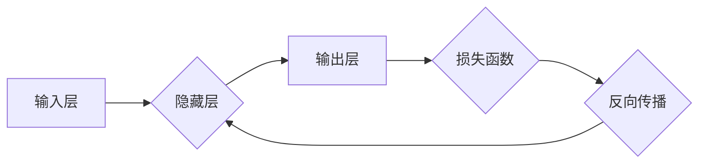

> 神经网络,深度学习,机器学习,卷积神经网络,循环神经网络,梯度下降,反向传播

## 1. 背景介绍

人工智能（AI）近年来发展迅速，其中深度学习作为其重要分支，在图像识别、自然语言处理、语音识别等领域取得了突破性进展。深度学习的核心是神经网络，它模仿了人脑神经元网络的结构和功能，通过多层神经元之间的连接和权重调整，学习复杂的模式和关系。

传统的机器学习算法通常需要人工特征工程，而深度学习算法能够自动学习特征，从而降低了算法开发的门槛，提高了模型的性能。

## 2. 核心概念与联系

**2.1 神经网络结构**

神经网络由多个层组成，每一层包含多个神经元。神经元之间通过连接进行信息传递，每个连接都有一个权重，权重决定了信息传递的强度。

* **输入层:**接收原始数据，每个神经元对应一个输入特征。
* **隐藏层:**隐藏层可以有多个，负责对输入数据进行特征提取和转换。
* **输出层:**输出最终结果，每个神经元对应一个输出类别或值。

**2.2 激活函数**

激活函数是神经网络中一个重要的组成部分，它决定了神经元的输出值。常见的激活函数包括 sigmoid 函数、ReLU 函数、tanh 函数等。激活函数的作用是引入非线性，使神经网络能够学习复杂的模式。

**2.3 权重和偏置**

权重和偏置是神经网络的参数，它们决定了神经网络的学习能力。权重控制着神经元之间的连接强度，偏置控制着神经元的激活阈值。

**2.4 前向传播和反向传播**

* **前向传播:**输入数据通过神经网络层层传递，最终得到输出结果。
* **反向传播:**根据输出结果与真实值的误差，调整神经网络的权重和偏置，使模型的预测结果更加准确。

**2.5 损失函数**

损失函数用于衡量模型预测结果与真实值的差距。常见的损失函数包括均方误差、交叉熵等。

**2.6 优化算法**

优化算法用于更新神经网络的权重和偏置，使模型的损失函数最小化。常见的优化算法包括梯度下降、Adam 算法等。

**Mermaid 流程图**



## 3. 核心算法原理 & 具体操作步骤

### 3.1 算法原理概述

神经网络学习的核心是通过调整权重和偏置，使模型能够准确地预测输出结果。

* **梯度下降:** 梯度下降算法是一种迭代优化算法，它通过计算损失函数的梯度，不断调整权重和偏置，使损失函数逐渐减小。
* **反向传播:** 反向传播算法用于计算梯度，它通过链式法则，将损失函数的梯度反向传播到每个神经元，从而计算出每个权重和偏置的梯度。

### 3.2 算法步骤详解

1. **初始化权重和偏置:** 将权重和偏置随机初始化。
2. **前向传播:** 将输入数据通过神经网络层层传递，计算输出结果。
3. **计算损失函数:** 计算输出结果与真实值的差距，即损失函数的值。
4. **反向传播:** 计算损失函数的梯度，反向传播到每个神经元。
5. **更新权重和偏置:** 使用优化算法，根据梯度更新权重和偏置。
6. **重复步骤2-5:** 重复上述步骤，直到损失函数达到最小值或满足其他停止条件。

### 3.3 算法优缺点

**优点:**

* 能够学习复杂的模式和关系。
* 自动学习特征，降低了算法开发的门槛。
* 性能优于传统的机器学习算法。

**缺点:**

* 训练时间长，需要大量的计算资源。
* 容易过拟合，需要进行正则化处理。
* 难以解释模型的决策过程。

### 3.4 算法应用领域

* **图像识别:** 人脸识别、物体检测、图像分类等。
* **自然语言处理:** 文本分类、情感分析、机器翻译等。
* **语音识别:** 语音转文本、语音助手等。
* **推荐系统:** 商品推荐、用户画像等。
* **医疗诊断:** 疾病预测、影像分析等。

## 4. 数学模型和公式 & 详细讲解 & 举例说明

### 4.1 数学模型构建

神经网络的数学模型可以表示为一个多层感知机（MLP），其输出为输入数据的线性组合加上激活函数。

**公式:**

$$
y = f(W^L x^L + b^L)
$$

其中:

* $y$ 是输出结果。
* $f$ 是激活函数。
* $W^L$ 是第 $L$ 层的权重矩阵。
* $x^L$ 是第 $L$ 层的输入向量。
* $b^L$ 是第 $L$ 层的偏置向量。

### 4.2 公式推导过程

神经网络的训练过程是通过最小化损失函数来实现的。损失函数通常是输出结果与真实值的均方误差。

**公式:**

$$
L = \frac{1}{2} \sum_{i=1}^{N} (y_i - t_i)^2
$$

其中:

* $L$ 是损失函数的值。
* $N$ 是样本数量。
* $y_i$ 是第 $i$ 个样本的预测结果。
* $t_i$ 是第 $i$ 个样本的真实值。

通过梯度下降算法，可以计算出损失函数对每个权重和偏置的梯度，并根据梯度更新权重和偏置。

**公式:**

$$
\Delta W = -\eta \frac{\partial L}{\partial W}
$$

$$
\Delta b = -\eta \frac{\partial L}{\partial b}
$$

其中:

* $\Delta W$ 是权重的更新量。
* $\Delta b$ 是偏置的更新量。
* $\eta$ 是学习率。

### 4.3 案例分析与讲解

**举例说明:**

假设我们有一个简单的神经网络，用于分类手写数字。输入数据是数字图像的像素值，输出结果是数字的类别。

我们可以使用反向传播算法训练这个神经网络，通过调整权重和偏置，使模型能够准确地识别手写数字。

## 5. 项目实践：代码实例和详细解释说明

### 5.1 开发环境搭建

* Python 3.x
* TensorFlow 或 PyTorch 等深度学习框架
* Jupyter Notebook 或其他代码编辑器

### 5.2 源代码详细实现

```python
import tensorflow as tf

# 定义模型
model = tf.keras.models.Sequential([
    tf.keras.layers.Flatten(input_shape=(28, 28)),
    tf.keras.layers.Dense(128, activation='relu'),
    tf.keras.layers.Dense(10, activation='softmax')
])

# 编译模型
model.compile(optimizer='adam',
              loss='sparse_categorical_crossentropy',
              metrics=['accuracy'])

# 训练模型
model.fit(x_train, y_train, epochs=5)

# 评估模型
loss, accuracy = model.evaluate(x_test, y_test)
print('Test loss:', loss)
print('Test accuracy:', accuracy)
```

### 5.3 代码解读与分析

* **定义模型:** 使用 `tf.keras.models.Sequential` 创建一个顺序模型，并添加两个全连接层和一个 Flatten 层。
* **编译模型:** 使用 `adam` 优化器、`sparse_categorical_crossentropy` 损失函数和 `accuracy` 评估指标编译模型。
* **训练模型:** 使用 `model.fit` 方法训练模型，输入训练数据 `x_train` 和标签 `y_train`，训练 5 个 epochs。
* **评估模型:** 使用 `model.evaluate` 方法评估模型，输入测试数据 `x_test` 和标签 `y_test`，打印测试损失和准确率。

### 5.4 运行结果展示

训练完成后，模型的准确率会随着训练 epochs 的增加而提高。

## 6. 实际应用场景

### 6.1 图像识别

* **人脸识别:** 用于解锁手机、验证身份、监控安全等。
* **物体检测:** 用于自动驾驶、安防监控、工业自动化等。
* **图像分类:** 用于医学影像诊断、产品分类、内容推荐等。

### 6.2 自然语言处理

* **文本分类:** 用于垃圾邮件过滤、情感分析、新闻分类等。
* **机器翻译:** 用于将文本从一种语言翻译成另一种语言。
* **聊天机器人:** 用于与用户进行自然语言对话。

### 6.3 语音识别

* **语音转文本:** 用于语音助手、字幕生成、语音搜索等。
* **语音识别:** 用于语音控制、语音输入等。

### 6.4 其他应用

* **推荐系统:** 基于用户行为和物品特征，推荐用户可能感兴趣的内容。
* **金融预测:** 用于股票预测、风险评估、欺诈检测等。
* **医疗诊断:** 用于疾病预测、影像分析、药物研发等。

### 6.5 未来应用展望

随着深度学习技术的不断发展，神经网络将在更多领域得到应用，例如：

* **个性化教育:** 根据学生的学习情况，提供个性化的学习内容和教学方法。
* **智能家居:** 通过语音控制、图像识别等技术，实现智能家居的自动化控制。
* **自动驾驶:** 通过深度学习算法，实现车辆的自动驾驶功能。

## 7. 工具和资源推荐

### 7.1 学习资源推荐

* **书籍:**
    * 深度学习 (Deep Learning) - Ian Goodfellow, Yoshua Bengio, Aaron Courville
    * 神经网络与深度学习 (Neural Networks and Deep Learning) - Michael Nielsen
* **在线课程:**
    * Coursera: 深度学习 Specialization
    * Udacity: 深度学习 Nanodegree
    * fast.ai: 深度学习课程

### 7.2 开发工具推荐

* **TensorFlow:** Google 开发的开源深度学习框架。
* **PyTorch:** Facebook 开发的开源深度学习框架。
* **Keras:** TensorFlow 上的深度学习 API，易于使用。

### 7.3 相关论文推荐

* **ImageNet Classification with Deep Convolutional Neural Networks** - Alex Krizhevsky, Ilya Sutskever, Geoffrey E. Hinton
* **Sequence to Sequence Learning with Neural Networks** - Ilya Sutskever, Oriol Vinyals, Quoc V. Le
* **Attention Is All You Need** - Ashish Vaswani, Noam Shazeer, Niki Parmar, Jakob Uszkoreit, Llion Jones, Aidan N. Gomez, Łukasz Kaiser, Illia Polosukhin

## 8. 总结：未来发展趋势与挑战

### 8.1 研究成果总结

近年来，深度学习取得了显著的进展，在图像识别、自然语言处理、语音识别等领域取得了突破性成果。

### 8.2 未来发展趋势

* **模型规模和复杂度:** 模型规模和复杂度将继续增加，例如 Transformer 模型的出现。
* **数据效率:** 研究更有效的训练方法，降低对数据量的依赖。
* **可解释性:** 研究更可解释的深度学习模型，提高模型的透明度和可信度。
* **边缘计算:** 将深度学习模型部署到边缘设备，实现更快速的推理和更低的延迟。

### 8.3 面临的挑战

* **数据获取和标注:** 深度学习模型需要大量的训练数据，数据获取和标注成本高昂。
* **计算资源:** 训练大型深度学习模型需要大量的计算资源，成本高昂。
* **模型可解释性:** 深度学习模型的决策过程难以解释，这限制了其在一些领域应用的推广。