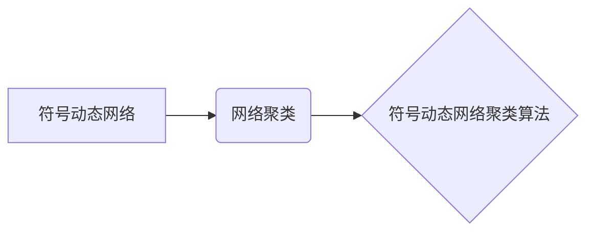

> 符号动态网络，聚类算法，符号动态网络聚类，网络分析，机器学习

## 1. 背景介绍

在当今数据爆炸的时代，如何有效地从海量数据中挖掘有价值的信息成为了一个关键问题。网络分析作为一种强大的工具，能够帮助我们理解复杂系统中的结构和关系。其中，符号动态网络聚类算法作为一种新兴的网络分析方法，能够识别出网络中具有相似结构和动态特性的子网络，从而揭示隐藏的模式和规律。

传统的聚类算法主要基于数据点的静态特征，而符号动态网络聚类算法则考虑了网络结构和节点之间的动态交互，能够更准确地反映网络的复杂性。

## 2. 核心概念与联系

**2.1 符号动态网络**

符号动态网络是指由符号节点和符号边组成的网络，其中节点和边都具有特定的符号表示。符号动态网络能够更全面地刻画网络中的信息，例如节点的属性、边上的关系类型等。

**2.2 网络聚类**

网络聚类是指将网络中的节点按照相似性进行分组，形成若干个子网络。聚类算法的目标是将网络划分为若干个互不重叠的子网络，使得每个子网络中的节点之间具有更高的相似性，而不同子网络之间的节点相似性较低。

**2.3 符号动态网络聚类算法**

符号动态网络聚类算法是一种基于符号动态网络的聚类算法，它考虑了网络结构、节点属性和动态交互等因素，能够更准确地识别出网络中具有相似结构和动态特性的子网络。

**2.4 核心概念关系图**



## 3. 核心算法原理 & 具体操作步骤

**3.1 算法原理概述**

符号动态网络聚类算法的核心思想是基于节点之间的符号相似性和动态交互关系来进行聚类。

算法首先将网络中的节点按照其符号特征进行分组，然后根据节点之间的动态交互关系，将这些分组进一步合并或分割，最终形成若干个互不重叠的子网络。

**3.2 算法步骤详解**

1. **符号特征提取:** 从符号动态网络中提取节点的符号特征，例如节点的类型、属性等。

2. **符号相似度计算:** 计算节点之间的符号相似度，可以使用余弦相似度、Jaccard相似度等度量方法。

3. **动态交互关系分析:** 分析节点之间的动态交互关系，例如节点之间的连接强度、交互频率等。

4. **聚类分组:** 基于节点的符号相似度和动态交互关系，将节点进行分组，形成若干个子网络。

5. **子网络优化:** 对形成的子网络进行优化，例如调整子网络的边界、合并相似的子网络等。

**3.3 算法优缺点**

**优点:**

* 能够考虑网络结构和节点之间的动态交互关系，更准确地反映网络的复杂性。
* 能够识别出具有相似结构和动态特性的子网络，揭示隐藏的模式和规律。

**缺点:**

* 计算复杂度较高，对于大型网络可能需要较长时间进行聚类。
* 需要对网络进行预处理，例如提取节点的符号特征、计算动态交互关系等。

**3.4 算法应用领域**

符号动态网络聚类算法在以下领域具有广泛的应用前景:

* **社交网络分析:** 识别出社交网络中的社区结构、兴趣群体等。
* **生物网络分析:** 发现生物网络中的功能模块、信号通路等。
* **推荐系统:** 基于用户行为和商品属性进行个性化推荐。
* **金融风险管理:** 识别出金融网络中的风险节点、风险链等。

## 4. 数学模型和公式 & 详细讲解 & 举例说明

**4.1 数学模型构建**

符号动态网络可以表示为一个四元组：

G = (V, E, S, D)

其中：

* V 是节点集合。
* E 是边集合。
* S 是节点符号集合。
* D 是边符号集合。

节点的符号特征可以表示为一个向量：

s_i = (s_{i1}, s_{i2}, ..., s_{ik})

其中：

* s_{ij} 是节点 i 的第 j 个符号特征。

节点之间的动态交互关系可以表示为一个矩阵：

A = (a_{ij})

其中：

* a_{ij} 表示节点 i 和节点 j 之间的交互强度。

**4.2 公式推导过程**

符号动态网络聚类算法的聚类目标是找到一个划分，使得每个子网络中的节点之间具有更高的相似性，而不同子网络之间的节点相似性较低。

可以使用以下公式来度量节点之间的相似性：

$$
similarity(i, j) = \frac{s_i \cdot s_j}{||s_i|| ||s_j||}
$$

其中：

* s_i 和 s_j 是节点 i 和节点 j 的符号特征向量。
*  · 表示向量的点积。
* ||s_i|| 和 ||s_j|| 是向量的模长。

**4.3 案例分析与讲解**

假设我们有一个符号动态网络，其中节点的符号特征包括节点的类型和颜色。

我们可以使用上述公式计算节点之间的符号相似度，然后根据节点之间的符号相似度和动态交互关系进行聚类。

例如，如果两个节点的类型相同且颜色相同，那么它们的符号相似度较高，它们可能属于同一个子网络。

## 5. 项目实践：代码实例和详细解释说明

**5.1 开发环境搭建**

本项目使用 Python 语言进行开发，所需的库包括：

* NetworkX: 用于构建和操作网络图。
* Scikit-learn: 用于聚类算法的实现。
* Matplotlib: 用于可视化网络图。

**5.2 源代码详细实现**

```python
import networkx as nx
from sklearn.cluster import KMeans
import matplotlib.pyplot as plt

# 构建符号动态网络
G = nx.Graph()
G.add_nodes_from([1, 2, 3, 4, 5, 6, 7, 8, 9, 10])
G.add_edges_from([(1, 2), (1, 3), (2, 4), (2, 5), (3, 6), (3, 7), (4, 8), (5, 9), (6, 10)])

# 提取节点符号特征
node_features = {
    1: {'type': 'A', 'color': 'red'},
    2: {'type': 'B', 'color': 'blue'},
    3: {'type': 'A', 'color': 'green'},
    4: {'type': 'B', 'color': 'blue'},
    5: {'type': 'B', 'color': 'red'},
    6: {'type': 'A', 'color': 'green'},
    7: {'type': 'A', 'color': 'red'},
    8: {'type': 'B', 'color': 'blue'},
    9: {'type': 'B', 'color': 'red'},
    10: {'type': 'A', 'color': 'green'},
}

# 计算节点之间的符号相似度
def calculate_similarity(node1, node2):
    # 使用余弦相似度计算节点之间的符号相似度
    return np.dot(node1['features'], node2['features']) / (np.linalg.norm(node1['features']) * np.linalg.norm(node2['features']))

# 进行聚类
kmeans = KMeans(n_clusters=2)
features = [node_features[node] for node in G.nodes()]
kmeans.fit(features)

# 将节点分配到不同的子网络
clusters = kmeans.labels_
for node, cluster in enumerate(clusters):
    G.nodes[node]['cluster'] = cluster

# 可视化网络图
nx.draw(G, with_labels=True, node_color=[G.nodes[node]['cluster'] for node in G.nodes()])
plt.show()
```

**5.3 代码解读与分析**

* 首先，我们构建了一个符号动态网络，并添加了节点和边。
* 然后，我们提取了节点的符号特征，并定义了一个计算节点之间符号相似度的函数。
* 接下来，我们使用 KMeans 聚类算法对节点进行聚类，并将每个节点分配到不同的子网络。
* 最后，我们使用 Matplotlib 库可视化网络图，并根据节点的聚类结果对节点进行颜色标记。

**5.4 运行结果展示**

运行代码后，将生成一个可视化的网络图，其中节点根据聚类结果被分成不同的颜色，可以直观地观察到网络中的子网络结构。

## 6. 实际应用场景

**6.1 社交网络分析**

符号动态网络聚类算法可以用于识别社交网络中的社区结构，例如兴趣小组、好友圈等。

**6.2 生物网络分析**

符号动态网络聚类算法可以用于发现生物网络中的功能模块，例如代谢通路、信号通路等。

**6.3 推荐系统**

符号动态网络聚类算法可以用于基于用户行为和商品属性进行个性化推荐。

**6.4 金融风险管理**

符号动态网络聚类算法可以用于识别金融网络中的风险节点和风险链，帮助金融机构进行风险管理。

**6.5 未来应用展望**

随着符号动态网络分析技术的不断发展，符号动态网络聚类算法将在更多领域得到应用，例如：

* **智能交通:** 分析交通网络中的流量模式，优化交通流量分配。
* **医疗诊断:** 分析患者的医疗数据，辅助医生进行诊断。
* **城市规划:** 分析城市网络中的结构和功能，优化城市规划。

## 7. 工具和资源推荐

**7.1 学习资源推荐**

* **书籍:**
    * 《网络分析》
    * 《符号动态网络》
* **在线课程:**
    * Coursera: 网络分析课程
    * edX: 数据挖掘课程

**7.2 开发工具推荐**

* **NetworkX:** Python 库，用于构建和操作网络图。
* **Gephi:** 开源网络可视化工具。
* **Cytoscape:** 开源网络分析工具。

**7.3 相关论文推荐**

* **Newman, M. E. J. (2003). The structure and function of complex networks.**
* **Leskovec, J., & Faloutsos, C. (2007). Sampling techniques for large graphs.**
* **Girvan, M., & Newman, M. E. J. (2002). Community structure in social networks.**

## 8. 总结：未来发展趋势与挑战

**8.1 研究成果总结**

符号动态网络聚类算法是一种新兴的网络分析方法，能够更准确地识别出网络中具有相似结构和动态特性的子网络。

**8.2 未来发展趋势**

未来，符号动态网络聚类算法的研究将朝着以下几个方向发展：

* **算法效率:** 提高算法的效率，使其能够处理更大规模的网络数据。
* **算法鲁棒性:** 提高算法的鲁棒性，使其能够更好地应对噪声数据和不完整数据。
* **算法可解释性:** 提高算法的可解释性，使其能够更好地解释聚类结果。

**8.3 面临的挑战**

符号动态网络聚类算法还面临着一些挑战：

* **数据获取:** 获取高质量的符号动态网络数据仍然是一个挑战。
* **算法复杂度:** 算法的复杂度较高，需要进一步优化。
* **理论基础:** 算法的理论基础还需要进一步完善。

**8.4 研究展望**

尽管面临着一些挑战，但符号动态网络聚类算法具有巨大的潜力，未来将会有更多的研究成果涌现，并在更多领域得到应用。

## 9. 附录：常见问题与解答

**9.1 如何选择合适的聚类算法？**

选择合适的聚类算法需要根据具体的应用场景和数据特点进行选择。

**9.2 如何评估聚类结果