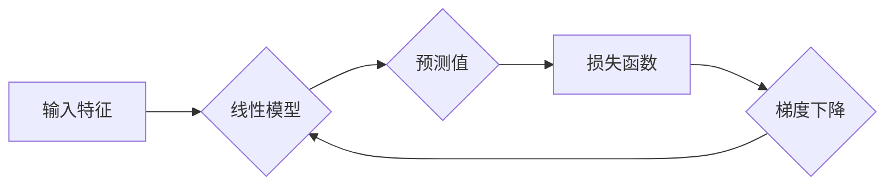

> 线性回归，机器学习，预测模型，回归分析，梯度下降，Python，scikit-learn

## 1. 背景介绍

在机器学习领域，线性回归作为一种基础且广泛应用的算法，在预测连续值方面表现出色。它能够建立输入特征与输出变量之间的线性关系，并通过最小化误差来找到最佳拟合直线或超平面。

线性回归的应用场景非常广泛，例如：

* **房价预测:** 根据房屋面积、位置、房间数量等特征预测房价。
* **股票价格预测:** 根据历史股票数据、市场指数等特征预测未来股票价格。
* **销售额预测:** 根据市场营销活动、季节性因素等特征预测未来销售额。
* **客户流失预测:** 根据客户行为、购买历史等特征预测客户流失概率。

## 2. 核心概念与联系

线性回归的核心概念包括：

* **线性关系:** 假设输入特征与输出变量之间存在线性关系，即可以用一条直线或超平面来描述。
* **目标函数:** 线性回归的目标是找到一条最佳拟合直线或超平面，使得预测值与真实值之间的误差最小。
* **损失函数:** 用于衡量预测值与真实值之间的误差，常用的损失函数是均方误差（MSE）。
* **梯度下降:** 是一种迭代优化算法，用于找到最小化损失函数的参数值。

**Mermaid 流程图:**



## 3. 核心算法原理 & 具体操作步骤

### 3.1  算法原理概述

线性回归算法的基本原理是找到一条最佳拟合直线或超平面，使得预测值与真实值之间的误差最小。

假设我们有n个样本数据，每个样本包含m个特征和一个输出变量。我们可以用以下线性方程来表示样本数据之间的关系：

$$y = w_0 + w_1x_1 + w_2x_2 + ... + w_mx_m$$

其中：

* $y$ 是输出变量
* $w_0, w_1, w_2, ..., w_m$ 是模型参数
* $x_1, x_2, ..., x_m$ 是输入特征

我们的目标是找到最佳的参数值，使得预测值与真实值之间的误差最小。

### 3.2  算法步骤详解

1. **数据准备:** 收集和预处理数据，将数据转换为模型可接受的格式。
2. **特征选择:** 选择与输出变量相关的特征作为模型输入。
3. **模型初始化:** 初始化模型参数，例如随机初始化或使用预先训练好的模型。
4. **梯度下降优化:** 使用梯度下降算法迭代更新模型参数，最小化损失函数。
5. **模型评估:** 使用测试数据评估模型性能，例如计算均方误差（MSE）或R-squared值。
6. **模型调参:** 根据模型评估结果，调整模型参数或超参数，例如学习率、正则化参数等。
7. **模型部署:** 将训练好的模型部署到实际应用场景中，用于预测新的数据。

### 3.3  算法优缺点

**优点:**

* **简单易懂:** 线性回归算法原理简单易懂，易于实现和理解。
* **计算效率高:** 线性回归算法的计算效率较高，适合处理大规模数据。
* **可解释性强:** 线性回归模型的系数可以解释特征对输出变量的影响程度。

**缺点:**

* **假设线性关系:** 线性回归算法假设输入特征与输出变量之间存在线性关系，如果数据存在非线性关系，则模型预测效果会下降。
* **容易过拟合:** 如果模型参数过多，则容易发生过拟合现象，导致模型在训练数据上表现良好，但在测试数据上表现较差。

### 3.4  算法应用领域

线性回归算法广泛应用于以下领域：

* **金融:** 股票价格预测、信用评分、风险评估
* **电商:** 商品推荐、价格预测、用户行为分析
* **医疗:** 疾病诊断、药物研发、患者风险预测
* **制造业:** 产品质量预测、设备故障诊断、生产效率优化

## 4. 数学模型和公式 & 详细讲解 & 举例说明

### 4.1  数学模型构建

线性回归模型的目标是找到一条最佳拟合直线或超平面，使得预测值与真实值之间的误差最小。

假设我们有n个样本数据，每个样本包含m个特征和一个输出变量。我们可以用以下线性方程来表示样本数据之间的关系：

$$y_i = w_0 + w_1x_{i1} + w_2x_{i2} + ... + w_mx_{im} + \epsilon_i$$

其中：

* $y_i$ 是第i个样本的输出变量
* $w_0, w_1, w_2, ..., w_m$ 是模型参数
* $x_{i1}, x_{i2}, ..., x_{im}$ 是第i个样本的m个特征
* $\epsilon_i$ 是第i个样本的误差项

### 4.2  公式推导过程

为了找到最佳的模型参数，我们需要最小化损失函数。常用的损失函数是均方误差（MSE）：

$$MSE = \frac{1}{n} \sum_{i=1}^{n} (y_i - \hat{y}_i)^2$$

其中：

* $\hat{y}_i$ 是模型预测的第i个样本的输出变量

通过梯度下降算法，我们可以迭代更新模型参数，使得MSE最小化。梯度下降算法的基本思想是：沿着损失函数的负梯度方向更新模型参数，直到找到最小值。

### 4.3  案例分析与讲解

假设我们想要预测房屋价格，输入特征包括房屋面积、房间数量、位置等，输出变量是房屋价格。

我们可以使用线性回归算法建立一个模型，将房屋特征与价格建立线性关系。通过训练模型，我们可以得到每个特征对房屋价格的影响程度，例如，面积每增加1平方米，房屋价格会增加多少元。

## 5. 项目实践：代码实例和详细解释说明

### 5.1  开发环境搭建

本项目使用Python语言进行开发，需要安装以下库：

* NumPy: 用于数值计算
* Pandas: 用于数据处理
* Scikit-learn: 用于机器学习算法

可以使用以下命令安装这些库：

```bash
pip install numpy pandas scikit-learn
```

### 5.2  源代码详细实现

```python
import numpy as np
from sklearn.linear_model import LinearRegression
from sklearn.model_selection import train_test_split
from sklearn.metrics import mean_squared_error

# 准备数据
data = np.array([[100, 2, 'A'],
                 [150, 3, 'B'],
                 [200, 4, 'C'],
                 [250, 5, 'D']])

X = data[:, 0:2]  # 特征
y = data[:, 2]  # 目标变量

# 数据分割
X_train, X_test, y_train, y_test = train_test_split(X, y, test_size=0.2, random_state=42)

# 创建线性回归模型
model = LinearRegression()

# 模型训练
model.fit(X_train, y_train)

# 模型预测
y_pred = model.predict(X_test)

# 模型评估
mse = mean_squared_error(y_test, y_pred)
print(f'均方误差: {mse}')

# 打印模型系数
print(f'模型系数: {model.coef_}')
print(f'截距: {model.intercept_}')
```

### 5.3  代码解读与分析

1. **数据准备:** 首先，我们准备了一个包含房屋面积、房间数量和位置信息的样本数据。
2. **特征和目标变量:** 我们将房屋面积和房间数量作为特征，位置信息作为目标变量。
3. **数据分割:** 我们将数据分为训练集和测试集，用于模型训练和评估。
4. **模型创建:** 我们使用Scikit-learn库中的LinearRegression类创建了一个线性回归模型。
5. **模型训练:** 我们使用模型的fit()方法训练模型，将训练数据作为输入。
6. **模型预测:** 我们使用模型的predict()方法预测测试数据的输出变量。
7. **模型评估:** 我们使用均方误差（MSE）来评估模型的性能。
8. **打印模型系数:** 我们打印模型的系数和截距，了解每个特征对输出变量的影响程度。

### 5.4  运行结果展示

运行代码后，会输出模型的均方误差和模型系数。

## 6. 实际应用场景

### 6.1  房价预测

线性回归可以用于预测房屋价格，根据房屋面积、房间数量、位置等特征，预测房屋的市场价值。

### 6.2  股票价格预测

线性回归可以用于预测股票价格，根据历史股票数据、市场指数等特征，预测未来股票价格走势。

### 6.3  销售额预测

线性回归可以用于预测销售额，根据市场营销活动、季节性因素等特征，预测未来销售额变化趋势。

### 6.4  未来应用展望

随着机器学习技术的不断发展，线性回归算法在未来将有更广泛的应用场景，例如：

* **个性化推荐:** 根据用户的行为数据，推荐个性化的商品或服务。
* **欺诈检测:** 根据交易数据，识别潜在的欺诈行为。
* **医疗诊断:** 根据患者的症状和病史，辅助医生进行诊断。

## 7. 工具和资源推荐

### 7.1  学习资源推荐

* **书籍:**
    * 《机器学习》 by 周志华
    * 《Python机器学习实战》 by 塞缪尔·阿布拉姆斯
* **在线课程:**
    * Coursera: 机器学习
    * edX: 机器学习
* **博客:**
    * 机器学习 Mastery
    * Analytics Vidhya

### 7.2  开发工具推荐

* **Python:** 
    * Jupyter Notebook: 用于代码编写和可视化
    * Spyder: 用于科学计算和数据分析
* **机器学习库:**
    * Scikit-learn: 用于机器学习算法
    * TensorFlow: 用于深度学习
    * PyTorch: 用于深度学习

### 7.3  相关论文推荐

* **The Elements of Statistical Learning** by Trevor Hastie, Robert Tibshirani, and Jerome Friedman
* **Linear Regression Analysis** by Douglas Montgomery and George C. Runger

## 8. 总结：未来发展趋势与挑战

### 8.1  研究成果总结

线性回归算法作为机器学习领域的基础算法，在预测连续值方面表现出色，并广泛应用于各个领域。

### 8.2  未来发展趋势

未来，线性回归算法将继续发展，主要趋势包括：

* **结合深度学习:** 将线性回归与深度学习算法结合，提高模型的预测精度。
* **处理非线性关系:** 研究新的方法，使线性回归算法能够处理非线性关系的数据。
* **增强解释性:** 研究新的方法，提高线性回归模型的解释性，使模型的决策过程更加透明。

### 8.3  面临的挑战

线性回归算法也面临一些挑战，例如：

* **过拟合:** 当模型参数过多时，容易发生过拟合现象。
* **数据质量:** 线性回归算法对数据质量要求较高，如果数据存在噪声或异常值，会影响模型的性能。
* **特征选择:** 选择合适的特征对于线性回归模型的性能至关重要。

### 8.4  研究展望

未来，研究人员将继续探索线性回归算法的改进方法，提高其预测精度、鲁棒性和解释性，使其在更多领域得到应用。

## 9. 附录：常见问题与解答

### 9.1  Q1: 线性回归模型的假设条件是什么？

**A1:** 线性回归