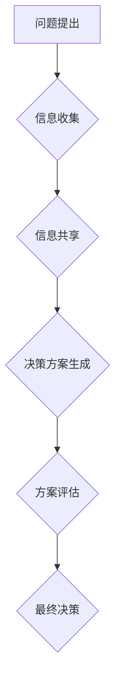

>群体智慧，协同决策，人工智能，机器学习，优化算法，数据分析，决策支持系统

## 1. 背景介绍

在当今数据爆炸的时代，面对复杂多变的决策环境，传统的单点决策模式已显不足。如何有效地汇集和整合来自不同个体的信息，并将其转化为更优的决策方案，成为一个亟待解决的关键问题。群体智慧，作为一种新兴的决策模式，以其独特的优势吸引了越来越多的关注。

群体智慧是指由多个个体协同合作，通过信息共享和交互，最终达到比单个个体更优的决策结果。这种现象在自然界中随处可见，例如蜂群的集体决策、鸟群的迁徙路线选择等。近年来，随着人工智能和机器学习技术的快速发展，群体智慧的研究也取得了长足的进步，并逐渐应用于各个领域，例如金融投资、市场营销、医疗诊断等。

## 2. 核心概念与联系

群体智慧的核心概念包括：

* **个体智能:** 指单个个体所拥有的知识、经验和决策能力。
* **信息共享:** 个体之间通过各种方式交换信息，例如对话、数据传输等。
* **协同决策:** 个体根据共享的信息，共同制定决策方案。
* **群体智能:** 集体决策的结果，通常比单个个体的决策更优。

**群体智慧决策流程:**



## 3. 核心算法原理 & 具体操作步骤

### 3.1  算法原理概述

群体智慧算法通常基于以下几个核心原理：

* **启发式搜索:** 利用启发式函数引导搜索过程，提高决策效率。
* **模拟退火:** 通过模拟物质的退火过程，逐步优化决策方案。
* **遗传算法:** 通过模拟生物的进化过程，不断改进决策方案。
* **粒子群优化算法:** 模拟鸟群或鱼群的运动行为，寻找最优解。

### 3.2  算法步骤详解

以粒子群优化算法为例，其具体操作步骤如下：

1. **初始化粒子群:** 随机生成多个粒子，每个粒子代表一个决策方案。
2. **评估粒子适应度:** 根据决策方案的优劣，计算每个粒子的适应度值。
3. **更新粒子速度和位置:** 根据粒子适应度和全局最优解，更新每个粒子的速度和位置。
4. **重复步骤2-3:** 直到达到预设的迭代次数或找到最优解。

### 3.3  算法优缺点

**优点:**

* 能够有效地探索决策空间，找到全局最优解。
* 对问题结构要求较低，适用于复杂多变的决策环境。
* 具有并行化处理能力，提高决策效率。

**缺点:**

* 算法收敛速度较慢，需要较长的计算时间。
* 参数设置对算法性能影响较大，需要进行仔细调试。

### 3.4  算法应用领域

群体智慧算法广泛应用于以下领域：

* **金融投资:** 股票预测、风险管理、资产配置等。
* **市场营销:** 客户 segmentation、广告投放优化、产品推荐等。
* **医疗诊断:** 疾病预测、药物研发、医疗资源分配等。
* **交通运输:** 路线规划、交通流量控制、车辆调度等。

## 4. 数学模型和公式 & 详细讲解 & 举例说明

### 4.1  数学模型构建

粒子群优化算法的数学模型可以描述为：

* **速度更新公式:**

$$v_i(t+1) = w \cdot v_i(t) + c_1 \cdot r_1 \cdot (p_i(t) - x_i(t)) + c_2 \cdot r_2 \cdot (p_g(t) - x_i(t))$$

* **位置更新公式:**

$$x_i(t+1) = x_i(t) + v_i(t+1)$$

其中:

* $v_i(t)$: 粒子 $i$ 在时间 $t$ 的速度
* $x_i(t)$: 粒子 $i$ 在时间 $t$ 的位置
* $p_i(t)$: 粒子 $i$ 的个体最优解
* $p_g(t)$: 全局最优解
* $w$: 惯性权重
* $c_1$, $c_2$: 学习因子
* $r_1$, $r_2$: 随机数

### 4.2  公式推导过程

速度更新公式的推导过程基于以下原理:

* **惯性:** 粒子在运动过程中会保留一定的惯性，即速度会受到自身历史速度的影响。
* **个体学习:** 粒子会根据自身历史最优解，调整其速度方向，朝着更优的方向运动。
* **全局学习:** 粒子会根据全局最优解，调整其速度方向，朝着更优的方向运动。

### 4.3  案例分析与讲解

假设我们想要寻找一个函数的最小值，可以使用粒子群优化算法进行求解。

1. **初始化粒子群:** 随机生成多个粒子，每个粒子代表一个函数的输入值。
2. **评估粒子适应度:** 计算每个粒子的函数值，作为其适应度值。
3. **更新粒子速度和位置:** 根据速度更新公式和位置更新公式，更新每个粒子的速度和位置。
4. **重复步骤2-3:** 直到达到预设的迭代次数或找到最优解。

通过不断迭代，粒子群会逐渐收敛到函数的最小值附近。

## 5. 项目实践：代码实例和详细解释说明

### 5.1  开发环境搭建

本项目使用 Python 语言进行开发，所需的库包括 numpy、matplotlib 等。

### 5.2  源代码详细实现

```python
import numpy as np

class Particle:
    def __init__(self, position, velocity, fitness):
        self.position = position
        self.velocity = velocity
        self.fitness = fitness

class PSO:
    def __init__(self, num_particles, dimensions, bounds, w, c1, c2):
        self.num_particles = num_particles
        self.dimensions = dimensions
        self.bounds = bounds
        self.w = w
        self.c1 = c1
        self.c2 = c2
        self.particles = []
        self.best_global = None

    def initialize_particles(self):
        for _ in range(self.num_particles):
            position = np.random.uniform(self.bounds[0], self.bounds[1], self.dimensions)
            velocity = np.random.uniform(-1, 1, self.dimensions)
            fitness = self.evaluate_fitness(position)
            particle = Particle(position, velocity, fitness)
            self.particles.append(particle)

    def evaluate_fitness(self, position):
        # 计算粒子适应度
        return -np.sum(position**2)  # 例如，最小化目标函数

    def update_particles(self):
        for particle in self.particles:
            r1 = np.random.rand()
            r2 = np.random.rand()
            velocity = self.w * particle.velocity + self.c1 * r1 * (particle.position - particle.position) + self.c2 * r2 * (self.best_global.position - particle.position)
            particle.velocity = velocity
            particle.position = particle.position + particle.velocity
            particle.fitness = self.evaluate_fitness(particle.position)
            if particle.fitness > self.best_global.fitness:
                self.best_global = particle

    def run(self, iterations):
        self.initialize_particles()
        for _ in range(iterations):
            self.update_particles()
        return self.best_global.position

# 实例化PSO对象
pso = PSO(num_particles=10, dimensions=2, bounds=[-5, 5], w=0.7, c1=1.5, c2=1.5)

# 运行PSO算法
best_position = pso.run(iterations=100)

# 打印最佳解
print(f"最佳解: {best_position}")
```

### 5.3  代码解读与分析

代码首先定义了粒子和PSO类，分别代表单个粒子和粒子群优化算法。

* `Particle`类包含粒子的位置、速度和适应度值。
* `PSO`类包含粒子群的大小、维度、边界、惯性权重、学习因子等参数。

`initialize_particles()`方法初始化粒子群，随机生成每个粒子的位置和速度，并计算其适应度值。

`evaluate_fitness()`方法计算粒子的适应度值，例如，最小化目标函数。

`update_particles()`方法更新每个粒子的速度和位置，并重新计算其适应度值。

`run()`方法运行PSO算法，迭代更新粒子群，并返回最佳解。

### 5.4  运行结果展示

运行代码后，会输出最佳解，即找到的目标函数的最小值。

## 6. 实际应用场景

群体智慧在各个领域都有着广泛的应用场景，例如：

### 6.1  金融投资

* **股票预测:** 利用群体智慧算法分析股票市场数据，预测股票价格走势。
* **风险管理:** 通过群体智慧算法评估投资组合的风险，并制定相应的风险控制策略。
* **资产配置:** 根据投资者风险偏好和市场情况，利用群体智慧算法优化资产配置方案。

### 6.2  市场营销

* **客户 segmentation:** 利用群体智慧算法分析客户数据，将客户进行细分，以便针对不同客户群体的需求进行营销。
* **广告投放优化:** 利用群体智慧算法优化广告投放策略，提高广告效果。
* **产品推荐:** 利用群体智慧算法分析用户行为数据，推荐用户感兴趣的产品。

### 6.3  医疗诊断

* **疾病预测:** 利用群体智慧算法分析患者数据，预测疾病风险。
* **药物研发:** 利用群体智慧算法筛选潜在的药物候选者。
* **医疗资源分配:** 利用群体智慧算法优化医疗资源分配，提高医疗服务效率。

### 6.4  未来应用展望

随着人工智能和机器学习技术的不断发展，群体智慧将在更多领域得到应用，例如：

* **自动驾驶:** 利用群体智慧算法协同控制多个车辆，实现自动驾驶。
* **智能制造:** 利用群体智慧算法优化生产流程，提高生产效率。
* **城市规划:** 利用群体智慧算法优化城市交通、能源、环境等方面。

## 7. 工具和资源推荐

### 7.1  学习资源推荐

* **书籍:**
    * 《群体智慧》
    * 《人工智能：现代方法》
* **在线课程:**
    * Coursera: Machine Learning
    * edX: Artificial Intelligence

### 7.2  开发工具推荐

* **Python:** 广泛用于机器学习和人工智能开发。
* **Scikit-learn:** Python机器学习库，提供各种群体智慧算法实现。
* **TensorFlow:** 深度学习框架，可以用于实现自定义群体智慧算法。

### 7.3  相关论文推荐

* **Particle Swarm Optimization: A Review**
* **Ant Colony Optimization: A Metaheuristic Approach to Problem Solving**
* **Genetic Algorithms in Search, Optimization, and Machine Learning**

## 8. 总结：未来发展趋势与挑战

### 8.1  研究成果总结

群体智慧研究取得了长足的进步，在解决复杂优化问题方面展现出强大的潜力。

### 8.2  未来发展趋势

* **多智能体协作:** 研究多个群体智慧算法协同工作，提高决策效率和准确性。
* **迁移学习:** 研究群体智慧算法的迁移学习能力，使其能够在不同领域和任务中进行应用。
* **解释性:** 研究群体智慧算法的决策过程，提高其透明度和可解释性。

### 8.3  面临的挑战

