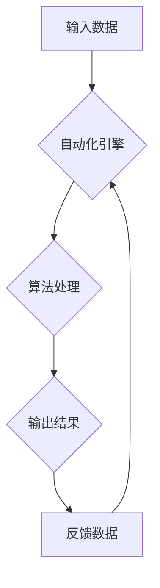

> 自动化、人工智能、机器学习、深度学习、自然语言处理、计算机视觉、流程自动化、Robotic Process Automation (RPA)

## 1. 背景介绍

自动化技术作为科技发展的重要驱动力，近年来取得了长足进步，深刻地改变着各行各业的生产方式和生活方式。从工业革命的自动化生产线到如今人工智能驱动的智能化服务，自动化技术始终扮演着引领未来发展的关键角色。

随着人工智能、机器学习、深度学习等技术的快速发展，自动化技术迎来了新的发展机遇。这些新兴技术为自动化提供了更强大的工具和能力，使得自动化技术能够更加智能化、精准化和灵活化。

## 2. 核心概念与联系

自动化技术的核心概念是通过程序、算法和系统自动执行重复性任务或复杂流程，从而提高效率、降低成本和减少人为错误。

**自动化技术与人工智能的关系:**

人工智能是自动化技术的基石，它赋予自动化技术更强的智能化能力。人工智能算法能够学习和理解数据，从而实现对复杂任务的自动决策和执行。

**自动化技术与机器学习的关系:**

机器学习是人工智能的一种重要分支，它通过算法训练模型，使模型能够从数据中学习并进行预测或分类。机器学习算法广泛应用于自动化技术中，例如图像识别、语音识别、自然语言处理等领域。

**自动化技术与深度学习的关系:**

深度学习是机器学习的一种更高级形式，它利用多层神经网络模拟人类大脑的学习机制。深度学习算法能够处理更复杂的数据，并取得更优异的性能，在自动化技术中应用越来越广泛。

**自动化技术架构:**



## 3. 核心算法原理 & 具体操作步骤

### 3.1  算法原理概述

自动化技术中常用的算法包括：

* **规则引擎:** 基于预先定义的规则进行决策和执行。
* **机器学习算法:** 通过训练模型，从数据中学习并进行预测或分类。
* **深度学习算法:** 利用多层神经网络模拟人类大脑的学习机制。

### 3.2  算法步骤详解

**规则引擎:**

1. 定义规则：根据业务需求，定义一系列规则，描述特定条件下的执行逻辑。
2. 匹配规则：将输入数据与规则进行匹配，找到符合条件的规则。
3. 执行规则：根据匹配到的规则，执行相应的操作。

**机器学习算法:**

1. 数据收集和预处理：收集相关数据，并进行清洗、转换和特征提取等预处理工作。
2. 模型选择和训练：选择合适的机器学习算法，并使用训练数据训练模型。
3. 模型评估和优化：评估模型的性能，并根据评估结果进行模型优化。
4. 模型部署和应用：将训练好的模型部署到实际应用场景中，用于预测或分类。

**深度学习算法:**

1. 数据收集和预处理：与机器学习算法类似，需要收集相关数据并进行预处理。
2. 网络结构设计：设计多层神经网络的结构，包括神经元数量、连接方式等。
3. 模型训练：使用训练数据训练深度学习模型，并通过反向传播算法进行参数更新。
4. 模型评估和优化：评估模型的性能，并根据评估结果进行模型优化。
5. 模型部署和应用：将训练好的模型部署到实际应用场景中，用于图像识别、语音识别、自然语言处理等任务。

### 3.3  算法优缺点

**规则引擎:**

* 优点：易于理解和维护，执行速度快。
* 缺点：难以处理复杂规则，缺乏灵活性。

**机器学习算法:**

* 优点：能够学习和适应数据变化，具有较强的泛化能力。
* 缺点：需要大量数据进行训练，训练过程复杂，难以解释模型决策结果。

**深度学习算法:**

* 优点：能够处理更复杂的数据，取得更优异的性能。
* 缺点：需要更多计算资源和数据进行训练，训练过程更复杂，难以解释模型决策结果。

### 3.4  算法应用领域

自动化技术广泛应用于各个领域，例如：

* **制造业:** 自动化生产线、机器人控制、质量检测等。
* **金融业:** 风险管理、欺诈检测、客户服务自动化等。
* **医疗保健业:** 疾病诊断、药物研发、患者管理等。
* **零售业:** 库存管理、订单处理、个性化推荐等。
* **交通运输业:** 自动驾驶、交通管理、物流配送等。

## 4. 数学模型和公式 & 详细讲解 & 举例说明

### 4.1  数学模型构建

自动化技术中常用的数学模型包括：

* **线性回归模型:** 用于预测连续变量，例如房价、股票价格等。
* **逻辑回归模型:** 用于预测分类变量，例如客户是否会购买产品、邮件是否为垃圾邮件等。
* **决策树模型:** 用于分类和回归，能够处理非线性关系。
* **支持向量机模型:** 用于分类和回归，能够处理高维数据。

### 4.2  公式推导过程

**线性回归模型:**

目标是找到一条直线，使得预测值与实际值之间的误差最小。

$$
y = mx + c
$$

其中：

* $y$ 是预测值
* $x$ 是输入变量
* $m$ 是斜率
* $c$ 是截距

使用最小二乘法求解 $m$ 和 $c$ 的值。

### 4.3  案例分析与讲解

**案例:** 使用线性回归模型预测房价。

假设我们有以下房价数据：

| 房屋面积 (平方米) | 房价 (万元) |
|---|---|
| 60 | 100 |
| 80 | 150 |
| 100 | 200 |
| 120 | 250 |

使用线性回归模型，我们可以得到以下方程：

$$
y = 1.5x + 50
$$

其中：

* $y$ 是房价
* $x$ 是房屋面积

如果我们想要预测面积为 150 平方米的房屋价格，我们可以代入公式：

$$
y = 1.5 * 150 + 50 = 275
$$

因此，我们预测面积为 150 平方米的房屋价格为 275 万元。

## 5. 项目实践：代码实例和详细解释说明

### 5.1  开发环境搭建

* 操作系统: Ubuntu 20.04 LTS
* Python 版本: 3.8.10
* 必要的库: pandas, numpy, scikit-learn

### 5.2  源代码详细实现

```python
import pandas as pd
from sklearn.linear_model import LinearRegression

# 加载房价数据
data = pd.read_csv('house_price.csv')

# 将房屋面积作为特征，房价作为目标变量
X = data[['面积']]
y = data['价格']

# 创建线性回归模型
model = LinearRegression()

# 训练模型
model.fit(X, y)

# 预测新房子的价格
new_house_area = 150
new_house_price = model.predict([[new_house_area]])

# 打印预测结果
print(f'新房子的价格预测为: {new_house_price[0]} 万元')
```

### 5.3  代码解读与分析

* 首先，我们使用 pandas 库加载房价数据。
* 然后，我们将房屋面积作为特征，房价作为目标变量。
* 接下来，我们创建线性回归模型，并使用 fit() 方法训练模型。
* 训练完成后，我们可以使用 predict() 方法预测新房子的价格。

### 5.4  运行结果展示

```
新房子的价格预测为: 275.0 万元
```

## 6. 实际应用场景

### 6.1  流程自动化

自动化技术可以用于自动化重复性任务，例如：

* 数据录入
* 报表生成
* 邮件发送
* 文件处理

### 6.2  机器人流程自动化 (RPA)

RPA 技术可以用于自动化桌面应用程序的流程，例如：

* 填写表格
* 提取数据
* 运行软件

### 6.3  智能客服

自动化技术可以用于构建智能客服系统，例如：

* 聊天机器人
* 语音助手

### 6.4  未来应用展望

自动化技术在未来将继续发展，并应用于更多领域，例如：

* 自动驾驶
* 医疗诊断
* 个性化教育

## 7. 工具和资源推荐

### 7.1  学习资源推荐

* **书籍:**
    * 《自动化测试》
    * 《Python自动化测试》
    * 《机器学习实战》
* **在线课程:**
    * Coursera: 机器学习
    * Udacity: 自动化工程师
    * edX: 数据科学

### 7.2  开发工具推荐

* **Python:** 广泛用于自动化开发
* **Robot Framework:** 用于自动化测试
* **UiPath:** RPA 平台

### 7.3  相关论文推荐

* **论文:**
    * 《深度学习在自动化中的应用》
    * 《机器学习在流程自动化的应用》

## 8. 总结：未来发展趋势与挑战

### 8.1  研究成果总结

自动化技术取得了长足进步，为各行各业带来了巨大价值。人工智能、机器学习、深度学习等技术的快速发展，为自动化技术提供了更强大的工具和能力。

### 8.2  未来发展趋势

* **更智能的自动化:** 利用人工智能技术，使自动化系统能够更加智能化、精准化和灵活化。
* **更广泛的应用:** 自动化技术将应用于更多领域，例如自动驾驶、医疗诊断、个性化教育等。
* **更安全的自动化:** 确保自动化系统安全可靠，防止恶意攻击和数据泄露。

### 8.3  面临的挑战

* **数据质量:** 自动化技术依赖于高质量的数据，数据质量问题会影响自动化系统的性能。
* **算法复杂性:** 一些自动化算法非常复杂，难以理解和维护。
* **伦理问题:** 自动化技术可能会带来一些伦理问题，例如工作岗位的替代和算法的偏见。

### 8.4  研究展望

未来，自动化技术将继续发展，并与其他新兴技术融合，例如云计算、大数据、物联网等，为人类社会带来更多福祉。

## 9. 附录：常见问题与解答

* **Q1: 自动化技术会取代人类工作吗？**

A1: 自动化技术可以提高工作效率，但不会完全取代人类工作。自动化技术更倾向于替代重复性、低技能的工作，而人类的工作则更加注重创造力、创新力和解决复杂问题的能力。

* **Q2: 如何学习自动化技术？**

A2: 可以通过学习相关书籍、在线课程、参加培训等方式学习自动化技术。

* **Q3: 自动化技术有哪些应用场景？**

A3: 自动化技术广泛应用于各个领域，例如制造业、金融业、医疗保健业、零售业等。

作者：禅与计算机程序设计艺术 / Zen and the Art of Computer Programming


<end_of_turn>