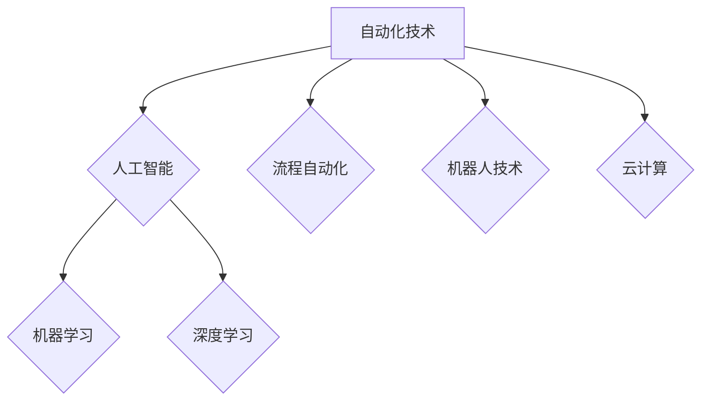

> 自动化技术、人工智能、机器学习、深度学习、自然语言处理、计算机视觉、流程自动化、机器人技术、云计算

## 1. 背景介绍

自动化技术作为科技发展的重要驱动力，近年来取得了显著的进步，深刻地改变了人类生产生活方式。从工业革命的自动化生产线到如今人工智能驱动的智能家居，自动化技术始终扮演着引领未来发展的关键角色。随着科技的不断发展，自动化技术将迎来更加蓬勃的增长，并深刻地影响着各个领域。

## 2. 核心概念与联系

自动化技术的核心概念是通过程序、算法和控制系统，实现对生产、工作流程和任务的自动执行，从而提高效率、降低成本和减少人为错误。

**自动化技术与人工智能的联系:**

人工智能（AI）作为自动化技术的核心驱动力，赋予了自动化技术更强大的智能化能力。人工智能算法能够学习和理解数据，并根据学习到的知识自动完成复杂的任务，例如图像识别、语音识别、自然语言处理等。

**自动化技术与机器学习的联系:**

机器学习作为人工智能的重要分支，通过算法训练数据，使机器能够从数据中学习并不断改进自身性能。机器学习算法广泛应用于自动化技术中，例如预测性维护、智能客服、个性化推荐等。

**自动化技术与深度学习的联系:**

深度学习作为机器学习的进一步发展，利用多层神经网络模拟人类大脑的学习机制，能够处理更复杂的数据，并取得更优异的性能。深度学习在自动化技术中应用广泛，例如图像识别、语音合成、机器翻译等。

**自动化技术与流程自动化的联系:**

流程自动化是指通过软件工具自动执行重复性任务和业务流程，例如审批流程、数据录入、报表生成等。流程自动化可以提高工作效率，减少人为错误，并释放人力资源用于更具创造性的工作。

**自动化技术与机器人技术的联系:**

机器人技术是自动化技术的重要组成部分，通过机械臂、传感器和控制系统，实现机器人的自主运动和操作。机器人技术广泛应用于制造业、物流业、医疗保健等领域，可以提高生产效率、降低成本，并完成危险或重复性工作。

**自动化技术与云计算的联系:**

云计算为自动化技术提供了强大的计算资源和数据存储能力，使得自动化技术能够处理更大规模的数据，并实现更复杂的应用场景。

**Mermaid 流程图:**



## 3. 核心算法原理 & 具体操作步骤

### 3.1  算法原理概述

自动化技术的核心算法原理包括：

* **规则引擎:** 基于预先定义的规则，对输入数据进行判断和决策。
* **机器学习算法:** 通过训练数据，学习数据之间的模式和关系，并根据学习到的知识进行预测和分类。
* **深度学习算法:** 利用多层神经网络，模拟人类大脑的学习机制，处理更复杂的数据，并取得更优异的性能。

### 3.2  算法步骤详解

**规则引擎算法步骤:**

1. 定义规则：根据业务需求，定义一系列规则，描述不同情况下的决策逻辑。
2. 数据输入：将输入数据输入到规则引擎中。
3. 规则匹配：规则引擎根据输入数据，匹配相应的规则。
4. 决策执行：匹配到的规则决定执行相应的动作。

**机器学习算法步骤:**

1. 数据收集：收集相关数据，并进行清洗和预处理。
2. 模型选择：选择合适的机器学习算法，例如线性回归、逻辑回归、决策树、支持向量机等。
3. 模型训练：使用训练数据训练机器学习模型，调整模型参数，使模型能够准确地预测或分类数据。
4. 模型评估：使用测试数据评估模型的性能，例如准确率、召回率、F1-score等。
5. 模型部署：将训练好的模型部署到实际应用场景中，用于预测或分类新的数据。

**深度学习算法步骤:**

1. 数据收集：收集大量数据，并进行清洗和预处理。
2. 模型构建：构建多层神经网络模型，例如卷积神经网络、循环神经网络等。
3. 模型训练：使用训练数据训练深度学习模型，调整模型参数，使模型能够学习数据中的复杂模式。
4. 模型评估：使用测试数据评估模型的性能，例如准确率、召回率、F1-score等。
5. 模型部署：将训练好的模型部署到实际应用场景中，用于预测或分类新的数据。

### 3.3  算法优缺点

**规则引擎算法:**

* **优点:** 易于理解和维护，规则清晰可控。
* **缺点:** 难以处理复杂、模糊的业务场景，规则更新成本高。

**机器学习算法:**

* **优点:** 可以自动学习数据模式，适应变化的业务场景。
* **缺点:** 需要大量数据进行训练，模型解释性较差。

**深度学习算法:**

* **优点:** 可以处理更复杂的数据，取得更优异的性能。
* **缺点:** 需要大量数据和计算资源进行训练，模型训练时间长，模型解释性较差。

### 3.4  算法应用领域

自动化技术广泛应用于各个领域，例如：

* **制造业:** 自动化生产线、机器人焊接、智能质检等。
* **物流业:** 自动化仓储、无人驾驶物流车、智能配送等。
* **金融业:** 自动化交易、风险控制、智能客服等。
* **医疗保健:** 自动化诊断、机器人手术、智能药物研发等。
* **教育:** 自动化批改、个性化学习、智能辅导等。

## 4. 数学模型和公式 & 详细讲解 & 举例说明

### 4.1  数学模型构建

自动化技术中常用的数学模型包括：

* **线性回归模型:** 用于预测连续变量，例如房价、股票价格等。
* **逻辑回归模型:** 用于预测分类变量，例如客户是否会购买产品、邮件是否为垃圾邮件等。
* **决策树模型:** 用于分类和预测，通过树状结构表示决策规则。
* **支持向量机模型:** 用于分类和回归，通过寻找最佳的分隔超平面来分类数据。

### 4.2  公式推导过程

**线性回归模型的公式推导:**

假设我们有n个样本数据，每个样本包含一个输入特征x和一个输出目标y。线性回归模型的目标是找到一个线性函数，能够将输入特征x映射到输出目标y。

线性函数的表达式为：

$$y = wx + b$$

其中，w是权重参数，b是偏置参数。

为了找到最佳的w和b值，我们需要使用最小二乘法。最小二乘法的目标是找到w和b值，使得模型预测值与实际值之间的误差平方和最小。

误差平方和为：

$$SSE = \sum_{i=1}^{n}(y_i - \hat{y}_i)^2$$

其中，$\hat{y}_i$是模型预测的第i个样本的输出值。

通过对SSE求导，并令导数为零，可以得到w和b的解：

$$w = \frac{\sum_{i=1}^{n}(x_i - \bar{x})(y_i - \bar{y})}{\sum_{i=1}^{n}(x_i - \bar{x})^2}$$

$$b = \bar{y} - w\bar{x}$$

其中，$\bar{x}$和$\bar{y}$分别是输入特征x和输出目标y的平均值。

### 4.3  案例分析与讲解

**线性回归模型的案例分析:**

假设我们想要预测房价，输入特征是房屋面积，输出目标是房价。我们可以收集一些房屋面积和房价的数据，并使用线性回归模型进行训练。

训练完成后，我们可以使用模型预测新的房屋价格。例如，如果一个房屋面积为100平方米，我们可以使用模型预测其价格。

## 5. 项目实践：代码实例和详细解释说明

### 5.1  开发环境搭建

* 操作系统: Ubuntu 20.04 LTS
* Python 版本: 3.8.10
* 必要的库: pandas, numpy, scikit-learn

### 5.2  源代码详细实现

```python
import pandas as pd
from sklearn.linear_model import LinearRegression
from sklearn.model_selection import train_test_split

# 加载数据
data = pd.read_csv('house_data.csv')

# 将面积作为特征，价格作为目标
X = data[['面积']]
y = data['价格']

# 将数据分为训练集和测试集
X_train, X_test, y_train, y_test = train_test_split(X, y, test_size=0.2, random_state=42)

# 创建线性回归模型
model = LinearRegression()

# 训练模型
model.fit(X_train, y_train)

# 预测测试集数据
y_pred = model.predict(X_test)

# 评估模型性能
from sklearn.metrics import mean_squared_error
mse = mean_squared_error(y_test, y_pred)
print(f'均方误差: {mse}')
```

### 5.3  代码解读与分析

* 首先，我们加载数据，并将面积作为特征，价格作为目标。
* 然后，我们将数据分为训练集和测试集，用于训练和评估模型。
* 接下来，我们创建线性回归模型，并使用训练集数据进行训练。
* 训练完成后，我们可以使用模型预测测试集数据，并评估模型性能。

### 5.4  运行结果展示

运行代码后，会输出模型的均方误差值。均方误差值越小，模型的预测性能越好。

## 6. 实际应用场景

### 6.1  自动化生产线

自动化生产线可以提高生产效率、降低成本，并减少人为错误。例如，汽车制造业的自动化生产线可以实现汽车的自动组装、喷漆、检测等过程。

### 6.2  智能客服

智能客服可以利用自然语言处理技术，自动回答客户的常见问题，并提供个性化的服务。例如，银行的智能客服可以帮助客户查询账户余额、转账、办理贷款等业务。

### 6.3  个性化推荐

个性化推荐可以根据用户的历史行为和偏好，推荐用户感兴趣的产品或服务。例如，电商平台的个性化推荐可以根据用户的购买历史、浏览记录等数据，推荐用户可能感兴趣的商品。

### 6.4  未来应用展望

自动化技术将继续在各个领域得到广泛应用，例如：

* **自动驾驶:** 自动驾驶汽车将改变交通出行方式，提高道路安全性和效率。
* **医疗诊断:** 自动化诊断系统可以辅助医生进行诊断，提高诊断准确率。
* **个性化教育:** 自动化教育系统可以根据学生的学习进度和能力，提供个性化的学习内容和辅导。

## 7. 工具和资源推荐

### 7.1  学习资源推荐

* **在线课程:** Coursera, edX, Udemy等平台提供丰富的自动化技术课程。
* **书籍:** 《Python自动化测试》、《自动化测试实战》、《人工智能基础》等书籍。
* **博客:** 许多技术博客提供自动化技术相关的文章和教程。

### 7.2  开发工具推荐

* **Python:** 广泛应用于自动化开发，拥有丰富的库和框架。
* **Robot Framework:** 用于自动化测试的开源框架。
* **UiPath:** 商业化的自动化流程平台。

### 7.3  相关论文推荐

* **Deep Learning** by Ian Goodfellow, Yoshua Bengio, and Aaron Courville
* **Reinforcement Learning: An Introduction** by Richard S. Sutton and Andrew G. Barto
* **Hands-On Machine Learning with Scikit-Learn, Keras & TensorFlow** by Aurélien Géron

## 8. 总结：未来发展趋势与挑战

### 8.1  研究成果总结

自动化技术近年来取得了显著的进展，人工智能、机器学习、深度学习等技术为自动化技术提供了强大的驱动力。自动化技术已经广泛应用于各个领域