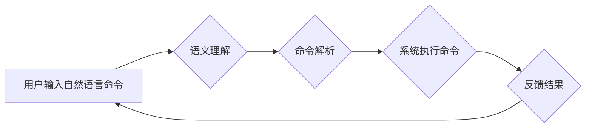

> 自然语言交互 (NLI)
> 命令行界面 (CUI)
> 人机交互
> 语义理解
> 自然语言处理 (NLP)

## 1. 背景介绍

随着人工智能技术的飞速发展，自然语言交互 (NLI) 已成为人机交互领域的重要研究方向。传统命令行界面 (CUI) 的操作方式相对繁琐，需要用户掌握特定的命令语法，这对于非技术人员来说存在一定的学习成本。而NLI则能够通过理解用户的自然语言指令，实现更直观、更便捷的人机交互体验。

NLI在CUI中的应用，能够有效提升用户体验，降低使用门槛，并为CUI带来新的发展机遇。

## 2. 核心概念与联系

### 2.1 自然语言交互 (NLI)

NLI是指机器能够理解和响应人类自然语言的交互方式。它涉及到自然语言处理 (NLP) 领域的核心技术，包括：

* **词法分析:** 将文本分解成单词或词组。
* **语法分析:** 分析文本的语法结构，识别句子成分和关系。
* **语义分析:** 理解文本的含义，识别实体、关系和事件。
* **对话管理:** 控制对话流程，理解用户意图并提供相应的响应。

### 2.2 命令行界面 (CUI)

CUI是一种文本界面，用户通过输入命令来控制系统。它通常用于命令行工具、脚本和程序。CUI的特点是：

* **简洁高效:** 只显示必要的文本信息，操作速度快。
* **功能强大:** 可以执行复杂的命令和操作。
* **可定制性强:** 可以通过自定义脚本和命令来扩展功能。

### 2.3 NLI在CUI中的应用

将NLI技术应用于CUI，可以实现以下功能：

* **自然语言命令:** 用户可以使用自然语言来输入命令，例如“打开浏览器”或“搜索天气预报”。
* **上下文理解:** 系统能够理解用户的上下文信息，并提供更精准的响应。
* **语音交互:** 用户可以通过语音输入命令，实现无键盘交互。
* **个性化定制:** 系统可以根据用户的习惯和偏好，提供个性化的命令建议和响应。

**Mermaid 流程图**



## 3. 核心算法原理 & 具体操作步骤

### 3.1 算法原理概述

NLI在CUI中的应用主要依赖于以下核心算法：

* **词嵌入:** 将单词映射到低维向量空间，捕捉单词之间的语义关系。
* **序列标注:** 将文本序列标记为不同的类别，例如实体识别、情感分析等。
* **机器翻译:** 将自然语言从一种语言翻译成另一种语言。
* **对话系统:** 建立一个能够与用户进行自然语言对话的系统。

### 3.2 算法步骤详解

1. **预处理:** 对用户输入的自然语言进行预处理，例如分词、去停用词、词形还原等。
2. **词嵌入:** 使用词嵌入模型将预处理后的文本转换为向量表示。
3. **语义理解:** 使用序列标注模型或其他语义分析模型，识别用户的意图和实体。
4. **命令解析:** 将用户的意图和实体转换为对应的命令格式。
5. **系统执行:** 将解析后的命令发送到系统执行。
6. **反馈结果:** 将系统的执行结果反馈给用户。

### 3.3 算法优缺点

**优点:**

* **用户体验提升:** 用户可以使用自然语言进行交互，更加直观、便捷。
* **降低使用门槛:** 非技术人员也能更容易地使用CUI。
* **功能扩展:** 可以实现更丰富的交互功能，例如语音交互、个性化定制等。

**缺点:**

* **算法复杂度高:** NLI算法需要处理大量的文本数据，计算量较大。
* **语义理解难度大:** 自然语言的表达方式多样，语义理解仍然是一个挑战。
* **系统响应时间:** 语义理解和命令解析需要一定的时间，可能会影响系统的响应速度。

### 3.4 算法应用领域

NLI在CUI中的应用领域广泛，例如：

* **命令行工具:** 使用自然语言来执行命令，例如搜索文件、启动程序等。
* **脚本自动化:** 使用自然语言来编写和执行脚本，例如自动化任务、数据处理等。
* **编程辅助:** 使用自然语言来编写代码、调试程序等。
* **智能家居:** 使用自然语言来控制智能家居设备，例如调节温度、打开灯光等。

## 4. 数学模型和公式 & 详细讲解 & 举例说明

### 4.1 数学模型构建

NLI算法通常使用深度学习模型，例如循环神经网络 (RNN) 或 Transformer。这些模型可以学习文本序列的语义表示，并进行语义理解和命令解析。

**举例:**

一个简单的RNN模型可以表示为：

$$h_t = f(W_xh_t-1 + W_xh_t + b)$$

其中：

* $h_t$ 是时间步t的隐藏状态。
* $x_t$ 是时间步t的输入词向量。
* $W_x$ 和 $W_h$ 是权重矩阵。
* $b$ 是偏置项。
* $f$ 是激活函数。

### 4.2 公式推导过程

RNN模型的隐藏状态 $h_t$ 是由前一个隐藏状态 $h_{t-1}$ 和当前输入词向量 $x_t$ 计算得到的。通过循环计算，RNN模型可以学习文本序列的上下文信息，并生成最终的语义表示。

### 4.3 案例分析与讲解

**举例:**

假设我们有一个文本序列 "打开浏览器"，我们可以使用RNN模型将其表示为一个向量。RNN模型会首先将每个词 "打开"、"浏览器" 分别转换为词向量，然后通过循环计算，将这些词向量组合起来，生成最终的语义向量。

## 5. 项目实践：代码实例和详细解释说明

### 5.1 开发环境搭建

* 操作系统: Ubuntu 20.04
* Python 版本: 3.8
* 依赖库: TensorFlow, NLTK, SpaCy

### 5.2 源代码详细实现

```python
import tensorflow as tf
from tensorflow.keras.models import Sequential
from tensorflow.keras.layers import Embedding, LSTM, Dense

# 数据预处理
# ...

# 模型构建
model = Sequential()
model.add(Embedding(input_dim=vocab_size, output_dim=embedding_dim))
model.add(LSTM(units=128))
model.add(Dense(units=num_classes, activation='softmax'))

# 模型编译
model.compile(optimizer='adam', loss='sparse_categorical_crossentropy', metrics=['accuracy'])

# 模型训练
model.fit(x_train, y_train, epochs=10)

# 模型评估
loss, accuracy = model.evaluate(x_test, y_test)
print('Loss:', loss)
print('Accuracy:', accuracy)

# 模型预测
predictions = model.predict(x_new)
```

### 5.3 代码解读与分析

* **数据预处理:** 将文本数据转换为数字格式，例如词嵌入。
* **模型构建:** 使用深度学习模型，例如RNN或Transformer，构建NLI模型。
* **模型编译:** 设置优化器、损失函数和评价指标。
* **模型训练:** 使用训练数据训练模型。
* **模型评估:** 使用测试数据评估模型性能。
* **模型预测:** 使用训练好的模型对新的文本数据进行预测。

### 5.4 运行结果展示

训练完成后，可以查看模型的损失值和准确率，并使用模型对新的文本数据进行预测。

## 6. 实际应用场景

### 6.1 智能命令助手

可以将NLI技术应用于智能命令助手，例如使用自然语言来控制智能家居设备、搜索文件、启动程序等。

### 6.2 代码生成工具

可以使用NLI技术构建代码生成工具，例如根据用户描述生成代码片段、自动完成代码补全等。

### 6.3 文档分析工具

NLI技术可以用于文档分析工具，例如提取文档中的关键信息、识别文档主题等。

### 6.4 未来应用展望

NLI在CUI中的应用前景广阔，未来可能应用于更多领域，例如：

* **个性化CUI:** 根据用户的习惯和偏好，定制个性化的CUI界面和命令建议。
* **多模态交互:** 将NLI与语音、图像等其他模态交互技术结合，实现更丰富的交互体验。
* **跨语言交互:** 支持多种语言的自然语言交互，打破语言障碍。

## 7. 工具和资源推荐

### 7.1 学习资源推荐

* **书籍:**
    * 《自然语言处理》
    * 《深度学习》
* **在线课程:**
    * Coursera: 自然语言处理
    * edX: 深度学习
* **开源项目:**
    * spaCy
    * NLTK

### 7.2 开发工具推荐

* **Python:** 广泛用于NLP开发，拥有丰富的库和工具。
* **TensorFlow:** 深度学习框架，用于构建NLI模型。
* **PyTorch:** 深度学习框架，与TensorFlow类似。

### 7.3 相关论文推荐

* **BERT: Pre-training of Deep Bidirectional Transformers for Language Understanding**
* **GPT-3: Language Models are Few-Shot Learners**
* **XLNet: Generalized Autoregressive Pretraining for Language Understanding**

## 8. 总结：未来发展趋势与挑战

### 8.1 研究成果总结

NLI在CUI中的应用取得了显著进展，能够有效提升用户体验，降低使用门槛，并为CUI带来新的发展机遇。

### 8.2 未来发展趋势

未来NLI在CUI中的应用将朝着以下方向发展：

* **更准确的语义理解:** 研究更先进的语义分析模型，提高NLI的准确率。
* **更个性化的交互体验:** 基于用户的习惯和偏好，定制个性化的CUI界面和命令建议。
* **更丰富的交互方式:** 将NLI与语音、图像等其他模态交互技术结合，实现更丰富的交互体验。

### 8.3 面临的挑战

NLI在CUI中的应用仍然面临一些挑战：

* **语义理解的复杂性:** 自然语言的表达方式多样，语义理解仍然是一个难题。
* **数据量的不足:** NLI算法需要大量的文本数据进行训练，而高质量的文本数据往往难以获取。
* **计算资源的限制:** NLI算法计算量较大，需要强大的计算资源支持。

### 8.4 研究展望

未来研究将重点关注以下方面：

* **开发更有效的语义分析模型:** 研究新的算法和模型，提高NLI的准确率和效率。
* **探索新的数据来源:** 挖掘新的数据来源，例如网络文本、书籍、代码等，丰富NLI训练数据。
* **开发更轻量级的NLI模型:** 研究更轻量级的NLI模型，降低计算资源需求，使其能够应用于更多设备。

## 9. 附录：常见问题与解答

### 9.1 如何选择合适的NLI模型？

选择合适的NLI模型需要根据具体应用场景和数据特点进行选择。

* **文本长度:** 如果文本长度较短，可以使用RNN模型。如果文本长度较长，可以使用Transformer模型。
* **数据量:** 如果数据量较少，可以使用预训练模型进行微调。如果数据量较大，可以使用从头训练模型。
* **任务类型:** 不同的任务类型需要不同的NLI模型。例如，文本分类任务可以使用分类器模型，而机器翻译任务可以使用机器翻译模型。

### 9.2 如何评估NLI模型的性能？

NLI模型的性能通常使用以下指标进行评估：

* **准确率:** 模型预测正确的比例。
* **召回率:** 模型能够识别出所有正确实例的比例。
* **F1-score:** 准确率和召回率的调和平均值。
*