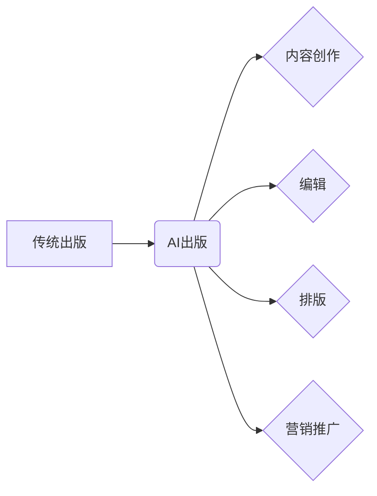

> 自然语言处理，AI，出版业，机器学习，深度学习，文本生成，内容创作，自动化，效率提升

## 1. 背景介绍

出版业作为人类文明传播的重要载体，经历了漫长的发展历程。从印刷术的诞生到数字出版的兴起，出版业始终在不断革新。然而，传统出版模式面临着诸多挑战，例如内容创作效率低下、市场竞争激烈、读者阅读习惯变化等。

近年来，人工智能（AI）技术突飞猛进，特别是自然语言处理（NLP）领域取得了突破性进展。NLP技术能够理解、生成和处理人类语言，为出版业带来了前所未有的机遇。

## 2. 核心概念与联系

**2.1 自然语言处理（NLP）**

自然语言处理（NLP）是人工智能的一个分支，旨在使计算机能够理解、理解和生成人类语言。NLP技术涵盖了文本分析、语音识别、机器翻译等多个领域。

**2.2 AI出版业**

AI出版业是指利用人工智能技术来辅助或替代传统出版流程的各个环节，包括内容创作、编辑、排版、营销推广等。

**2.3 核心概念关系图**



## 3. 核心算法原理 & 具体操作步骤

**3.1 算法原理概述**

AI出版业的核心算法主要包括：

* **文本生成算法**: 用于自动生成各种类型的文本内容，例如新闻报道、小说、诗歌等。常见的文本生成算法包括循环神经网络（RNN）、长短期记忆网络（LSTM）和生成对抗网络（GAN）。
* **文本分类算法**: 用于将文本内容分类到不同的类别，例如新闻主题、情感倾向、垃圾邮件等。常见的文本分类算法包括朴素贝叶斯、支持向量机（SVM）和深度学习模型。
* **文本摘要算法**: 用于提取文本内容的精华部分，生成简洁的摘要。常见的文本摘要算法包括提取式摘要和抽取式摘要。

**3.2 算法步骤详解**

以文本生成算法为例，其具体操作步骤如下：

1. **数据预处理**: 将原始文本数据进行清洗、格式化和编码。
2. **模型训练**: 使用训练数据训练文本生成模型，例如RNN、LSTM或GAN。
3. **文本生成**: 将待生成的文本输入到训练好的模型中，模型会根据训练数据生成相应的文本内容。
4. **文本评估**: 对生成的文本内容进行评估，例如流畅度、准确性、相关性等。

**3.3 算法优缺点**

* **优点**: 自动化内容创作，提高效率，降低成本。
* **缺点**: 生成的文本内容可能缺乏创意和个性，需要人工进行修改和完善。

**3.4 算法应用领域**

* **新闻报道**: 自动生成新闻报道摘要、新闻分类等。
* **小说创作**: 自动生成小说情节、人物对话等。
* **广告文案**: 自动生成广告文案、产品描述等。

## 4. 数学模型和公式 & 详细讲解 & 举例说明

**4.1 数学模型构建**

文本生成模型通常基于概率模型，例如语言模型。语言模型的目标是学习文本序列的概率分布，以便能够生成符合语法和语义的文本。

**4.2 公式推导过程**

一个常见的语言模型是n-gram模型，它假设文本序列中每个词的概率只依赖于其前n-1个词。n-gram模型的概率公式如下：

$$P(w_t|w_{t-1}, w_{t-2}, ..., w_{t-n+1})$$

其中，$w_t$表示当前词，$w_{t-1}, w_{t-2}, ..., w_{t-n+1}$表示其前n-1个词。

**4.3 案例分析与讲解**

假设我们有一个训练语料库，包含以下句子：

"The cat sat on the mat."

如果我们使用3-gram模型，则可以计算出以下概率：

* $P("sat"| "The cat") = 1$
* $P("on"| "sat") = 1$
* $P("mat"| "on the") = 1$

因此，根据3-gram模型，我们可以预测下一个词为"mat"。

## 5. 项目实践：代码实例和详细解释说明

**5.1 开发环境搭建**

* Python 3.x
* TensorFlow 或 PyTorch
* NLTK 或 spaCy

**5.2 源代码详细实现**

```python
import tensorflow as tf

# 定义文本生成模型
model = tf.keras.Sequential([
    tf.keras.layers.Embedding(input_dim=vocab_size, output_dim=embedding_dim),
    tf.keras.layers.LSTM(units=lstm_units),
    tf.keras.layers.Dense(units=vocab_size, activation='softmax')
])

# 编译模型
model.compile(optimizer='adam', loss='sparse_categorical_crossentropy', metrics=['accuracy'])

# 训练模型
model.fit(x_train, y_train, epochs=epochs)

# 生成文本
text = "The cat"
for _ in range(max_length):
    predictions = model.predict(tf.expand_dims(text, 0))
    predicted_index = tf.argmax(predictions[0]).numpy()
    text += tokenizer.index_word[predicted_index]
```

**5.3 代码解读与分析**

* 代码首先定义了一个文本生成模型，使用LSTM层和Dense层。
* 模型使用Adam优化器，交叉熵损失函数和准确率指标进行训练。
* 训练完成后，可以使用模型生成新的文本内容。

**5.4 运行结果展示**

运行代码后，可以生成类似于训练语料库的文本内容。例如，如果训练语料库包含关于猫的句子，则生成的文本内容可能包含关于猫的描述。

## 6. 实际应用场景

**6.1 内容创作辅助**

AI可以帮助作家克服写作瓶颈，生成故事梗概、人物对话、场景描述等，提高写作效率。

**6.2 自动化新闻报道**

AI可以自动生成新闻报道摘要、新闻分类等，节省新闻编辑的时间和精力。

**6.3 个性化内容推荐**

AI可以根据用户的阅读习惯和喜好，推荐个性化的书籍和文章。

**6.4 未来应用展望**

* 更智能、更具创造力的文本生成模型。
* 更精准、更有效的文本分类和摘要算法。
* AI驱动的个性化出版平台。

## 7. 工具和资源推荐

**7.1 学习资源推荐**

* Stanford NLP课程
* Deep Learning Specialization (Coursera)
* Hugging Face Transformers

**7.2 开发工具推荐**

* TensorFlow
* PyTorch
* spaCy

**7.3 相关论文推荐**

* Attention Is All You Need
* BERT: Pre-training of Deep Bidirectional Transformers for Language Understanding

## 8. 总结：未来发展趋势与挑战

**8.1 研究成果总结**

AI出版业取得了显著进展，例如文本生成、文本分类、文本摘要等算法取得了突破性进展。

**8.2 未来发展趋势**

* 更智能、更具创造力的AI模型。
* 更广泛的AI应用场景。
* 人机协作出版模式。

**8.3 面临的挑战**

* 算法的可靠性和安全性。
* 数据隐私和版权问题。
* 人工智能伦理问题。

**8.4 研究展望**

未来研究方向包括：

* 开发更安全、更可靠的AI模型。
* 探索人机协作出版模式。
* 研究人工智能伦理问题。

## 9. 附录：常见问题与解答

**9.1 AI生成的文本是否原创？**

AI生成的文本基于训练数据，因此可能存在重复或抄袭的风险。

**9.2 AI出版业会取代人类出版人吗？**

AI出版业可以辅助人类出版人，提高效率，但不会完全取代人类出版人。

**9.3 AI出版业对社会有哪些影响？**

AI出版业可以促进信息传播，降低出版成本，但同时也可能带来一些挑战，例如数据隐私和版权问题。


作者：禅与计算机程序设计艺术 / Zen and the Art of Computer Programming 
<end_of_turn>