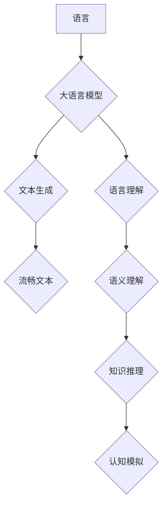

> 大语言模型，认知科学，语言理解，思维模拟，人工智能伦理

## 1. 背景介绍

近年来，大语言模型（LLM）的快速发展，以其惊人的文本生成能力和多任务学习能力，掀起了人工智能领域的热潮。从ChatGPT的爆火到LaMDA的惊艳表现，这些模型展现出令人惊叹的语言理解和生成能力，甚至能够模拟人类的对话和创作。然而，在这些令人兴奋的成就背后，我们不禁要问：这些模型真的“理解”语言吗？它们是否能够像人类一样思考和推理？

LLM的训练方式基于海量文本数据的统计学习，通过学习语言的模式和结构，能够生成流畅、语法正确的文本。然而，这种学习方式仅仅是表面的模仿，并没有真正理解语言背后的含义和逻辑。就像一个鹦鹉能够模仿人类的语言，但并不真正理解语言的意义一样，LLM也面临着“符号主义”的局限性，即仅仅处理语言符号，而缺乏对真实世界的感知和理解。

## 2. 核心概念与联系

**2.1 语言与思维的联系**

语言是人类思维的重要载体，它不仅用于表达思想，也塑造了我们的思维方式。语言的结构和语法影响着我们对世界的认知和理解，而思维的抽象性和逻辑性也体现在语言的表达中。

**2.2 大语言模型的认知能力**

尽管LLM展现出强大的语言能力，但其认知能力仍然有限。它们能够完成许多语言任务，例如翻译、摘要、问答等，但缺乏人类的常识、推理能力和情感理解。

**2.3 认知科学与人工智能的交叉**

认知科学致力于研究人类的思维、学习和感知过程，而人工智能试图构建能够模拟人类认知能力的智能系统。这两者领域的研究相互补充，可以帮助我们更好地理解语言与思维的联系，以及如何构建更智能的人工智能系统。

**Mermaid 流程图**



## 3. 核心算法原理 & 具体操作步骤

**3.1 算法原理概述**

大语言模型的核心算法是基于Transformer网络架构的深度学习模型。Transformer网络通过自注意力机制，能够捕捉文本序列中长距离依赖关系，从而实现更准确的语言理解和生成。

**3.2 算法步骤详解**

1. **词嵌入:** 将文本中的每个词转换为向量表示，捕捉词语的语义信息。
2. **编码器:** 利用多层Transformer编码器，对输入文本序列进行编码，提取文本的语义特征。
3. **解码器:** 利用多层Transformer解码器，根据编码后的文本特征，生成目标文本序列。
4. **损失函数:** 使用交叉熵损失函数，计算模型预测结果与真实结果之间的差异，并通过反向传播算法更新模型参数。

**3.3 算法优缺点**

**优点:**

* 能够捕捉长距离依赖关系，提高语言理解和生成能力。
* 训练效率高，能够处理海量文本数据。
* 可迁移性强，可以应用于多种语言任务。

**缺点:**

* 训练成本高，需要大量的计算资源和数据。
* 容易受到训练数据偏差的影响，可能产生偏见或错误的输出。
* 缺乏对真实世界的感知和理解，难以完成需要常识和推理能力的任务。

**3.4 算法应用领域**

* 文本生成：小说、诗歌、剧本等。
* 机器翻译：将一种语言翻译成另一种语言。
* 问答系统：回答用户提出的问题。
* 聊天机器人：与用户进行自然语言对话。
* 文本摘要：提取文本的关键信息。

## 4. 数学模型和公式 & 详细讲解 & 举例说明

**4.1 数学模型构建**

Transformer网络的核心是自注意力机制，它通过计算每个词与其他词之间的相关性，来捕捉文本序列中的长距离依赖关系。

**4.2 公式推导过程**

自注意力机制的计算公式如下：

$$
Attention(Q, K, V) = softmax(\frac{QK^T}{\sqrt{d_k}})V
$$

其中：

* $Q$：查询矩阵
* $K$：键矩阵
* $V$：值矩阵
* $d_k$：键向量的维度
* $softmax$：softmax函数

**4.3 案例分析与讲解**

假设我们有一个句子“我爱吃苹果”，我们想要计算“吃”这个词与其他词之间的相关性。

1. 将句子中的每个词转换为向量表示，得到查询矩阵 $Q$、键矩阵 $K$ 和值矩阵 $V$。
2. 计算 $QK^T$，得到每个词与其他词之间的相关性得分。
3. 使用 softmax 函数将得分归一化，得到每个词与其他词的注意力权重。
4. 将注意力权重与值矩阵相乘，得到“吃”这个词的上下文向量，它包含了“吃”这个词与其他词之间的语义信息。

## 5. 项目实践：代码实例和详细解释说明

**5.1 开发环境搭建**

* Python 3.7+
* PyTorch 1.7+
* CUDA 10.2+

**5.2 源代码详细实现**

```python
import torch
import torch.nn as nn

class Transformer(nn.Module):
    def __init__(self, vocab_size, embedding_dim, num_heads, num_layers):
        super(Transformer, self).__init__()
        self.embedding = nn.Embedding(vocab_size, embedding_dim)
        self.encoder = nn.TransformerEncoder(nn.TransformerEncoderLayer(embedding_dim, num_heads), num_layers)

    def forward(self, x):
        x = self.embedding(x)
        x = self.encoder(x)
        return x
```

**5.3 代码解读与分析**

* `Transformer` 类定义了一个Transformer网络模型。
* `embedding` 层将词语转换为向量表示。
* `encoder` 层是一个Transformer编码器，用于提取文本的语义特征。

**5.4 运行结果展示**

训练好的Transformer模型可以用于各种语言任务，例如文本生成、机器翻译等。

## 6. 实际应用场景

**6.1 文本生成**

LLM可以用于生成各种类型的文本，例如小说、诗歌、剧本等。例如，OpenAI的GPT-3模型可以根据给定的提示，生成高质量的创意文本。

**6.2 机器翻译**

LLM可以用于将一种语言翻译成另一种语言。例如，Google的BERT模型可以实现高质量的机器翻译。

**6.3 问答系统**

LLM可以用于构建问答系统，回答用户提出的问题。例如，微软的DialoGPT模型可以进行自然语言对话，并回答用户的提问。

**6.4 聊天机器人**

LLM可以用于构建聊天机器人，与用户进行自然语言对话。例如，Facebook的BlenderBot模型可以进行多轮对话，并记住之前的对话内容。

**6.5 文本摘要**

LLM可以用于提取文本的关键信息，生成文本摘要。例如，BART模型可以生成高质量的文本摘要。

**6.6 未来应用展望**

LLM在未来将有更广泛的应用场景，例如：

* 教育：个性化学习、智能辅导
* 医疗：疾病诊断、医疗记录分析
* 法律：法律文件分析、合同审查
* 娱乐：游戏剧本创作、虚拟角色对话

## 7. 工具和资源推荐

**7.1 学习资源推荐**

* **书籍:**
    * 《深度学习》
    * 《自然语言处理》
    * 《Transformer网络》
* **在线课程:**
    * Coursera: 深度学习
    * Udacity: 自然语言处理
    * fast.ai: 深度学习

**7.2 开发工具推荐**

* **PyTorch:** 深度学习框架
* **TensorFlow:** 深度学习框架
* **HuggingFace:** 预训练模型库

**7.3 相关论文推荐**

* 《Attention Is All You Need》
* 《BERT: Pre-training of Deep Bidirectional Transformers for Language Understanding》
* 《GPT-3: Language Models are Few-Shot Learners》

## 8. 总结：未来发展趋势与挑战

**8.1 研究成果总结**

近年来，LLM取得了显著的进展，展现出强大的语言理解和生成能力。这些模型的出现，为人工智能领域带来了新的机遇和挑战。

**8.2 未来发展趋势**

* **模型规模的进一步扩大:** 更大的模型规模可以带来更好的性能，但同时也带来更高的训练成本和计算资源需求。
* **多模态学习:** 将文本与其他模态数据（例如图像、音频）进行融合，构建更全面的认知模型。
* **可解释性研究:** 研究LLM的决策过程，提高模型的可解释性和透明度。

**8.3 面临的挑战**

* **数据偏见:** 训练数据可能存在偏见，导致模型输出结果存在偏差。
* **安全风险:** LLMs可能被用于生成虚假信息、进行网络攻击等恶意活动。
* **伦理问题:** LLMs的应用引发了关于人工智能伦理、隐私保护等一系列问题。

**8.4 研究展望**

未来，LLM的研究将继续朝着更智能、更安全、更可解释的方向发展。我们需要加强对LLM的理解和控制，确保其安全、负责任地应用于社会。

## 9. 附录：常见问题与解答

**9.1 如何训练一个LLM模型？**

训练一个LLM模型需要大量的计算资源、数据和专业知识。一般来说，需要使用深度学习框架（例如PyTorch或TensorFlow），并根据具体的任务选择合适的模型架构和训练策略。

**9.2 LLMs真的理解语言吗？**

目前，LLMs仍然没有真正理解语言的能力。它们仅仅是通过学习语言的模式和结构，能够生成流畅、语法正确的文本。

**9.3 LLMs有哪些应用场景？**

LLMs可以应用于各种场景，例如文本生成、机器翻译、问答系统、聊天机器人、文本摘要等。

**9.4 LLMs有哪些伦理问题？**

LLMs的应用引发了关于人工智能伦理、隐私保护、信息安全等一系列问题。我们需要加强对LLM的监管和引导，确保其安全、负责任地应用于社会。


作者：禅与计算机程序设计艺术 / Zen and the Art of Computer Programming 
<end_of_turn>