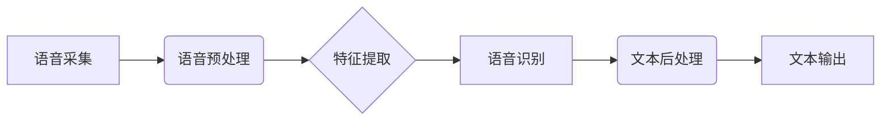

> 语音识别, 人机交互, 深度学习, 自然语言处理, 创业

## 1. 背景介绍

语音识别技术作为人机交互的重要组成部分，近年来取得了长足的进步。从早期的基于规则的语音识别系统到如今的深度学习驱动的语音识别模型，技术的演进速度令人瞩目。随着人工智能技术的蓬勃发展，语音识别技术也迎来了新的机遇和挑战。

**1.1 语音识别技术发展历程**

语音识别技术的发展可以追溯到20世纪50年代，早期主要依赖于规则和特征工程，识别准确率有限。随着计算机硬件和算法的进步，基于统计模型的语音识别系统逐渐兴起，例如隐马尔可夫模型（HMM）和条件随机场（CRF）。

21世纪初，深度学习技术的出现为语音识别领域带来了革命性的变革。卷积神经网络（CNN）和循环神经网络（RNN）等深度学习模型能够自动学习语音特征，显著提高了语音识别的准确率和鲁棒性。

**1.2 语音识别技术应用场景**

语音识别技术已广泛应用于各个领域，例如：

* **智能家居:** 语音控制家电、调节灯光、播放音乐等。
* **移动设备:** 语音助手、语音输入、语音通话等。
* **汽车行业:** 语音导航、语音控制车载系统等。
* **医疗保健:** 语音记录病历、语音诊断等。
* **教育:** 语音朗读、语音识别作业等。

**1.3 语音识别创业机遇**

语音识别技术的快速发展为创业者带来了诸多机遇。

* **垂直领域应用:** 针对特定行业或场景开发定制化的语音识别解决方案。
* **边缘计算:** 将语音识别模型部署到边缘设备，实现低延迟、高效率的语音识别。
* **多模态交互:** 将语音识别与其他传感器数据（如图像、视频）融合，实现更智能的人机交互。

## 2. 核心概念与联系

语音识别系统通常由以下几个核心模块组成：

* **语音采集:** 使用麦克风或其他音频设备采集语音信号。
* **语音预处理:** 对采集到的语音信号进行降噪、增益调整、分帧等处理，提高语音信号质量。
* **特征提取:** 从语音信号中提取特征，例如梅尔频率倒谱系数（MFCC）、线性预测系数（LPC）等。
* **语音识别:** 使用机器学习模型对提取的语音特征进行识别，将语音信号转换为文本。
* **文本后处理:** 对识别结果进行纠错、拼写检查等处理，提高识别结果的准确性。

**2.1 语音识别系统架构**



## 3. 核心算法原理 & 具体操作步骤

### 3.1  算法原理概述

深度学习模型在语音识别领域取得了显著的成果，其中，循环神经网络（RNN）及其变种，例如长短期记忆网络（LSTM）和双向循环神经网络（Bi-LSTM），是语音识别中常用的算法。

RNN能够处理序列数据，例如语音信号，并学习语音信号中时间依赖的特征。LSTM和Bi-LSTM则通过引入门控机制，能够更好地捕捉长距离依赖关系，提高语音识别的准确率。

### 3.2  算法步骤详解

1. **数据预处理:** 将语音信号转换为数字信号，并进行分帧、特征提取等处理。
2. **模型训练:** 使用训练数据训练LSTM或Bi-LSTM模型，学习语音特征和语言模型。
3. **模型评估:** 使用测试数据评估模型的性能，例如识别准确率、错误率等。
4. **模型部署:** 将训练好的模型部署到实际应用场景中，例如智能手机、智能音箱等。

### 3.3  算法优缺点

**优点:**

* 能够学习复杂的语音特征，提高识别准确率。
* 对噪声和环境变化具有较好的鲁棒性。

**缺点:**

* 训练数据量大，训练时间长。
* 模型参数量大，部署成本较高。

### 3.4  算法应用领域

* **语音助手:** 例如Siri、Alexa、Google Assistant等。
* **语音搜索:** 例如语音搜索引擎、语音命令等。
* **语音翻译:** 例如实时语音翻译、语音字幕等。

## 4. 数学模型和公式 & 详细讲解 & 举例说明

### 4.1  数学模型构建

语音识别模型通常基于概率模型，例如隐马尔可夫模型（HMM）和条件随机场（CRF）。

**4.1.1 隐马尔可夫模型（HMM）**

HMM是一种用于处理序列数据的概率模型，它假设每个时刻的状态只依赖于前一个时刻的状态，而与其他时刻的状态无关。

**4.1.2 条件随机场（CRF）**

CRF是一种用于处理序列数据的概率模型，它假设每个时刻的状态依赖于所有历史时刻的状态。

### 4.2  公式推导过程

**4.2.1 HMM 的状态转移概率和发射概率**

* 状态转移概率：$a_{ij} = P(q_t = j | q_{t-1} = i)$，表示从状态 $i$ 转移到状态 $j$ 的概率。
* 发射概率：$b_i(o_t) = P(o_t | q_t = i)$，表示在状态 $i$ 下观测到输出 $o_t$ 的概率。

**4.2.2 CRF 的条件概率**

* 条件概率：$P(y_1, y_2, ..., y_T | x) = \frac{1}{Z(x)} \exp(\sum_{t=1}^{T} \sum_{i=1}^{N} \lambda_i f_i(x, y_t))$，其中 $y_t$ 是序列 $y$ 中第 $t$ 个标签， $x$ 是输入序列， $f_i(x, y_t)$ 是特征函数， $\lambda_i$ 是权重参数， $Z(x)$ 是归一化因子。

### 4.3  案例分析与讲解

**4.3.1 HMM 在语音识别中的应用**

HMM 可以用于语音识别，将语音信号序列映射到对应的文本序列。

**4.3.2 CRF 在语音识别中的应用**

CRF 可以用于语音识别，并能更好地处理语音信号中的长距离依赖关系。

## 5. 项目实践：代码实例和详细解释说明

### 5.1  开发环境搭建

* 操作系统：Ubuntu 20.04
* Python 版本：3.8
* 深度学习框架：TensorFlow 2.x

### 5.2  源代码详细实现

```python
# 导入必要的库
import tensorflow as tf

# 定义 LSTM 模型
model = tf.keras.Sequential([
    tf.keras.layers.Embedding(input_dim=vocab_size, output_dim=embedding_dim),
    tf.keras.layers.LSTM(units=lstm_units),
    tf.keras.layers.Dense(units=vocab_size, activation='softmax')
])

# 编译模型
model.compile(optimizer='adam',
              loss='sparse_categorical_crossentropy',
              metrics=['accuracy'])

# 训练模型
model.fit(x_train, y_train, epochs=epochs, batch_size=batch_size)

# 评估模型
loss, accuracy = model.evaluate(x_test, y_test)
print('Test Loss:', loss)
print('Test Accuracy:', accuracy)

# 保存模型
model.save('speech_recognition_model.h5')
```

### 5.3  代码解读与分析

* **Embedding 层:** 将单词转换为稠密的向量表示。
* **LSTM 层:** 学习语音信号中的时间依赖特征。
* **Dense 层:** 将 LSTM 输出映射到每个单词的概率分布。
* **编译模型:** 使用 Adam 优化器、交叉熵损失函数和准确率作为评估指标。
* **训练模型:** 使用训练数据训练模型。
* **评估模型:** 使用测试数据评估模型的性能。
* **保存模型:** 将训练好的模型保存为文件。

### 5.4  运行结果展示

训练完成后，可以使用测试数据评估模型的性能，例如识别准确率、错误率等。

## 6. 实际应用场景

### 6.1 语音助手

语音助手可以理解用户的语音指令，并执行相应的操作，例如播放音乐、设置闹钟、发送短信等。

### 6.2 语音搜索

语音搜索可以利用语音识别技术，将用户的语音查询转换为文本，并返回相关的搜索结果。

### 6.3 语音翻译

语音翻译可以将一种语言的语音转换为另一种语言的语音或文本。

### 6.4  未来应用展望

* **多模态交互:** 将语音识别与其他传感器数据（如图像、视频）融合，实现更智能的人机交互。
* **个性化语音识别:** 根据用户的语音特征和习惯，定制个性化的语音识别模型。
* **实时语音转录:** 将语音实时转换为文本，用于会议记录、课堂笔记等场景。

## 7. 工具和资源推荐

### 7.1  学习资源推荐

* **书籍:**
    * 《Speech and Language Processing》
    * 《Deep Learning》
* **在线课程:**
    * Coursera: Natural Language Processing Specialization
    * edX: Deep Learning

### 7.2  开发工具推荐

* **深度学习框架:** TensorFlow, PyTorch
* **语音识别库:** Kaldi, Vosk

### 7.3  相关论文推荐

* 《Sequence to Sequence Learning with Neural Networks》
* 《Attention Is All You Need》

## 8. 总结：未来发展趋势与挑战

### 8.1  研究成果总结

语音识别技术取得了长足的进步，深度学习模型在语音识别领域发挥了重要作用。

### 8.2  未来发展趋势

* **更准确、更鲁棒的语音识别:** 提高语音识别模型的准确率和鲁棒性，能够应对更复杂的环境和语音特征。
* **更低延迟的语音识别:** 降低语音识别模型的延迟时间，实现实时语音识别。
* **更个性化的语音识别:** 根据用户的语音特征和习惯，定制个性化的语音识别模型。

### 8.3  面临的挑战

* **数据标注:** 语音识别模型需要大量的标注数据，数据标注成本高昂。
* **计算资源:** 训练大型语音识别模型需要大量的计算资源。
* **隐私安全:** 语音数据具有隐私敏感性，需要采取措施保护用户隐私。

### 8.4  研究展望

未来，语音识别技术将继续朝着更准确、更鲁棒、更个性化的方向发展，并应用于更多领域，例如医疗保健、教育、娱乐等。

## 9. 附录：常见问题与解答

**9.1 如何选择合适的语音识别模型？**

选择合适的语音识别模型需要考虑以下因素：

* **应用场景:** 不同的应用场景对语音识别模型的性能要求不同。
* **数据量:** 训练模型需要大量的标注数据，数据量越大，模型性能越好。
* **计算资源:** 训练大型语音识别模型需要大量的计算资源。

**9.2 如何提高语音识别模型的准确率？**

提高语音识别模型的准确率可以通过以下方法：

* **增加训练数据量:** 训练模型需要大量的标注数据，增加训练数据量可以提高模型性能。
* **改进特征提取方法:** 使用更有效的特征提取方法可以提高模型的识别能力。
* **优化模型结构:** 调整模型结构，例如增加隐藏层数、调整神经元数量等，可以提高模型性能。

**9.3 如何解决语音识别模型的噪声问题？**

可以使用以下方法解决语音识别模型的噪声问题：

* **语音降噪:** 使用语音降噪算法去除语音信号中的噪声。
* **鲁棒性训练:** 使用对抗训练等方法训练更鲁棒的语音识别模型，能够更好地应对噪