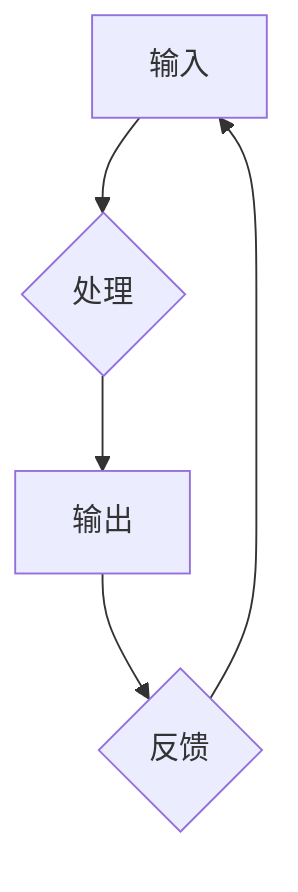

> 信息处理，输入，输出，反馈，算法，数据结构，编程，人工智能

## 1. 背景介绍

在当今信息爆炸的时代，信息处理能力已成为决定一个系统或个体竞争力的关键因素。从简单的计算器到复杂的智能系统，从人类的认知过程到机器学习的算法，都遵循着基本的“输入、处理、输出、反馈”的信息处理逻辑。 

理解这一基本逻辑对于我们深入理解计算机科学、人工智能以及自身认知过程至关重要。本文将从理论层面探讨信息处理的基本原理，并结合实际案例，阐述其在不同领域中的应用。

## 2. 核心概念与联系

信息处理的核心在于将原始数据转化为有意义的信息，并根据需要进行操作和反馈。

**2.1 信息处理流程**

信息处理流程通常可以概括为以下四个步骤：

* **输入 (Input):** 从外部环境获取数据，例如用户输入、传感器数据、网络数据等。
* **处理 (Processing):** 对输入数据进行分析、转换、计算等操作，提取有价值的信息。
* **输出 (Output):** 将处理后的结果以可理解的形式呈现出来，例如显示在屏幕上、存储到文件、发送到网络等。
* **反馈 (Feedback):** 输出结果反馈到处理过程，用于调整和优化后续处理，形成闭环。

**2.2 信息处理架构**



**2.3 核心概念联系**

* **数据:** 信息处理的基石，是未经加工的原始符号或符号组合。
* **算法:** 用于处理数据的指令序列，规定了对数据的操作步骤和逻辑。
* **数据结构:** 用于组织和存储数据的结构，例如数组、链表、树等，影响算法的效率和可读性。
* **编程语言:** 用于描述算法和数据结构的符号系统，使计算机能够理解和执行指令。

## 3. 核心算法原理 & 具体操作步骤

**3.1 算法原理概述**

算法是解决特定问题的指令序列，其核心在于明确定义输入、输出和处理步骤，并保证在所有情况下都能正确执行。

**3.2 算法步骤详解**

1. **问题分析:** 首先需要明确问题的具体描述，包括输入数据、输出结果和处理逻辑。
2. **算法设计:** 根据问题分析结果，设计出解决问题的算法，包括算法步骤、数据结构和操作逻辑。
3. **算法实现:** 将算法用编程语言实现，编写出可执行的代码。
4. **算法测试:** 对实现的算法进行测试，验证其正确性和效率。

**3.3 算法优缺点**

不同的算法具有不同的优缺点，需要根据具体问题选择最合适的算法。

* **时间复杂度:** 指算法执行所需的时间，通常用大O符号表示。
* **空间复杂度:** 指算法执行所需内存空间，也通常用大O符号表示。
* **易读性:** 指算法代码的可读性和理解性。
* **可维护性:** 指算法代码的修改和维护难度。

**3.4 算法应用领域**

算法广泛应用于各个领域，例如：

* **计算机科学:** 搜索算法、排序算法、数据结构算法等。
* **人工智能:** 机器学习算法、深度学习算法、自然语言处理算法等。
* **生物信息学:** 基因序列比对算法、蛋白质结构预测算法等。
* **金融领域:** 风险评估算法、投资策略算法等。

## 4. 数学模型和公式 & 详细讲解 & 举例说明

**4.1 数学模型构建**

数学模型可以用来描述信息处理过程中的各种关系和规律。例如，我们可以用线性方程来描述数据之间的线性关系，用概率论来描述数据的随机性，用图论来描述数据的结构关系。

**4.2 公式推导过程**

在构建数学模型时，需要根据实际问题推导相应的公式。例如，我们可以用以下公式来描述数据之间的线性关系：

$$y = mx + c$$

其中，$y$ 是输出变量，$x$ 是输入变量，$m$ 是斜率，$c$ 是截距。

**4.3 案例分析与讲解**

假设我们有一个简单的线性回归问题，需要预测房价。我们可以收集房子的面积和房价的数据，并用线性回归模型来建立房价与面积之间的关系。

通过对数据进行拟合，我们可以得到一个线性方程，例如：

$$y = 2000x + 50000$$

其中，$y$ 是房价，$x$ 是房子的面积。

这个方程告诉我们，每增加1平方米的面积，房价就会增加2000元。

## 5. 项目实践：代码实例和详细解释说明

**5.1 开发环境搭建**

为了实现信息处理的项目，我们需要搭建一个合适的开发环境。

* **操作系统:** Linux、macOS 或 Windows。
* **编程语言:** Python、Java、C++ 等。
* **开发工具:** IDE、文本编辑器、调试器等。

**5.2 源代码详细实现**

以下是一个简单的Python代码示例，演示了如何实现一个简单的文本处理程序：

```python
def process_text(text):
  """
  处理文本，将所有字母转换为大写。
  """
  return text.upper()

# 获取用户输入的文本
text = input("请输入文本：")

# 处理文本
processed_text = process_text(text)

# 输出处理后的文本
print("处理后的文本：", processed_text)
```

**5.3 代码解读与分析**

* `process_text(text)` 函数接收一个文本字符串作为输入，并使用 `text.upper()` 方法将所有字母转换为大写，返回处理后的文本。
* `input("请输入文本：")` 函数获取用户输入的文本，并将其存储在 `text` 变量中。
* `processed_text = process_text(text)` 调用 `process_text()` 函数处理文本，并将结果存储在 `processed_text` 变量中。
* `print("处理后的文本：", processed_text)` 函数输出处理后的文本。

**5.4 运行结果展示**

如果用户输入 "hello world"，程序将输出 "HELLO WORLD"。

## 6. 实际应用场景

信息处理技术广泛应用于各个领域，例如：

* **搜索引擎:** 利用算法对海量数据进行索引和检索，提供精准的搜索结果。
* **社交媒体:** 利用算法推荐相关内容，分析用户行为，实现个性化服务。
* **电子商务:** 利用算法推荐商品，预测用户需求，优化物流配送。
* **医疗诊断:** 利用算法分析医学影像，辅助医生诊断疾病。

**6.4 未来应用展望**

随着人工智能技术的不断发展，信息处理技术将更加智能化、自动化和个性化。

* **智能助手:** 更智能的语音助手和聊天机器人，能够理解更复杂的指令和对话。
* **个性化学习:** 根据用户的学习进度和风格，提供个性化的学习内容和辅导。
* **自动驾驶:** 利用算法分析路况和环境信息，实现自动驾驶功能。
* **医疗辅助:** 利用算法辅助医生进行诊断、治疗和预防疾病。

## 7. 工具和资源推荐

**7.1 学习资源推荐**

* **书籍:**
    * 《算法导论》
    * 《数据结构与算法分析》
    * 《深入理解计算机系统》
* **在线课程:**
    * Coursera
    * edX
    * Udacity

**7.2 开发工具推荐**

* **IDE:**
    * Visual Studio Code
    * PyCharm
    * IntelliJ IDEA
* **文本编辑器:**
    * Sublime Text
    * Atom

**7.3 相关论文推荐**

* **机器学习:**
    * 《机器学习》
    * 《深度学习》
* **人工智能:**
    * 《人工智能：现代方法》
    * 《人工智能：理论与实践》

## 8. 总结：未来发展趋势与挑战

**8.1 研究成果总结**

信息处理技术取得了长足的进步，从简单的计算器到复杂的智能系统，都遵循着基本的“输入、处理、输出、反馈”的信息处理逻辑。

**8.2 未来发展趋势**

未来信息处理技术将更加智能化、自动化和个性化，人工智能将成为核心驱动力。

**8.3 面临的挑战**

* **数据安全:** 如何保护个人隐私和数据安全。
* **算法偏见:** 如何避免算法产生偏见和歧视。
* **伦理问题:** 如何确保人工智能技术的使用符合伦理道德。

**8.4 研究展望**

未来研究将集中在以下几个方面：

* **更智能的算法:** 开发更智能、更灵活、更适应复杂环境的算法。
* **更安全的系统:** 建立更安全的系统，防止数据泄露和恶意攻击。
* **更负责任的人工智能:** 确保人工智能技术的使用符合伦理道德，造福人类社会。

## 9. 附录：常见问题与解答

**9.1 如何选择合适的算法？**

选择合适的算法需要根据具体问题分析输入数据、输出结果和处理逻辑，并考虑算法的时间复杂度、空间复杂度、易读性和可维护性等因素。

**9.2 如何提高算法效率？**

提高算法效率可以从以下几个方面入手：

* **优化算法逻辑:** 简化算法步骤，减少重复计算。
* **选择合适的算法数据结构:** 优化数据存储和访问方式。
* **利用并行计算:** 将算法分解成多个子任务，并行执行。

**9.3 如何避免算法产生偏见？**

避免算法产生偏见需要从以下几个方面入手：

* **数据多样化:** 使用多样化的训练数据，避免数据偏差。
* **算法透明化:** 使算法的决策过程更加透明，便于识别和修正偏见。
* **伦理审查:** 对算法进行伦理审查，确保其符合社会公正和公平原则。


作者：禅与计算机程序设计艺术 / Zen and the Art of Computer Programming 
<end_of_turn>