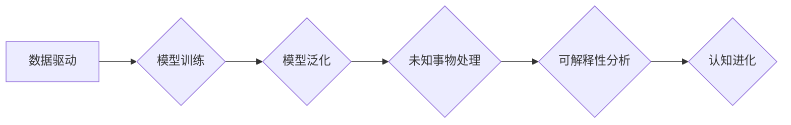

> 人工智能、认知进化、未知事物、机器学习、深度学习、数据驱动、模型泛化、可解释性

## 1. 背景介绍

在瞬息万变的科技时代，人工智能（AI）正以惊人的速度发展，不断突破人类认知的边界。从语音识别到图像生成，从自动驾驶到医疗诊断，AI技术的应用领域日益广泛，深刻地改变着我们的生活方式和社会结构。然而，在AI的蓬勃发展过程中，我们也面临着许多挑战，其中之一就是如何应对未知事物。

传统人工智能系统通常依赖于大量的标注数据进行训练，而未知事物往往缺乏充足的训练数据。因此，如何让AI系统能够有效地学习和应对未知事物，是当前人工智能研究领域的一个重要课题。

## 2. 核心概念与联系

**2.1 认知进化**

认知进化是指生物或人工智能系统在经历学习和适应的过程中，逐渐提高认知能力的过程。它涉及到知识的获取、理解、应用和反思等多个方面。

**2.2 未知事物**

未知事物是指我们目前无法完全理解或预测的事件、现象或概念。它具有不确定性、复杂性和动态性等特点，对人工智能系统的学习和决策带来挑战。

**2.3 数据驱动与模型泛化**

数据驱动是现代人工智能的核心思想，即通过大量的训练数据来训练和优化人工智能模型。模型泛化是指模型能够将从训练数据中学到的知识应用到新的、未见过的数据上。

**2.4 可解释性**

可解释性是指人工智能模型的决策过程能够被人类理解和解释的能力。对于未知事物，可解释性尤为重要，因为它可以帮助我们理解模型的决策逻辑，并提高对未知事物的认知。

**Mermaid 流程图**



## 3. 核心算法原理 & 具体操作步骤

**3.1 算法原理概述**

针对未知事物的处理，目前人工智能领域主要采用以下几种算法：

* **迁移学习:** 利用已有的知识和经验，迁移到新的任务或领域。
* **元学习:** 学习如何学习，能够快速适应新的任务和环境。
* **强化学习:** 通过与环境交互，学习最优的策略。

**3.2 算法步骤详解**

以迁移学习为例，其具体步骤如下：

1. **源任务训练:** 在源任务上训练一个模型，并获得其权重参数。
2. **特征提取:** 将源任务的特征提取出来，作为目标任务的输入特征。
3. **目标任务微调:** 在目标任务上微调模型的权重参数，使其能够适应新的任务。

**3.3 算法优缺点**

* **迁移学习:** 优点是能够利用已有知识，减少训练数据需求；缺点是源任务和目标任务之间需要有一定的相似性。
* **元学习:** 优点是能够快速适应新的任务；缺点是训练复杂度较高。
* **强化学习:** 优点是能够学习最优策略；缺点是训练时间长，需要大量的交互数据。

**3.4 算法应用领域**

* **迁移学习:** 自然语言处理、图像识别、语音识别等领域。
* **元学习:** 自动驾驶、机器人控制、药物发现等领域。
* **强化学习:** 游戏、自动控制、推荐系统等领域。

## 4. 数学模型和公式 & 详细讲解 & 举例说明

**4.1 数学模型构建**

迁移学习可以看作是一个参数优化问题，目标是找到一个最优的模型参数，使得模型在目标任务上的性能达到最大。

**4.2 公式推导过程**

假设源任务的损失函数为 $L_s$, 目标任务的损失函数为 $L_t$, 则迁移学习的目标函数可以表示为：

$$
L = \lambda L_s + (1-\lambda) L_t
$$

其中，$\lambda$ 是一个权重参数，用于平衡源任务和目标任务的损失。

**4.3 案例分析与讲解**

例如，在图像分类任务中，我们可以将预先训练好的图像分类模型作为源任务，并将新的图像分类任务作为目标任务。通过迁移学习，我们可以将源任务的知识迁移到目标任务中，从而提高目标任务的分类精度。

## 5. 项目实践：代码实例和详细解释说明

**5.1 开发环境搭建**

* Python 3.7+
* TensorFlow 2.0+
* PyTorch 1.0+

**5.2 源代码详细实现**

```python
# 迁移学习示例代码

import tensorflow as tf

# 定义源任务模型
source_model = tf.keras.applications.ResNet50(weights='imagenet')

# 定义目标任务模型
target_model = tf.keras.models.Sequential([
    source_model.layers[:-1],  # 使用源任务模型的前几层
    tf.keras.layers.Dense(num_classes, activation='softmax')
])

# 迁移学习
target_model.compile(optimizer='adam',
                    loss='categorical_crossentropy',
                    metrics=['accuracy'])

target_model.fit(target_data, target_labels, epochs=10)
```

**5.3 代码解读与分析**

* 代码首先定义了源任务模型和目标任务模型。
* 源任务模型使用预先训练好的ResNet50模型，目标任务模型使用源任务模型的前几层，并添加一个新的全连接层。
* 然后，代码使用迁移学习方法训练目标任务模型。

**5.4 运行结果展示**

通过训练，目标任务模型的准确率会提高，表明迁移学习方法有效地利用了源任务的知识。

## 6. 实际应用场景

**6.1 自然语言处理**

迁移学习可以用于自然语言处理任务，例如文本分类、情感分析、机器翻译等。

**6.2 图像识别**

迁移学习可以用于图像识别任务，例如物体检测、图像分类、图像分割等。

**6.3 语音识别**

迁移学习可以用于语音识别任务，例如语音转文本、语音命令识别等。

**6.4 未来应用展望**

随着人工智能技术的不断发展，迁移学习等方法将应用于更多领域，例如医疗诊断、金融风险评估、自动驾驶等。

## 7. 工具和资源推荐

**7.1 学习资源推荐**

* **书籍:**
    * 深度学习
    * 人工智能：一个现代方法
* **在线课程:**
    * Coursera: 深度学习
    * Udacity: 
    * fast.ai: 深度学习课程

**7.2 开发工具推荐**

* **TensorFlow:** 开源深度学习框架
* **PyTorch:** 开源深度学习框架
* **Keras:** 高级深度学习API

**7.3 相关论文推荐**

* **迁移学习**
    * Pan, S. J., & Yang, Q. (2010). A survey on transfer learning. IEEE Transactions on Knowledge and Data Engineering, 22(10), 1345-1359.
* **元学习**
    * Finn, C., Abbeel, P., & Levine, S. (2017). Model-agnostic meta-learning for fast adaptation of deep networks. In Proceedings of the 34th International Conference on Machine Learning (pp. 1126-1135).
* **强化学习**
    * Sutton, R. S., & Barto, A. G. (2018). Reinforcement learning: An introduction. MIT press.

## 8. 总结：未来发展趋势与挑战

**8.1 研究成果总结**

近年来，人工智能领域取得了显著进展，特别是迁移学习、元学习和强化学习等方法在应对未知事物方面展现出巨大的潜力。

**8.2 未来发展趋势**

* **更强大的模型:** 随着计算能力的提升，我们将看到更强大、更复杂的AI模型的出现。
* **更有效的学习方法:** 研究人员将继续探索更有效的学习方法，例如自监督学习、无监督学习等。
* **更强的可解释性:** 如何提高AI模型的可解释性，使其决策过程更加透明，是未来研究的重要方向。

**8.3 面临的挑战**

* **数据获取和隐私问题:** 训练强大的AI模型需要大量的训练数据，而数据获取和隐私保护是一个重要的挑战。
* **算法安全性和鲁棒性:** AI模型可能受到攻击或恶意操纵，因此需要提高算法的安全性和鲁棒性。
* **伦理和社会影响:** AI技术的快速发展也带来了伦理和社会影响，需要认真思考和应对。

**8.4 研究展望**

未来，人工智能研究将继续朝着更智能、更安全、更可解释的方向发展，为人类社会带来更多福祉。


## 9. 附录：常见问题与解答

**9.1 如何选择合适的迁移学习方法？**

选择合适的迁移学习方法需要考虑源任务和目标任务之间的相似性、数据量、模型复杂度等因素。

**9.2 如何评估迁移学习的效果？**

可以通过在目标任务上测试模型的性能，例如准确率、召回率等指标来评估迁移学习的效果。

**9.3 如何解决迁移学习中的过拟合问题？**

可以使用正则化技术、数据增强、早停等方法来解决迁移学习中的过拟合问题。


作者：禅与计算机程序设计艺术 / Zen and the Art of Computer Programming 
<end_of_turn>