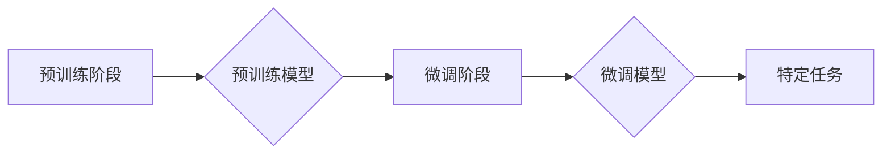

> 预训练，微调，深度学习，自然语言处理，计算机视觉，模型优化，迁移学习

## 1. 背景介绍

近年来，深度学习在人工智能领域取得了突破性的进展，其核心在于训练出强大的模型，能够处理海量数据并进行复杂的任务。然而，训练一个大型深度学习模型需要大量的计算资源和数据，这对许多研究者和开发者来说是一个巨大的挑战。为了解决这个问题，预训练与微调技术应运而生，成为深度学习模型优化策略的重要组成部分。

预训练与微调是一种模型训练策略，它将模型训练分为两个阶段：

* **预训练阶段:** 在一个大规模、公共的语料库上训练模型，学习通用特征和知识。
* **微调阶段:** 将预训练模型应用于特定任务，在小规模、特定领域的语料库上进行微调，以提高模型在该任务上的性能。

这种策略能够有效地利用现有的模型资源，降低训练成本和时间，同时提高模型的性能。

## 2. 核心概念与联系

预训练与微调的核心概念是迁移学习，即利用已学习到的知识和经验来解决新的问题。

**预训练模型** 是在大量数据上训练出的通用模型，它已经学习了数据的基本特征和模式，例如语言的语法规则、图像的结构特征等。

**微调** 是将预训练模型应用于特定任务，通过调整模型参数来使其适应新的数据和任务。

**流程图:**



## 3. 核心算法原理 & 具体操作步骤

### 3.1  算法原理概述

预训练与微调的算法原理主要基于深度学习的梯度下降优化算法。

预训练阶段，模型通过大量数据进行训练，学习到通用的特征表示。微调阶段，模型的参数会被冻结，只调整部分参数，例如最后一层全连接层，以适应新的任务和数据。

### 3.2  算法步骤详解

**预训练阶段:**

1. 选择一个合适的预训练模型架构，例如BERT、GPT、ResNet等。
2. 在一个大规模、公共的语料库上训练模型，例如维基百科、书籍、网页等。
3. 使用交叉熵损失函数和梯度下降优化算法训练模型。

**微调阶段:**

1. 将预训练模型应用于特定任务。
2. 冻结预训练模型的大部分参数，只调整最后一层全连接层的参数。
3. 在小规模、特定领域的语料库上训练模型。
4. 使用交叉熵损失函数和梯度下降优化算法训练模型。

### 3.3  算法优缺点

**优点:**

* 降低训练成本和时间。
* 提高模型性能。
* 能够应用于数据量较少的任务。

**缺点:**

* 预训练模型可能不适合所有任务。
* 微调过程可能需要大量的计算资源。

### 3.4  算法应用领域

预训练与微调技术广泛应用于以下领域:

* 自然语言处理：文本分类、情感分析、机器翻译、问答系统等。
* 计算机视觉：图像分类、目标检测、图像分割等。
* 语音识别：语音转文本、语音合成等。

## 4. 数学模型和公式 & 详细讲解 & 举例说明

### 4.1  数学模型构建

预训练与微调的数学模型主要基于神经网络，其结构可以根据具体任务进行调整。

例如，在自然语言处理任务中，BERT模型使用Transformer架构，其核心是注意力机制，能够捕捉文本中的长距离依赖关系。

### 4.2  公式推导过程

预训练与微调的训练过程本质上是优化模型参数的过程，其目标函数通常是交叉熵损失函数。

**交叉熵损失函数:**

$$
L = -\sum_{i=1}^{N} y_i \log(\hat{y}_i)
$$

其中：

* $N$ 是样本数量。
* $y_i$ 是真实标签。
* $\hat{y}_i$ 是模型预测的概率。

### 4.3  案例分析与讲解

假设我们有一个预训练的BERT模型，用于文本分类任务。

在微调阶段，我们将冻结BERT模型的大部分参数，只调整最后一层全连接层的参数。

训练数据包括一些文本样本和对应的类别标签。

模型会根据训练数据，调整最后一层全连接层的参数，使得模型能够将文本分类到正确的类别。

## 5. 项目实践：代码实例和详细解释说明

### 5.1  开发环境搭建

预训练与微调的项目实践需要以下开发环境：

* Python 3.x
* TensorFlow 或 PyTorch 深度学习框架
* CUDA 和 cuDNN (可选，用于GPU加速)

### 5.2  源代码详细实现

以下是一个使用PyTorch框架进行文本分类微调的代码示例：

```python
import torch
import torch.nn as nn
from transformers import BertModel, BertTokenizer

# 加载预训练模型和词典
model_name = 'bert-base-uncased'
tokenizer = BertTokenizer.from_pretrained(model_name)
model = BertModel.from_pretrained(model_name)

# 定义分类头
class ClassificationHead(nn.Module):
    def __init__(self, num_classes):
        super(ClassificationHead, self).__init__()
        self.linear = nn.Linear(768, num_classes)

    def forward(self, x):
        x = x[:, 0, :]  # 取句子第一个token的输出
        x = self.linear(x)
        return x

# 实例化分类头
num_classes = 2  # 设定分类类别数量
classifier = ClassificationHead(num_classes)

# 将分类头与预训练模型连接
model = nn.Sequential(model, classifier)

# 定义优化器和损失函数
optimizer = torch.optim.Adam(model.parameters(), lr=2e-5)
loss_fn = nn.CrossEntropyLoss()

# 训练模型
# ...

```

### 5.3  代码解读与分析

* 代码首先加载预训练的BERT模型和词典。
* 然后定义一个分类头，用于将BERT模型的输出映射到具体的分类类别。
* 将分类头与预训练模型连接，形成完整的模型。
* 定义优化器和损失函数，用于训练模型。
* 最后进行模型训练，使用微调策略调整模型参数。

### 5.4  运行结果展示

训练完成后，可以评估模型的性能，例如使用准确率、F1-score等指标。

## 6. 实际应用场景

预训练与微调技术在实际应用场景中展现出强大的潜力。

### 6.1  自然语言处理

* **文本分类:** 将文本分类到不同的类别，例如情感分析、主题分类、垃圾邮件过滤等。
* **问答系统:** 回答用户提出的问题，例如搜索引擎、聊天机器人等。
* **机器翻译:** 将文本从一种语言翻译成另一种语言。

### 6.2  计算机视觉

* **图像分类:** 将图像分类到不同的类别，例如识别物体、场景识别等。
* **目标检测:** 在图像中检测到特定目标，例如人脸识别、车辆检测等。
* **图像分割:** 将图像分割成不同的区域，例如医学图像分割、道路分割等。

### 6.3  语音识别

* **语音转文本:** 将语音转换为文本，例如语音助手、语音输入等。
* **语音合成:** 将文本转换为语音，例如语音播报、语音助手等。

### 6.4  未来应用展望

预训练与微调技术在未来将继续发展，并应用于更多领域。

例如，在医疗领域，可以利用预训练模型进行疾病诊断、药物研发等。

在金融领域，可以利用预训练模型进行欺诈检测、风险评估等。

## 7. 工具和资源推荐

### 7.1  学习资源推荐

* **书籍:**
    * Deep Learning by Ian Goodfellow, Yoshua Bengio, and Aaron Courville
    * Hands-On Machine Learning with Scikit-Learn, Keras & TensorFlow by Aurélien Géron
* **在线课程:**
    * Stanford CS231n: Convolutional Neural Networks for Visual Recognition
    * Deep Learning Specialization by Andrew Ng

### 7.2  开发工具推荐

* **深度学习框架:** TensorFlow, PyTorch, Keras
* **预训练模型库:** Hugging Face Transformers, TensorFlow Hub

### 7.3  相关论文推荐

* BERT: Pre-training of Deep Bidirectional Transformers for Language Understanding
* GPT-3: Language Models are Few-Shot Learners
* ResNet: Deep Residual Learning for Image Recognition

## 8. 总结：未来发展趋势与挑战

### 8.1  研究成果总结

预训练与微调技术取得了显著的成果，在自然语言处理、计算机视觉等领域取得了突破性的进展。

### 8.2  未来发展趋势

* **更大的模型:** 预训练模型规模将继续扩大，以学习更丰富的知识和表示。
* **更广泛的应用:** 预训练与微调技术将应用于更多领域，例如医疗、金融、教育等。
* **更有效的训练方法:** 研究更有效的预训练和微调方法，以降低训练成本和时间。

### 8.3  面临的挑战

* **数据偏见:** 预训练模型可能受到训练数据中的偏见影响，导致模型在某些领域表现不佳。
* **可解释性:** 预训练模型的决策过程难以解释，这限制了模型在一些安全关键领域中的应用。
* **公平性:** 预训练模型可能导致算法歧视，需要关注模型的公平性问题。

### 8.4  研究展望

未来研究将集中在解决上述挑战，例如开发更公平、更可解释的预训练模型，以及探索新的预训练和微调方法。

## 9. 附录：常见问题与解答

**Q1: 预训练模型的训练成本很高吗？**

A1: 预训练模型的训练成本确实很高，需要大量的计算资源和数据。但是，由于预训练模型可以被复用，因此在微调阶段，每个特定任务的训练成本会大大降低。

**Q2: 预训练模型适用于所有任务吗？**

A2: 不一定。预训练模型的性能取决于其预训练数据和模型架构。对于某些特定任务，可能需要使用专门训练的模型才能获得更好的性能。

**Q3: 如何选择合适的预训练模型？**

A3: 选择合适的预训练模型需要考虑任务类型、数据规模、模型大小等因素。可以参考Hugging Face Transformers等平台上的预训练模型库，选择适合自己的模型。


作者：禅与计算机程序设计艺术 / Zen and the Art of Computer Programming 
<end_of_turn>