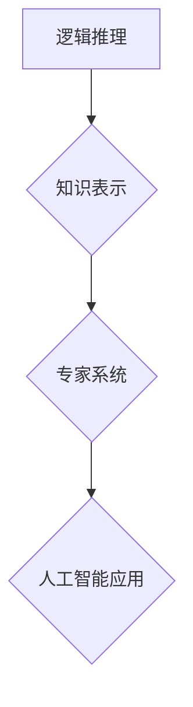

>人工智能，逻辑推理，知识表示，专家系统，计算机科学史

## 1. 背景介绍

20世纪50年代至70年代，人工智能（AI）领域经历了蓬勃发展，涌现出一批杰出的科学家和工程师。其中，约翰·麦卡锡（John McCarthy）和马文·明斯基（Marvin Minsky）是两位奠基人，他们对人工智能的理论和实践做出了不可磨灭的贡献。

麦卡锡被誉为“人工智能之父”，他于1956年提出了“人工智能”这个词，并组织了著名的达特茅斯人工智能研讨会，标志着人工智能研究的正式开始。明斯基是一位多才多艺的科学家，他在神经科学、认知科学和人工智能领域都做出了重要贡献。他与麦卡锡共同创办了麻省理工学院人工智能实验室（MIT AI Lab），成为人工智能研究的中心。

## 2. 核心概念与联系

麦卡锡和明斯基对人工智能的核心概念有以下贡献：

* **逻辑推理:** 他们认为，人工智能的关键在于能够像人类一样进行逻辑推理，从已知的事实和规则中推导出新的知识。
* **知识表示:** 他们强调了知识表示的重要性，即如何将人类知识以计算机可理解的形式表示出来。
* **专家系统:** 他们提出了专家系统的概念，即利用人工智能技术模拟人类专家的知识和推理能力，解决特定领域的复杂问题。

**核心概念与联系流程图:**



## 3. 核心算法原理 & 具体操作步骤

### 3.1  算法原理概述

麦卡锡和明斯基的研究对人工智能算法的发展产生了深远影响。例如，他们提出的逻辑推理算法，如前向推理和后向推理，至今仍是人工智能领域的重要算法。

* **前向推理:** 从已知的事实出发，根据规则推导出新的结论。
* **后向推理:** 从目标结论出发，根据规则反推所需的事实。

### 3.2  算法步骤详解

**前向推理算法步骤:**

1. 从已知的事实开始。
2. 根据规则，从已知的事实推导出新的结论。
3. 重复步骤2，直到达到目标结论或无法再推导出新的结论。

**后向推理算法步骤:**

1. 从目标结论开始。
2. 根据规则，找到与目标结论相关的已知事实或规则。
3. 重复步骤2，直到找到所有所需的事实。

### 3.3  算法优缺点

**前向推理算法:**

* **优点:** 容易理解和实现。
* **缺点:** 效率较低，难以处理复杂问题。

**后向推理算法:**

* **优点:** 效率较高，能够处理复杂问题。
* **缺点:** 难以理解和实现。

### 3.4  算法应用领域

逻辑推理算法广泛应用于人工智能领域，例如：

* **专家系统:** 用于模拟人类专家的知识和推理能力，解决特定领域的复杂问题。
* **自然语言处理:** 用于理解和生成自然语言。
* **机器学习:** 用于训练机器学习模型。

## 4. 数学模型和公式 & 详细讲解 & 举例说明

### 4.1  数学模型构建

麦卡锡和明斯基的研究中，逻辑推理的数学模型主要基于命题逻辑和谓词逻辑。

* **命题逻辑:** 是一种简单的逻辑系统，只处理命题（陈述）和逻辑连接词（如“与”、“或”、“非”）。
* **谓词逻辑:** 是一种更强大的逻辑系统，可以处理变量和函数，更接近人类的思考方式。

### 4.2  公式推导过程

例如，在命题逻辑中，我们可以用以下公式表示“如果A是真，那么B是真”:

$$A \rightarrow B$$

这个公式可以推导出以下结论：

* 如果A是真，那么B是真。
* 如果A是假，那么B可以是真或假。

### 4.3  案例分析与讲解

在专家系统中，我们可以使用谓词逻辑来表示知识。例如，我们可以用以下谓词表示“一个人是医生”:

$$Doctor(x)$$

其中，x是一个变量，代表一个人。

我们可以用以下规则表示“如果一个人是医生，那么他可以开药”:

$$Doctor(x) \rightarrow CanPrescribe(x)$$

其中，CanPrescribe(x)表示“x可以开药”。

## 5. 项目实践：代码实例和详细解释说明

### 5.1  开发环境搭建

为了演示逻辑推理算法的应用，我们可以使用Python语言编写一个简单的专家系统。

需要安装以下软件：

* Python 3.x
* Jupyter Notebook

### 5.2  源代码详细实现

```python
# 专家系统：判断是否需要看医生

def check_symptoms(fever, cough, sore_throat):
  """
  根据症状判断是否需要看医生。

  Args:
    fever: 是否发烧 (True/False)
    cough: 是否咳嗽 (True/False)
    sore_throat: 是否喉咙痛 (True/False)

  Returns:
    需要看医生 (True) 或不需要看医生 (False)
  """

  if fever and cough and sore_throat:
    return True
  elif fever or cough or sore_throat:
    return True
  else:
    return False

# 获取用户输入
fever = input("是否发烧？ (True/False): ")
cough = input("是否咳嗽？ (True/False): ")
sore_throat = input("是否喉咙痛？ (True/False): ")

# 调用函数判断是否需要看医生
need_doctor = check_symptoms(fever, cough, sore_throat)

# 输出结果
if need_doctor:
  print("建议去看医生。")
else:
  print("暂时不需要看医生，但请注意身体状况。")
```

### 5.3  代码解读与分析

这段代码实现了一个简单的专家系统，根据用户的输入（发烧、咳嗽、喉咙痛）判断是否需要看医生。

* `check_symptoms()` 函数根据用户输入的症状，使用逻辑规则判断是否需要看医生。
* `input()` 函数获取用户的输入。
* `if-else` 语句根据判断结果输出不同的建议。

### 5.4  运行结果展示

当用户输入“True”表示发烧、咳嗽和喉咙痛时，程序会输出“建议去看医生”。

当用户输入“True”表示发烧，但没有咳嗽和喉咙痛时，程序会输出“暂时不需要看医生，但请注意身体状况”。

## 6. 实际应用场景

麦卡锡和明斯基的研究成果在人工智能领域有着广泛的应用场景，例如：

* **医疗诊断:** 专家系统可以辅助医生诊断疾病，提高诊断准确率。
* **金融风险管理:** 专家系统可以帮助金融机构识别和管理风险。
* **法律推理:** 专家系统可以帮助律师分析法律问题，提供法律建议。

### 6.4  未来应用展望

随着人工智能技术的不断发展，麦卡锡和明斯基的研究成果将在未来发挥更加重要的作用。例如：

* **个性化医疗:** 专家系统可以根据患者的个体特征提供个性化的医疗建议。
* **自动驾驶:** 专家系统可以帮助自动驾驶汽车做出安全可靠的决策。
* **智能客服:** 专家系统可以帮助企业提供更加智能和高效的客服服务。

## 7. 工具和资源推荐

### 7.1  学习资源推荐

* **人工智能导论:** 
* **人工智能：一种现代方法:** 
* **深度学习:** 

### 7.2  开发工具推荐

* **Python:** 
* **Jupyter Notebook:** 
* **TensorFlow:** 

### 7.3  相关论文推荐

* **A Proposal for the Dartmouth Summer Research Project on Artificial Intelligence:** 
* **Programs with Common Sense:** 

## 8. 总结：未来发展趋势与挑战

### 8.1  研究成果总结

麦卡锡和明斯基的研究成果为人工智能的发展奠定了坚实的基础，他们的工作对人工智能理论和实践都产生了深远的影响。

### 8.2  未来发展趋势

人工智能技术正在快速发展，未来将朝着更加智能、更加通用、更加安全的方向发展。

### 8.3  面临的挑战

人工智能技术还面临着一些挑战，例如：

* **数据获取和处理:** 训练人工智能模型需要大量的训练数据，而获取和处理这些数据是一个挑战。
* **算法解释性和可解释性:** 许多人工智能算法是黑箱模型，难以解释其决策过程，这限制了人工智能技术的应用。
* **伦理和社会影响:** 人工智能技术的快速发展引发了伦理和社会问题，例如人工智能的就业影响、人工智能的偏见问题等。

### 8.4  研究展望

未来，人工智能研究将继续探索更加智能、更加安全、更加可解释的人工智能算法，并解决人工智能技术带来的伦理和社会问题。

## 9. 附录：常见问题与解答

**常见问题:**

* **什么是人工智能？**
* **人工智能有哪些应用场景？**
* **人工智能技术的发展趋势是什么？**

**解答:**

* **什么是人工智能？** 人工智能是指使机器能够像人类一样思考、学习和解决问题的能力。
* **人工智能有哪些应用场景？** 人工智能技术广泛应用于医疗诊断、金融风险管理、法律推理、自动驾驶、智能客服等领域。
* **人工智能技术的发展趋势是什么？** 人工智能技术正在朝着更加智能、更加通用、更加安全的方向发展。


作者：禅与计算机程序设计艺术 / Zen and the Art of Computer Programming 
<end_of_turn>