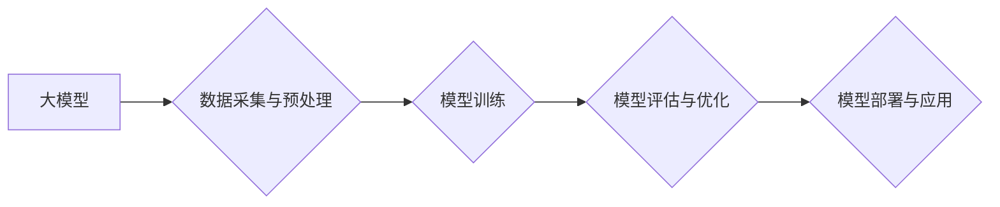

> AI大模型，创业，商业应用，技术趋势，未来优势，落地实践

## 1. 背景介绍

人工智能（AI）技术近年来发展迅速，特别是大模型的涌现，为各行各业带来了前所未有的机遇。大模型是指参数规模庞大、训练数据海量的人工智能模型，具备强大的泛化能力和学习能力，能够在自然语言处理、计算机视觉、语音识别等领域取得突破性进展。

然而，大模型的开发和应用并非易事，需要强大的技术实力、海量数据资源和巨额资金投入。对于创业者来说，如何利用大模型的优势，开拓新的商业模式，并实现可持续发展，是一个重要的课题。

## 2. 核心概念与联系

**2.1 大模型的定义和特点**

大模型是指参数规模在数十亿甚至数千亿级别的人工智能模型。其特点包括：

* **参数规模庞大:** 大模型拥有大量的参数，能够学习更复杂的模式和关系。
* **训练数据海量:** 大模型需要大量的训练数据才能达到最佳性能。
* **泛化能力强:** 大模型能够应用于多种不同的任务，并表现出良好的泛化能力。
* **学习能力强:** 大模型能够从数据中学习新的知识和技能。

**2.2 大模型的架构**

大模型的架构通常基于 Transformer 网络，其特点是能够有效地处理序列数据，并具有强大的并行计算能力。

**2.3 大模型的应用场景**

大模型在各个领域都有广泛的应用场景，例如：

* **自然语言处理:** 文本生成、机器翻译、问答系统、情感分析等。
* **计算机视觉:** 图像识别、物体检测、图像生成等。
* **语音识别:** 语音转文本、语音合成等。
* **推荐系统:** 商品推荐、内容推荐等。

**2.4 大模型创业的机遇和挑战**

大模型为创业者提供了巨大的机遇，但也面临着一些挑战：

* **技术门槛高:** 开发和应用大模型需要强大的技术实力和经验。
* **数据资源匮乏:** 大模型需要海量数据才能训练，而数据资源的获取和处理成本较高。
* **计算资源需求大:** 训练大模型需要大量的计算资源，成本较高。
* **伦理和安全问题:** 大模型的应用可能带来一些伦理和安全问题，需要谨慎对待。

**Mermaid 流程图**

## 3. 核心算法原理 & 具体操作步骤

### 3.1  算法原理概述

大模型的训练主要基于深度学习算法，特别是 Transformer 网络。Transformer 网络的特点是能够有效地处理序列数据，并具有强大的并行计算能力。其核心结构包括编码器和解码器，编码器用于提取输入序列的特征，解码器用于生成输出序列。

### 3.2  算法步骤详解

大模型的训练过程可以概括为以下步骤：

1. **数据采集与预处理:** 收集大量相关数据，并进行清洗、格式化、标记等预处理工作。
2. **模型构建:** 根据任务需求选择合适的模型架构，并初始化模型参数。
3. **模型训练:** 使用训练数据训练模型，通过反向传播算法更新模型参数，使模型的预测结果与真实值尽可能接近。
4. **模型评估与优化:** 使用验证集评估模型的性能，并根据评估结果调整模型参数或架构，以提高模型性能。
5. **模型部署与应用:** 将训练好的模型部署到实际应用场景中，并进行持续监控和维护。

### 3.3  算法优缺点

**优点:**

* 泛化能力强，能够应用于多种不同的任务。
* 学习能力强，能够从数据中学习新的知识和技能。
* 性能优异，在许多任务上取得了突破性进展。

**缺点:**

* 技术门槛高，需要强大的技术实力和经验。
* 数据资源匮乏，需要海量数据才能训练。
* 计算资源需求大，成本较高。
* 训练时间长，可能需要数天甚至数周的时间。

### 3.4  算法应用领域

大模型的应用领域非常广泛，包括：

* 自然语言处理：文本生成、机器翻译、问答系统、情感分析等。
* 计算机视觉：图像识别、物体检测、图像生成等。
* 语音识别：语音转文本、语音合成等。
* 推荐系统：商品推荐、内容推荐等。
* 医疗保健：疾病诊断、药物研发等。
* 金融科技：风险评估、欺诈检测等。

## 4. 数学模型和公式 & 详细讲解 & 举例说明

### 4.1  数学模型构建

大模型的训练过程本质上是一个优化问题，目标是找到模型参数，使得模型的预测结果与真实值之间的误差最小。常用的损失函数包括均方误差（MSE）、交叉熵损失（Cross-Entropy Loss）等。

**4.1.1 均方误差 (MSE)**

MSE 用于回归任务，计算预测值与真实值之间的平方差的平均值。

$$MSE = \frac{1}{N} \sum_{i=1}^{N} (y_i - \hat{y}_i)^2$$

其中：

* $N$ 是样本数量。
* $y_i$ 是真实值。
* $\hat{y}_i$ 是预测值。

**4.1.2 交叉熵损失 (Cross-Entropy Loss)**

交叉熵损失用于分类任务，计算预测概率分布与真实概率分布之间的差异。

$$Cross-Entropy Loss = -\sum_{i=1}^{C} y_i \log(\hat{y}_i)$$

其中：

* $C$ 是类别数量。
* $y_i$ 是真实类别概率。
* $\hat{y}_i$ 是预测类别概率。

### 4.2  公式推导过程

损失函数的推导过程通常基于概率论和统计学原理。例如，MSE 的推导过程可以基于最小二乘法的原理，而交叉熵损失的推导过程可以基于信息论的原理。

### 4.3  案例分析与讲解

可以结合具体的案例分析，例如使用 MSE 损失函数训练一个房价预测模型，或者使用交叉熵损失函数训练一个图像分类模型，并解释损失函数在模型训练过程中的作用。

## 5. 项目实践：代码实例和详细解释说明

### 5.1  开发环境搭建

大模型的开发通常需要使用 Python 语言和相关的深度学习框架，例如 TensorFlow 或 PyTorch。需要安装必要的软件包，并配置开发环境。

### 5.2  源代码详细实现

可以提供一个简单的代码示例，例如使用 TensorFlow 训练一个简单的文本分类模型，并详细解释代码的每一部分。

### 5.3  代码解读与分析

需要对代码进行详细解读，解释代码的逻辑和功能，并分析代码的优缺点。

### 5.4  运行结果展示

可以展示模型的训练结果和测试结果，例如准确率、召回率、F1-score 等指标，并分析结果的优劣。

## 6. 实际应用场景

### 6.1  自然语言处理

大模型在自然语言处理领域有广泛的应用场景，例如：

* **文本生成:** 可以用于生成各种类型的文本，例如新闻文章、小说、诗歌等。
* **机器翻译:** 可以将文本从一种语言翻译成另一种语言。
* **问答系统:** 可以回答用户提出的问题。
* **情感分析:** 可以分析文本的情感倾向，例如正面、负面或中性。

### 6.2  计算机视觉

大模型在计算机视觉领域也有广泛的应用场景，例如：

* **图像识别:** 可以识别图像中的物体、场景等。
* **物体检测:** 可以检测图像中物体的位置和类别。
* **图像生成:** 可以生成新的图像。

### 6.3  语音识别

大模型在语音识别领域也有广泛的应用场景，例如：

* **语音转文本:** 可以将语音转换为文本。
* **语音合成:** 可以将文本转换为语音。

### 6.4  未来应用展望

大模型的应用场景还在不断扩展，未来可能会应用于更多领域，例如：

* **医疗保健:** 辅助医生诊断疾病、研发新药等。
* **金融科技:** 风险评估、欺诈检测等。
* **教育:** 个性化学习、智能辅导等。

## 7. 工具和资源推荐

### 7.1  学习资源推荐

* **书籍:**
    * 《深度学习》
    * 《自然语言处理》
    * 《计算机视觉》
* **在线课程:**
    * Coursera
    * edX
    * Udacity

### 7.2  开发工具推荐

* **深度学习框架:** TensorFlow, PyTorch
* **编程语言:** Python
* **云计算平台:** AWS, Azure, Google Cloud

### 7.3  相关论文推荐

* **Transformer网络:** Attention Is All You Need
* **BERT模型:** BERT: Pre-training of Deep Bidirectional Transformers for Language Understanding
* **GPT模型:** Generative Pre-trained Transformer

## 8. 总结：未来发展趋势与挑战

### 8.1  研究成果总结

大模型在人工智能领域取得了显著的进展，在自然语言处理、计算机视觉、语音识别等领域取得了突破性进展。

### 8.2  未来发展趋势

* **模型规模继续扩大:** 未来大模型的规模将会继续扩大，参数数量将会达到数万亿甚至数千亿级别。
* **模型架构更加复杂:** 未来大模型的架构将会更加复杂，例如多模态模型、自监督学习模型等。
* **应用场景更加广泛:** 未来大模型将会应用于更多领域，例如医疗保健、金融科技、教育等。

### 8.3  面临的挑战

* **数据资源获取和处理:** 大模型需要海量数据才能训练，而数据资源的获取和处理成本较高。
* **计算资源需求:** 训练大模型需要大量的计算资源，成本较高。
* **伦理和安全问题:** 大模型的应用可能带来一些伦理和安全问题，需要谨慎对待。

### 8.4  研究展望

未来研究方向包括：

* **高效训练方法:** 研究更加高效的训练方法，降低训练成本。
* **模型解释性:** 研究大模型的解释性，使其更加透明和可理解。
* **伦理和安全问题:** 研究大模型的伦理和安全问题，制定相应的规范和标准。

## 9. 附录：常见问题与解答

### 9.1  常见问题

* **大模型的训练需要多长时间？**

* **大模型的训练成本是多少？**

* **如何评估大模型的性能？**

* **如何部署大模型到实际应用场景中？**

### 9.2  解答

* **大模型的训练时间取决于模型规模、数据量和硬件资源等因素，可能需要数天甚至数周的时间。**
* **大模型的训练成本取决于模型规模、数据量、训练时间和硬件资源等因素，可能需要数万美元甚至数百万美元。**
* **大模型的性能可以通过准确率、召回率、F1-score 等指标进行评估。**
* **大模型的部署方式取决于具体的应用场景，可以部署到云端、边缘设备或本地服务器等。**

作者：禅与计算机程序设计艺术 / Zen and the Art of Computer Programming 
<end_of_turn>