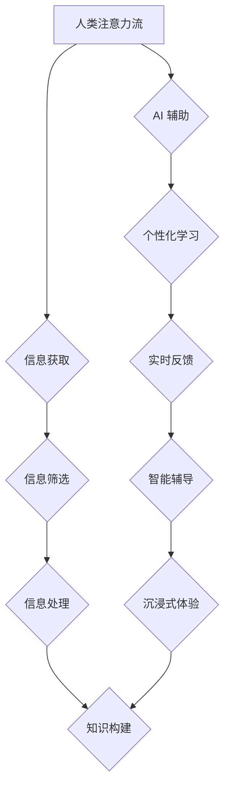

> 人工智能，注意力流，教育，学习，深度学习，神经网络，个性化学习，未来教育

## 1. 背景介绍

在信息爆炸的时代，人类面临着前所未有的信息过载。如何有效地获取、处理和利用信息，成为了一个至关重要的挑战。而注意力，作为人类认知的核心能力之一，在信息时代显得尤为重要。

人工智能（AI）技术的快速发展，为我们提供了新的视角和工具，来理解和提升人类注意力。深度学习算法的出现，使得机器能够学习和模拟人类的注意力机制，从而为教育和学习领域带来了革命性的变革。

## 2. 核心概念与联系

**2.1 人类注意力流**

人类注意力流是一个动态且复杂的认知过程，它涉及到多个脑区和神经网络的协同工作。注意力流可以被理解为一个有限的资源，它可以被分配到不同的任务或信息上，从而帮助我们聚焦于重要内容，并有效地处理信息。

**2.2 AI 与注意力机制**

近年来，深度学习领域涌现出许多基于注意力机制的模型，例如Transformer、BERT等。这些模型能够学习到文本或序列数据的关键信息，并根据其重要性分配不同的权重，从而实现更精准的理解和生成。

**2.3 AI 辅助教育与学习**

将 AI 技术与注意力机制相结合，可以为教育和学习领域带来诸多益处：

* **个性化学习：** AI 可以根据学生的学习进度、兴趣和能力，定制个性化的学习内容和路径。
* **实时反馈：** AI 可以实时监测学生的学习状态，并提供个性化的反馈和建议，帮助学生及时纠正错误和提升学习效率。
* **智能辅导：** AI 可以扮演学生的学习伙伴，提供知识解答、练习指导和学习策略建议。
* **沉浸式体验：** AI 可以创造沉浸式的学习环境，增强学生的学习兴趣和参与度。

**2.4  Mermaid 流程图**



## 3. 核心算法原理 & 具体操作步骤

**3.1 算法原理概述**

注意力机制的核心思想是，在处理序列数据时，不同的元素可能具有不同的重要性。注意力机制通过学习一个权重向量，来分配不同的注意力权重给每个元素，从而突出重要信息，并抑制无关信息。

**3.2 算法步骤详解**

1. **输入序列：** 将需要处理的序列数据输入到注意力机制模型中。
2. **查询、键、值矩阵：** 将输入序列映射到三个不同的矩阵：查询矩阵（Query）、键矩阵（Key）和值矩阵（Value）。
3. **注意力权重计算：** 计算查询矩阵与键矩阵之间的相似度，并将其作为注意力权重。
4. **加权求和：** 将注意力权重与值矩阵相乘，并进行加权求和，得到最终的输出。

**3.3 算法优缺点**

**优点：**

* 可以学习到序列数据中的重要信息。
* 可以有效地处理长序列数据。
* 可以提高模型的表达能力和泛化能力。

**缺点：**

* 计算复杂度较高。
* 需要大量的训练数据。
* 难以解释注意力权重的含义。

**3.4 算法应用领域**

注意力机制在自然语言处理、计算机视觉、语音识别等领域都有广泛的应用，例如：

* **机器翻译：** 关注源语言中的关键词，并将其翻译成目标语言。
* **文本摘要：** 关注文本中的重要句子，并生成简洁的摘要。
* **图像识别：** 关注图像中的关键区域，并进行分类或识别。

## 4. 数学模型和公式 & 详细讲解 & 举例说明

**4.1 数学模型构建**

注意力机制的数学模型可以表示为以下公式：

$$
\text{Attention}(Q, K, V) = \text{softmax}\left(\frac{Q K^T}{\sqrt{d_k}}\right) V
$$

其中：

* $Q$：查询矩阵
* $K$：键矩阵
* $V$：值矩阵
* $d_k$：键向量的维度
* $\text{softmax}$：softmax 函数

**4.2 公式推导过程**

1. 计算查询矩阵 $Q$ 与键矩阵 $K$ 的点积，并进行归一化处理，得到注意力权重矩阵。
2. 将注意力权重矩阵与值矩阵 $V$ 相乘，并进行加权求和，得到最终的输出。

**4.3 案例分析与讲解**

假设我们有一个句子：“我爱学习人工智能”。

* $Q$：查询向量
* $K$：键向量
* $V$：值向量

我们可以计算每个词的注意力权重，并根据权重进行加权求和，得到最终的输出向量。

## 5. 项目实践：代码实例和详细解释说明

**5.1 开发环境搭建**

* Python 3.x
* TensorFlow 或 PyTorch

**5.2 源代码详细实现**

```python
import tensorflow as tf

# 定义注意力机制模型
class Attention(tf.keras.layers.Layer):
    def __init__(self, units):
        super(Attention, self).__init__()
        self.Wq = tf.keras.layers.Dense(units)
        self.Wk = tf.keras.layers.Dense(units)
        self.Wv = tf.keras.layers.Dense(units)
        self.fc = tf.keras.layers.Dense(units)

    def call(self, query, key, value, mask=None):
        # 计算注意力权重
        scores = tf.matmul(self.Wq(query), self.Wk(key), transpose_b=True)
        scores /= tf.math.sqrt(tf.cast(self.Wq.output_shape[-1], tf.float32))
        if mask is not None:
            scores += (mask * -1e9)
        attention_weights = tf.nn.softmax(scores, axis=-1)

        # 加权求和
        context_vector = tf.matmul(attention_weights, value)
        output = self.fc(context_vector)
        return output

# 实例化注意力机制模型
attention_layer = Attention(units=128)

# 输入数据
query = tf.random.normal(shape=(1, 5, 128))
key = tf.random.normal(shape=(1, 5, 128))
value = tf.random.normal(shape=(1, 5, 128))

# 计算注意力输出
output = attention_layer(query, key, value)
print(output.shape)
```

**5.3 代码解读与分析**

* `Attention` 类定义了一个注意力机制模型，包含三个稠密层 (`Wq`, `Wk`, `Wv`) 和一个全连接层 (`fc`)。
* `call` 方法计算注意力权重并进行加权求和，得到最终的输出。
* `tf.matmul` 函数用于计算矩阵乘法。
* `tf.nn.softmax` 函数用于计算softmax函数。
* `mask` 参数用于屏蔽不需要的注意力权重。

**5.4 运行结果展示**

运行代码后，会输出注意力机制模型的输出形状，例如`(1, 5, 128)`。

## 6. 实际应用场景

**6.1 个性化学习平台**

AI 辅助的个性化学习平台可以根据学生的学习进度、兴趣和能力，定制个性化的学习内容和路径。例如，AI 可以根据学生的学习记录，推荐相关的学习资源，并提供个性化的学习建议。

**6.2 智能辅导系统**

智能辅导系统可以扮演学生的学习伙伴，提供知识解答、练习指导和学习策略建议。例如，AI 可以帮助学生理解复杂的知识点，并提供针对性的练习题。

**6.3 沉浸式学习环境**

AI 可以创造沉浸式的学习环境，增强学生的学习兴趣和参与度。例如，AI 可以生成虚拟现实场景，让学生身临其境地体验学习内容。

**6.4 未来应用展望**

随着 AI 技术的不断发展，AI 与注意力机制的结合将为教育和学习领域带来更多创新应用，例如：

* **实时个性化反馈：** AI 可以实时监测学生的学习状态，并提供个性化的反馈和建议，帮助学生及时纠正错误和提升学习效率。
* **智能学习伙伴：** AI 可以扮演学生的学习伙伴，提供更智能、更个性化的学习支持。
* **跨学科学习：** AI 可以帮助学生建立跨学科的知识网络，并促进深度学习。

## 7. 工具和资源推荐

**7.1 学习资源推荐**

* **书籍：**
    * 《深度学习》
    * 《Attention Is All You Need》
* **在线课程：**
    * Coursera: 深度学习
    * Udacity: 自然语言处理

**7.2 开发工具推荐**

* **TensorFlow:** 开源深度学习框架
* **PyTorch:** 开源深度学习框架
* **Hugging Face:** 自然语言处理模型库

**7.3 相关论文推荐**

* 《Attention Is All You Need》
* 《BERT: Pre-training of Deep Bidirectional Transformers for Language Understanding》

## 8. 总结：未来发展趋势与挑战

**8.1 研究成果总结**

AI 与注意力机制的结合为教育和学习领域带来了革命性的变革，为个性化学习、智能辅导和沉浸式学习提供了新的可能性。

**8.2 未来发展趋势**

未来，AI 与注意力机制在教育和学习领域的应用将更加广泛和深入，例如：

* **更精准的个性化学习：** AI 将能够更精准地理解学生的学习需求，并提供更个性化的学习方案。
* **更智能的学习伙伴：** AI 将能够扮演更智能、更人性化的学习伙伴，提供更有效的学习支持。
* **更沉浸式的学习体验：** AI 将能够创造更逼真的虚拟现实学习环境，增强学生的学习兴趣和参与度。

**8.3 面临的挑战**

尽管 AI 与注意力机制在教育和学习领域展现了巨大的潜力，但也面临着一些挑战：

* **数据隐私和安全：** AI 模型需要大量的数据进行训练，如何保护学生的隐私和数据安全是一个重要的挑战。
* **算法公平性：** AI 模型可能会存在偏见，导致不公平的学习结果。
* **伦理问题：** AI 在教育和学习领域的应用可能会引发一些伦理问题，例如，AI 是否会取代教师的角色？

**8.4 研究展望**

未来，我们需要继续研究和探索 AI 与注意力机制在教育和学习领域的应用，并解决相关挑战，以确保 AI 技术能够真正为教育和学习领域带来积极的变革。

## 9. 附录：常见问题与解答

**9.1 如何选择合适的 AI 模型？**

选择合适的 AI 模型取决于具体的应用场景和数据特点。例如，对于文本分类任务，BERT 模型效果较好；对于图像识别任务，ResNet 模型效果较好。

**9.2 如何评估 AI 模型的性能？**

常用的评估指标包括准确率、召回率、F1-score等。

**9.3 如何解决 AI 模型的偏见问题？**

可以通过数据预处理、算法设计和模型调优等方法来解决 AI 模型的偏见问题。

作者：禅与计算机程序设计艺术 / Zen and the Art of Computer Programming


<end_of_turn>