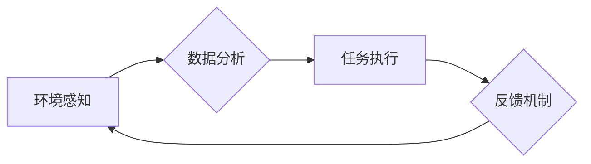

> AI代理，供应链管理，工作流自动化，机器学习，预测分析，优化算法

## 1. 背景介绍

在当今全球化经济的背景下，供应链管理 (SCM) 已经成为企业竞争力的关键因素。传统的供应链管理模式往往面临着复杂性、不确定性和效率低下等挑战。随着人工智能 (AI) 技术的快速发展，AI代理 (AI Agent) 作为一种智能化解决方案，逐渐被应用于供应链管理领域，为优化供应链流程、提高效率和降低成本提供了新的思路。

AI代理是一种能够自主学习、决策和执行任务的软件智能体。它可以模拟人类的智能行为，通过感知环境信息、分析数据和执行操作来完成特定的任务。在供应链管理中，AI代理可以扮演不同的角色，例如：

* **需求预测代理:** 分析历史数据和市场趋势，预测未来需求，帮助企业优化库存管理和生产计划。
* **物流优化代理:** 规划最优的运输路线和配送方案，提高物流效率和降低运输成本。
* **风险管理代理:** 监控供应链中的潜在风险，例如自然灾害、政治动荡和供应中断，并采取相应的措施进行风险规避。
* **协商代理:** 与供应商和客户进行协商，优化采购价格和交货时间。

## 2. 核心概念与联系

**2.1 AI代理工作流**

AI代理工作流是指利用AI代理技术实现供应链管理流程自动化和智能化的过程。它通常包括以下几个步骤：

1. **环境感知:** AI代理通过传感器、数据接口等方式获取供应链环境信息，例如库存水平、订单数量、运输状况等。
2. **数据分析:** AI代理利用机器学习、数据挖掘等技术对获取到的环境信息进行分析，识别模式和趋势，并做出决策。
3. **任务执行:** AI代理根据分析结果执行相应的任务，例如调整库存水平、优化运输路线、通知供应商等。
4. **反馈机制:** AI代理将任务执行结果反馈到系统，用于后续决策和流程优化。

**2.2 架构图**



**2.3 核心概念联系**

AI代理工作流的核心概念包括：

* **AI代理:** 智能化软件智能体，能够自主学习、决策和执行任务。
* **工作流:** 供应链管理流程的自动化和智能化过程。
* **环境感知:** 获取供应链环境信息。
* **数据分析:** 利用机器学习等技术分析环境信息。
* **任务执行:** 执行相应的供应链管理任务。
* **反馈机制:** 将任务执行结果反馈到系统，用于后续决策和流程优化。

## 3. 核心算法原理 & 具体操作步骤

**3.1 算法原理概述**

AI代理工作流中常用的算法包括：

* **机器学习:** 用于从数据中学习模式和趋势，预测未来需求、识别风险等。
* **优化算法:** 用于优化供应链流程，例如运输路线规划、库存管理等。
* **自然语言处理:** 用于处理文本数据，例如订单信息、供应商沟通等。

**3.2 算法步骤详解**

以需求预测为例，AI代理工作流中的算法步骤如下：

1. **数据收集:** 收集历史销售数据、市场趋势数据、季节性因素等相关数据。
2. **数据预处理:** 对收集到的数据进行清洗、转换和特征工程，以便于机器学习模型的训练。
3. **模型训练:** 利用机器学习算法，例如ARIMA、LSTM等，对预处理后的数据进行训练，建立需求预测模型。
4. **模型评估:** 使用测试数据对训练好的模型进行评估，评估模型的预测精度。
5. **预测执行:** 将模型应用于新的数据，预测未来需求，并根据预测结果调整库存水平和生产计划。

**3.3 算法优缺点**

* **优点:**

    * 自动化和智能化: 可以自动完成需求预测、物流优化等任务，提高效率和准确性。
    * 数据驱动: 基于数据分析和预测，能够做出更科学和合理的决策。
    * 适应性强: 可以根据变化的市场环境和需求进行调整。

* **缺点:**

    * 数据依赖: 需要大量高质量的数据进行训练和评估。
    * 模型复杂性: 训练和维护复杂的机器学习模型需要专业知识和技术。
    * 伦理风险: AI代理的决策可能会存在偏差或不公平性，需要进行伦理评估和监管。

**3.4 算法应用领域**

AI代理工作流的算法可以应用于供应链管理的各个环节，例如：

* **需求预测:** 预测未来需求，优化库存管理和生产计划。
* **物流优化:** 规划最优的运输路线和配送方案，提高物流效率和降低运输成本。
* **风险管理:** 监控供应链中的潜在风险，例如自然灾害、政治动荡和供应中断，并采取相应的措施进行风险规避。
* **协商代理:** 与供应商和客户进行协商，优化采购价格和交货时间。

## 4. 数学模型和公式 & 详细讲解 & 举例说明

**4.1 数学模型构建**

在AI代理工作流中，可以使用数学模型来描述供应链的动态行为和优化目标。例如，可以使用线性规划模型来优化库存管理，使用动态规划模型来规划运输路线。

**4.2 公式推导过程**

以线性规划模型为例，其目标函数和约束条件可以表示为以下公式：

* **目标函数:** 
$$
min \sum_{i=1}^{n} c_i x_i
$$
其中，$c_i$ 是第 $i$ 种产品的单位成本，$x_i$ 是第 $i$ 种产品的库存量。

* **约束条件:**
$$
\sum_{i=1}^{n} a_{ij} x_i \geq b_j, \quad j = 1, 2, ..., m
$$
其中，$a_{ij}$ 是第 $i$ 种产品对第 $j$ 个资源的需求量，$b_j$ 是第 $j$ 个资源的可用量。

**4.3 案例分析与讲解**

假设一家公司需要管理两种产品，产品A和产品B。产品A的单位成本为10元，产品B的单位成本为15元。公司有两种资源，资源1和资源2。资源1的可用量为100，资源2的可用量为80。产品A对资源1的需求量为2，对资源2的需求量为1。产品B对资源1的需求量为1，对资源2的需求量为2。

可以使用线性规划模型来优化公司的库存管理，目标是将总成本降到最低。

## 5. 项目实践：代码实例和详细解释说明

**5.1 开发环境搭建**

* 操作系统: Ubuntu 20.04
* Python 版本: 3.8
* 必要的库: TensorFlow, PyTorch, scikit-learn, pandas, numpy

**5.2 源代码详细实现**

```python
# 需求预测模型
from sklearn.linear_model import LinearRegression

# 数据加载
data = pd.read_csv('sales_data.csv')

# 数据预处理
X = data[['month', 'season', 'promotion']]
y = data['sales']

# 模型训练
model = LinearRegression()
model.fit(X, y)

# 预测
future_data = pd.DataFrame({'month': [1, 2, 3], 'season': ['spring', 'summer', 'autumn'], 'promotion': [True, False, True]})
future_sales = model.predict(future_data)

# 打印预测结果
print(future_sales)
```

**5.3 代码解读与分析**

* 代码首先加载销售数据，并进行数据预处理，提取需要预测的特征和目标变量。
* 然后，使用线性回归模型训练预测模型。
* 最后，使用训练好的模型预测未来三个月的销售额。

**5.4 运行结果展示**

运行代码后，将输出未来三个月的预测销售额。

## 6. 实际应用场景

**6.1 需求预测**

AI代理可以根据历史销售数据、市场趋势和季节性因素等信息，预测未来需求，帮助企业优化库存管理和生产计划。

**6.2 物流优化**

AI代理可以规划最优的运输路线和配送方案，提高物流效率和降低运输成本。

**6.3 风险管理**

AI代理可以监控供应链中的潜在风险，例如自然灾害、政治动荡和供应中断，并采取相应的措施进行风险规避。

**6.4 协商代理**

AI代理可以与供应商和客户进行协商，优化采购价格和交货时间。

**6.5 未来应用展望**

随着AI技术的不断发展，AI代理在供应链管理领域的应用将更加广泛和深入。未来，AI代理可能能够：

* 更准确地预测需求，减少库存积压和缺货风险。
* 更智能地优化物流流程，提高效率和降低成本。
* 更有效地识别和应对供应链风险。
* 更灵活地协商与供应商和客户，达成更优的合作关系。

## 7. 工具和资源推荐

**7.1 学习资源推荐**

* **书籍:**
    * 《人工智能：一种现代方法》
    * 《深度学习》
    * 《机器学习实战》
* **在线课程:**
    * Coursera: 人工智能课程
    * edX: 深度学习课程
    * Udacity: 机器学习工程师课程

**7.2 开发工具推荐**

* **Python:** 广泛应用于AI开发，拥有丰富的库和框架。
* **TensorFlow:** Google开发的开源深度学习框架。
* **PyTorch:** Facebook开发的开源深度学习框架。
* **scikit-learn:** Python机器学习库。

**7.3 相关论文推荐**

* **Reinforcement Learning for Supply Chain Management**
* **Deep Learning for Demand Forecasting**
* **AI-Powered Logistics Optimization**

## 8. 总结：未来发展趋势与挑战

**8.1 研究成果总结**

AI代理工作流在供应链管理领域取得了显著的成果，能够有效地提高效率、降低成本和优化决策。

**8.2 未来发展趋势**

未来，AI代理工作流将朝着以下方向发展：

* **更智能化:** 利用更先进的AI算法，例如强化学习和迁移学习，使AI代理更加智能化和自主化。
* **更个性化:** 根据不同客户和供应商的需求，定制化AI代理，提供更个性化的服务。
* **更协同化:** 将AI代理与其他系统和平台进行集成，实现供应链管理的协同化和自动化。

**8.3 面临的挑战**

AI代理工作流的应用也面临着一些挑战：

* **数据安全:** 供应链数据通常包含敏感信息，需要采取措施保障数据安全。
* **算法透明度:** AI代理的决策过程往往是复杂的，需要提高算法的透明度和可解释性。
* **伦理风险:** AI代理的决策可能会存在偏差或不公平性，需要进行伦理评估和监管。

**8.4 研究展望**

未来，需要进一步研究AI代理工作流的安全性、可靠性和伦理问题，并探索其在更多供应链管理场景中的应用。


## 9. 附录：常见问题与解答

**9.1 如何选择合适的AI代理算法？**

选择合适的AI代理算法需要根据具体的应用场景和数据特点进行选择。例如，对于预测需求的场景，可以使用ARIMA、LSTM等时间序列模型；对于优化物流路线的场景，可以使用遗传算法、模拟退火算法等优化算法。

**9.2 如何保证AI代理的安全性？**

保证AI代理的安全性需要采取以下措施：

* 数据加密: 对敏感数据进行加密，防止数据