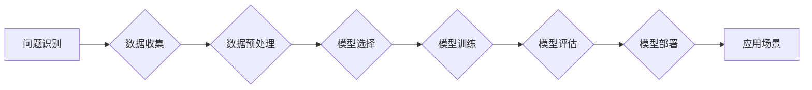

> AI创业, 算法, 场景, 应用, 技术, 挑战, 商业化, 伦理

## 1. 背景介绍

人工智能（AI）技术近年来发展迅速，已渗透到各个领域，为创业者提供了前所未有的机遇。AI创业项目，从语音助手到自动驾驶，从医疗诊断到金融风险控制，其应用场景日益广泛。然而，AI创业也面临着诸多挑战，技术、应用和场景平衡是其中最为关键的难题。

**1.1 AI创业的机遇与挑战**

AI技术的进步为创业者带来了前所未有的机遇：

* **自动化和效率提升:** AI可以自动化许多重复性任务，提高工作效率，降低成本。
* **个性化体验:** AI可以根据用户的需求和喜好提供个性化的产品和服务。
* **新产品和服务创新:** AI可以帮助创业者开发出全新的产品和服务，满足市场新的需求。

然而，AI创业也面临着诸多挑战：

* **技术门槛高:** AI技术需要专业的知识和技能，创业者需要具备相应的技术背景或团队。
* **数据依赖:** AI算法需要大量的数据进行训练，获取高质量的数据是一个难题。
* **模型解释性和可信度:** AI模型的决策过程往往难以解释，这可能会导致用户对模型的信任度降低。
* **伦理和社会影响:** AI技术的应用可能会带来伦理和社会问题，创业者需要考虑这些问题并进行相应的规制。

**1.2 技术、应用和场景平衡**

AI创业的成功取决于技术、应用和场景的平衡。

* **技术:** 创业者需要选择合适的AI技术，并根据实际需求进行定制开发。
* **应用:** 创业者需要将AI技术应用到具体的场景中，并解决实际问题。
* **场景:** 创业者需要选择合适的场景进行应用，并考虑场景的特性和用户需求。

## 2. 核心概念与联系

**2.1 AI创业的核心概念**

* **机器学习:**  机器学习是AI的核心技术之一，它通过算法学习数据，并从中发现规律，从而实现预测、分类、聚类等功能。
* **深度学习:** 深度学习是机器学习的一种高级形式，它使用多层神经网络来模拟人类大脑的学习过程，能够处理更复杂的数据，并取得更好的性能。
* **自然语言处理:** 自然语言处理（NLP）是AI领域的一个重要分支，它致力于使计算机能够理解和处理人类语言。
* **计算机视觉:** 计算机视觉是AI领域另一个重要分支，它致力于使计算机能够“看”和理解图像和视频。

**2.2 AI创业的联系**

AI创业的核心概念相互联系，共同构成了AI创业的生态系统。

* **机器学习**为AI创业提供了强大的技术基础，**深度学习**则进一步提升了AI技术的性能。
* **自然语言处理**和**计算机视觉**则将AI技术应用到更广泛的场景中。

**2.3 AI创业流程图**



## 3. 核心算法原理 & 具体操作步骤

**3.1 算法原理概述**

本节将介绍一种常用的机器学习算法——**支持向量机（SVM）**。SVM是一种监督学习算法，用于分类和回归问题。其核心思想是找到一个最佳的分隔超平面，将不同类别的样本分开。

**3.2 算法步骤详解**

1. **数据预处理:** 将原始数据进行清洗、转换和特征工程，使其适合SVM算法的训练。
2. **核函数选择:** 选择合适的核函数，将数据映射到高维空间，以便找到更优的分隔超平面。
3. **参数优化:** 通过优化算法，例如SMO算法，找到最佳的模型参数，例如惩罚参数C和核函数参数γ。
4. **模型训练:** 使用训练数据训练SVM模型，得到最佳的分隔超平面。
5. **模型评估:** 使用测试数据评估模型的性能，例如准确率、召回率和F1-score。
6. **模型部署:** 将训练好的模型部署到实际应用场景中，用于分类或回归预测。

**3.3 算法优缺点**

**优点:**

* **高精度:** SVM算法在许多分类问题上表现出较高的精度。
* **鲁棒性:** SVM算法对噪声和异常值有一定的鲁棒性。
* **可解释性:** SVM模型的决策边界相对容易理解。

**缺点:**

* **计算复杂度高:** SVM算法的训练过程可能比较耗时，尤其是在数据量较大时。
* **参数选择困难:** SVM算法的性能依赖于参数的选择，参数选择不当可能会导致模型性能下降。
* **非线性问题处理困难:** 当数据是非线性的时，需要选择合适的核函数，否则可能会导致模型性能下降。

**3.4 算法应用领域**

SVM算法广泛应用于以下领域：

* **图像识别:** 人脸识别、物体检测、图像分类。
* **文本分类:** 垃圾邮件过滤、情感分析、主题分类。
* **金融风险控制:** 欺诈检测、信用评分、风险评估。
* **生物信息学:** 基因预测、蛋白质结构预测、疾病诊断。

## 4. 数学模型和公式 & 详细讲解 & 举例说明

**4.1 数学模型构建**

SVM的目标是找到一个最佳的分隔超平面，将不同类别的样本分开。

假设我们有训练数据 {(x1, y1), (x2, y2), ..., (xn, yn)}，其中 xi 是样本特征向量，yi 是样本类别标签。

SVM的目标函数是：

$$
min_{w,b} \frac{1}{2} ||w||^2 + C \sum_{i=1}^{n} \xi_i
$$

其中：

* w 是分隔超平面的权重向量。
* b 是分隔超平面的截距。
* C 是惩罚参数，控制模型的复杂度。
* ξi 是松弛变量，允许一些样本不满足分类条件。

**4.2 公式推导过程**

SVM的目标函数可以理解为：

* 寻找一个最小的权重向量 ||w||^2，表示分隔超平面的简单性。
* 同时最大化分类正确率，即最小化松弛变量的总和 C∑xi。

通过拉格朗日乘子法，可以将上述目标函数转化为对偶问题，并求解得到最佳的模型参数。

**4.3 案例分析与讲解**

假设我们有一个二分类问题，数据如下：

| x1 | x2 | y |
|---|---|---|
| 1 | 1 | 1 |
| 2 | 2 | 1 |
| 3 | 3 | -1 |
| 4 | 4 | -1 |

我们可以使用SVM算法将这些数据进行分类。通过训练模型，得到最佳的分隔超平面，并将其用于预测新的样本类别。

## 5. 项目实践：代码实例和详细解释说明

**5.1 开发环境搭建**

本例使用Python语言和scikit-learn库进行SVM算法的实现。

需要安装以下软件：

* Python 3.x
* scikit-learn

**5.2 源代码详细实现**

```python
from sklearn import svm
from sklearn.datasets import make_classification
from sklearn.model_selection import train_test_split
from sklearn.metrics import accuracy_score

# 生成样本数据
X, y = make_classification(n_samples=100, n_features=2, random_state=42)

# 将数据划分为训练集和测试集
X_train, X_test, y_train, y_test = train_test_split(X, y, test_size=0.2, random_state=42)

# 创建SVM模型
clf = svm.SVC(kernel='linear')

# 训练模型
clf.fit(X_train, y_train)

# 预测测试集
y_pred = clf.predict(X_test)

# 计算模型精度
accuracy = accuracy_score(y_test, y_pred)
print(f"模型精度: {accuracy}")
```

**5.3 代码解读与分析**

* 使用`make_classification`函数生成样本数据。
* 使用`train_test_split`函数将数据划分为训练集和测试集。
* 使用`svm.SVC`类创建SVM模型，并设置核函数为线性核。
* 使用`fit`方法训练模型。
* 使用`predict`方法预测测试集。
* 使用`accuracy_score`函数计算模型精度。

**5.4 运行结果展示**

运行上述代码，可以得到模型的精度值。

## 6. 实际应用场景

**6.1 医疗诊断**

SVM算法可以用于医疗诊断，例如根据患者的症状和检查结果预测疾病类型。

**6.2 金融风险控制**

SVM算法可以用于金融风险控制，例如根据客户的信用记录和交易行为预测客户的违约风险。

**6.3 垃圾邮件过滤**

SVM算法可以用于垃圾邮件过滤，根据邮件内容和发送者信息判断邮件是否为垃圾邮件。

**6.4 未来应用展望**

随着AI技术的不断发展，SVM算法将在更多领域得到应用，例如：

* **自动驾驶:** 用于识别道路上的障碍物和交通信号。
* **人脸识别:** 用于身份验证和安全监控。
* **个性化推荐:** 用于推荐用户感兴趣的商品和服务。

## 7. 工具和资源推荐

**7.1 学习资源推荐**

* **书籍:**
    * 《机器学习》 by 周志华
    * 《深入理解机器学习》 by 邱锡鹏
* **在线课程:**
    * Coursera: Machine Learning by Andrew Ng
    * edX: Artificial Intelligence by Columbia University

**7.2 开发工具推荐**

* **Python:** 
    * scikit-learn: 机器学习库
    * TensorFlow: 深度学习库
    * PyTorch: 深度学习库

**7.3 相关论文推荐**

* **Support Vector Machines** by Vladimir Vapnik and Alexey Chervonenkis
* **A Tutorial on Support Vector Machines for Pattern Recognition** by Christopher J.C. Burges

## 8. 总结：未来发展趋势与挑战

**8.1 研究成果总结**

SVM算法是一种高效的机器学习算法，在许多分类问题上表现出较高的精度。

**8.2 未来发展趋势**

* **核函数的改进:** 研究新的核函数，提高SVM算法对复杂数据的处理能力。
* **大规模数据处理:** 研究高效的SVM算法，能够处理海量数据。
* **结合深度学习:** 将SVM算法与深度学习算法结合，提高模型的性能。

**8.3 面临的挑战**

* **参数选择困难:** SVM算法的性能依赖于参数的选择，参数选择不当可能会导致模型性能下降。
* **非线性问题处理困难:** 当数据是非线性的时，需要选择合适的核函数，否则可能会导致模型性能下降。
* **解释性问题:** SVM模型的决策边界相对难以解释，这可能会影响模型的信任度。

**8.4 研究展望**

未来研究方向包括：

* 研究更有效的参数选择方法。
* 开发新的核函数，提高SVM算法对复杂数据的处理能力。
* 研究将SVM算法与其他机器学习算法结合的方法。


## 9. 附录：常见问题与解答

**9.1 什么是支持向量机？**

支持向量机（SVM）是一种监督学习算法，用于分类和回归问题。其核心思想是找到一个最佳的分隔超平面，将不同类别的样本分开。

**9.2 SVM算法的优点是什么？**

SVM算法的优点包括：

* 高精度
* 鲁棒性
* 可解释性

**9.3 SVM算法的缺点是什么？**

SVM算法的缺点包括：

* 计算复杂度高
* 参数选择困难
* 非线性问题处理困难

**9.4 如何选择SVM算法