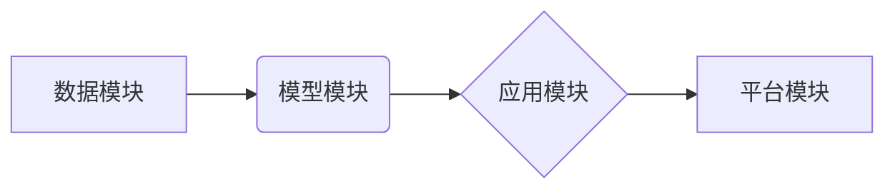

>  人工智能，创业，技术，应用，场景，平衡，挑战，机遇

## 1. 背景介绍

人工智能（AI）技术近年来发展迅速，已渗透到各个领域，为创业者带来了前所未有的机遇。AI创业，是指利用人工智能技术开发新产品、新服务或新商业模式，以解决实际问题并创造价值。然而，AI创业也面临着诸多挑战，例如技术门槛高、数据获取困难、应用场景有限等。

**1.1 AI 创业的机遇**

AI 技术的快速发展为创业者提供了前所未有的机遇：

* **自动化和效率提升:** AI 可以自动化许多重复性任务，提高工作效率，降低成本。
* **个性化体验:** AI 可以根据用户的需求和喜好提供个性化的产品和服务，提升用户体验。
* **新产品和服务创新:** AI 可以帮助创业者开发全新的产品和服务，开拓新的市场。
* **数据驱动决策:** AI 可以帮助创业者分析数据，做出更明智的决策。

**1.2 AI 创业的挑战**

尽管 AI 创业充满机遇，但也面临着诸多挑战：

* **技术门槛高:** AI 技术需要专业的知识和技能，创业者需要具备一定的技术背景或团队。
* **数据获取困难:** AI 模型的训练需要大量的数据，获取高质量的数据是一个难题。
* **应用场景有限:** 目前 AI 技术的应用场景还比较有限，创业者需要找到合适的应用场景。
* **伦理和安全问题:** AI 技术的应用也带来了一些伦理和安全问题，需要引起重视。

## 2. 核心概念与联系

**2.1 AI 创业的核心概念**

* **人工智能 (AI):** 人工智能是指模拟人类智能的计算机系统，包括机器学习、深度学习、自然语言处理等技术。
* **创业:** 创业是指创办新公司或新项目，以创造价值和解决问题。
* **技术:** 技术是指应用科学知识和技能解决实际问题的方法和手段。
* **应用:** 应用是指将技术应用到实际场景中，解决实际问题。
* **场景:** 场景是指特定环境或情境，需要根据场景特点选择合适的 AI 技术和应用方案。

**2.2 AI 创业的联系**

AI 创业的核心是将 AI 技术应用到实际场景中，解决实际问题，创造价值。

**2.3 AI 创业的流程**

AI 创业是一个循序渐进的过程，一般包括以下几个阶段：

1. **识别机会:** 寻找 AI 技术可以解决的问题或创造价值的场景。
2. **技术选型:** 选择合适的 AI 技术和工具。
3. **数据获取和处理:** 获取和处理所需的训练数据。
4. **模型开发和训练:** 开发和训练 AI 模型。
5. **产品开发和测试:** 开发基于 AI 的产品或服务，并进行测试。
6. **市场推广和运营:** 推广和运营 AI 产品或服务。

**2.4 AI 创业的架构**

AI 创业的架构通常包括以下几个模块：

* **数据模块:** 负责数据采集、存储、处理和分析。
* **模型模块:** 负责开发和训练 AI 模型。
* **应用模块:** 负责将 AI 模型应用到实际场景中。
* **平台模块:** 提供 AI 开发和部署的平台和工具。



## 3. 核心算法原理 & 具体操作步骤

**3.1 算法原理概述**

机器学习算法是 AI 创业的核心技术之一，它可以帮助计算机从数据中学习，并做出预测或决策。常见的机器学习算法包括：

* **监督学习:** 利用标记数据训练模型，预测新的数据标签。
* **无监督学习:** 利用未标记数据发现数据中的模式和结构。
* **强化学习:** 通过试错学习，找到最佳策略。

**3.2 算法步骤详解**

以监督学习为例，其步骤如下：

1. **数据收集和预处理:** 收集相关数据，并进行清洗、转换和特征工程等预处理。
2. **模型选择:** 根据任务需求选择合适的模型，例如线性回归、逻辑回归、决策树等。
3. **模型训练:** 利用标记数据训练模型，调整模型参数，使模型能够准确预测数据标签。
4. **模型评估:** 利用测试数据评估模型的性能，例如准确率、召回率、F1-score等。
5. **模型部署:** 将训练好的模型部署到实际应用场景中，用于预测新的数据标签。

**3.3 算法优缺点**

* **优点:** 可以自动学习数据模式，无需人工编程，具有较高的预测精度。
* **缺点:** 需要大量的数据进行训练，训练时间较长，对数据质量要求较高。

**3.4 算法应用领域**

机器学习算法广泛应用于各个领域，例如：

* **图像识别:** 自动识别图像中的物体、场景和人物。
* **自然语言处理:** 处理和理解自然语言文本，例如机器翻译、文本摘要、情感分析等。
* **推荐系统:** 根据用户的历史行为推荐相关产品或服务。
* **预测分析:** 预测未来事件的发生概率，例如销售预测、风险评估等。

## 4. 数学模型和公式 & 详细讲解 & 举例说明

**4.1 数学模型构建**

机器学习算法通常基于数学模型构建，例如线性回归模型：

$$
y = w_0 + w_1x_1 + w_2x_2 + ... + w_nx_n + \epsilon
$$

其中：

* $y$ 是预测值
* $w_0, w_1, ..., w_n$ 是模型参数
* $x_1, x_2, ..., x_n$ 是输入特征
* $\epsilon$ 是误差项

**4.2 公式推导过程**

模型参数的学习过程通常使用梯度下降算法，其目标是找到使误差最小化的参数值。梯度下降算法的基本原理是：

1. 计算模型预测值与真实值的误差。
2. 计算误差对每个参数的梯度。
3. 根据梯度更新每个参数的值。

**4.3 案例分析与讲解**

例如，假设我们想要预测房价，输入特征包括房屋面积、房间数、地理位置等。我们可以使用线性回归模型，并使用梯度下降算法训练模型。训练完成后，我们可以使用模型预测新房子的价格。

## 5. 项目实践：代码实例和详细解释说明

**5.1 开发环境搭建**

* Python 3.x
* TensorFlow 或 PyTorch 等深度学习框架
* Jupyter Notebook 或 VS Code 等开发环境

**5.2 源代码详细实现**

```python
import tensorflow as tf

# 定义模型
model = tf.keras.models.Sequential([
    tf.keras.layers.Dense(64, activation='relu', input_shape=(7,)),
    tf.keras.layers.Dense(1)
])

# 编译模型
model.compile(optimizer='adam', loss='mse')

# 训练模型
model.fit(X_train, y_train, epochs=10)

# 评估模型
loss = model.evaluate(X_test, y_test)
print('Loss:', loss)

# 预测新数据
predictions = model.predict(new_data)
```

**5.3 代码解读与分析**

* 代码首先定义了一个简单的线性回归模型，包含两个全连接层。
* 然后，模型使用 Adam 优化器和均方误差损失函数进行编译。
* 接着，模型使用训练数据进行训练，训练 epochs 为 10。
* 最后，模型使用测试数据进行评估，并预测新数据的房价。

**5.4 运行结果展示**

运行结果将显示模型的训练损失和测试损失，以及对新数据的预测结果。

## 6. 实际应用场景

**6.1 医疗保健**

* **疾病诊断:** 利用 AI 算法分析患者的医疗影像、病历等数据，辅助医生诊断疾病。
* **药物研发:** 利用 AI 算法加速药物研发过程，例如预测药物的有效性、安全性等。

**6.2 金融服务**

* **欺诈检测:** 利用 AI 算法分析交易数据，识别异常交易行为，防止欺诈。
* **风险评估:** 利用 AI 算法评估客户的信用风险，帮助银行进行贷款审批。

**6.3 商业零售**

* **个性化推荐:** 利用 AI 算法分析用户的购买历史和行为数据，推荐个性化的商品。
* **库存管理:** 利用 AI 算法预测商品需求，优化库存管理。

**6.4 未来应用展望**

AI 技术的应用场景还在不断扩展，未来将应用于更多领域，例如：

* **教育:** 个性化学习、智能辅导
* **交通:** 自动驾驶、智能交通管理
* **制造业:** 智能制造、预测性维护

## 7. 工具和资源推荐

**7.1 学习资源推荐**

* **在线课程:** Coursera、edX、Udacity 等平台提供丰富的 AI 课程。
* **书籍:** 《深度学习》、《机器学习实战》等书籍。
* **开源项目:** TensorFlow、PyTorch 等开源项目。

**7.2 开发工具推荐**

* **Python:** 广泛用于 AI 开发的编程语言。
* **Jupyter Notebook:** 用于编写和运行 Python 代码的交互式环境。
* **VS Code:** 功能强大的代码编辑器。

**7.3 相关论文推荐**

* **《ImageNet Classification with Deep Convolutional Neural Networks》**
* **《Attention Is All You Need》**
* **《BERT: Pre-training of Deep Bidirectional Transformers for Language Understanding》**

## 8. 总结：未来发展趋势与挑战

**8.1 研究成果总结**

近年来，AI 技术取得了长足的进步，在各个领域都取得了显著的应用成果。

**8.2 未来发展趋势**

* **模型规模和能力提升:** AI 模型将变得更大、更强大，能够处理更复杂的任务。
* **边缘计算:** AI 计算将更加靠近数据源，实现更实时、更高效的处理。
* **解释性 AI:** AI 模型的决策过程将更加透明，更容易被理解和解释。

**8.3 面临的挑战**

* **数据隐私和安全:** AI 模型的训练和应用需要大量数据，如何保护数据隐私和安全是一个重要挑战。
* **算法偏见:** AI 模型可能存在算法偏见，导致不公平的结果。
* **伦理问题:** AI 技术的应用可能带来一些伦理问题，需要引起重视。

**8.4 研究展望**

未来，AI 研究将继续朝着更安全、更可靠、更可解释的方向发展，并为人类社会带来更多福祉。

## 9. 附录：常见问题与解答

**9.1 如何选择合适的 AI 算法？**

选择合适的 AI 算法取决于具体的应用场景和数据特点。需要考虑算法的类型、性能、复杂度等因素。

**9.2 如何解决数据获取困难的问题？**

可以尝试以下方法解决数据获取困难的问题：

* 利用公开数据集
* 与其他机构合作获取数据
* 使用数据合成技术生成数据

**9.3 如何评估 AI 模型的性能？**

可以使用多种指标评估 AI 模型的性能，例如准确率、召回率、F1-score等。

**9.4 如何避免 AI 模型的算法偏见？**

可以采取以下措施避免 AI 模型的算法偏见：

* 使用多样化的训练数据
* 对训练数据进行预处理，消除潜在的偏见
* 使用公平性评估指标评估模型的公平性

**9.5 如何确保 AI 技术的伦理使用？**

需要制定相关的伦理规范和政策，并加强对 AI 技术的监管和监督。


作者：禅与计算机程序设计艺术 / Zen and the Art of Computer Programming 
<end_of_turn>