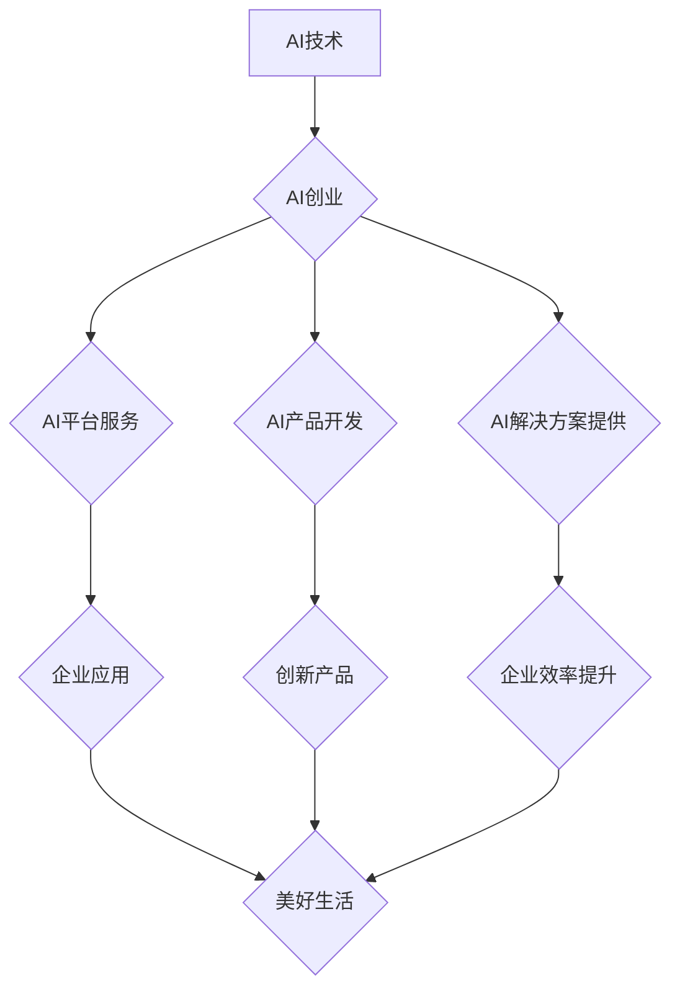

>  人工智能、AI创业、机器学习、深度学习、自然语言处理、计算机视觉、数据科学、云计算

## 1. 背景介绍

人工智能（AI）正以惊人的速度发展，深刻地改变着我们的生活。从智能手机的语音助手到自动驾驶汽车，AI技术已渗透到各个领域，为我们带来了前所未有的便利和效率。然而，AI技术的发展也带来了新的挑战和机遇。

对于创业者来说，AI技术提供了无限的可能性。AI创业者可以利用AI技术开发出颠覆性的产品和服务，解决社会痛点，创造新的价值。然而，AI创业也充满挑战，需要创业者具备扎实的AI技术基础、敏锐的市场洞察力和强大的执行力。

本文将从AI创业者的角度出发，探讨AI技术在赋能美好生活方面的愿景和实践，并分析AI创业面临的挑战和机遇。

## 2. 核心概念与联系

**2.1 AI技术概述**

人工智能（AI）是指模拟人类智能行为的计算机系统。AI技术涵盖了多个领域，包括机器学习、深度学习、自然语言处理、计算机视觉等。

**2.2 AI创业模式**

AI创业模式是指利用AI技术开发和运营商业产品的模式。常见的AI创业模式包括：

* **AI平台服务:** 提供AI算法、数据和工具平台，帮助企业开发和部署AI应用。
* **AI产品开发:** 开发基于AI技术的创新产品，例如智能家居、智能医疗、智能交通等。
* **AI解决方案提供:** 为企业提供定制化的AI解决方案，帮助企业提高效率、降低成本、提升竞争力。

**2.3 AI赋能美好生活**

AI技术可以应用于各个领域，为人们的生活带来诸多便利和福祉。例如：

* **医疗保健:** AI可以辅助医生诊断疾病、预测患者风险、个性化治疗方案。
* **教育:** AI可以提供个性化学习方案、智能辅导、自动批改作业。
* **交通运输:** AI可以实现自动驾驶、智能交通管理、优化物流配送。
* **生活服务:** AI可以提供智能家居、智能客服、个性化推荐等服务。

**2.4 Mermaid 流程图**



## 3. 核心算法原理 & 具体操作步骤

**3.1 算法原理概述**

机器学习是AI的核心技术之一，它通过算法训练模型，使模型能够从数据中学习规律，并对新数据进行预测或分类。常见的机器学习算法包括：

* **监督学习:** 利用标记数据训练模型，例如分类、回归等。
* **无监督学习:** 利用未标记数据发现数据中的隐藏结构，例如聚类、降维等。
* **强化学习:** 通过试错学习，使模型在特定环境中获得最大奖励。

**3.2 算法步骤详解**

以监督学习为例，其基本步骤如下：

1. **数据收集和预处理:** 收集相关数据，并进行清洗、转换、特征工程等预处理操作。
2. **模型选择:** 根据任务需求选择合适的机器学习算法。
3. **模型训练:** 利用标记数据训练模型，调整模型参数，使模型能够准确预测或分类。
4. **模型评估:** 利用测试数据评估模型的性能，例如准确率、召回率、F1-score等。
5. **模型部署:** 将训练好的模型部署到实际应用场景中。

**3.3 算法优缺点**

不同的机器学习算法具有不同的优缺点，需要根据具体任务选择合适的算法。例如，决策树算法易于理解和解释，但泛化能力较弱；支持向量机算法具有较好的泛化能力，但训练时间较长。

**3.4 算法应用领域**

机器学习算法广泛应用于各个领域，例如：

* **图像识别:** 人脸识别、物体检测、图像分类等。
* **自然语言处理:** 文本分类、情感分析、机器翻译等。
* **推荐系统:** 商品推荐、内容推荐、用户画像等。
* **金融风险控制:** 欺诈检测、信用评分、风险评估等。

## 4. 数学模型和公式 & 详细讲解 & 举例说明

**4.1 数学模型构建**

机器学习模型通常可以看作是数学函数，其输入是数据特征，输出是预测结果或分类标签。例如，线性回归模型可以表示为：

$$y = w_0 + w_1x_1 + w_2x_2 + ... + w_nx_n$$

其中：

* $y$ 是预测结果
* $w_0, w_1, w_2, ..., w_n$ 是模型参数
* $x_1, x_2, ..., x_n$ 是数据特征

**4.2 公式推导过程**

机器学习模型的训练过程就是通过优化模型参数，使模型的预测结果与真实结果尽可能接近的过程。常用的优化算法包括梯度下降法、随机梯度下降法等。

**4.3 案例分析与讲解**

以线性回归为例，其目标是找到最佳的模型参数，使模型能够对数据进行最佳拟合。可以使用最小二乘法来求解模型参数，其目标函数为：

$$J(w) = \frac{1}{2}\sum_{i=1}^{n}(y_i - \hat{y}_i)^2$$

其中：

* $J(w)$ 是损失函数
* $w$ 是模型参数
* $y_i$ 是真实值
* $\hat{y}_i$ 是模型预测值

通过梯度下降法，可以迭代更新模型参数，逐步降低损失函数的值，最终得到最佳的模型参数。

## 5. 项目实践：代码实例和详细解释说明

**5.1 开发环境搭建**

* Python 3.x
* TensorFlow 或 PyTorch
* Jupyter Notebook

**5.2 源代码详细实现**

```python
import tensorflow as tf

# 定义模型
model = tf.keras.models.Sequential([
    tf.keras.layers.Dense(128, activation='relu', input_shape=(784,)),
    tf.keras.layers.Dense(10, activation='softmax')
])

# 编译模型
model.compile(optimizer='adam',
              loss='sparse_categorical_crossentropy',
              metrics=['accuracy'])

# 训练模型
model.fit(x_train, y_train, epochs=10)

# 评估模型
loss, accuracy = model.evaluate(x_test, y_test)
print('Test loss:', loss)
print('Test accuracy:', accuracy)
```

**5.3 代码解读与分析**

* 代码首先定义了一个简单的多层感知机模型，包含两层全连接层。
* 然后，使用Adam优化器、交叉熵损失函数和准确率指标对模型进行编译。
* 接着，使用训练数据训练模型，设置训练轮数为10。
* 最后，使用测试数据评估模型的性能，打印测试损失和准确率。

**5.4 运行结果展示**

训练完成后，可以观察模型的训练过程和测试结果，例如训练损失和准确率的变化趋势。

## 6. 实际应用场景

**6.1 智能客服**

AI技术可以用于构建智能客服系统，自动回答用户常见问题，提高客户服务效率。

**6.2 个性化推荐**

AI技术可以分析用户行为数据，提供个性化的商品、内容或服务推荐。

**6.3 自动驾驶**

AI技术可以用于开发自动驾驶汽车，实现车辆自动驾驶功能。

**6.4 未来应用展望**

AI技术的发展将继续推动社会进步，在医疗保健、教育、交通运输、生活服务等领域带来更多创新应用。

## 7. 工具和资源推荐

**7.1 学习资源推荐**

* **在线课程:** Coursera、edX、Udacity等平台提供丰富的AI课程。
* **书籍:** 《深度学习》、《机器学习实战》等书籍是AI学习的经典教材。
* **开源项目:** TensorFlow、PyTorch等开源项目提供了丰富的AI工具和代码示例。

**7.2 开发工具推荐**

* **Python:** 作为AI开发的主要编程语言，Python拥有丰富的AI库和工具。
* **Jupyter Notebook:** 用于编写和执行Python代码的交互式笔记本环境。
* **TensorFlow/PyTorch:** 两种流行的深度学习框架。

**7.3 相关论文推荐**

* **《ImageNet Classification with Deep Convolutional Neural Networks》**
* **《Attention Is All You Need》**
* **《BERT: Pre-training of Deep Bidirectional Transformers for Language Understanding》**

## 8. 总结：未来发展趋势与挑战

**8.1 研究成果总结**

近年来，AI技术取得了长足的进步，在图像识别、自然语言处理、语音识别等领域取得了突破性进展。

**8.2 未来发展趋势**

* **模型规模和能力的提升:** 未来AI模型将更加强大，能够处理更复杂的任务。
* **边缘计算和分布式训练:** AI模型将部署到边缘设备，并利用分布式训练技术提高训练效率。
* **AI伦理和可解释性:** 随着AI技术的应用越来越广泛，AI伦理和可解释性将成为重要的研究方向。

**8.3 面临的挑战**

* **数据获取和隐私保护:** AI模型的训练需要大量数据，如何获取高质量数据并保护用户隐私是一个挑战。
* **算法偏见和公平性:** AI算法可能存在偏见，导致不公平的结果，需要研究如何解决算法偏见问题。
* **安全性和可靠性:** AI系统需要保证安全性和可靠性，防止被恶意攻击或产生错误结果。

**8.4 研究展望**

未来，AI技术将继续发展，为人类社会带来更多福祉。我们需要加强AI基础研究，探索新的AI算法和应用场景，并关注AI伦理和社会影响，确保AI技术能够安全、可持续地发展。

## 9. 附录：常见问题与解答

**9.1 如何选择合适的机器学习算法？**

选择合适的机器学习算法需要根据具体任务需求和数据特点进行选择。例如，对于分类任务，可以考虑决策树、支持向量机、神经网络等算法；对于回归任务，可以考虑线性回归、逻辑回归、支持向量回归等算法。

**9.2 如何处理数据中的缺失值？**

数据中的缺失值可以通过多种方法处理，例如删除缺失值、用均值或中位数填充缺失值、使用KNN算法进行插值等。

**9.3 如何评估机器学习模型的性能？**

机器学习模型的性能可以通过多种指标进行评估，例如准确率、召回率、F1-score、AUC等。

**9.4 如何防止机器学习模型的过拟合？**

过拟合是指模型在训练数据上表现很好，但在测试数据上表现较差。可以采用正则化、交叉验证、Dropout等技术来防止模型过拟合。


作者：禅与计算机程序设计艺术 / Zen and the Art of Computer Programming 
<end_of_turn>