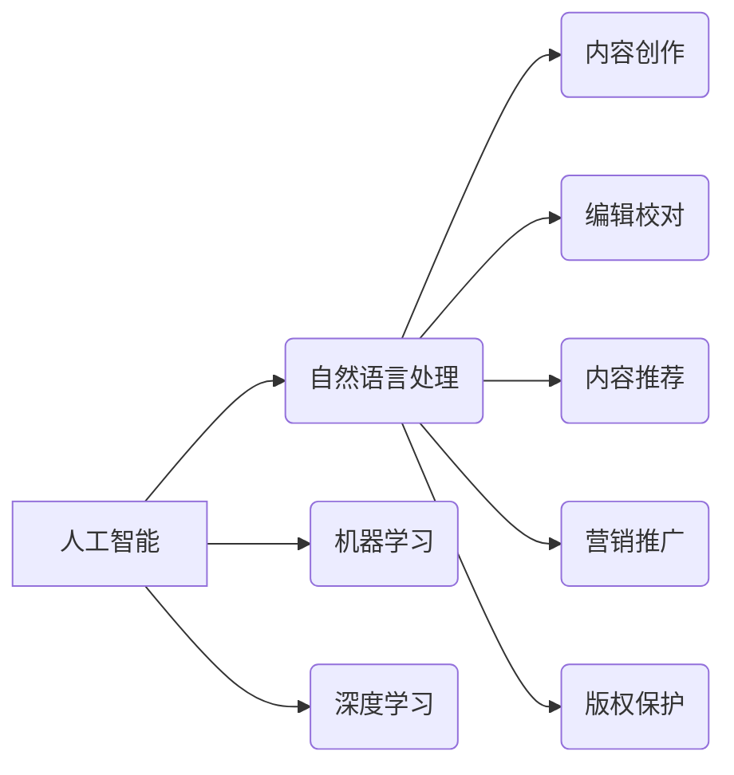

>  人工智能，出版业，自然语言处理，机器学习，深度学习，内容生成，文本摘要，推荐系统

## 1. 背景介绍

出版业作为文化传播的重要载体，近年来面临着前所未有的挑战。传统出版模式的局限性，如漫长的出版周期、高昂的印刷成本和有限的读者触达范围，逐渐暴露出来。与此同时，数字阅读的兴起和互联网技术的飞速发展，为出版业带来了新的机遇和挑战。

人工智能（AI）作为一门新兴技术，正在深刻地改变着出版业的格局。AI技术能够自动分析和处理海量文本数据，识别文本中的关键信息，并根据用户的阅读偏好进行个性化推荐。这为出版业提供了全新的内容创作、编辑、营销和推广模式。

## 2. 核心概念与联系

**2.1  人工智能（AI）**

人工智能是指模拟人类智能行为的计算机系统。AI技术涵盖了多个领域，包括机器学习、深度学习、自然语言处理等。

**2.2  自然语言处理（NLP）**

自然语言处理是指让计算机能够理解、处理和生成人类语言的技术。NLP技术是AI在出版业应用的关键技术之一，它能够帮助计算机理解文本的语义和结构，从而实现文本分析、摘要、翻译等功能。

**2.3  机器学习（ML）**

机器学习是一种人工智能技术，它通过算法学习数据中的模式，并根据这些模式进行预测或分类。机器学习在出版业中应用广泛，例如用于内容推荐、文本分类、作者风格识别等。

**2.4  深度学习（DL）**

深度学习是一种机器学习的子集，它使用多层神经网络来模拟人类大脑的学习过程。深度学习在处理复杂文本数据方面具有强大的能力，例如用于文本生成、机器翻译、情感分析等。

**2.5  出版业应用场景**

AI技术在出版业的应用场景非常广泛，包括：

* **内容创作：** 利用AI技术生成新闻稿、小说、诗歌等内容。
* **编辑校对：** 利用AI技术自动检查语法错误、拼写错误和风格问题。
* **内容推荐：** 根据用户的阅读偏好，推荐相关的书籍、文章和期刊。
* **营销推广：** 利用AI技术分析读者数据，精准地进行营销推广。
* **版权保护：** 利用AI技术识别和防止盗版行为。

**2.6  核心概念关系图**



## 3. 核心算法原理 & 具体操作步骤

### 3.1  算法原理概述

在AI驱动的出版业中，许多核心算法被广泛应用，例如：

* **文本分类算法：** 用于将文本归类到不同的类别，例如新闻、小说、科技文章等。常见的文本分类算法包括朴素贝叶斯算法、支持向量机算法和深度学习算法。
* **文本摘要算法：** 用于生成文本的简短摘要，保留文本的主要信息。常见的文本摘要算法包括抽取式摘要算法和生成式摘要算法。
* **内容推荐算法：** 用于根据用户的阅读偏好推荐相关的书籍、文章和期刊。常见的推荐算法包括协同过滤算法、内容基准算法和混合算法。

### 3.2  算法步骤详解

以文本分类算法为例，其具体操作步骤如下：

1. **数据预处理：** 将文本数据进行清洗、格式化和特征提取。
2. **模型训练：** 使用训练数据训练文本分类模型。
3. **模型评估：** 使用测试数据评估模型的性能。
4. **模型部署：** 将训练好的模型部署到生产环境中，用于对新文本进行分类。

### 3.3  算法优缺点

不同的算法具有不同的优缺点，需要根据具体应用场景选择合适的算法。例如，朴素贝叶斯算法简单易实现，但性能较差；支持向量机算法性能较好，但训练时间较长；深度学习算法性能优异，但需要大量的训练数据和计算资源。

### 3.4  算法应用领域

文本分类算法在出版业中应用广泛，例如：

* **自动分类书籍：** 根据书籍内容自动分类到不同的类别，方便读者查找。
* **识别新闻主题：** 自动识别新闻文章的主题，方便新闻编辑进行分类和排序。
* **过滤垃圾邮件：** 识别和过滤垃圾邮件，提高用户邮箱的收件质量。

## 4. 数学模型和公式 & 详细讲解 & 举例说明

### 4.1  数学模型构建

在文本分类算法中，常用的数学模型是逻辑回归模型。逻辑回归模型将文本特征映射到一个概率值，该概率值表示文本属于某个类别的可能性。

### 4.2  公式推导过程

逻辑回归模型的输出概率为：

$$
P(y=1|x) = \frac{1}{1 + e^{-(w^T x + b)}}
$$

其中：

* $P(y=1|x)$ 是文本属于类别1的概率。
* $x$ 是文本的特征向量。
* $w$ 是模型的参数向量。
* $b$ 是模型的偏置项。
* $e$ 是自然对数的底数。

### 4.3  案例分析与讲解

假设我们有一个文本分类任务，需要将文本分类为“体育”和“娱乐”两类。我们可以使用逻辑回归模型进行训练。

训练过程中，我们会使用训练数据来学习模型参数 $w$ 和 $b$。训练完成后，我们可以使用测试数据来评估模型的性能。

## 5. 项目实践：代码实例和详细解释说明

### 5.1  开发环境搭建

为了实现AI驱动的出版业应用，我们需要搭建一个开发环境。常用的开发环境包括：

* **操作系统：** Linux、macOS、Windows
* **编程语言：** Python、Java、C++
* **深度学习框架：** TensorFlow、PyTorch、Keras
* **自然语言处理库：** NLTK、spaCy、Gensim

### 5.2  源代码详细实现

以下是一个使用Python和scikit-learn库实现文本分类的简单代码示例：

```python
from sklearn.feature_extraction.text import TfidfVectorizer
from sklearn.linear_model import LogisticRegression
from sklearn.model_selection import train_test_split

# 数据准备
texts = [
    "今天天气真好，适合出去散步。",
    "我正在看一部非常好看的电影。",
    "今天是世界杯决赛，我期待着精彩的比赛。",
    "我正在学习Python编程，感觉很有趣。",
]
labels = [0, 1, 0, 1]

# 特征提取
vectorizer = TfidfVectorizer()
X = vectorizer.fit_transform(texts)

# 模型训练
model = LogisticRegression()
model.fit(X, labels)

# 模型评估
X_train, X_test, y_train, y_test = train_test_split(X, labels, test_size=0.2)
model.fit(X_train, y_train)
accuracy = model.score(X_test, y_test)
print(f"模型准确率：{accuracy}")

# 预测
new_text = "我今天去公园散步了。"
new_text_vector = vectorizer.transform([new_text])
prediction = model.predict(new_text_vector)
print(f"预测结果：{prediction}")
```

### 5.3  代码解读与分析

这段代码首先使用TfidfVectorizer将文本数据转换为特征向量。然后使用LogisticRegression模型训练文本分类模型。最后使用测试数据评估模型的性能，并对新文本进行预测。

### 5.4  运行结果展示

运行这段代码后，会输出模型的准确率和对新文本的预测结果。

## 6. 实际应用场景

### 6.1  内容创作辅助

AI技术可以辅助作家创作小说、诗歌等内容。例如，可以使用AI生成故事梗概、人物性格、场景描述等，帮助作家克服创作瓶颈。

### 6.2  智能编辑

AI技术可以帮助编辑校对文本，识别语法错误、拼写错误和风格问题。例如，可以使用AI自动检查文章的语法和拼写，并提供修改建议。

### 6.3  个性化推荐

AI技术可以根据用户的阅读偏好，推荐相关的书籍、文章和期刊。例如，可以使用AI分析用户的阅读历史和兴趣，并推荐他们可能感兴趣的内容。

### 6.4  未来应用展望

未来，AI技术将在出版业中发挥更重要的作用。例如：

* **AI驱动的内容创作平台：** 提供更便捷、更智能的内容创作工具，帮助作家和内容创作者更高效地创作内容。
* **个性化学习平台：** 根据用户的学习进度和兴趣，提供个性化的学习内容和学习路径。
* **沉浸式阅读体验：** 利用AI技术增强阅读体验，例如生成语音朗读、3D场景展示等。

## 7. 工具和资源推荐

### 7.1  学习资源推荐

* **在线课程：** Coursera、edX、Udacity等平台提供人工智能、自然语言处理等方面的在线课程。
* **书籍：** 《深度学习》、《自然语言处理实战》等书籍可以帮助读者深入了解AI技术。
* **开源项目：** TensorFlow、PyTorch等开源项目可以帮助读者实践AI技术。

### 7.2  开发工具推荐

* **编程语言：** Python、Java、C++
* **深度学习框架：** TensorFlow、PyTorch、Keras
* **自然语言处理库：** NLTK、spaCy、Gensim

### 7.3  相关论文推荐

* **Attention Is All You Need:** https://arxiv.org/abs/1706.03762
* **BERT: Pre-training of Deep Bidirectional Transformers for Language Understanding:** https://arxiv.org/abs/1810.04805

## 8. 总结：未来发展趋势与挑战

### 8.1  研究成果总结

AI技术在出版业的应用取得了显著成果，例如：

* **提高了内容创作效率：** AI可以辅助作家创作内容，提高创作效率。
* **提升了内容质量：** AI可以帮助编辑校对文本，提升内容质量。
* **个性化阅读体验：** AI可以根据用户的阅读偏好，推荐相关的书籍和文章，提供个性化阅读体验。

### 8.2  未来发展趋势

未来，AI技术在出版业的应用将更加广泛和深入，例如：

* **更智能的内容创作工具：** AI将能够生成更逼真的内容，例如小说、诗歌、剧本等。
* **更精准的个性化推荐：** AI将能够更精准地理解用户的阅读偏好，推荐更符合用户需求的内容。
* **更沉浸式的阅读体验：** AI将能够增强阅读体验，例如生成语音朗读、3D场景展示等。

### 8.3  面临的挑战

AI技术在出版业的应用也面临着一些挑战，例如：

* **数据安全和隐私保护：** AI模型需要大量数据进行训练，如何保证数据的安全和隐私保护是一个重要问题。
* **算法偏见：** AI模型可能会受到训练数据的偏见影响，导致算法输出结果存在偏见。
* **伦理问题：** AI技术在出版业的应用可能会引发一些伦理问题，例如内容原创权、信息真实性等。

### 8.4  研究展望

未来，需要进一步研究以下问题：

* 如何开发更安全、更可靠的AI模型？
* 如何解决AI算法偏见问题？
* 如何制定AI技术在出版业应用的伦理规范？


## 9. 附录：常见问题与解答

**Q1：AI技术是否会取代出版人？**

A1：AI技术可以帮助出版人提高工作效率，但不会完全取代