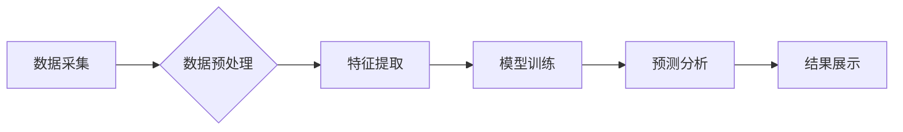

>  电商平台、数据分析、人工智能、机器学习、深度学习、推荐系统、个性化营销、预测分析

## 1. 背景介绍

电子商务平台作为当今商业模式的重要组成部分，其发展速度惊人，数据量也呈指数级增长。这些数据蕴藏着丰富的商业价值，例如用户行为、商品属性、市场趋势等。如何有效地挖掘和分析这些数据，为电商平台提供决策支持，提升用户体验和商业效益，成为一个重要的挑战。

人工智能（AI）技术，特别是机器学习（ML）和深度学习（DL）技术的快速发展，为电商平台数据分析提供了强大的工具。AI算法能够从海量数据中自动学习模式和规律，并进行预测和决策，为电商平台提供更精准、更智能的数据分析服务。

## 2. 核心概念与联系

**2.1 数据分析在电商平台中的应用**

电商平台的数据分析主要涵盖以下几个方面：

* **用户行为分析:** 分析用户浏览、搜索、购买、评价等行为，了解用户喜好、购买习惯、消费偏好等，为个性化推荐和营销提供依据。
* **商品分析:** 分析商品销售数据、评价数据、库存数据等，了解商品受欢迎程度、市场趋势、库存管理等，为商品定价、促销、库存优化等提供决策支持。
* **市场趋势分析:** 分析市场整体趋势、竞争对手情况、用户需求变化等，为产品开发、市场营销、战略规划等提供参考。

**2.2 AI技术在电商平台数据分析中的应用**

AI技术可以应用于电商平台数据分析的各个环节，例如：

* **数据预处理:** 使用AI算法自动清洗、转换、整合数据，提高数据质量。
* **特征提取:** 使用AI算法自动提取数据中的关键特征，例如用户画像、商品属性、市场趋势等。
* **模型训练:** 使用AI算法训练预测模型，例如用户购买预测、商品推荐模型、市场趋势预测模型等。
* **结果分析:** 使用AI算法分析预测结果，并生成可视化报表，帮助决策者理解数据和做出决策。

**2.3 AI技术与电商平台数据分析的架构**



## 3. 核心算法原理 & 具体操作步骤

**3.1 算法原理概述**

在电商平台数据分析中，常用的AI算法包括：

* **推荐系统:** 基于用户行为、商品属性、市场趋势等数据，推荐用户可能感兴趣的商品。常用的推荐算法包括协同过滤、内容过滤、基于知识的推荐等。
* **个性化营销:** 根据用户画像、购买历史、浏览记录等数据，为用户提供个性化的营销服务，例如个性化推荐、精准广告投放等。
* **预测分析:** 基于历史数据，预测未来用户行为、商品销售、市场趋势等，为电商平台决策提供参考。常用的预测算法包括线性回归、逻辑回归、决策树、支持向量机等。

**3.2 算法步骤详解**

以推荐系统为例，其基本步骤如下：

1. **数据收集:** 收集用户行为数据、商品属性数据、市场趋势数据等。
2. **数据预处理:** 清洗、转换、整合数据，提高数据质量。
3. **特征提取:** 从数据中提取关键特征，例如用户兴趣、商品类别、价格等。
4. **模型训练:** 使用推荐算法训练模型，例如协同过滤算法。
5. **模型评估:** 使用测试数据评估模型性能，例如准确率、召回率等。
6. **模型部署:** 将训练好的模型部署到线上环境，为用户提供推荐服务。

**3.3 算法优缺点**

不同的AI算法具有不同的优缺点，需要根据实际应用场景选择合适的算法。例如，协同过滤算法能够推荐用户可能感兴趣的商品，但需要大量的用户行为数据才能训练出准确的模型。内容过滤算法则可以根据用户兴趣推荐商品，但容易陷入“信息茧房”问题。

**3.4 算法应用领域**

AI算法在电商平台数据分析中应用广泛，例如：

* **商品推荐:** 为用户推荐可能感兴趣的商品。
* **个性化营销:** 为用户提供个性化的营销服务。
* **用户画像:** 建立用户画像，了解用户需求和行为。
* **市场趋势预测:** 预测未来市场趋势，帮助电商平台制定战略。

## 4. 数学模型和公式 & 详细讲解 & 举例说明

**4.1 数学模型构建**

在电商平台数据分析中，常用的数学模型包括：

* **线性回归模型:** 用于预测连续变量，例如商品销售量。
* **逻辑回归模型:** 用于预测分类变量，例如用户是否会购买商品。
* **协同过滤模型:** 用于推荐商品，基于用户行为和商品属性之间的相似性。

**4.2 公式推导过程**

以线性回归模型为例，其目标是找到一条直线，使得预测值与实际值之间的误差最小。

线性回归模型的公式如下：

$$y = \beta_0 + \beta_1x + \epsilon$$

其中：

* $y$ 是预测值
* $x$ 是输入特征
* $\beta_0$ 是截距
* $\beta_1$ 是斜率
* $\epsilon$ 是误差项

**4.3 案例分析与讲解**

假设我们想要预测商品的销售量，输入特征是商品价格。我们可以使用线性回归模型训练一个预测模型。

训练完成后，我们可以使用模型预测不同价格的商品销售量。例如，如果商品价格为100元，模型预测的销售量为100件。

## 5. 项目实践：代码实例和详细解释说明

**5.1 开发环境搭建**

* Python 3.x
* Jupyter Notebook
* scikit-learn

**5.2 源代码详细实现**

```python
from sklearn.linear_model import LinearRegression
import pandas as pd

# 加载数据
data = pd.read_csv('sales_data.csv')

# 划分训练集和测试集
X = data[['price']]
y = data['sales']
from sklearn.model_selection import train_test_split
X_train, X_test, y_train, y_test = train_test_split(X, y, test_size=0.2, random_state=42)

# 创建线性回归模型
model = LinearRegression()

# 训练模型
model.fit(X_train, y_train)

# 预测测试集数据
y_pred = model.predict(X_test)

# 评估模型性能
from sklearn.metrics import mean_squared_error
mse = mean_squared_error(y_test, y_pred)
print(f'Mean Squared Error: {mse}')
```

**5.3 代码解读与分析**

* 首先，我们加载数据并划分训练集和测试集。
* 然后，我们创建线性回归模型并训练模型。
* 训练完成后，我们使用模型预测测试集数据，并评估模型性能。

**5.4 运行结果展示**

运行代码后，会输出模型的均方误差（MSE）值。MSE值越小，模型的预测性能越好。

## 6. 实际应用场景

**6.1 商品推荐系统**

电商平台可以利用AI算法构建商品推荐系统，根据用户的浏览历史、购买记录、兴趣偏好等数据，推荐用户可能感兴趣的商品。

**6.2 个性化营销**

电商平台可以利用AI算法进行个性化营销，例如根据用户的画像，推送个性化的广告、优惠券、促销活动等。

**6.3 预测分析**

电商平台可以利用AI算法进行预测分析，例如预测未来用户购买行为、商品销售量、市场趋势等，为电商平台决策提供参考。

**6.4 未来应用展望**

随着AI技术的不断发展，AI在电商平台数据分析中的应用将更加广泛和深入。例如：

* **更精准的推荐:** 利用深度学习算法，构建更精准的推荐系统，推荐用户更感兴趣的商品。
* **更个性化的营销:** 利用自然语言处理技术，进行更个性化的营销，例如根据用户的聊天记录，推荐相关的商品。
* **更智能的客服:** 利用机器学习算法，构建智能客服系统，自动回答用户的常见问题。

## 7. 工具和资源推荐

**7.1 学习资源推荐**

* **书籍:**
    * 《Python机器学习》
    * 《深度学习》
* **在线课程:**
    * Coursera: 机器学习
    * edX: 深度学习
* **博客:**
    * Towards Data Science
    * Machine Learning Mastery

**7.2 开发工具推荐**

* **Python:** 
    * scikit-learn
    * TensorFlow
    * PyTorch
* **数据可视化工具:**
    * Matplotlib
    * Seaborn

**7.3 相关论文推荐**

* **协同过滤推荐系统:**
    * "Collaborative Filtering for Recommender Systems" by Su-Yin Lee and Wei-Min Chen
* **深度学习推荐系统:**
    * "Deep Learning for Recommender Systems" by Xiangnan He et al.

## 8. 总结：未来发展趋势与挑战

**8.1 研究成果总结**

AI技术在电商平台数据分析领域取得了显著成果，例如推荐系统、个性化营销、预测分析等应用取得了成功。

**8.2 未来发展趋势**

未来，AI在电商平台数据分析领域将继续发展，主要趋势包括：

* **更精准的推荐:** 利用深度学习算法，构建更精准的推荐系统，推荐用户更感兴趣的商品。
* **更个性化的营销:** 利用自然语言处理技术，进行更个性化的营销，例如根据用户的聊天记录，推荐相关的商品。
* **更智能的客服:** 利用机器学习算法，构建智能客服系统，自动回答用户的常见问题。

**8.3 面临的挑战**

AI技术在电商平台数据分析领域也面临一些挑战，例如：

* **数据质量问题:** 电商平台数据往往存在缺失、错误、不完整等问题，需要进行有效的数据清洗和预处理。
* **算法解释性问题:** 一些AI算法的决策过程难以解释，这可能会导致用户对推荐结果的信任度降低。
* **隐私保护问题:** 电商平台数据往往包含用户隐私信息，需要采取有效措施保护用户隐私。

**8.4 研究展望**

未来，需要进一步研究如何解决AI技术在电商平台数据分析领域面临的挑战，例如：

* 开发更鲁棒、更解释性的AI算法。
* 建立更完善的数据治理体系，保障数据质量和隐私安全。
* 加强AI技术与商业模式的融合，推动AI技术在电商平台的落地应用。

## 9. 附录：常见问题与解答

**9.1 如何选择合适的AI算法？**

选择合适的AI算法需要根据实际应用场景和数据特点进行选择。例如，如果需要预测连续变量，可以使用线性回归模型；如果需要预测分类变量，可以使用逻辑回归模型。

**9.2 如何评估AI模型的性能？**

常用的AI模型性能评估指标包括准确率、召回率、F1-score、AUC等。

**9.3 如何保护用户隐私？**

在使用AI技术进行数据分析时，需要采取有效措施保护用户隐私，例如：

*  anonymize 用户数据
* 使用加密技术保护敏感信息
* 遵守相关数据隐私法规


作者：禅与计算机程序设计艺术 / Zen and the Art of Computer Programming 
<end_of_turn>