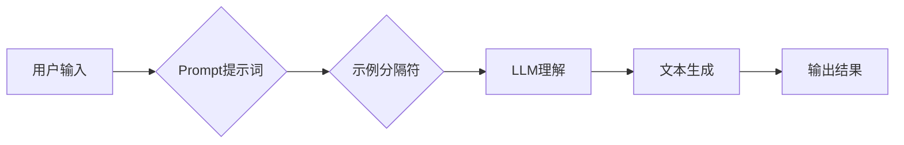

> AI大模型,Prompt提示词,最佳实践,示例分隔符,自然语言处理,文本生成

## 1. 背景介绍

近年来，大语言模型（LLM）在自然语言处理（NLP）领域取得了显著进展，展现出强大的文本生成、翻译、摘要等能力。然而，LLM的性能很大程度上取决于输入的Prompt提示词的质量。一个精心设计的Prompt可以引导模型生成更准确、更相关的输出，而一个模糊或不完整的Prompt则可能导致模型产生错误或不相关的结果。因此，学习如何编写高质量的Prompt提示词对于充分利用LLM的潜力至关重要。

## 2. 核心概念与联系

**2.1 Prompt提示词**

Prompt提示词是指用户向LLM输入的文本指令或问题，它引导模型理解用户意图并生成相应的输出。Prompt可以是简单的关键词、完整的句子，甚至是一段对话。

**2.2  示例分隔符**

示例分隔符是一种用于结构化Prompt提示词的特殊符号或标记，它将Prompt分为不同的部分，例如输入文本、预期输出、模型参数等。使用示例分隔符可以帮助LLM更好地理解Prompt的结构和语义，从而提高生成结果的准确性和相关性。

**2.3  核心概念关系**

Prompt提示词和示例分隔符共同构成了LLM输入的结构化信息，它们之间的关系可以理解为：

* **Prompt提示词**：提供LLM执行任务的指令或问题。
* **示例分隔符**：组织和结构化Prompt提示词，帮助LLM理解信息。

**2.4  Mermaid 流程图**



## 3. 核心算法原理 & 具体操作步骤

**3.1  算法原理概述**

LLM的训练过程本质上是通过学习语言模式和语义关系来预测下一个词。当用户输入Prompt提示词时，LLM会根据输入的词语序列和预训练的知识，预测下一个最可能的词，并以此类推，最终生成完整的文本输出。

**3.2  算法步骤详解**

1. **词嵌入:** 将输入的Prompt提示词中的每个词语转换为向量表示，每个向量代表词语的语义信息。
2. **编码:** 使用Transformer等编码器网络将词语向量序列编码成一个上下文表示，该表示包含了整个Prompt提示词的语义信息。
3. **解码:** 使用解码器网络根据编码后的上下文表示，预测下一个词语的概率分布。
4. **生成:** 根据概率分布选择最可能的词语，并将其添加到输出文本中。重复步骤3和4，直到生成完整的文本输出。

**3.3  算法优缺点**

* **优点:** 能够生成流畅、自然的文本，并具备一定的理解和推理能力。
* **缺点:** 训练成本高，需要大量的文本数据和计算资源；容易受到Prompt提示词的质量影响，生成结果可能存在偏差或错误。

**3.4  算法应用领域**

* 文本生成：小说、诗歌、剧本等
* 机器翻译：将一种语言翻译成另一种语言
* 文本摘要：提取文本的关键信息
* 对话系统：与用户进行自然语言交互

## 4. 数学模型和公式 & 详细讲解 & 举例说明

**4.1  数学模型构建**

LLM通常基于Transformer网络架构，其核心是注意力机制。注意力机制允许模型关注输入序列中与当前词语最相关的部分，从而更好地理解上下文信息。

**4.2  公式推导过程**

注意力机制的计算公式如下：

$$
Attention(Q, K, V) = softmax(\frac{QK^T}{\sqrt{d_k}})V
$$

其中：

* $Q$：查询矩阵
* $K$：键矩阵
* $V$：值矩阵
* $d_k$：键向量的维度
* $softmax$：softmax函数，用于归一化注意力权重

**4.3  案例分析与讲解**

假设我们有一个句子“我爱吃苹果”，我们要计算“吃”这个词语的注意力权重。

* $Q$：包含“吃”词语的查询向量
* $K$：包含所有词语的键向量
* $V$：包含所有词语的值向量

通过计算$QK^T$，得到每个词语与“吃”词语的相关性得分。然后使用softmax函数归一化这些得分，得到每个词语的注意力权重。

## 5. 项目实践：代码实例和详细解释说明

**5.1  开发环境搭建**

* Python 3.7+
* PyTorch 或 TensorFlow
* CUDA 和 cuDNN (可选，用于GPU加速)

**5.2  源代码详细实现**

```python
import torch
import torch.nn as nn

class Transformer(nn.Module):
    def __init__(self, vocab_size, embedding_dim, num_heads, num_layers):
        super(Transformer, self).__init__()
        self.embedding = nn.Embedding(vocab_size, embedding_dim)
        self.transformer_layers = nn.ModuleList([
            nn.TransformerEncoderLayer(embedding_dim, num_heads)
            for _ in range(num_layers)
        ])

    def forward(self, x):
        x = self.embedding(x)
        for layer in self.transformer_layers:
            x = layer(x)
        return x
```

**5.3  代码解读与分析**

* `Transformer`类定义了一个基本的Transformer模型。
* `embedding`层将词语转换为向量表示。
* `transformer_layers`是一个模块列表，包含多个`TransformerEncoderLayer`层，每个层负责处理输入序列的上下文信息。
* `forward`方法定义了模型的输入和输出流程。

**5.4  运行结果展示**

使用训练好的模型，可以输入Prompt提示词，并得到相应的文本输出。

## 6. 实际应用场景

**6.1  聊天机器人**

LLM可以用于构建聊天机器人，通过理解用户的输入并生成自然语言的回复，提供更人性化的交互体验。

**6.2  文本摘要**

LLM可以自动生成文本摘要，提取文本的关键信息，节省用户阅读时间。

**6.3  代码生成**

LLM可以根据用户提供的描述，自动生成代码，提高开发效率。

**6.4  未来应用展望**

随着LLM技术的不断发展，其应用场景将更加广泛，例如：

* 个性化教育：根据学生的学习进度和需求，提供个性化的学习内容和辅导。
* 医疗诊断：辅助医生进行疾病诊断，提高诊断准确率。
* 科学研究：加速科学研究的进程，帮助科学家发现新的知识。

## 7. 工具和资源推荐

**7.1  学习资源推荐**

* **书籍:**
    * 《深度学习》
    * 《自然语言处理》
* **在线课程:**
    * Coursera: 自然语言处理
    * edX: 深度学习
* **博客和论坛:**
    * Hugging Face
    * TensorFlow Blog

**7.2  开发工具推荐**

* **框架:**
    * PyTorch
    * TensorFlow
* **库:**
    * Transformers
    * NLTK
* **平台:**
    * Google Colab
    * Kaggle

**7.3  相关论文推荐**

* Attention Is All You Need
* BERT: Pre-training of Deep Bidirectional Transformers for Language Understanding
* GPT-3: Language Models are Few-Shot Learners

## 8. 总结：未来发展趋势与挑战

**8.1  研究成果总结**

近年来，LLM取得了显著进展，在文本生成、机器翻译、文本摘要等领域展现出强大的能力。

**8.2  未来发展趋势**

* 模型规模和能力的进一步提升
* 更高效的训练方法和算法
* 更广泛的应用场景和领域
* 更加安全、可靠和可解释的模型

**8.3  面临的挑战**

* 训练成本高，需要大量的计算资源
* 容易受到Prompt提示词的质量影响
* 存在潜在的偏见和错误
* 缺乏对模型行为的解释性

**8.4  研究展望**

未来研究将重点关注以下几个方面：

* 开发更高效、更节能的训练方法
* 提高模型的鲁棒性和泛化能力
* 增强模型的可解释性和安全性
* 探索LLM在更多领域的新应用

## 9. 附录：常见问题与解答

**9.1  如何编写高质量的Prompt提示词？**

* 明确表达你的意图
* 提供足够的上下文信息
* 使用具体的关键词和短语
* 避免使用模糊或歧义的语言

**9.2  如何选择合适的LLM模型？**

* 考虑你的应用场景和需求
* 评估模型的性能和参数规模
* 参考开源社区的推荐和评价

**9.3  如何解决LLM生成的文本存在偏见或错误的问题？**

* 使用高质量的训练数据
* 采用反偏见训练方法
* 进行文本校正和评估

作者：禅与计算机程序设计艺术 / Zen and the Art of Computer Programming


<end_of_turn>