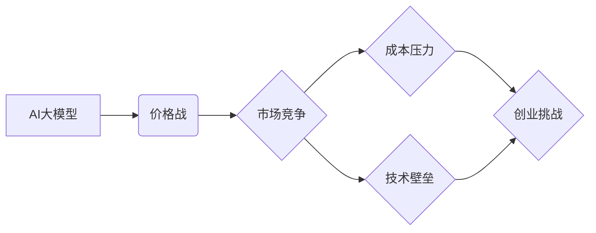

> AI大模型，价格战，商业模式，开源，闭源，数据，算力，人才

## 1. 背景介绍

近年来，人工智能（AI）技术蓬勃发展，特别是大模型的涌现，为各行各业带来了革命性的变革。从自然语言处理到图像识别，从药物研发到金融预测，AI大模型的应用场景日益广泛。然而，随着技术的成熟和开源工具的普及，AI大模型的开发成本逐渐降低，市场竞争也日益激烈。

未来，AI大模型市场将面临一场价格战的考验。一方面，越来越多的企业和研究机构涌入这个领域，试图通过降低价格来抢占市场份额；另一方面，开源社区的兴起也使得AI大模型的底层技术更加透明和可访问，降低了企业开发自有模型的门槛。

在这种情况下，如何应对未来价格战，成为AI大模型创业者面临的重大挑战。

## 2. 核心概念与联系

**2.1 AI大模型的定义**

AI大模型是指在海量数据上训练，拥有庞大参数规模的深度学习模型。其强大的学习能力和泛化能力使其能够在各种复杂任务中表现出色。

**2.2 价格战的本质**

价格战是指企业通过降低产品价格来竞争市场份额的商业策略。其本质是通过牺牲利润来获取更大的市场占有率，最终实现规模效应和竞争优势。

**2.3 AI大模型创业面临的挑战**

* **成本压力:** AI大模型的训练和部署需要大量的算力和数据资源，成本较高。
* **技术壁垒:** 训练和优化大型模型需要专业的技术团队和经验积累。
* **市场竞争:** AI大模型市场竞争激烈，价格战的风险较高。

**2.4  核心概念关系图**



## 3. 核心算法原理 & 具体操作步骤

**3.1 算法原理概述**

AI大模型的训练主要基于深度学习算法，其中Transformer模型是近年来发展最快的模型架构之一。Transformer模型的核心思想是利用注意力机制来捕捉文本序列中的长距离依赖关系，从而提高模型的理解和生成能力。

**3.2 算法步骤详解**

1. **数据预处理:** 将原始文本数据进行清洗、分词、标记等预处理操作，使其能够被模型理解。
2. **模型构建:** 根据Transformer模型架构，构建模型结构，包括编码器、解码器和注意力机制等模块。
3. **模型训练:** 使用训练数据对模型进行训练，通过调整模型参数，使其能够准确地预测目标输出。
4. **模型评估:** 使用测试数据对模型进行评估，衡量模型的性能，例如准确率、召回率等指标。
5. **模型部署:** 将训练好的模型部署到实际应用场景中，用于文本生成、翻译、问答等任务。

**3.3 算法优缺点**

* **优点:** Transformer模型能够有效地捕捉文本序列中的长距离依赖关系，具有较高的准确性和泛化能力。
* **缺点:** Transformer模型的训练成本较高，需要大量的算力和数据资源。

**3.4 算法应用领域**

* **自然语言处理:** 文本生成、机器翻译、问答系统、文本摘要等。
* **计算机视觉:** 图像识别、目标检测、图像分割等。
* **语音识别:** 语音转文本、语音合成等。

## 4. 数学模型和公式 & 详细讲解 & 举例说明

**4.1 数学模型构建**

Transformer模型的核心是注意力机制，其数学模型可以表示为：

$$
Attention(Q, K, V) = softmax(\frac{QK^T}{\sqrt{d_k}})V
$$

其中：

* $Q$：查询矩阵
* $K$：键矩阵
* $V$：值矩阵
* $d_k$：键向量的维度
* $softmax$：softmax函数

**4.2 公式推导过程**

注意力机制的目的是计算查询向量与键向量的相关性，并根据相关性对值向量进行加权求和。

1. 计算查询向量与每个键向量的点积，得到一个分数矩阵。
2. 对分数矩阵进行归一化，得到一个概率分布。
3. 将概率分布与值向量进行加权求和，得到最终的输出向量。

**4.3 案例分析与讲解**

假设我们有一个句子“我爱学习编程”，我们需要计算“学习”这个词与整个句子的相关性。

1. 将句子中的每个词都转换为向量表示，作为查询向量、键向量和值向量。
2. 计算“学习”词的查询向量与所有键向量的点积，得到一个分数矩阵。
3. 对分数矩阵进行归一化，得到一个概率分布，表示“学习”词与每个词的相关性。
4. 将概率分布与所有值向量进行加权求和，得到最终的输出向量，代表“学习”词与整个句子的语义信息。

## 5. 项目实践：代码实例和详细解释说明

**5.1 开发环境搭建**

* 操作系统：Ubuntu 20.04
* Python 版本：3.8
* 深度学习框架：PyTorch 1.8

**5.2 源代码详细实现**

```python
import torch
import torch.nn as nn

class Transformer(nn.Module):
    def __init__(self, vocab_size, embedding_dim, num_heads, num_layers):
        super(Transformer, self).__init__()
        self.embedding = nn.Embedding(vocab_size, embedding_dim)
        self.transformer_layers = nn.ModuleList([
            nn.TransformerEncoderLayer(embedding_dim, num_heads)
            for _ in range(num_layers)
        ])
        self.linear = nn.Linear(embedding_dim, vocab_size)

    def forward(self, x):
        x = self.embedding(x)
        for layer in self.transformer_layers:
            x = layer(x)
        x = self.linear(x)
        return x
```

**5.3 代码解读与分析**

* `__init__` 方法：初始化模型参数，包括词嵌入层、Transformer编码器层和输出层。
* `forward` 方法：定义模型的正向传播过程，将输入序列经过词嵌入层、Transformer编码器层和输出层，最终得到预测输出。

**5.4 运行结果展示**

使用训练好的模型，可以对新的文本序列进行预测，例如生成文本、翻译文本等。

## 6. 实际应用场景

**6.1 文本生成**

* 自动生成新闻报道、小说、诗歌等文本。
* 创建聊天机器人，进行自然语言对话。

**6.2 机器翻译**

* 将文本从一种语言翻译成另一种语言。
* 支持多种语言的翻译，提高跨语言沟通效率。

**6.3 问答系统**

* 根据用户的问题，从知识库中检索相关信息，并给出准确的答案。
* 构建智能客服系统，自动回答用户常见问题。

**6.4 未来应用展望**

* **个性化教育:** 根据学生的学习情况，定制个性化的学习方案。
* **医疗诊断:** 辅助医生进行疾病诊断，提高诊断准确率。
* **科学研究:** 加速科学研究的进程，发现新的知识和规律。

## 7. 工具和资源推荐

**7.1 学习资源推荐**

* **书籍:**
    * 《深度学习》
    * 《自然语言处理》
* **在线课程:**
    * Coursera: 深度学习
    * Udacity: 自然语言处理
* **博客:**
    * Jay Alammar's Blog
    * The Gradient

**7.2 开发工具推荐**

* **深度学习框架:** PyTorch, TensorFlow
* **自然语言处理库:** NLTK, spaCy
* **云计算平台:** AWS, Google Cloud, Azure

**7.3 相关论文推荐**

* Attention Is All You Need
* BERT: Pre-training of Deep Bidirectional Transformers for Language Understanding

## 8. 总结：未来发展趋势与挑战

**8.1 研究成果总结**

近年来，AI大模型取得了显著的进展，在各种应用领域展现出强大的潜力。

**8.2 未来发展趋势**

* **模型规模的进一步扩大:** 随着算力和数据资源的不断提升，AI大模型的规模将继续扩大，模型能力将进一步提升。
* **模型训练成本的降低:** 开源社区的兴起和硬件技术的进步，将推动AI大模型训练成本的降低，使得更多企业和研究机构能够参与到AI大模型的开发和应用中。
* **模型应用场景的拓展:** AI大模型将应用于更多领域，例如医疗、教育、金融等，为人类社会带来更多价值。

**8.3 面临的挑战**

* **数据安全和隐私保护:** AI大模型的训练需要大量数据，如何保证数据安全和隐私保护是一个重要的挑战。
* **模型可解释性和信任度:** AI大模型的决策过程往往是复杂的，如何提高模型的可解释性和信任度是一个重要的研究方向。
* **伦理和社会影响:** AI大模型的应用可能会带来一些伦理和社会问题，例如算法偏见、就业失业等，需要引起社会各界的关注和讨论。

**8.4 研究展望**

未来，AI大模型的研究将继续朝着更强大、更安全、更可解释的方向发展。


## 9. 附录：常见问题与解答

**9.1 如何选择合适的AI大模型？**

选择合适的AI大模型需要根据具体的应用场景和需求进行考虑。例如，如果需要进行文本生成任务，可以选择GPT-3等文本生成模型；如果需要进行图像识别任务，可以选择Vision Transformer等图像识别模型。

**9.2 如何训练自己的AI大模型？**

训练自己的AI大模型需要具备一定的技术基础和资源支持。首先需要收集和预处理训练数据，然后选择合适的模型架构和训练参数，最后使用深度学习框架进行模型训练。

**9.3 如何部署AI大模型？**

部署AI大模型可以采用云计算、边缘计算等方式。需要根据实际应用场景选择合适的部署方式，并进行模型优化和性能测试。


作者：禅与计算机程序设计艺术 / Zen and the Art of Computer Programming 
<end_of_turn>