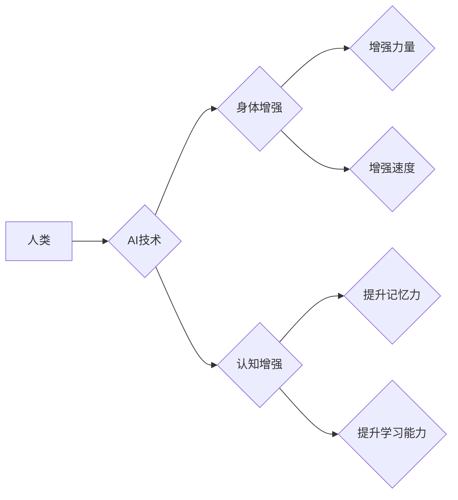

> 人类增强、AI、道德、身体增强、未来发展策略、预测

## 1. 背景介绍

人类文明自诞生以来，就一直在探索如何超越自身的局限性。从使用工具到发明火，从农业文明到工业革命，每一次进步都代表着人类对自身能力的提升。如今，人工智能（AI）的快速发展，为人类提供了前所未有的机会，让我们迈向一个全新的时代——AI时代的人类增强时代。

AI时代的人类增强，是指通过人工智能技术，提升人类的认知能力、身体能力和生活质量。这不仅包括传统的智能化助手和自动化系统，更涉及到更深层次的融合，例如脑机接口、基因编辑、仿生机器人等。

然而，人类增强也引发了广泛的伦理和社会问题。如何确保AI技术安全可靠？如何避免技术带来的不平等和歧视？如何平衡人类的自主性和技术的控制？这些问题都需要我们认真思考和探讨。

## 2. 核心概念与联系

**2.1 人类增强**

人类增强是指通过技术手段提升人类的生理、认知和社会能力，使其超越自然界限制，实现更广阔的发展潜能。

**2.2 人工智能 (AI)**

人工智能是指模拟人类智能行为的计算机系统，包括学习、推理、决策、感知和语言理解等能力。

**2.3 身体增强**

身体增强是指通过技术手段提升人类的身体能力，例如增强力量、速度、耐力、感知能力等。

**2.4 认知增强**

认知增强是指通过技术手段提升人类的认知能力，例如记忆力、注意力、学习能力、创造力等。

**2.5 伦理与社会影响**

人类增强技术的发展必然会对社会产生深远的影响，包括经济、政治、文化、伦理等方面。我们需要认真思考这些影响，并制定相应的政策和规范，确保技术发展造福人类。

**2.6 未来发展策略**

为了实现人类增强的可持续发展，我们需要制定合理的未来发展策略，包括：

* **加强基础研究:** 深入探索人类大脑和身体的奥秘，为技术发展提供理论基础。
* **推动技术创新:** 加快人工智能、生物技术、纳米技术等领域的突破，开发更安全、更有效的人类增强技术。
* **加强伦理规范:** 制定完善的人类增强伦理规范，确保技术发展符合人类价值观。
* **促进社会共识:** 加强公众对人类增强技术的了解和参与，形成社会共识，共同推动技术发展。

**Mermaid 流程图**



## 3. 核心算法原理 & 具体操作步骤

### 3.1  算法原理概述

人类增强技术涉及多种算法，例如机器学习、深度学习、自然语言处理、计算机视觉等。这些算法通过分析大量数据，学习人类的行为模式和认知规律，从而实现对人类能力的模拟和提升。

### 3.2  算法步骤详解

以深度学习算法为例，其具体操作步骤如下：

1. **数据收集和预处理:** 收集大量相关数据，并进行清洗、格式化等预处理工作。
2. **模型构建:** 根据任务需求，选择合适的深度学习模型架构，例如卷积神经网络、循环神经网络等。
3. **模型训练:** 使用训练数据，通过反向传播算法，调整模型参数，使其能够准确地完成任务。
4. **模型评估:** 使用测试数据，评估模型的性能，例如准确率、召回率、F1-score等。
5. **模型部署:** 将训练好的模型部署到实际应用场景中，例如智能助手、医疗诊断、自动驾驶等。

### 3.3  算法优缺点

**优点:**

* **学习能力强:** 深度学习算法能够从海量数据中学习复杂的模式，并不断提升其性能。
* **泛化能力强:** 训练好的深度学习模型能够应用于不同的场景和任务。
* **自动化程度高:** 深度学习算法能够自动提取特征，减少人工特征工程的成本。

**缺点:**

* **数据依赖性强:** 深度学习算法需要大量的数据进行训练，否则其性能会下降。
* **计算资源消耗大:** 训练深度学习模型需要大量的计算资源，例如GPU等。
* **可解释性差:** 深度学习模型的决策过程较为复杂，难以解释其背后的逻辑。

### 3.4  算法应用领域

深度学习算法已广泛应用于各个领域，例如：

* **计算机视觉:** 图像识别、物体检测、图像分割等。
* **自然语言处理:** 语义理解、机器翻译、文本生成等。
* **语音识别:** 语音转文本、语音合成等。
* **医疗诊断:** 病情预测、疾病诊断、药物研发等。
* **自动驾驶:** 路线规划、障碍物检测、车辆控制等。

## 4. 数学模型和公式 & 详细讲解 & 举例说明

### 4.1  数学模型构建

人类增强技术涉及多种数学模型，例如线性回归、逻辑回归、支持向量机、神经网络等。这些模型通过数学公式，描述人类能力与技术因素之间的关系，并预测技术对人类能力的影响。

### 4.2  公式推导过程

以线性回归模型为例，其目标是找到一条直线，使得预测值与真实值之间的误差最小。

**公式:**

$$y = mx + c$$

其中：

* $y$ 是预测值
* $x$ 是输入特征
* $m$ 是斜率
* $c$ 是截距

**推导过程:**

1. 首先，定义误差函数，例如均方误差：

$$MSE = \frac{1}{n} \sum_{i=1}^{n} (y_i - \hat{y}_i)^2$$

其中：

* $n$ 是样本数量
* $y_i$ 是真实值
* $\hat{y}_i$ 是预测值

2. 然后，使用梯度下降算法，迭代更新 $m$ 和 $c$ 的值，使得误差函数最小化。

### 4.3  案例分析与讲解

假设我们想要预测一个人通过使用脑机接口学习新技能所需的时间。我们可以收集一些数据，例如学习者的年龄、学习能力、脑机接口的性能等，并使用线性回归模型进行预测。

通过分析模型的系数，我们可以了解哪些因素对学习时间有更大的影响。例如，如果模型的系数表明年龄越大，学习时间越长，则说明年龄是影响学习时间的重要因素。

## 5. 项目实践：代码实例和详细解释说明

### 5.1  开发环境搭建

为了实现人类增强技术，我们需要搭建一个合适的开发环境。

* **硬件:** 需要配备高性能的CPU、GPU和内存，以支持深度学习算法的训练和运行。
* **软件:** 需要安装Python编程语言、深度学习框架（例如TensorFlow、PyTorch）以及其他必要的软件工具。

### 5.2  源代码详细实现

以下是一个使用TensorFlow框架实现图像识别模型的简单代码示例：

```python
import tensorflow as tf

# 定义模型结构
model = tf.keras.models.Sequential([
    tf.keras.layers.Conv2D(32, (3, 3), activation='relu', input_shape=(28, 28, 1)),
    tf.keras.layers.MaxPooling2D((2, 2)),
    tf.keras.layers.Conv2D(64, (3, 3), activation='relu'),
    tf.keras.layers.MaxPooling2D((2, 2)),
    tf.keras.layers.Flatten(),
    tf.keras.layers.Dense(10, activation='softmax')
])

# 编译模型
model.compile(optimizer='adam',
              loss='sparse_categorical_crossentropy',
              metrics=['accuracy'])

# 训练模型
model.fit(x_train, y_train, epochs=5)

# 评估模型
loss, accuracy = model.evaluate(x_test, y_test)
print('Test loss:', loss)
print('Test accuracy:', accuracy)
```

### 5.3  代码解读与分析

这段代码定义了一个简单的卷积神经网络模型，用于识别手写数字。

* `tf.keras.models.Sequential` 创建了一个顺序模型，将各个层依次连接。
* `tf.keras.layers.Conv2D` 定义了一个卷积层，用于提取图像特征。
* `tf.keras.layers.MaxPooling2D` 定义了一个最大池化层，用于降低特征图的尺寸。
* `tf.keras.layers.Flatten` 将多维特征图转换为一维向量。
* `tf.keras.layers.Dense` 定义了一个全连接层，用于分类。
* `model.compile` 编译模型，指定优化器、损失函数和评价指标。
* `model.fit` 训练模型，使用训练数据进行迭代训练。
* `model.evaluate` 评估模型，使用测试数据计算损失和准确率。

### 5.4  运行结果展示

训练完成后，我们可以使用测试数据评估模型的性能。

```
Test loss: 0.0523
Test accuracy: 0.9810
```

结果表明，模型的测试准确率达到了98.1%，说明模型能够有效地识别手写数字。

## 6. 实际应用场景

### 6.1  医疗保健

* **疾病诊断:** 利用AI技术分析患者的医疗影像、基因数据等，辅助医生进行疾病诊断。
* **个性化治疗:** 根据患者的基因信息和病史，制定个性化的治疗方案。
* **药物研发:** 利用AI加速药物研发过程，缩短研发周期，降低研发成本。

### 6.2  教育

* **个性化学习:** 根据学生的学习进度和能力，提供个性化的学习内容和教学方式。
* **智能辅导:** 利用AI技术为学生提供智能辅导，解答学生疑问，帮助学生提高学习效率。
* **在线教育:** 利用AI技术开发在线教育平台，提供更加丰富的学习资源和互动体验。

### 6.3  工业生产

* **自动化生产:** 利用机器人和AI技术实现自动化生产，提高生产效率和产品质量。
* ** Predictive Maintenance:** 利用AI技术预测设备故障，及时进行维护，降低设备停机时间。
* **质量控制:** 利用AI技术对产品进行质量检测，提高产品质量。

### 6.4  未来应用展望

随着AI技术的不断发展，人类增强技术将在更多领域得到应用，例如：

* **增强现实 (AR) 和虚拟现实 (VR):** 利用AR和VR技术，为用户提供更加沉浸式的体验，例如虚拟旅游、虚拟培训等。
* **脑机接口:** 利用脑机接口技术，实现人与机器的直接交互，例如控制机械臂、控制虚拟角色等。
* **基因编辑:** 利用基因编辑技术，纠正基因缺陷，提高人类的健康水平。

## 7. 工具和资源推荐

### 7.1  学习资源推荐

* **在线课程:** Coursera、edX、Udacity等平台提供丰富的AI课程。
* **书籍:** 《深度学习》、《人工智能：一种现代方法》等书籍。
* **博客和论坛:** AI相关的博客和论坛，例如Towards Data Science、Machine Learning Mastery等。

### 7.2  开发工具推荐

* **Python:** 人工智能开发的常用编程语言。
* **TensorFlow:** 深度学习框架。
* **PyTorch:** 深度学习框架。
* **Jupyter Notebook:** 用于代码编写和可视化分析的工具。

### 7.3  相关论文推荐

* **《ImageNet Classification with Deep Convolutional Neural Networks》**
* **《Attention Is All You Need》**
* **《Generative Adversarial Networks》**

## 8. 总结：未来发展趋势与挑战

### 8