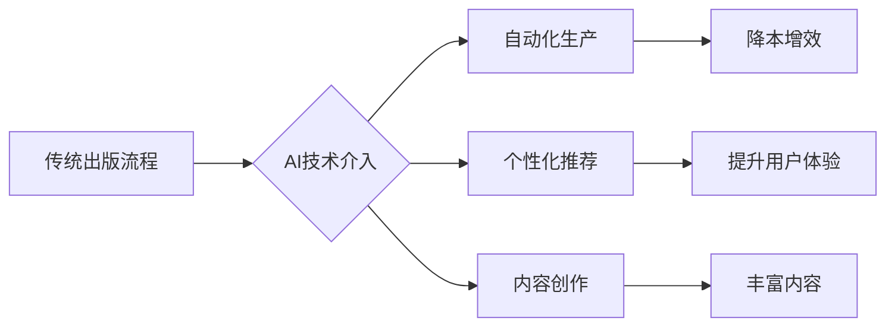

> AI、出版业、降本增效、场景创新、自动化、机器学习、自然语言处理、内容创作、个性化推荐

## 1. 背景介绍

出版业作为文化传播的重要载体，长期以来面临着成本高、效率低、市场竞争激烈等挑战。随着人工智能技术的快速发展，AI技术正在深刻地改变着出版业的传统模式，为出版业带来了新的机遇和挑战。

**1.1 出版业面临的挑战**

* **成本高昂:** 传统出版流程涉及编辑、排版、印刷、发行等多个环节，成本高昂，利润空间有限。
* **效率低下:** 出版流程繁琐，周期长，难以满足读者日益增长的个性化需求。
* **市场竞争激烈:**  互联网时代，电子书、音频书等新兴阅读形式的兴起，加剧了出版业的市场竞争。

**1.2 AI技术带来的机遇**

* **自动化生产:** AI技术可以自动化完成许多重复性工作，例如文本校对、排版设计、封面生成等，提高生产效率，降低成本。
* **个性化推荐:** AI算法可以根据读者的阅读习惯和喜好，精准推荐合适的书籍，提升用户体验。
* **内容创作:** AI技术可以辅助作家创作，例如生成故事梗概、人物设定、情节发展等，提高创作效率。

## 2. 核心概念与联系

**2.1 AI技术在出版业中的应用场景**

* **内容创作:** 利用AI技术生成小说、诗歌、剧本等创意内容。
* **内容编辑:** 利用AI技术进行文本校对、语法检查、风格调整等编辑工作。
* **内容翻译:** 利用AI技术实现多语言文本翻译，拓展出版市场。
* **内容推荐:** 利用AI技术分析用户阅读习惯，推荐个性化书籍。
* **营销推广:** 利用AI技术进行精准营销，提高推广效率。

**2.2 AI技术与出版业的融合架构**



## 3. 核心算法原理 & 具体操作步骤

**3.1 算法原理概述**

在AI技术应用于出版业中，常用的算法包括自然语言处理（NLP）、机器学习（ML）、深度学习（DL）等。

* **自然语言处理（NLP）:**  NLP算法可以理解和处理人类语言，例如文本分类、情感分析、文本摘要等。
* **机器学习（ML）:** ML算法可以从数据中学习规律，例如用户阅读偏好预测、书籍推荐算法等。
* **深度学习（DL）:** DL算法可以模拟人类大脑神经网络，例如图像识别、语音识别、机器翻译等。

**3.2 算法步骤详解**

以书籍推荐为例，其算法步骤如下：

1. **数据收集:** 收集用户阅读历史、书籍信息、用户评价等数据。
2. **数据预处理:** 对数据进行清洗、转换、特征提取等处理。
3. **模型训练:** 利用机器学习算法，训练书籍推荐模型。
4. **模型评估:** 使用测试数据评估模型的准确率、召回率等指标。
5. **模型部署:** 将训练好的模型部署到线上系统，为用户提供个性化书籍推荐。

**3.3 算法优缺点**

* **优点:** 能够根据用户喜好精准推荐书籍，提升用户体验，提高出版效率。
* **缺点:** 需要大量数据进行训练，算法模型需要不断更新迭代，存在数据隐私安全问题。

**3.4 算法应用领域**

* **电子书平台:** 为用户推荐个性化电子书。
* **图书馆:** 为读者推荐相关书籍。
* **出版社:**  分析市场趋势，预测书籍销量。

## 4. 数学模型和公式 & 详细讲解 & 举例说明

**4.1 数学模型构建**

书籍推荐系统通常采用协同过滤算法，其核心思想是基于用户的相似度或物品的相似度进行推荐。

**4.2 公式推导过程**

假设用户u对书籍i的评分为r(u,i)，则用户u与用户v的相似度可以计算为：

```latex
Sim(u,v) = \frac{\sum_{i \in I(u) \cap I(v)} (r(u,i) - \bar{r}_u)(r(v,i) - \bar{r}_v)}{\sqrt{(\sum_{i \in I(u)} (r(u,i) - \bar{r}_u)^2)(\sum_{i \in I(v)} (r(v,i) - \bar{r}_v)^2)}}
```

其中：

* I(u) 和 I(v) 分别表示用户u和用户v评分过的书籍集合。
* $\bar{r}_u$ 和 $\bar{r}_v$ 分别表示用户u和用户v的平均评分。

**4.3 案例分析与讲解**

假设用户A和用户B都评分过书籍1、2、3，并且用户A对书籍1评分为5，用户B对书籍1评分为4，则可以计算用户A和用户B的相似度。

## 5. 项目实践：代码实例和详细解释说明

**5.1 开发环境搭建**

* Python 3.x
* TensorFlow 或 PyTorch
* Jupyter Notebook

**5.2 源代码详细实现**

```python
# 导入必要的库
import numpy as np
from sklearn.metrics.pairwise import cosine_similarity

# 定义用户评分数据
ratings = np.array([
    [5, 4, 3],  # 用户A对书籍1、2、3的评分
    [4, 5, 2],  # 用户B对书籍1、2、3的评分
    [3, 2, 5]   # 用户C对书籍1、2、3的评分
])

# 计算用户之间的相似度
similarity_matrix = cosine_similarity(ratings)

# 打印相似度矩阵
print(similarity_matrix)
```

**5.3 代码解读与分析**

* 代码首先导入必要的库，例如NumPy用于数值计算，Scikit-learn用于计算余弦相似度。
* 然后定义用户评分数据，例如ratings是一个二维数组，其中每一行代表一个用户，每一列代表一个书籍。
* 使用cosine_similarity函数计算用户之间的相似度，并将结果存储在similarity_matrix中。
* 最后打印相似度矩阵，可以观察到用户之间的相似度。

**5.4 运行结果展示**

运行代码后，会输出一个相似度矩阵，例如：

```
[[1.         0.8660254  0.57735027]
 [0.8660254  1.         0.57735027]
 [0.57735027  0.57735027  1.        ]]
```

其中，1表示用户之间完全相似，0表示用户之间完全不相似。

## 6. 实际应用场景

**6.1 电子书平台**

* **个性化推荐:** 根据用户的阅读历史和喜好，推荐个性化的电子书。
* **内容发现:**  帮助用户发现新的书籍和作者。
* **阅读体验优化:**  根据用户的阅读习惯，提供个性化的阅读设置，例如字体大小、行距等。

**6.2 出版社**

* **市场分析:**  分析市场趋势，预测书籍销量。
* **内容策划:**  根据市场需求，策划新的书籍内容。
* **营销推广:**  利用AI技术进行精准营销，提高推广效率。

**6.3 图书馆**

* **资源管理:**  帮助图书馆管理书籍资源，提高资源利用率。
* **读者服务:**  为读者提供个性化的书籍推荐和阅读指导。
* **知识传播:**  利用AI技术，开发新的图书馆服务，例如在线知识问答、虚拟导览等。

**6.4 未来应用展望**

* **AI辅助写作:**  利用AI技术辅助作家创作，提高创作效率。
* **智能出版:**  利用AI技术实现自动化出版流程，降低出版成本。
* **沉浸式阅读体验:**  利用VR/AR技术，打造沉浸式的阅读体验。

## 7. 工具和资源推荐

**7.1 学习资源推荐**

* **书籍:**
    * 《深度学习》
    * 《自然语言处理》
    * 《机器学习实战》
* **在线课程:**
    * Coursera
    * edX
    * Udacity

**7.2 开发工具推荐**

* **Python:**  Python是一种流行的编程语言，广泛应用于AI领域。
* **TensorFlow:**  TensorFlow是一个开源的机器学习框架。
* **PyTorch:**  PyTorch是一个开源的深度学习框架。

**7.3 相关论文推荐**

* **BERT:**  Bidirectional Encoder Representations from Transformers
* **GPT-3:**  Generative Pre-trained Transformer 3
* **DALL-E:**  Generative Pre-trained Transformer 3

## 8. 总结：未来发展趋势与挑战

**8.1 研究成果总结**

AI技术在出版业的应用取得了显著成果，例如个性化推荐、自动化生产、内容创作等。

**8.2 未来发展趋势**

* **更精准的推荐:**  利用更先进的算法和数据，实现更精准的书籍推荐。
* **更智能的内容创作:**  利用AI技术，辅助作家创作更具创意和吸引力的内容。
* **更沉浸式的阅读体验:**  利用VR/AR技术，打造更沉浸式的阅读体验。

**8.3 面临的挑战**

* **数据隐私安全:**  AI技术需要大量数据进行训练，如何保护用户数据隐私安全是一个重要的挑战。
* **算法偏见:**  AI算法可能会存在偏见，需要不断改进算法，避免算法歧视。
* **伦理问题:**  AI技术在出版业的应用可能会引发一些伦理问题，例如内容原创权、人工创作的文学价值等，需要进行深入探讨。

**8.4 研究展望**

未来，AI技术在出版业的应用将更加广泛和深入，将为出版业带来更多机遇和挑战。需要加强对AI技术的研发和应用，并关注AI技术的伦理和社会影响。

## 9. 附录：常见问题与解答

**9.1 如何保护用户数据隐私安全？**

* 数据匿名化：对用户数据进行匿名处理，去除个人识别信息。
* 数据加密：对用户数据进行加密存储和传输，防止数据泄露。
* 数据访问控制：对用户数据进行严格的访问控制，只允许授权人员访问。

**9.2 如何避免算法偏见？**

* 使用多样化的训练数据：确保训练数据涵盖不同种族、性别、文化背景等群体。
* 算法调优：通过算法调优，减少算法偏见的影响。
* 定期评估算法：定期评估算法的公平性，及时发现和解决偏见问题。


作者：禅与计算机程序设计艺术 / Zen and the Art of Computer Programming 
<end_of_turn>