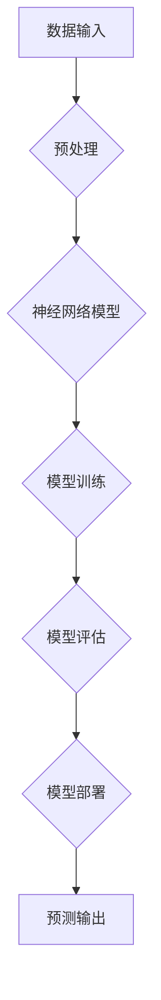

> 人工智能，深度学习，神经网络，编程思维，算法设计，机器学习

## 1. 背景介绍

人工智能（AI）正以惊人的速度发展，深刻地改变着我们生活的方方面面。从自动驾驶汽车到智能语音助手，从医疗诊断到金融预测，AI技术的应用场景日益广泛。然而，与传统软件开发相比，AI编程面临着独特的挑战。

传统的软件开发基于明确的规则和逻辑，程序员需要明确地定义算法和数据处理流程。而AI编程则更侧重于学习和适应，需要训练模型以从数据中提取知识和模式。这要求程序员具备更深层次的数学、统计和机器学习知识，并掌握新的编程思维和工具。

## 2. 核心概念与联系

**2.1 深度学习**

深度学习是机器学习的一个子领域，它利用多层神经网络来模拟人类大脑的学习过程。深度学习模型能够从海量数据中自动学习特征和模式，从而实现更精准的预测和决策。

**2.2 神经网络**

神经网络是深度学习的基础，它由多个相互连接的神经元组成。每个神经元接收输入信号，对其进行处理，并输出信号。神经网络通过调整连接权重来学习数据，从而实现功能的提升。

**2.3 编程思维转变**

传统的编程思维侧重于明确的指令和逻辑控制，而AI编程则更注重数据驱动和模型训练。程序员需要从“如何编写代码”转变为“如何设计模型”和“如何优化训练过程”。

**2.4 架构图**



## 3. 核心算法原理 & 具体操作步骤

**3.1 算法原理概述**

深度学习算法的核心是反向传播算法，它用于调整神经网络的连接权重，使模型的预测结果更加准确。反向传播算法通过计算误差信号，并将其反向传播到网络各层，从而更新权重值。

**3.2 算法步骤详解**

1. **数据预处理:** 将原始数据转换为模型可接受的格式，例如归一化、编码等。
2. **模型构建:** 定义神经网络的结构，包括层数、神经元数量、激活函数等。
3. **模型训练:** 使用训练数据训练模型，通过反向传播算法更新权重值。
4. **模型评估:** 使用测试数据评估模型的性能，例如准确率、召回率等。
5. **模型部署:** 将训练好的模型部署到实际应用场景中。

**3.3 算法优缺点**

**优点:**

* 能够从海量数据中自动学习特征，无需人工特征工程。
* 能够实现高精度预测和决策。
* 适用于各种类型的数据，例如文本、图像、音频等。

**缺点:**

* 训练时间长，需要大量的计算资源。
* 模型解释性差，难以理解模型的决策过程。
* 对数据质量要求高，训练数据必须足够大且高质量。

**3.4 算法应用领域**

* **图像识别:** 人脸识别、物体检测、图像分类等。
* **自然语言处理:** 文本分类、情感分析、机器翻译等。
* **语音识别:** 语音转文本、语音助手等。
* **医疗诊断:** 病情预测、疾病诊断等。
* **金融预测:** 股票预测、风险评估等。

## 4. 数学模型和公式 & 详细讲解 & 举例说明

**4.1 数学模型构建**

深度学习模型的核心是神经网络，它可以看作是一个复杂的数学模型。神经网络的每个神经元接收多个输入信号，对其进行线性变换，并通过激活函数进行非线性变换，最终输出一个信号。

**4.2 公式推导过程**

神经网络的输出可以表示为：

$$
y = f(W^L x^L + b^L)
$$

其中：

* $y$ 是神经网络的输出
* $f$ 是激活函数
* $W^L$ 是第 $L$ 层神经元的权重矩阵
* $x^L$ 是第 $L$ 层神经元的输入向量
* $b^L$ 是第 $L$ 层神经元的偏置向量

反向传播算法的目标是通过调整权重矩阵 $W^L$ 和偏置向量 $b^L$ 来最小化模型的损失函数。损失函数衡量模型预测结果与真实值的差异。

**4.3 案例分析与讲解**

假设我们有一个简单的线性回归问题，目标是预测房价。我们可以使用一个单层神经网络来解决这个问题。

* 输入特征：房屋面积
* 输出特征：房价

我们可以使用均方误差作为损失函数，并使用梯度下降算法来更新权重和偏置。

## 5. 项目实践：代码实例和详细解释说明

**5.1 开发环境搭建**

* Python 3.x
* TensorFlow 或 PyTorch

**5.2 源代码详细实现**

```python
import tensorflow as tf

# 定义模型
model = tf.keras.models.Sequential([
    tf.keras.layers.Dense(units=1, input_shape=[1])
])

# 编译模型
model.compile(optimizer='sgd', loss='mean_squared_error')

# 训练模型
model.fit(x_train, y_train, epochs=100)

# 评估模型
loss = model.evaluate(x_test, y_test)
print('Loss:', loss)

# 预测房价
new_house_area = 100
predicted_price = model.predict([new_house_area])
print('Predicted price:', predicted_price)
```

**5.3 代码解读与分析**

* 我们使用 TensorFlow 库构建了一个简单的线性回归模型。
* 模型只有一个全连接层，输入特征为房屋面积，输出特征为房价。
* 我们使用随机梯度下降算法来训练模型，并使用均方误差作为损失函数。
* 训练完成后，我们使用测试数据评估模型的性能。
* 最后，我们使用训练好的模型预测新房子的价格。

**5.4 运行结果展示**

运行结果将显示模型的损失值和预测的房价。

## 6. 实际应用场景

**6.1 医疗诊断**

深度学习可以用于分析医学图像，例如X光片、CT扫描和MRI扫描，以辅助医生诊断疾病。

**6.2 金融预测**

深度学习可以用于预测股票价格、信用风险和欺诈行为。

**6.3 自动驾驶**

深度学习可以用于训练自动驾驶汽车的感知系统，例如识别道路标志、车辆和行人。

**6.4 未来应用展望**

随着人工智能技术的不断发展，深度学习将在更多领域得到应用，例如个性化教育、智能家居和机器人技术。

## 7. 工具和资源推荐

**7.1 学习资源推荐**

* **书籍:**
    * 深度学习
    * 人工智能：一种现代方法
* **在线课程:**
    * Coursera 深度学习课程
    * Udacity 深度学习工程师 Nanodegree

**7.2 开发工具推荐**

* TensorFlow
* PyTorch
* Keras

**7.3 相关论文推荐**

* ImageNet Classification with Deep Convolutional Neural Networks
* AlexNet

## 8. 总结：未来发展趋势与挑战

**8.1 研究成果总结**

深度学习在过去几年取得了显著的进展，在图像识别、自然语言处理和语音识别等领域取得了突破性成果。

**8.2 未来发展趋势**

* **模型效率提升:** 研究更轻量级、更高效的深度学习模型。
* **解释性增强:** 开发能够解释模型决策过程的方法。
* **数据安全与隐私:** 研究如何保护数据安全和隐私。

**8.3 面临的挑战**

* **数据获取和标注:** 深度学习模型需要大量的训练数据，数据获取和标注成本高昂。
* **模型可解释性:** 深度学习模型的决策过程难以理解，这限制了其在一些领域应用。
* **伦理问题:** 深度学习技术可能带来伦理问题，例如算法偏见和隐私侵犯。

**8.4 研究展望**

未来，深度学习研究将继续朝着更智能、更安全、更可解释的方向发展。


## 9. 附录：常见问题与解答

**9.1 什么是深度学习？**

深度学习是机器学习的一个子领域，它利用多层神经网络来模拟人类大脑的学习过程。

**9.2 深度学习有哪些应用场景？**

深度学习的应用场景非常广泛，包括图像识别、自然语言处理、语音识别、医疗诊断、金融预测等。

**9.3 如何学习深度学习？**

可以通过阅读书籍、参加在线课程、参与开源项目等方式学习深度学习。

作者：禅与计算机程序设计艺术 / Zen and the Art of Computer Programming 


<end_of_turn>