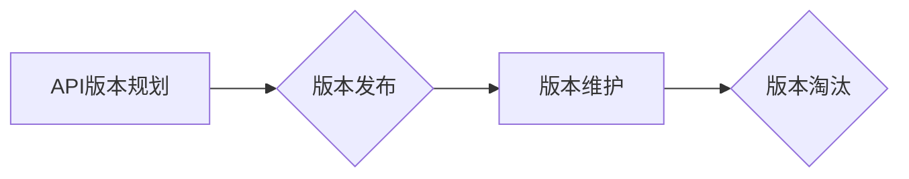

> API, 版本控制, 版本迭代, API文档, API设计, API管理, 软件开发

## 1. 背景介绍

在当今以软件为中心的时代，应用程序接口 (API) 已成为构建和连接软件系统不可或缺的基石。API 允许不同的软件系统之间进行通信和数据交换，从而促进了软件的复用、协作和创新。随着 API 的日益普及，API 版本控制的重要性也日益凸显。

API 版本控制是指对 API 的版本进行管理和控制的过程，它涉及到 API 的定义、文档、发布和维护等各个环节。API 版本控制可以帮助开发人员更好地管理 API 的演进，确保 API 的稳定性和兼容性，并降低 API 版本升级带来的风险。

## 2. 核心概念与联系

### 2.1 API 版本的概念

API 版本是指 API 的一个特定标识符，它代表了 API 的功能、接口和数据结构的特定状态。每个 API 版本都具有唯一的标识符，例如 v1、v2、v3 等。

### 2.2 版本控制的意义

API 版本控制的意义在于：

* **保证 API 的稳定性:**  API 版本控制可以确保 API 的稳定性，避免由于 API 的突然更改而导致应用程序的崩溃或功能失效。
* **维护 API 的兼容性:**  API 版本控制可以帮助开发人员维护 API 的兼容性，确保旧版本的应用程序能够与新版本的 API 进行通信。
* **简化 API 的维护:**  API 版本控制可以简化 API 的维护，例如可以方便地发布新的 API 版本，并管理旧版本的 API。
* **提高 API 的可信度:**  API 版本控制可以提高 API 的可信度，因为开发人员可以清楚地了解 API 的版本历史和更改记录。

### 2.3 版本控制流程

API 版本控制流程通常包括以下步骤：

1. **版本规划:**  确定 API 的版本策略，例如采用增量版本控制还是跳跃版本控制。
2. **版本发布:**  发布新的 API 版本，并提供相应的 API 文档和测试用例。
3. **版本维护:**  维护旧版本的 API，并提供必要的支持和更新。
4. **版本淘汰:**  淘汰不再使用的 API 版本。

**Mermaid 流程图**



## 3. 核心算法原理 & 具体操作步骤

### 3.1 算法原理概述

API 版本控制的核心算法原理是版本管理，它涉及到版本标识、版本历史记录、版本比较和版本恢复等操作。

### 3.2 算法步骤详解

1. **版本标识:** 为每个 API 版本分配一个唯一的标识符，例如版本号、日期戳等。
2. **版本历史记录:** 记录每个 API 版本的变更历史，包括变更内容、变更时间和变更作者等信息。
3. **版本比较:** 比较不同版本的 API，识别出变更内容和差异。
4. **版本恢复:** 从版本历史记录中恢复到指定版本的 API。

### 3.3 算法优缺点

**优点:**

* **版本管理:**  可以有效地管理 API 的版本，确保 API 的稳定性和兼容性。
* **变更跟踪:**  可以跟踪 API 的变更历史，方便了解 API 的演进过程。
* **版本回滚:**  可以方便地回滚到之前的 API 版本，降低 API 版本升级带来的风险。

**缺点:**

* **复杂性:**  API 版本控制的实现需要考虑多个因素，例如版本策略、版本标识、版本历史记录等，因此可能会增加开发的复杂性。
* **维护成本:**  API 版本控制需要持续维护，例如更新版本历史记录、管理旧版本的 API 等，这可能会增加维护成本。

### 3.4 算法应用领域

API 版本控制的应用领域非常广泛，例如：

* **软件开发:**  API 版本控制可以帮助开发人员更好地管理 API 的演进，确保 API 的稳定性和兼容性。
* **云计算:**  云计算平台通常提供 API 接口，API 版本控制可以帮助管理这些 API 的版本和兼容性。
* **移动应用开发:**  移动应用通常依赖于第三方 API，API 版本控制可以帮助开发人员管理这些 API 的版本和兼容性。

## 4. 数学模型和公式 & 详细讲解 & 举例说明

### 4.1 数学模型构建

API 版本控制可以抽象为一个状态机模型，其中每个状态代表一个 API 版本，状态之间的转换代表 API 版本的升级或降级。

**状态机模型:**

```
状态: v1, v2, v3, ...
事件: 版本升级, 版本降级
转换:
    v1 -> v2 (版本升级)
    v2 -> v3 (版本升级)
    v3 -> v2 (版本降级)
```

### 4.2 公式推导过程

API 版本控制的数学模型可以利用状态转移概率来描述不同版本之间的转换关系。

**状态转移概率:**

$$P(v_i \rightarrow v_j) = \frac{N(v_i \rightarrow v_j)}{N(v_i)}$$

其中:

* $P(v_i \rightarrow v_j)$ 是从版本 $v_i$ 升级到版本 $v_j$ 的概率。
* $N(v_i \rightarrow v_j)$ 是从版本 $v_i$ 升级到版本 $v_j$ 的次数。
* $N(v_i)$ 是版本 $v_i$ 的总次数。

### 4.3 案例分析与讲解

假设一个 API 的版本历史记录如下:

* v1: 2023-01-01
* v2: 2023-03-01
* v3: 2023-05-01

则从 v1 到 v2 的状态转移概率为:

$$P(v1 \rightarrow v2) = \frac{1}{2}$$

## 5. 项目实践：代码实例和详细解释说明

### 5.1 开发环境搭建

* 操作系统: Ubuntu 20.04
* 编程语言: Python 3.8
* 开发工具: VS Code

### 5.2 源代码详细实现

```python
class APIVersion:
    def __init__(self, version_number):
        self.version_number = version_number

    def __str__(self):
        return self.version_number

class APIVersionControl:
    def __init__(self):
        self.versions = []

    def add_version(self, version):
        self.versions.append(version)

    def get_latest_version(self):
        return self.versions[-1]

    def get_version_history(self):
        return self.versions

# 示例代码
version_control = APIVersionControl()
version_control.add_version(APIVersion("v1"))
version_control.add_version(APIVersion("v2"))
version_control.add_version(APIVersion("v3"))

latest_version = version_control.get_latest_version()
print(f"Latest version: {latest_version}")

version_history = version_control.get_version_history()
print(f"Version history: {version_history}")
```

### 5.3 代码解读与分析

* `APIVersion` 类用于表示 API 的版本，包含版本号属性。
* `APIVersionControl` 类用于管理 API 的版本，包含版本列表属性。
* `add_version()` 方法用于添加新的 API 版本。
* `get_latest_version()` 方法用于获取最新的 API 版本。
* `get_version_history()` 方法用于获取 API 的版本历史记录。

### 5.4 运行结果展示

```
Latest version: v3
Version history: [<__main__.APIVersion object at 0x7f8b6b94b7d0>, <__main__.APIVersion object at 0x7f8b6b94b810>, <__main__.APIVersion object at 0x7f8b6b94b890>]
```

## 6. 实际应用场景

### 6.1 API 版本控制的应用场景

API 版本控制在各种软件开发场景中都有广泛的应用，例如：

* **电商平台:**  电商平台的 API 通常用于处理商品信息、订单信息、支付信息等，API 版本控制可以确保不同版本的应用程序能够兼容电商平台的 API。
* **社交媒体平台:**  社交媒体平台的 API 通常用于处理用户数据、消息推送、好友关系等，API 版本控制可以确保不同版本的应用程序能够兼容社交媒体平台的 API。
* **金融服务平台:**  金融服务平台的 API 通常用于处理银行账户、交易记录、投资信息等，API 版本控制可以确保不同版本的应用程序能够兼容金融服务平台的 API。

### 6.2 案例分析

例如，一个电商平台的 API 接口用于获取商品信息。当电商平台更新商品信息结构时，需要发布新的 API 版本，并提供相应的 API 文档和测试用例。旧版本的应用程序需要升级到新的 API 版本才能访问最新的商品信息。

### 6.4 未来应用展望

随着 API 的日益普及，API 版本控制的重要性将更加突出。未来，API 版本控制技术将朝着以下方向发展：

* **自动化:**  API 版本控制将更加自动化，例如自动生成 API 文档、自动测试 API 版本兼容性等。
* **智能化:**  API 版本控制将更加智能化，例如能够根据 API 使用情况自动推荐合适的版本、自动识别 API 的变更风险等。
* **可扩展性:**  API 版本控制将更加可扩展，例如能够支持多种 API 协议、多种数据格式等。

## 7. 工具和资源推荐

### 7.1 学习资源推荐

* **书籍:**
    * RESTful API Design
    * API Design Patterns
* **在线课程:**
    * Udemy: API Design and Development
    * Coursera: API Design and Development

### 7.2 开发工具推荐

* **Swagger:**  用于定义、文档和测试 RESTful API 的工具。
* **Postman:**  用于测试和调试 API 的工具。
* **Apigee:**  用于管理和保护 API 的平台。

### 7.3 相关论文推荐

* **RESTful API Design Principles**
* **API Versioning Strategies**
* **API Security Best Practices**

## 8. 总结：未来发展趋势与挑战

### 8.1 研究成果总结

API 版本控制技术已经取得了显著的进展，为软件开发提供了更加可靠、高效的 API 管理方案。

### 8.2 未来发展趋势

API 版本控制技术将朝着自动化、智能化、可扩展性等方向发展，为软件开发提供更加便捷、高效的 API 管理解决方案。

### 8.3 面临的挑战

API 版本控制技术还面临着一些挑战，例如：

* **版本管理复杂性:**  随着 API 的规模和复杂性不断增加，版本管理的复杂性也会随之增加。
* **兼容性问题:**  不同版本的 API 可能存在兼容性问题，需要开发人员进行仔细的测试和维护。
* **安全问题:**  API 版本控制需要考虑 API 的安全问题，例如防止恶意攻击和数据泄露。

### 8.4 研究展望

未来，API 版本控制技术的研究方向将包括：

* **开发更加智能化的 API 版本控制工具:**  能够自动识别 API 的变更风险、自动推荐合适的版本等。
* **研究更加高效的 API 版本管理策略:**  能够更好地应对 API 的规模和复杂性增加。
* **加强 API 版本控制的安全性和可靠性:**  防止恶意攻击和数据泄露。

## 9. 附录：常见问题与解答

### 9.1 常见问题

* **如何选择合适的 API 版本控制策略?**

选择合适的 API 版本控制策略需要根据 API 的特性、使用场景和开发团队的经验进行综合考虑。

* **如何管理旧版本的 API?**

旧版本的 API 可以通过以下方式进行管理:

* 提供相应的 API 文档和测试用例。
* 提供必要的支持和更新。
* 在特定情况下，可以继续维护旧版本的 API。

* **如何防止 API 版本升级带来的风险?**

可以通过以下方式防止 API 版本升级带来的风险:

* 提前发布 API 版本升级计划，并