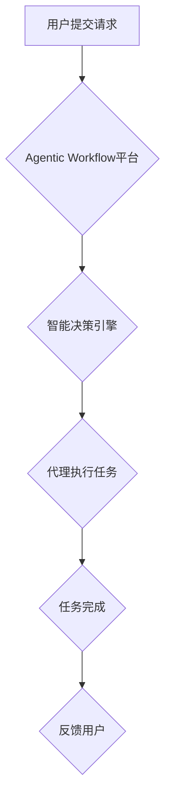

> Agentic Workflow, 用户群体分析, 工作流自动化, AI驱动的工作流, 业务流程优化

## 1. 背景介绍

在当今数字化时代，工作流程自动化已成为企业提高效率、降低成本和增强竞争力的关键驱动力。Agentic Workflow 作为一种新兴的 AI 驱动的工作流自动化平台，旨在通过智能化决策和自动化执行，彻底改变传统工作流程的运作方式。然而，为了确保 Agentic Workflow 的成功应用，深入了解其目标用户群体及其需求至关重要。

本篇文章将深入分析 Agentic Workflow 的用户群体，从不同维度进行细分，并探讨其各自的特点、需求和痛点。通过对用户群体的深入理解，我们能够更好地设计和优化 Agentic Workflow 的功能和体验，使其能够更有效地满足用户需求，并最终实现其在市场上的成功。

## 2. 核心概念与联系

Agentic Workflow 基于人工智能和机器学习技术，构建了一个智能化的工作流自动化平台。其核心概念包括：

* **代理 (Agent):**  Agentic Workflow 中的每个代理都是一个独立的智能实体，能够自主学习、决策和执行任务。代理可以根据预设规则或机器学习模型，自动识别工作流程中的关键节点，并根据实际情况做出最优决策。
* **工作流 (Workflow):**  工作流是指一系列相互关联的任务和步骤，用于完成一个特定的业务目标。Agentic Workflow 可以自动识别和建模各种类型的业务流程，并根据用户需求进行定制化配置。
* **智能决策 (Intelligent Decision):**  Agentic Workflow 利用机器学习算法，从历史数据中学习和分析工作流程中的模式和趋势，从而为代理提供智能化的决策支持。
* **自动化执行 (Automated Execution):**  Agentic Workflow 可以自动执行工作流程中的任务，包括数据处理、文档生成、邮件发送等，从而提高工作效率和准确性。

**Mermaid 流程图:**



## 3. 核心算法原理 & 具体操作步骤

### 3.1  算法原理概述

Agentic Workflow 的核心算法基于深度强化学习 (Deep Reinforcement Learning) 和自然语言处理 (Natural Language Processing) 技术。

* **深度强化学习:**  代理通过与环境交互，学习完成任务的最佳策略。它利用奖励机制，不断调整自己的行为，以最大化奖励并最小化惩罚。
* **自然语言处理:**  Agentic Workflow 可以理解和处理自然语言文本，例如用户请求、工作流程描述等。这使得代理能够更灵活地与用户交互，并根据用户需求进行定制化配置。

### 3.2  算法步骤详解

1. **环境建模:**  Agentic Workflow 将工作流程建模为一个马尔可夫决策过程 (Markov Decision Process)，其中状态表示工作流程的当前状态，动作表示代理可以执行的操作，奖励表示完成任务的程度。
2. **代理训练:**  利用深度强化学习算法，训练代理在模拟环境中学习完成任务的最佳策略。
3. **策略部署:**  训练好的代理策略部署到真实环境中，用于执行工作流程中的任务。
4. **性能评估:**  持续监控代理的执行性能，并根据反馈进行策略调整和优化。

### 3.3  算法优缺点

**优点:**

* **智能化决策:**  代理能够根据实际情况做出最优决策，提高工作流程的效率和准确性。
* **自动化执行:**  代理可以自动执行任务，减少人工干预，提高工作效率。
* **可扩展性:**  Agentic Workflow 可以轻松扩展到处理更复杂的工作流程。

**缺点:**

* **训练成本:**  训练代理需要大量的训练数据和计算资源。
* **解释性:**  深度强化学习模型的决策过程难以解释，这可能导致信任问题。
* **安全风险:**  如果代理被恶意攻击，可能会导致工作流程中断或数据泄露。

### 3.4  算法应用领域

Agentic Workflow 的核心算法可以应用于各种需要自动化和智能化的领域，例如：

* **金融服务:**  自动处理贷款申请、理财投资等业务流程。
* **医疗保健:**  自动处理病历记录、预约挂号等业务流程。
* **制造业:**  自动控制生产线、管理库存等业务流程。
* **电商:**  自动处理订单处理、物流配送等业务流程。

## 4. 数学模型和公式 & 详细讲解 & 举例说明

### 4.1  数学模型构建

Agentic Workflow 的核心算法可以建模为一个马尔可夫决策过程 (MDP)，其中：

* **状态空间 (S):**  工作流程的当前状态，例如任务完成度、资源可用性等。
* **动作空间 (A):**  代理可以执行的操作，例如执行任务、获取信息、请求帮助等。
* **转移概率 (P):**  从一个状态到另一个状态的概率，取决于代理执行的动作。
* **奖励函数 (R):**  代理在某个状态执行某个动作后获得的奖励，反映了完成任务的程度。

### 4.2  公式推导过程

代理的目标是最大化累积奖励，可以使用动态规划算法或强化学习算法求解最优策略。

* **Bellman 方程:**  用于计算状态价值函数，即在某个状态下获得的累积奖励期望。

$$
V(s) = \max_a \sum_{s'} P(s'|s,a) [R(s,a,s') + \gamma V(s')]
$$

其中：

* $V(s)$ 是状态 $s$ 的价值函数。
* $a$ 是代理可以执行的动作。
* $s'$ 是状态 $s$ 执行动作 $a$ 后可能到达的状态。
* $R(s,a,s')$ 是代理在状态 $s$ 执行动作 $a$ 后到达状态 $s'$ 获得的奖励。
* $\gamma$ 是折扣因子，控制未来奖励的权重。

### 4.3  案例分析与讲解

假设一个工作流程包含三个任务：A、B、C。代理需要完成这些任务并获得最大奖励。

* 状态空间：$S = \{s_0, s_1, s_2, s_3\}$, 其中 $s_0$ 表示所有任务未完成，$s_1$ 表示任务 A 完成，$s_2$ 表示任务 A 和 B 完成，$s_3$ 表示所有任务完成。
* 动作空间：$A = \{a_1, a_2, a_3\}$, 其中 $a_1$ 表示执行任务 A，$a_2$ 表示执行任务 B，$a_3$ 表示执行任务 C。
* 转移概率和奖励函数可以根据实际情况设定。

通过 Bellman 方程和强化学习算法，代理可以学习到最优策略，例如先执行任务 A，然后执行任务 B，最后执行任务 C，以获得最大奖励。

## 5. 项目实践：代码实例和详细解释说明

### 5.1  开发环境搭建

Agentic Workflow 可以使用 Python 语言开发，并依赖于 TensorFlow、PyTorch 等深度学习框架。

开发环境搭建步骤：

1. 安装 Python 3.x 及相关依赖库。
2. 安装 TensorFlow 或 PyTorch 深度学习框架。
3. 安装其他必要的库，例如 NumPy、Pandas 等。

### 5.2  源代码详细实现

Agentic Workflow 的核心代码包括：

* **代理类:**  定义代理的结构和行为，包括状态、动作、奖励函数、策略等。
* **环境类:**  模拟工作流程的环境，提供状态、动作、奖励等信息。
* **训练器类:**  负责训练代理，使用强化学习算法优化代理策略。

### 5.3  代码解读与分析

代理类中的 `act()` 方法负责根据当前状态选择动作，并返回执行动作后的状态和奖励。

```python
class Agent:
    def __init__(self, env):
        self.env = env
        # 初始化策略等参数

    def act(self, state):
        # 根据策略选择动作
        action = self.policy(state)
        # 执行动作
        next_state, reward = self.env.step(action)
        # 返回状态和奖励
        return next_state, reward
```

### 5.4  运行结果展示

训练完成后，可以将代理部署到真实环境中，并监控其执行性能。

## 6. 实际应用场景

Agentic Workflow 可以应用于各种实际场景，例如：

* **自动审批流程:**  自动处理员工请假、加班等申请，提高审批效率。
* **智能客服:**  自动回复客户常见问题，提高客户服务效率。
* **数据处理自动化:**  自动处理数据清洗、转换、分析等任务，提高数据处理效率。

### 6.4  未来应用展望

随着人工智能技术的不断发展，Agentic Workflow 将能够应用于更多更复杂的场景，例如：

* **个性化服务:**  根据用户的需求和行为，提供个性化的服务和体验。
* **预测分析:**  利用历史数据预测未来趋势，帮助企业做出更明智的决策。
* **协作工作流:**  支持多个代理协同工作，完成更复杂的任务。

## 7. 工具和资源推荐

### 7.1  学习资源推荐

* **深度强化学习书籍:**  《深度强化学习》 (Deep Reinforcement Learning)
* **在线课程:**  Coursera、edX 等平台上的深度强化学习课程。
* **开源项目:**  OpenAI Gym、TensorFlow Agents 等开源项目。

### 7.2  开发工具推荐

* **Python:**  用于开发 Agentic Workflow 的主要编程语言。
* **TensorFlow/PyTorch:**  用于训练代理的深度学习框架。
* **Docker:**  用于容器化部署 Agentic Workflow。

### 7.3  相关论文推荐

* **Deep Reinforcement Learning: An Overview**
* **Proximal Policy Optimization Algorithms**
* **Asynchronous Methods for Deep Reinforcement Learning**

## 8. 总结：未来发展趋势与挑战

### 8.1  研究成果总结

Agentic Workflow 的研究成果表明，AI 驱动的工作流自动化具有巨大的潜力，能够显著提高工作效率和准确性。

### 8.2  未来发展趋势

未来，Agentic Workflow 将朝着以下方向发展：

* **更智能的决策:**  利用更先进的 AI 算法，提高代理的决策智能和准确性。
* **更广泛的应用场景:**  扩展到更多领域，解决更多实际问题。
* **更易于使用的平台:**  提供更友好的用户界面和更简单的配置方式。

### 8.3  面临的挑战

Agentic Workflow 还面临一些挑战，例如：

* **数据安全:**  确保代理处理的数据安全和隐私。
* **可解释性:**  提高代理决策过程的可解释性，增强用户信任。
* **可扩展性:**  支持处理更大规模、更复杂的工作流程。

### 8.4  研究展望

未来，我们将继续致力于 Agentic Workflow 的研究和开发，努力克服挑战，推动 AI 驱动的工作流自动化技术的发展。

## 9. 附录：常见问题与解答

**常见问题:**

* **Agentic Workflow 如何保证数据安全？**

**解答:**  Agentic Workflow 将采用多种安全措施，例如数据加密、访问控制等，确保数据安全和隐私。

* **Agentic Workflow 的决策过程是否可解释？**

**解答:**  我们正在研究提高代理决策过程可解释性的方法，例如使用可解释机器学习模型。

* **Agentic Workflow 是否可以处理复杂的工作流程？**

**解答:**  Agentic Workflow 可以处理复杂的工作流程，并支持自定义配置。

作者：禅与计算机程序设计艺术 / Zen and the Art of Computer Programming


<end_of_turn>