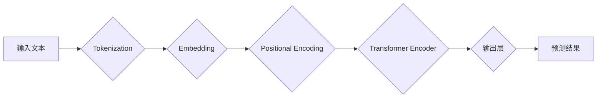

BERT, Transformer, 自然语言处理, 文本理解, 预训练语言模型, 序列标注, 代码实例

## 1. 背景介绍

自然语言处理 (NLP) 领域近年来取得了显著进展，其中预训练语言模型 (PLM) 扮演着越来越重要的角色。BERT (Bidirectional Encoder Representations from Transformers) 是 Google AI 团队于 2018 年提出的一个强大的 PLM，它在许多 NLP 任务中取得了state-of-the-art 的性能，例如文本分类、问答系统、情感分析等。

BERT 的核心创新在于其采用了 Transformer 架构和双向编码机制。传统的语言模型通常采用单向编码，只考虑词语的前后上下文信息，而 BERT 则能够同时考虑词语前后上下文信息，从而更好地理解词语的语义。

## 2. 核心概念与联系

BERT 的核心概念包括 Transformer、双向编码、Masked Language Modeling (MLM) 和 Next Sentence Prediction (NSP)。

**2.1 Transformer 架构**

Transformer 是 BERT 的基础架构，它是一种基于注意力机制的序列到序列模型。Transformer 摒弃了传统的循环神经网络 (RNN) 的顺序处理方式，而是通过注意力机制能够并行处理整个序列，从而提高了训练速度和模型性能。

**2.2 双向编码**

BERT 采用了双向编码机制，这意味着它能够同时考虑词语前后上下文信息。传统的语言模型通常采用单向编码，只考虑词语的前后上下文信息，而 BERT 则能够同时考虑词语前后上下文信息，从而更好地理解词语的语义。

**2.3 Masked Language Modeling (MLM)**

MLM 是 BERT 的预训练任务之一。在 MLM 任务中，BERT 会随机掩盖输入文本中的部分词语，然后预测被掩盖的词语。通过这种方式，BERT 可以学习到词语之间的语义关系和上下文依赖关系。

**2.4 Next Sentence Prediction (NSP)**

NSP 是 BERT 的另一个预训练任务。在 NSP 任务中，BERT 会被输入两个句子，然后预测这两个句子是否相邻。通过这种方式，BERT 可以学习到句子之间的语义关系和逻辑关系。

**2.5 BERT 工作流程**



## 3. 核心算法原理 & 具体操作步骤

### 3.1  算法原理概述

BERT 的核心算法原理是基于 Transformer 架构和双向编码机制。BERT 使用 Transformer Encoder 来处理输入文本，并通过 MLM 和 NSP 两个预训练任务来学习语言表示。

### 3.2  算法步骤详解

1. **Tokenization:** 将输入文本分割成一个个独立的词语或子词，称为 token。
2. **Embedding:** 将每个 token 映射到一个低维向量空间中，称为 embedding。
3. **Positional Encoding:** 为每个 token 添加位置信息，以便 Transformer Encoder 能够理解词语在句子中的顺序。
4. **Transformer Encoder:** 使用 Transformer Encoder 对输入文本进行编码，并生成每个 token 的上下文表示。
5. **输出层:** 根据预训练任务，使用输出层对上下文表示进行分类或预测。

### 3.3  算法优缺点

**优点:**

* **双向编码:** 能够更好地理解词语的语义和上下文关系。
* **Transformer 架构:** 能够并行处理整个序列，提高训练速度和模型性能。
* **预训练:** 预训练模型在大量文本数据上进行训练，能够更好地捕捉语言的复杂性。

**缺点:**

* **计算量大:** BERT 模型参数量较大，训练和推理需要较大的计算资源。
* **数据依赖:** BERT 的性能依赖于训练数据的质量和数量。

### 3.4  算法应用领域

BERT 在许多 NLP 任务中取得了成功，例如：

* 文本分类
* 问答系统
* 情感分析
* 机器翻译
* 语义相似度计算

## 4. 数学模型和公式 & 详细讲解 & 举例说明

### 4.1  数学模型构建

BERT 的数学模型构建基于 Transformer 架构，主要包括以下几个部分：

* **词嵌入层:** 将每个词语映射到一个低维向量空间中。
* **位置编码层:** 为每个词语添加位置信息。
* **多头注意力层:** 学习词语之间的上下文关系。
* **前馈神经网络层:** 对每个词语的上下文表示进行非线性变换。

### 4.2  公式推导过程

BERT 的核心公式是多头注意力机制的计算公式。多头注意力机制可以捕捉不同粒度的上下文信息，从而更好地理解词语的语义。

**注意力机制公式:**

$$
\text{Attention}(Q, K, V) = \text{softmax}\left(\frac{Q K^T}{\sqrt{d_k}}\right) V
$$

其中：

* $Q$ 是查询矩阵
* $K$ 是键矩阵
* $V$ 是值矩阵
* $d_k$ 是键向量的维度
* $\text{softmax}$ 是归一化函数

### 4.3  案例分析与讲解

假设我们有一个句子 "The cat sat on the mat"，BERT 会将每个词语映射到一个低维向量空间中，然后使用多头注意力机制计算每个词语与其他词语之间的注意力权重。例如，对于词语 "cat"，它与词语 "sat" 的注意力权重会比较高，因为它们在语义上相关。

## 5. 项目实践：代码实例和详细解释说明

### 5.1  开发环境搭建

BERT 的开发环境搭建需要以下软件：

* Python 3.6+
* TensorFlow 或 PyTorch
* CUDA 和 cuDNN (可选)

### 5.2  源代码详细实现

BERT 的源代码可以从 Hugging Face 的 Transformers 库中获取。

```python
from transformers import BertTokenizer, BertModel

# 初始化 tokenizer 和模型
tokenizer = BertTokenizer.from_pretrained('bert-base-uncased')
model = BertModel.from_pretrained('bert-base-uncased')

# 对文本进行 tokenization
input_text = "The cat sat on the mat"
tokens = tokenizer.tokenize(input_text)

# 将 token 转换为输入格式
input_ids = tokenizer.convert_tokens_to_ids(tokens)

# 将输入数据送入模型进行预测
outputs = model(input_ids=input_ids)

# 获取模型输出
last_hidden_states = outputs.last_hidden_state
```

### 5.3  代码解读与分析

* `BertTokenizer` 用于将文本转换为 token。
* `BertModel` 用于加载预训练的 BERT 模型。
* `convert_tokens_to_ids` 将 token 转换为模型识别的整数表示。
* `last_hidden_state` 是 BERT 模型输出的最后一个隐藏层状态，它包含了每个词语的上下文表示。

### 5.4  运行结果展示

BERT 模型的输出结果是一个包含每个词语上下文表示的矩阵。我们可以使用这些表示来进行后续的 NLP 任务，例如文本分类、问答系统等。

## 6. 实际应用场景

BERT 在许多实际应用场景中取得了成功，例如：

* **搜索引擎:** BERT 可以用于理解用户搜索意图，从而提高搜索结果的准确性。
* **聊天机器人:** BERT 可以用于训练更智能的聊天机器人，使其能够更好地理解用户对话内容。
* **文本摘要:** BERT 可以用于自动生成文本摘要，提取文本的关键信息。

### 6.4  未来应用展望

BERT 的未来应用前景广阔，例如：

* **多语言理解:** 将 BERT 应用于多语言文本处理，实现跨语言的理解和沟通。
* **代码生成:** 利用 BERT 的文本理解能力，训练代码生成模型，自动生成代码片段。
* **个性化推荐:** 基于用户的阅读历史和偏好，使用 BERT 进行个性化推荐。

## 7. 工具和资源推荐

### 7.1  学习资源推荐

* **BERT 官方论文:** https://arxiv.org/abs/1810.04805
* **Hugging Face Transformers 库:** https://huggingface.co/transformers/
* **Google AI Blog:** https://ai.googleblog.com/

### 7.2  开发工具推荐

* **TensorFlow:** https://www.tensorflow.org/
* **PyTorch:** https://pytorch.org/

### 7.3  相关论文推荐

* **XLNet:** https://arxiv.org/abs/1906.08237
* **RoBERTa:** https://arxiv.org/abs/1907.11692
* **GPT-3:** https://openai.com/blog/gpt-3/

## 8. 总结：未来发展趋势与挑战

### 8.1  研究成果总结

BERT 的提出和应用推动了 NLP 领域的发展，取得了显著的成果。BERT 的双向编码机制和 Transformer 架构为 NLP 模型带来了新的思路和方法。

### 8.2  未来发展趋势

未来，BERT 的发展趋势包括：

* **模型规模的扩大:** 训练更大规模的 BERT 模型，以提高模型性能。
* **多模态理解:** 将 BERT 应用于多模态数据，例如文本、图像、音频等，实现多模态理解。
* **高效训练:** 研究更有效的 BERT 训练方法，降低训练成本。

### 8.3  面临的挑战

BERT 仍然面临一些挑战，例如：

* **数据依赖:** BERT 的性能依赖于训练数据的质量和数量。
* **计算资源:** 训练和推理 BERT 模型需要大量的计算资源。
* **可解释性:** BERT 模型的决策过程难以解释，这限制了其在一些应用场景中的使用。

### 8.4  研究展望

未来，研究者将继续探索 BERT 的应用潜力，并解决其面临的挑战，推动 NLP 领域的发展。

## 9. 附录：常见问题与解答

**Q1: BERT 的训练数据是什么？**

A1: BERT 的训练数据来自 Google 的公开数据集，包括书籍、文章、网页等。

**Q2: BERT 的模型参数量是多少？**

A2: BERT 的模型参数量根据不同的版本而有所不同，例如 BERT-Base 有 1.1 亿个参数，BERT-Large 有 3.3 亿个参数。

**Q3: 如何使用 BERT 进行文本分类？**

A3: 可以将 BERT 的输出结果作为输入，训练一个分类器，例如逻辑回归或支持向量机。

**Q4: BERT 的开源代码在哪里可以找到？**

A4: BERT 的开源代码可以从 Hugging Face 的 Transformers 库中获取。


作者：禅与计算机程序设计艺术 / Zen and the Art of Computer Programming 
<end_of_turn>