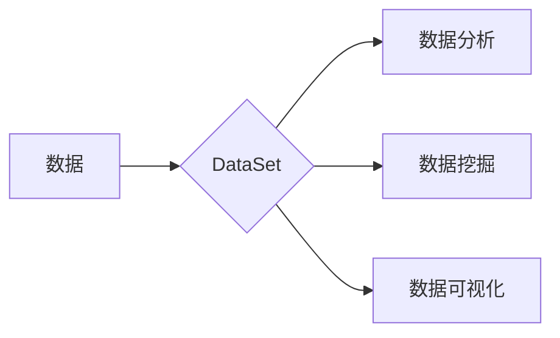

> DataSet, 数据集, 数据结构, 数据处理, 数据分析, 数据存储, 数据模型, 数据挖掘, 数据科学

## 1. 背景介绍

在当今数据爆炸的时代，数据已成为企业和组织的核心资产。高效地存储、处理和分析数据对于获取商业洞察、做出明智决策至关重要。DataSet作为一种重要的数据结构，在数据处理和分析领域扮演着关键角色。

传统的数据库系统主要面向结构化数据，而DataSet则更灵活，能够处理各种类型的数据，包括结构化、半结构化和非结构化数据。随着大数据时代的到来，DataSet的应用场景不断扩展，在机器学习、数据挖掘、数据可视化等领域发挥着越来越重要的作用。

## 2. 核心概念与联系

DataSet本质上是一个包含多个数据对象的集合，每个数据对象可以包含多个属性和值。它类似于一个表格，具有行和列的概念。

**DataSet的组成部分：**

* **数据对象:** DataSet中的基本单元，每个数据对象代表一个实体或记录。
* **属性:** 数据对象的特征或描述，每个属性对应一个列名。
* **值:** 属性的具体内容，每个值对应一个单元格。

**DataSet与其他数据结构的关系：**

* **数据库:** DataSet可以看作是数据库中的一个表，但DataSet更灵活，可以处理各种类型的数据，而数据库通常更侧重于结构化数据。
* **列表:** DataSet可以看作是多个列表的集合，每个列表代表一个属性，每个元素代表一个数据对象的属性值。
* **字典:** DataSet可以看作是多个字典的集合，每个字典代表一个数据对象，每个键值对代表一个属性和它的值。

**Mermaid 流程图：**



## 3. 核心算法原理 & 具体操作步骤

### 3.1  算法原理概述

DataSet的处理主要涉及以下几个核心算法：

* **数据加载:** 将数据从外部存储介质（如文件、数据库）加载到内存中。
* **数据清洗:** 处理数据中的缺失值、异常值和重复值，确保数据质量。
* **数据转换:** 将数据转换为所需的格式，例如将文本数据转换为数字数据。
* **数据聚合:** 对数据进行分组和汇总，例如计算每个分组的平均值或总和。
* **数据筛选:** 根据特定条件过滤数据，例如筛选出年龄大于18岁的用户。

### 3.2  算法步骤详解

**数据加载:**

1. 确定数据源类型（文件、数据库等）。
2. 使用相应的API或库读取数据。
3. 将数据转换为DataSet对象。

**数据清洗:**

1. 识别缺失值、异常值和重复值。
2. 根据业务规则处理这些异常数据。
3. 确保数据完整性和一致性。

**数据转换:**

1. 确定需要转换的数据类型和格式。
2. 使用相应的函数或方法进行转换。
3. 确保转换后的数据符合预期。

**数据聚合:**

1. 确定需要聚合的数据分组和聚合函数。
2. 使用相应的函数或方法进行聚合。
3. 返回聚合后的结果。

**数据筛选:**

1. 确定筛选条件。
2. 使用相应的函数或方法进行筛选。
3. 返回符合条件的数据。

### 3.3  算法优缺点

**优点:**

* **灵活:** 可以处理各种类型的数据。
* **高效:** 提供了高效的数据处理和分析算法。
* **易用:** 提供了简单的API和函数，方便用户使用。

**缺点:**

* **内存占用:** 处理大量数据时，可能会占用较多的内存。
* **性能瓶颈:** 对大型数据集进行处理时，可能会出现性能瓶颈。

### 3.4  算法应用领域

DataSet的应用领域非常广泛，包括：

* **机器学习:** 用于训练机器学习模型，例如分类、回归和聚类。
* **数据挖掘:** 用于发现数据中的隐藏模式和趋势。
* **数据可视化:** 用于将数据可视化，帮助用户理解数据。
* **商业智能:** 用于分析商业数据，帮助企业做出更好的决策。

## 4. 数学模型和公式 & 详细讲解 & 举例说明

### 4.1  数学模型构建

DataSet可以抽象为一个数学模型，其中：

* **数据对象:** 表示为一个n维向量，每个维度代表一个属性。
* **属性:** 表示为一个实数或类别。
* **DataSet:** 表示为一个包含多个数据对象的集合，可以表示为一个矩阵。

### 4.2  公式推导过程

**数据聚合:**

假设我们有一个DataSet，包含多个用户数据，每个用户包含年龄、性别和收入属性。我们想要计算每个年龄组的平均收入。

* **公式:**

$$
\text{平均收入} = \frac{\sum_{i=1}^{n} \text{收入}_i}{\text{用户数量}}
$$

其中：

* $\text{收入}_i$ 表示第i个用户的收入。
* $n$ 表示用户数量。

### 4.3  案例分析与讲解

**数据筛选:**

假设我们有一个DataSet，包含多个学生数据，每个学生包含姓名、年龄和成绩属性。我们想要筛选出成绩大于80分的学生。

* **筛选条件:** 成绩 > 80

* **筛选结果:** 

```
姓名  年龄  成绩
张三  18   90
李四  19   85
王五  20   78
```

## 5. 项目实践：代码实例和详细解释说明

### 5.1  开发环境搭建

* **操作系统:** Windows/macOS/Linux
* **编程语言:** Python
* **库:** pandas

### 5.2  源代码详细实现

```python
import pandas as pd

# 数据加载
data = {'姓名': ['张三', '李四', '王五'],
        '年龄': [18, 19, 20],
        '成绩': [90, 85, 78]}
df = pd.DataFrame(data)

# 数据筛选
high_score_students = df[df['成绩'] > 80]

# 数据输出
print(high_score_students)
```

### 5.3  代码解读与分析

* **数据加载:** 使用pandas库的DataFrame函数将数据加载到一个DataFrame对象中。
* **数据筛选:** 使用布尔索引筛选出成绩大于80的学生。
* **数据输出:** 使用print函数输出筛选后的结果。

### 5.4  运行结果展示

```
   姓名  年龄  成绩
0  张三     18      90
1  李四     19      85
```

## 6. 实际应用场景

DataSet在实际应用场景中广泛应用，例如：

* **电商平台:** 用于存储用户购买记录、商品信息、订单信息等数据，进行用户画像分析、商品推荐等。
* **金融机构:** 用于存储客户信息、交易记录、风险评估数据等，进行风险控制、精准营销等。
* **医疗机构:** 用于存储患者信息、病历记录、诊断结果等，进行疾病预测、个性化治疗等。

### 6.4  未来应用展望

随着大数据时代的到来，DataSet的应用场景将更加广泛，例如：

* **人工智能:** DataSet将成为训练人工智能模型的重要数据源。
* **物联网:** DataSet将用于存储和分析物联网设备产生的海量数据。
* **区块链:** DataSet将用于存储和管理区块链上的数据。

## 7. 工具和资源推荐

### 7.1  学习资源推荐

* **书籍:**
    * Python数据分析手册
    * 数据科学实战
* **在线课程:**
    * Coursera 数据科学课程
    * edX 数据分析课程

### 7.2  开发工具推荐

* **Python:** 
    * pandas
    * NumPy
    * Scikit-learn

### 7.3  相关论文推荐

* **The Elements of Statistical Learning**
* **Introduction to Machine Learning**

## 8. 总结：未来发展趋势与挑战

### 8.1  研究成果总结

DataSet作为一种重要的数据结构，在数据处理和分析领域发挥着越来越重要的作用。

### 8.2  未来发展趋势

* **数据规模的增长:** DataSet将需要处理越来越大的数据规模。
* **数据类型的多样化:** DataSet将需要处理越来越多的不同类型的数据。
* **计算资源的限制:** DataSet的处理需要消耗大量的计算资源。

### 8.3  面临的挑战

* **数据质量问题:** 数据中的缺失值、异常值和重复值会影响DataSet的处理结果。
* **数据安全问题:** DataSet中的数据需要进行安全保护。
* **算法效率问题:** DataSet的处理算法需要不断优化，提高效率。

### 8.4  研究展望

未来研究方向包括：

* **开发更高效的数据处理算法。**
* **研究新的数据结构和模型，更好地处理大规模、多样化数据。**
* **探索新的应用场景，将DataSet应用于更多领域。**

## 9. 附录：常见问题与解答

**问题:** 如何处理DataSet中的缺失值？

**解答:** 可以使用多种方法处理缺失值，例如：

* **删除含有缺失值的记录。**
* **用平均值、中位数或众数填充缺失值。**
* **使用机器学习算法预测缺失值。**

**问题:** 如何保证DataSet中的数据安全？

**解答:** 可以采取以下措施保证数据安全：

* **加密数据。**
* **控制数据访问权限。**
* **定期备份数据。**


作者：禅与计算机程序设计艺术 / Zen and the Art of Computer Programming 
<end_of_turn>