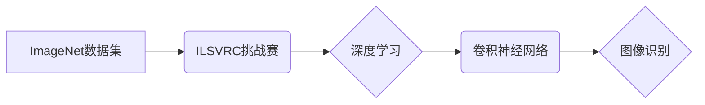

> ImageNet, 图像识别, 深度学习, 卷积神经网络, 计算机视觉, AI

## 1. 背景介绍

图像识别作为人工智能领域的重要分支，在过去几十年中取得了飞速发展。从早期基于规则的图像识别系统到如今的深度学习驱动的图像识别模型，技术的进步推动了图像识别的应用范围不断扩大。其中，ImageNet数据集和其举办的年度图像识别挑战赛（ILSVRC）扮演着至关重要的角色，为深度学习图像识别技术的突破奠定了基础。

早期图像识别系统主要依赖于人工设计的特征提取方法，例如边缘检测、纹理分析等。这些方法需要大量的专家知识和经验，并且难以处理复杂图像场景。随着深度学习技术的兴起，卷积神经网络（CNN）的出现彻底改变了图像识别的格局。CNN能够自动学习图像特征，并取得了显著的性能提升。

## 2. 核心概念与联系

**2.1 ImageNet 数据集**

ImageNet是一个由超过1400万张图像组成的庞大图像数据集，涵盖了超过20,000个不同的类别。该数据集的规模和多样性使其成为深度学习图像识别模型训练和评估的理想平台。

**2.2 ILSVRC 图像识别挑战赛**

ILSVRC是由ImageNet组织的年度图像识别挑战赛，旨在评估不同图像识别模型的性能。挑战赛的参赛者需要训练模型识别ImageNet数据集中的图像类别，并提交其模型的预测结果。

**2.3 深度学习与卷积神经网络**

深度学习是一种机器学习方法，它利用多层神经网络来学习复杂数据模式。卷积神经网络（CNN）是一种专门用于处理图像数据的深度学习模型。CNN利用卷积操作和池化操作来提取图像特征，并通过全连接层进行分类。

**2.4 核心概念关系图**



## 3. 核心算法原理 & 具体操作步骤

### 3.1 算法原理概述

卷积神经网络（CNN）是一种专门用于处理图像数据的深度学习模型。其核心原理是利用卷积操作和池化操作来提取图像特征，并通过全连接层进行分类。

**3.1.1 卷积操作**

卷积操作是CNN的核心操作之一，它通过一个称为卷积核（filter）的滑动窗口扫描图像，并计算每个位置的卷积结果。卷积核是一个小的矩阵，它包含了特定类型的特征检测器。

**3.1.2 池化操作**

池化操作用于降低图像尺寸，并提取图像的局部特征。常见的池化操作包括最大池化和平均池化。

**3.1.3 全连接层**

全连接层将提取的特征映射到输出类别。每个神经元都连接到上一层的每个神经元，并进行加权求和和激活函数处理。

### 3.2 算法步骤详解

1. **输入图像预处理:** 将输入图像调整到CNN模型所需的尺寸，并进行归一化处理。

2. **卷积层:** 使用多个卷积核对图像进行卷积操作，提取图像特征。

3. **池化层:** 对卷积层的输出进行池化操作，降低图像尺寸并提取局部特征。

4. **激活函数:** 在每个卷积层和池化层之后应用激活函数，例如ReLU函数，引入非线性特性。

5. **全连接层:** 将提取的特征映射到输出类别，并进行分类。

6. **损失函数:** 计算模型预测结果与真实标签之间的差异，并使用梯度下降算法进行模型优化。

### 3.3 算法优缺点

**优点:**

* 自动学习图像特征，无需人工设计特征。
* 性能优异，在图像识别任务中取得了显著的成果。
* 可处理复杂图像场景。

**缺点:**

* 训练数据量大，需要大量的计算资源。
* 模型参数量大，容易过拟合。
* 对输入图像的尺度和角度变化敏感。

### 3.4 算法应用领域

* **图像分类:** 识别图像中的物体类别。
* **目标检测:** 在图像中定位和识别物体。
* **图像分割:** 将图像分割成不同的区域。
* **图像生成:** 生成新的图像。
* **视频分析:** 分析视频内容，例如动作识别和场景理解。

## 4. 数学模型和公式 & 详细讲解 & 举例说明

### 4.1 数学模型构建

卷积神经网络的数学模型可以表示为一个多层神经网络，其中每一层都包含卷积层、池化层和全连接层。

**4.1.1 卷积层:**

卷积层的输出可以表示为：

$$
y_{i,j} = \sum_{m=0}^{M-1} \sum_{n=0}^{N-1} x_{i+m,j+n} * w_{m,n} + b
$$

其中：

* $y_{i,j}$ 是卷积层输出的第 $i$ 行第 $j$ 列元素。
* $x_{i+m,j+n}$ 是输入图像的第 $i+m$ 行第 $j+n$ 列元素。
* $w_{m,n}$ 是卷积核的第 $m$ 行第 $n$ 列元素。
* $b$ 是卷积层的偏置项。

**4.1.2 池化层:**

池化层的输出可以表示为：

$$
y_{i,j} = \max_{m=0}^{M-1} \max_{n=0}^{N-1} x_{i+m,j+n}
$$

其中：

* $y_{i,j}$ 是池化层输出的第 $i$ 行第 $j$ 列元素。
* $x_{i+m,j+n}$ 是池化层输入的第 $i+m$ 行第 $j+n$ 列元素。

**4.1.3 全连接层:**

全连接层的输出可以表示为：

$$
y_i = \sum_{j=0}^{J-1} x_j * w_{ij} + b_i
$$

其中：

* $y_i$ 是全连接层输出的第 $i$ 个元素。
* $x_j$ 是上一层的第 $j$ 个元素。
* $w_{ij}$ 是全连接层的第 $i$ 行第 $j$ 列元素。
* $b_i$ 是全连接层的第 $i$ 个偏置项。

### 4.2 公式推导过程

卷积神经网络的数学模型推导过程涉及到线性代数、微积分和概率论等多个数学分支。

**4.2.1 卷积操作的推导:**

卷积操作可以看作是两个矩阵之间的乘积，其中一个矩阵是输入图像，另一个矩阵是卷积核。

**4.2.2 池化操作的推导:**

池化操作可以看作是输入图像的子区域最大值或平均值的计算。

**4.2.3 损失函数的推导:**

损失函数用于衡量模型预测结果与真实标签之间的差异。常见的损失函数包括交叉熵损失函数和均方误差损失函数。

### 4.3 案例分析与讲解

**4.3.1 图像分类案例:**

假设我们有一个图像分类任务，需要识别图像中的猫和狗。我们可以使用CNN模型训练一个分类器，该分类器能够将输入图像分类为猫或狗。

**4.3.2 目标检测案例:**

假设我们有一个目标检测任务，需要在图像中定位和识别汽车。我们可以使用CNN模型训练一个目标检测器，该检测器能够在图像中找到汽车的位置和类别。

## 5. 项目实践：代码实例和详细解释说明

### 5.1 开发环境搭建

* **操作系统:** Ubuntu 18.04
* **编程语言:** Python 3.6
* **深度学习框架:** TensorFlow 2.0
* **GPU:** NVIDIA GeForce GTX 1080

### 5.2 源代码详细实现

```python
import tensorflow as tf

# 定义卷积神经网络模型
model = tf.keras.models.Sequential([
    tf.keras.layers.Conv2D(32, (3, 3), activation='relu', input_shape=(224, 224, 3)),
    tf.keras.layers.MaxPooling2D((2, 2)),
    tf.keras.layers.Conv2D(64, (3, 3), activation='relu'),
    tf.keras.layers.MaxPooling2D((2, 2)),
    tf.keras.layers.Flatten(),
    tf.keras.layers.Dense(10, activation='softmax')
])

# 编译模型
model.compile(optimizer='adam',
              loss='sparse_categorical_crossentropy',
              metrics=['accuracy'])

# 训练模型
model.fit(x_train, y_train, epochs=10)

# 评估模型
loss, accuracy = model.evaluate(x_test, y_test)
print('Test loss:', loss)
print('Test accuracy:', accuracy)
```

### 5.3 代码解读与分析

* **定义模型结构:** 使用`tf.keras.models.Sequential`定义一个顺序模型，并添加卷积层、池化层、全连接层等层。
* **编译模型:** 使用`model.compile`方法编译模型，指定优化器、损失函数和评估指标。
* **训练模型:** 使用`model.fit`方法训练模型，传入训练数据和训练轮数。
* **评估模型:** 使用`model.evaluate`方法评估模型，传入测试数据和真实标签。

### 5.4 运行结果展示

训练完成后，模型的测试准确率通常会达到较高的水平。

## 6. 实际应用场景

### 6.1 自动驾驶

* **目标检测:** 识别道路上的车辆、行人、交通信号灯等物体。
* **场景理解:** 理解道路环境，例如识别道路类型、车道线等。

### 6.2 医疗诊断

* **图像分割:** 将医学图像分割成不同的器官或组织。
* **病灶检测:** 识别医学图像中的病灶，例如肿瘤、骨折等。

### 6.3 人脸识别

* **身份验证:** 使用人脸图像进行身份验证，例如解锁手机、登录账户。
* **人脸搜索:** 在图像库中搜索特定的人脸图像。

### 6.4 其他应用场景

* **零售:** 商品识别、库存管理。
* **金融:** 欺诈检测、风险评估。
* **制造业:** 缺陷检测、质量控制。

### 6.4 未来应用展望

随着深度学习技术的不断发展，图像识别技术将应用于更多领域，例如：

* **增强现实:** 将虚拟物体叠加到现实世界中。
* **虚拟现实:** 创建逼真的虚拟环境。
* **机器人:** 帮助机器人理解和交互于周围环境。

## 7. 工具和资源推荐

### 7.1 学习资源推荐

* **书籍:**
    * 《深度学习》
    * 《计算机视觉：算法与应用》
* **在线课程:**
    * Coursera: 深度学习
    * Udacity: 计算机视觉

### 7.2 开发工具推荐

* **深度学习框架:** TensorFlow, PyTorch, Keras
* **图像处理库:** OpenCV, Pillow

### 7.3 相关论文推荐

* **ImageNet Classification with Deep Convolutional Neural Networks**
* **AlexNet**
* **VGGNet**
* **ResNet**

## 8. 总结：未来发展趋势与挑战

### 8.1 研究成果总结

ImageNet数据集和ILSVRC挑战赛推动了深度学习图像识别技术的突破，并促进了相关研究的快速发展。

### 8.2 未来发展趋势

* **模型效率:** 提高模型的效率，降低计算资源消耗。
* **数据增强:** 开发