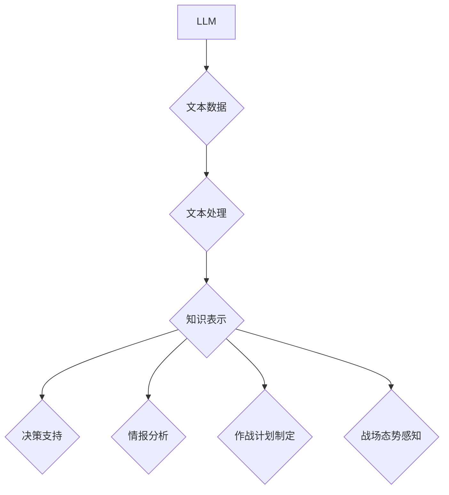

> Large Language Model (LLM), 军事应用, AI,国防, 战略决策, 情报分析, 人工智能伦理

## 1. 背景介绍

近年来，人工智能（AI）技术取得了飞速发展，特别是大型语言模型（LLM）的出现，为军事领域带来了前所未有的机遇和挑战。LLM 拥有强大的文本处理能力，能够理解和生成人类语言，这使其在军事应用中展现出巨大的潜力。从战略决策支持到情报分析，从作战计划制定到战场态势感知，LLM 都可以扮演着重要的角色。

然而，LLM 在军事领域的应用也引发了广泛的伦理和安全担忧。如何确保AI技术的负责任使用，避免其被用于恶意目的，是需要认真思考和解决的关键问题。

## 2. 核心概念与联系

**2.1 LLM概述**

大型语言模型（LLM）是一种基于深度学习的强大人工智能模型，通过训练海量文本数据，能够理解和生成人类语言。LLM 拥有以下关键特征：

* **强大的文本处理能力:** LLM 可以进行文本分类、情感分析、文本摘要、机器翻译等多种任务。
* **上下文理解:** LLM 可以理解文本中的上下文关系，生成更自然、更连贯的文本。
* **知识表示:** LLM 可以将文本信息转化为知识表示，方便进行知识推理和问答。

**2.2 LLM在军事领域的应用**

LLM 在军事领域可以应用于多个方面，例如：

* **战略决策支持:** LLM 可以分析大量军事数据，提供决策支持，帮助指挥官做出更明智的决策。
* **情报分析:** LLM 可以自动分析情报报告，识别关键信息，提高情报分析效率。
* **作战计划制定:** LLM 可以辅助制定作战计划，模拟不同作战场景，评估作战风险。
* **战场态势感知:** LLM 可以分析战场信息，实时感知战场态势，为指挥官提供决策依据。
* **人机交互:** LLM 可以用于开发更智能的人机交互系统，提高士兵的工作效率。

**2.3 核心概念架构**



## 3. 核心算法原理 & 具体操作步骤

**3.1 算法原理概述**

LLM 的核心算法是基于 Transformer 架构的深度神经网络。Transformer 架构能够有效地处理长文本序列，并捕捉文本中的长距离依赖关系。LLM 通过训练海量文本数据，学习语言的语法规则和语义关系，从而能够理解和生成人类语言。

**3.2 算法步骤详解**

1. **数据预处理:** 将文本数据进行清洗、分词、标记等预处理操作，使其能够被模型理解。
2. **模型训练:** 使用 Transformer 架构的深度神经网络，训练模型以预测文本序列的下一个词。
3. **模型评估:** 使用测试数据评估模型的性能，例如困惑度、BLEU 等指标。
4. **模型调优:** 根据评估结果，调整模型参数，提高模型性能。
5. **模型部署:** 将训练好的模型部署到实际应用场景中。

**3.3 算法优缺点**

**优点:**

* 强大的文本处理能力
* 能够理解上下文关系
* 知识表示能力强

**缺点:**

* 训练成本高
* 数据依赖性强
* 容易受到攻击

**3.4 算法应用领域**

LLM 的应用领域非常广泛，除了军事领域外，还包括：

* 自然语言处理
* 机器翻译
* 文本摘要
* 情感分析
* 聊天机器人

## 4. 数学模型和公式 & 详细讲解 & 举例说明

**4.1 数学模型构建**

LLM 的数学模型通常基于 Transformer 架构，其核心是注意力机制。注意力机制能够帮助模型关注文本序列中重要的信息，提高模型的理解能力。

**4.2 公式推导过程**

注意力机制的计算公式如下：

$$
Attention(Q, K, V) = softmax(\frac{QK^T}{\sqrt{d_k}})V
$$

其中：

* $Q$：查询矩阵
* $K$：键矩阵
* $V$：值矩阵
* $d_k$：键向量的维度
* $softmax$：softmax 函数

**4.3 案例分析与讲解**

假设我们有一个句子 "The cat sat on the mat"，我们想要计算 "cat" 这个词对于整个句子的注意力权重。

1. 将句子转换为词嵌入向量。
2. 计算查询向量 $Q$、键向量 $K$ 和值向量 $V$。
3. 计算注意力权重矩阵，其中每个元素代表一个词对于 "cat" 的注意力权重。
4. 将注意力权重矩阵与值向量 $V$ 进行加权求和，得到 "cat" 对整个句子的上下文表示。

## 5. 项目实践：代码实例和详细解释说明

**5.1 开发环境搭建**

* Python 3.7+
* PyTorch 或 TensorFlow
* CUDA 和 cuDNN

**5.2 源代码详细实现**

```python
import torch
import torch.nn as nn

class Transformer(nn.Module):
    def __init__(self, vocab_size, embedding_dim, num_heads, num_layers):
        super(Transformer, self).__init__()
        self.embedding = nn.Embedding(vocab_size, embedding_dim)
        self.transformer_layers = nn.ModuleList([
            nn.TransformerEncoderLayer(embedding_dim, num_heads)
            for _ in range(num_layers)
        ])

    def forward(self, x):
        x = self.embedding(x)
        for layer in self.transformer_layers:
            x = layer(x)
        return x
```

**5.3 代码解读与分析**

* `Transformer` 类定义了一个 Transformer 模型。
* `embedding` 层将词索引转换为词嵌入向量。
* `transformer_layers` 是一个列表，包含多个 Transformer Encoder Layer。
* `forward` 方法定义了模型的正向传播过程。

**5.4 运行结果展示**

训练好的模型可以用于各种自然语言处理任务，例如文本分类、机器翻译等。

## 6. 实际应用场景

**6.1 情报分析**

LLM 可以自动分析大量情报报告，识别关键信息，例如敌方动向、军事部署等，帮助情报人员更快地掌握战场信息。

**6.2 作战计划制定**

LLM 可以辅助制定作战计划，模拟不同作战场景，评估作战风险，帮助指挥官做出更明智的决策。

**6.3 人机交互**

LLM 可以用于开发更智能的人机交互系统，例如语音助手、聊天机器人，提高士兵的工作效率。

**6.4 未来应用展望**

随着LLM技术的不断发展，其在军事领域的应用将更加广泛和深入，例如：

* 自动化作战
* 虚拟现实训练
* 预测性维护

## 7. 工具和资源推荐

**7.1 学习资源推荐**

* **论文:** "Attention Is All You Need"
* **书籍:** "Deep Learning"
* **在线课程:** Coursera, edX

**7.2 开发工具推荐**

* **PyTorch:** https://pytorch.org/
* **TensorFlow:** https://www.tensorflow.org/

**7.3 相关论文推荐**

* "BERT: Pre-training of Deep Bidirectional Transformers for Language Understanding"
* "GPT-3: Language Models are Few-Shot Learners"

## 8. 总结：未来发展趋势与挑战

**8.1 研究成果总结**

LLM 在军事领域的应用取得了显著进展，为军事决策支持、情报分析、作战计划制定等方面提供了新的技术手段。

**8.2 未来发展趋势**

* 模型规模和性能将继续提升
* 应用场景将更加广泛和深入
* 伦理和安全问题将得到更加重视

**8.3 面临的挑战**

* 数据安全和隐私保护
* 模型可解释性和透明度
* 算法的鲁棒性和安全性

**8.4 研究展望**

未来研究将重点关注以下几个方面：

* 开发更安全、更可靠的LLM模型
* 探索LLM在军事领域的更多应用场景
* 制定LLM在军事领域的伦理规范和使用指南

## 9. 附录：常见问题与解答

**9.1 如何确保LLM在军事领域的负责任使用？**

* 建立严格的伦理规范和使用指南
* 加强模型安全性和隐私保护
* 确保模型的可解释性和透明度
* 促进多方合作，共同探讨LLM在军事领域的应用伦理问题

**9.2 如何应对LLM在军事领域的潜在风险？**

* 加强模型安全性和鲁棒性测试
* 开发对抗攻击和防御机制
* 提高人类对LLM的理解和控制能力
* 建立有效的监管机制，防止LLM被用于恶意目的


作者：禅与计算机程序设计艺术 / Zen and the Art of Computer Programming 
<end_of_turn>