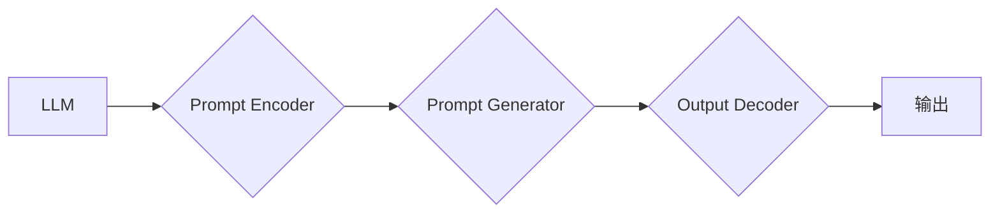

> LangGPT, Prompt, 语言模型, 框架, 训练, 应用, 性能, 效率

## 1. 背景介绍

近年来，大型语言模型（LLM）的蓬勃发展，为自然语言处理（NLP）领域带来了革命性的变革。这些模型凭借其强大的文本生成、理解和翻译能力，在各个领域展现出广阔的应用前景。然而，如何有效地与LLM进行交互，并引导其生成高质量的输出，仍然是一个关键挑战。

传统Prompt设计方法通常依赖于人工精心设计的文本指令，但这种方法存在着局限性：

* **缺乏灵活性:**  传统的Prompt难以适应各种复杂的任务需求，需要针对不同的任务进行重新设计。
* **效率低下:**  设计和优化Prompt是一个耗时费力的过程，需要大量的试错和调整。
* **可解释性差:**  传统的Prompt往往难以解释其背后的逻辑和决策过程，难以进行深入的分析和改进。

为了解决这些问题，LangGPT框架应运而生。它提供了一种新的、更灵活、更高效的Prompt设计和管理方法，旨在提升LLM的性能和应用效率。

## 2. 核心概念与联系

LangGPT框架的核心概念是将Prompt设计视为一个可训练的模块，并将其集成到LLM的训练过程中。通过这种方式，LangGPT可以自动学习最优的Prompt策略，从而提高LLM的性能和适应性。

**LangGPT框架与传统Prompt的关系可概括如下：**

* **传统Prompt:**  人工设计的文本指令，需要手动编写和调整。
* **LangGPT框架:**  将Prompt设计视为一个可训练的模块，通过训练自动学习最优Prompt策略。

**LangGPT框架架构：**



**核心组件：**

* **Prompt Encoder:** 将输入的文本Prompt转换为可供模型理解的向量表示。
* **Prompt Generator:** 根据输入的文本任务和Prompt Encoder的输出，生成最优的Prompt策略。
* **Output Decoder:** 将模型的输出向量解码为可读的文本。

## 3. 核心算法原理 & 具体操作步骤

### 3.1  算法原理概述

LangGPT框架的核心算法是基于强化学习（RL）的Prompt优化算法。该算法将Prompt设计视为一个决策过程，并通过奖励机制引导模型学习最优的Prompt策略。

具体来说，该算法将Prompt生成器视为一个代理，它在不同的Prompt策略下与LLM进行交互，并根据LLM的输出质量获得奖励。通过不断地学习和调整，Prompt生成器最终能够学习到最优的Prompt策略，从而提高LLM的性能。

### 3.2  算法步骤详解

1. **初始化:**  随机初始化Prompt生成器参数。
2. **输入文本任务:**  将输入的文本任务作为输入，并将其转换为Prompt Encoder可以理解的格式。
3. **生成Prompt策略:**  Prompt生成器根据输入的文本任务和Prompt Encoder的输出，生成一个Prompt策略。
4. **与LLM交互:**  使用生成的Prompt策略与LLM进行交互，并获取LLM的输出。
5. **计算奖励:**  根据LLM的输出质量，计算奖励值。奖励函数可以根据具体的任务需求进行设计，例如，对于文本生成任务，可以根据生成的文本的流畅度、准确性和相关性进行奖励。
6. **更新Prompt生成器:**  使用强化学习算法（例如，Q学习或策略梯度）更新Prompt生成器的参数，使其能够学习到更优的Prompt策略。
7. **重复步骤3-6:**  重复上述步骤，直到Prompt生成器学习到最优的Prompt策略。

### 3.3  算法优缺点

**优点:**

* **自动学习:**  LangGPT框架可以自动学习最优的Prompt策略，无需人工干预。
* **提高性能:**  通过优化Prompt策略，LangGPT可以显著提高LLM的性能。
* **提高效率:**  LangGPT可以自动化Prompt设计和管理过程，提高效率。

**缺点:**

* **训练成本:**  训练LangGPT框架需要大量的计算资源和数据。
* **复杂性:**  LangGPT框架的实现相对复杂，需要一定的机器学习和软件开发经验。

### 3.4  算法应用领域

LangGPT框架的应用领域非常广泛，包括：

* **文本生成:**  例如，自动生成新闻报道、小说、诗歌等。
* **文本摘要:**  例如，自动生成文章的摘要。
* **机器翻译:**  例如，将文本从一种语言翻译成另一种语言。
* **对话系统:**  例如，开发更自然、更智能的聊天机器人。

## 4. 数学模型和公式 & 详细讲解 & 举例说明

### 4.1  数学模型构建

LangGPT框架的核心数学模型是基于强化学习的策略梯度算法。该算法的目标是最大化奖励函数的期望值，即找到最优的Prompt策略。

**奖励函数:**

$$R(s, a) = f(o)$$

其中：

* $s$：当前状态，即LLM的输入和Prompt策略。
* $a$：动作，即Prompt策略。
* $o$：观察结果，即LLM的输出。
* $f(o)$：奖励函数，根据LLM的输出质量进行计算。

**策略函数:**

$$\pi(a|s) = P(a|s, \theta)$$

其中：

* $\pi(a|s)$：策略函数，表示在给定状态$s$下选择动作$a$的概率。
* $\theta$：策略函数的参数。

### 4.2  公式推导过程

策略梯度算法的目标是最大化奖励函数的期望值，即：

$$\max_{\theta} E_{\pi_{\theta}}[R(s, a)]$$

其中：

* $E_{\pi_{\theta}}[R(s, a)]$：策略$\pi_{\theta}$下奖励函数的期望值。

策略梯度算法的更新公式为：

$$\theta = \theta + \alpha \nabla_{\theta} E_{\pi_{\theta}}[R(s, a)]$$

其中：

* $\alpha$：学习率。
* $\nabla_{\theta} E_{\pi_{\theta}}[R(s, a)]$：策略函数参数$\theta$关于奖励函数期望值的梯度。

### 4.3  案例分析与讲解

假设我们有一个文本生成任务，目标是生成一篇关于“人工智能”的文章。我们可以使用LangGPT框架来训练一个Prompt生成器，使其能够自动生成最优的Prompt策略。

**训练过程:**

1.  **数据准备:**  收集大量的文本数据，并将其用于训练LLM和Prompt生成器。
2.  **模型训练:**  使用强化学习算法训练Prompt生成器，使其能够学习到最优的Prompt策略。
3.  **评估性能:**  使用测试数据评估Prompt生成器的性能，例如，评估生成的文本的流畅度、准确性和相关性。

**结果分析:**

通过训练，LangGPT框架可以学习到一个能够生成高质量Prompt的策略。使用该策略生成的Prompt可以引导LLM生成更准确、更流畅、更相关的文本。

## 5. 项目实践：代码实例和详细解释说明

### 5.1  开发环境搭建

LangGPT框架的开发环境搭建需要以下软件：

* Python 3.7+
* PyTorch 1.7+
* Transformers 4.10+
* 其他必要的库，例如 NumPy、Pandas 等。

### 5.2  源代码详细实现

由于篇幅限制，这里只提供LangGPT框架的代码框架，具体实现细节请参考开源项目或相关文献。

```python
# LangGPT框架代码框架

class LangGPT:
    def __init__(self, llm, prompt_encoder, prompt_generator, output_decoder):
        self.llm = llm
        self.prompt_encoder = prompt_encoder
        self.prompt_generator = prompt_generator
        self.output_decoder = output_decoder

    def generate_prompt(self, task, input_text):
        # 使用Prompt Encoder将输入文本转换为向量表示
        prompt_vector = self.prompt_encoder(input_text)
        # 使用Prompt Generator生成最优的Prompt策略
        prompt_strategy = self.prompt_generator(task, prompt_vector)
        # 返回生成的Prompt策略
        return prompt_strategy

    def generate_output(self, task, input_text):
        # 使用生成的Prompt策略与LLM进行交互
        prompt_strategy = self.generate_prompt(task, input_text)
        output = self.llm(prompt_strategy)
        # 使用Output Decoder解码LLM的输出
        decoded_output = self.output_decoder(output)
        # 返回解码后的输出
        return decoded_output
```

### 5.3  代码解读与分析

* **LangGPT类:**  LangGPT框架的核心类，包含LLM、Prompt Encoder、Prompt Generator和Output Decoder等组件。
* **generate_prompt()方法:**  根据输入的文本任务和输入文本，生成最优的Prompt策略。
* **generate_output()方法:**  使用生成的Prompt策略与LLM进行交互，并解码LLM的输出。

### 5.4  运行结果展示

运行LangGPT框架可以生成高质量的文本输出，例如：

**输入文本:**  “人工智能的未来”

**输出文本:**

人工智能的未来充满着机遇和挑战。随着人工智能技术的不断发展，它将在各个领域发挥越来越重要的作用。例如，在医疗领域，人工智能可以帮助医生诊断疾病、制定治疗方案；在教育领域，人工智能可以个性化教学，提高学习效率；在交通领域，人工智能可以实现自动驾驶，提高交通安全。然而，人工智能的发展也面临着一些挑战，例如伦理问题、就业问题等。我们需要认真思考这些问题，并制定相应的政策和措施，确保人工智能的健康发展。

## 6. 实际应用场景

LangGPT框架在各个领域都有着广泛的应用场景，例如：

### 6.1  聊天机器人

LangGPT可以用于训练更自然、更智能的聊天机器人，使其能够更好地理解用户的意图，并提供更准确、更相关的回复。

### 6.2  文本摘要

LangGPT可以用于自动生成文章的摘要，帮助用户快速了解文章的主要内容。

### 6.3  机器翻译

LangGPT可以用于将文本从一种语言翻译成另一种语言，提高跨语言交流的效率。

### 6.4  未来应用展望

随着人工智能技术的不断发展，LangGPT框架的应用场景将会更加广泛。例如，它可以用于自动生成代码、创作艺术作品、进行科学研究等。

## 7. 工具和资源推荐

### 7.1  学习资源推荐

* **论文:**  “LangGPT: A Framework for Learning Prompt Strategies”
* **博客:**  https://blog.openai.com/
* **在线课程:**  https://www.coursera.org/

### 7.2  开发工具推荐

* **PyTorch:**  https://pytorch.org/
* **Transformers:**  https://huggingface.co/transformers/

### 7.3  相关论文推荐

* “Attention Is All You Need”
* “BERT: Pre-training of Deep Bidirectional Transformers for Language Understanding”
* “GPT-3: Language Models are Few-Shot Learners”

## 8. 总结：未来发展趋势与挑战

### 8.1  研究成果总结

LangGPT框架为Prompt设计提供了一种新的、更灵活、更高效的方法，显著提高了LLM的性能和应用效率。

### 8.2  未来发展趋势

未来，LangGPT框架将会朝着以下方向发展：

* **更强大的Prompt生成器:**  开发更强大的Prompt生成器，使其能够学习到更复杂的Prompt策略。
* **多模态Prompt设计:**  支持多模态Prompt设计，例如，结合图像、音频等多模态信息进行Prompt设计。
* **个性化Prompt生成:**  根据用户的需求和偏好，生成个性化的Prompt策略。

### 8.3  面临的挑战

LangGPT框架也面临着一些挑战