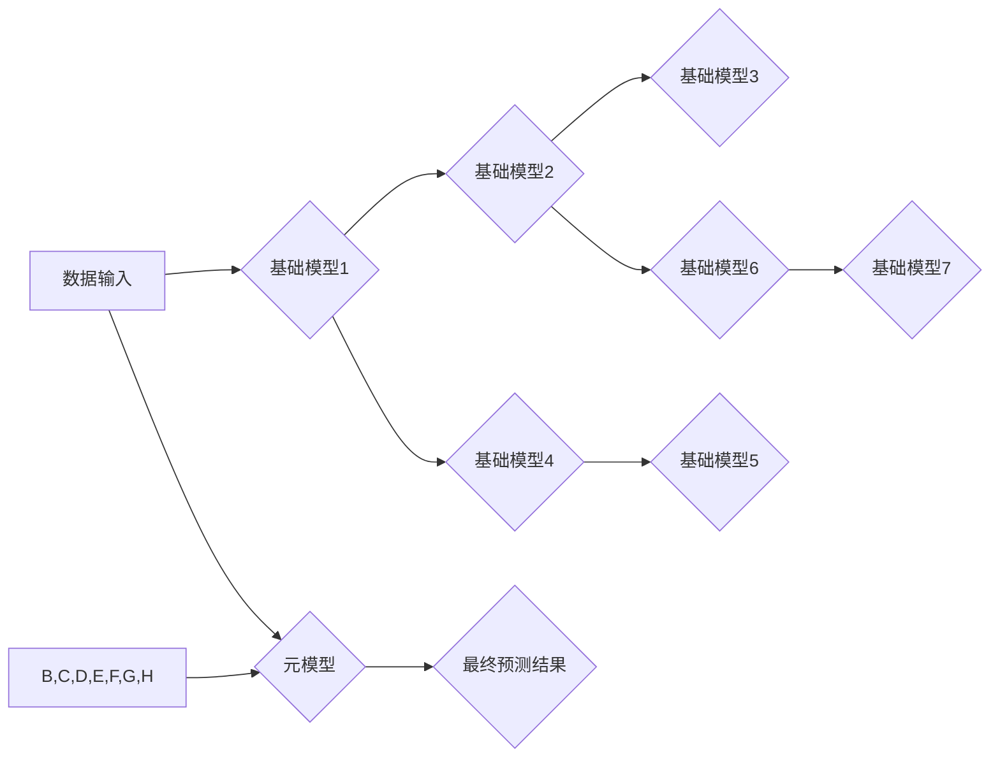

> 机器学习，Stacking，Blending，集成学习，模型性能，Python

## 1. 背景介绍

在机器学习领域，模型性能提升一直是研究者和开发者的核心目标。单一模型往往存在局限性，难以兼顾所有方面的表现。集成学习作为一种强大的机器学习技术，通过结合多个模型的预测结果，可以显著提高模型的准确性、鲁棒性和泛化能力。

Stacking和Blending是两种常用的集成学习方法，它们通过不同的方式组合多个模型，以获得更优的预测结果。Stacking通过训练一个“元模型”来学习各个基础模型的输出，而Blending则直接对基础模型的输出进行加权平均。

本篇文章将深入探讨Stacking和Blending的原理、算法步骤、数学模型以及实际应用场景。通过Python代码实例，我们将演示如何使用这些集成学习方法提高机器学习模型的性能。

## 2. 核心概念与联系

**2.1 Stacking**

Stacking，又称Stacked Generalization，是一种级联式集成学习方法。其核心思想是将多个基础模型的输出作为新的特征输入到一个“元模型”中进行训练。元模型学习如何从基础模型的输出中提取有价值的信息，最终生成最终的预测结果。

**2.2 Blending**

Blending，又称Bagging，是一种并行式集成学习方法。其核心思想是将多个基础模型的预测结果进行加权平均，以获得最终的预测结果。每个基础模型的权重可以根据其在训练集上的表现进行调整。

**2.3 Stacking与Blending的联系与区别**

Stacking和Blending都是集成学习方法，但它们在模型组合方式和训练策略上有所不同。

* **模型组合方式:** Stacking将基础模型的输出作为新的特征输入到元模型中，而Blending则直接对基础模型的输出进行加权平均。
* **训练策略:** Stacking需要训练一个元模型，而Blending只需要训练多个基础模型。

**2.4  流程图**



## 3. 核心算法原理 & 具体操作步骤

### 3.1  算法原理概述

Stacking和Blending的算法原理都基于以下核心思想：

* **多样性:** 使用不同的基础模型，可以捕捉到不同类型的特征和模式。
* **组合:** 通过组合多个模型的预测结果，可以降低模型的方差和偏差，提高模型的整体性能。

### 3.2  算法步骤详解

**3.2.1 Stacking**

1. **训练基础模型:** 使用不同的算法和参数组合训练多个基础模型。
2. **生成训练集:** 使用基础模型对训练集进行预测，并将预测结果作为新的特征输入到元模型中。
3. **训练元模型:** 使用元模型训练集训练一个新的模型，例如逻辑回归或支持向量机。
4. **预测:** 使用训练好的元模型对新的数据进行预测。

**3.2.2 Blending**

1. **训练基础模型:** 使用不同的算法和参数组合训练多个基础模型。
2. **生成预测集:** 使用基础模型对测试集进行预测，并将预测结果作为新的特征输入到Blending模型中。
3. **训练Blending模型:** 使用Blending模型训练集训练一个新的模型，例如线性回归或决策树。
4. **预测:** 使用训练好的Blending模型对新的数据进行预测。

### 3.3  算法优缺点

**3.3.1 Stacking**

* **优点:** 
    * 可以充分利用不同基础模型的优势。
    * 能够学习到更复杂的决策边界。
* **缺点:** 
    * 训练时间较长，需要训练多个模型和一个元模型。
    * 容易过拟合，需要进行适当的正则化。

**3.3.2 Blending**

* **优点:** 
    * 训练时间相对较短，只需要训练多个基础模型。
    * 容易实现，代码实现简单。
* **缺点:** 
    * 无法充分利用不同基础模型的优势。
    * 决策边界可能相对简单。

### 3.4  算法应用领域

Stacking和Blending在各种机器学习领域都有广泛的应用，例如：

* **图像识别:** 使用不同的卷积神经网络模型进行图像分类和目标检测。
* **自然语言处理:** 使用不同的深度学习模型进行文本分类、情感分析和机器翻译。
* **金融预测:** 使用不同的回归模型进行股票价格预测和信用风险评估。

## 4. 数学模型和公式 & 详细讲解 & 举例说明

### 4.1  数学模型构建

**4.1.1 Stacking**

假设我们有N个基础模型，每个模型的预测结果为$y_i$，其中$i=1,2,...,N$。Stacking的目标是学习一个元模型$f$，该模型能够从基础模型的输出中学习到有价值的信息，并生成最终的预测结果$\hat{y}$。

元模型的输入为基础模型的输出向量$[y_1, y_2, ..., y_N]$，输出为最终的预测结果$\hat{y}$。

**4.1.2 Blending**

Blending的目标是学习一个权重向量$w$，该向量能够对基础模型的输出进行加权平均，以获得最终的预测结果$\hat{y}$。

权重向量$w$的每个元素$w_i$代表基础模型$i$的权重，其中$i=1,2,...,N$。

### 4.2  公式推导过程

**4.2.1 Stacking**

元模型的损失函数可以定义为基础模型预测结果与真实值之间的差异。常用的损失函数包括均方误差（MSE）和交叉熵损失（Cross-Entropy Loss）。

**4.2.2 Blending**

Blending模型的损失函数可以定义为基础模型预测结果与真实值之间的差异。常用的损失函数包括均方误差（MSE）和交叉熵损失（Cross-Entropy Loss）。

### 4.3  案例分析与讲解

**4.3.1 Stacking案例分析**

假设我们使用Stacking方法进行图像分类任务，训练了三个基础模型：

* 模型1：AlexNet
* 模型2：VGG16
* 模型3：ResNet50

我们将三个模型的输出作为新的特征输入到一个逻辑回归模型中进行训练，作为元模型。

**4.3.2 Blending案例分析**

假设我们使用Blending方法进行股票价格预测任务，训练了五个基础模型：

* 模型1：线性回归
* 模型2：支持向量机
* 模型3：随机森林
* 模型4：梯度提升树
* 模型5：神经网络

我们将五个模型的预测结果进行加权平均，作为最终的预测结果。

## 5. 项目实践：代码实例和详细解释说明

### 5.1  开发环境搭建

本项目使用Python3.7环境，并安装以下库：

* scikit-learn
* pandas
* numpy
* matplotlib
* seaborn

### 5.2  源代码详细实现

```python
# 导入必要的库
import pandas as pd
from sklearn.model_selection import train_test_split
from sklearn.linear_model import LogisticRegression
from sklearn.ensemble import RandomForestClassifier
from sklearn.svm import SVC
from sklearn.metrics import accuracy_score

# 加载数据
data = pd.read_csv('data.csv')

# 分割特征和目标变量
X = data.drop('target', axis=1)
y = data['target']

# 将数据进行训练集和测试集划分
X_train, X_test, y_train, y_test = train_test_split(X, y, test_size=0.2, random_state=42)

# 训练基础模型
model1 = LogisticRegression()
model2 = RandomForestClassifier()
model3 = SVC()

model1.fit(X_train, y_train)
model2.fit(X_train, y_train)
model3.fit(X_train, y_train)

# 生成基础模型的预测结果
y_pred1 = model1.predict(X_test)
y_pred2 = model2.predict(X_test)
y_pred3 = model3.predict(X_test)

# 将基础模型的预测结果作为新的特征输入到元模型中
X_meta = pd.DataFrame({'model1': y_pred1, 'model2': y_pred2, 'model3': y_pred3})

# 训练元模型
meta_model = LogisticRegression()
meta_model.fit(X_meta, y_test)

# 使用元模型进行预测
y_pred_meta = meta_model.predict(X_meta)

# 计算模型性能
accuracy = accuracy_score(y_test, y_pred_meta)
print(f'模型性能: {accuracy}')
```

### 5.3  代码解读与分析

* **数据加载和预处理:** 代码首先加载数据，并将其分割成特征和目标变量。然后，将数据进行训练集和测试集划分。
* **基础模型训练:** 代码训练了三个基础模型：逻辑回归、随机森林和支持向量机。
* **基础模型预测:** 代码使用训练好的基础模型对测试集进行预测，并将预测结果存储在变量中。
* **元模型训练:** 代码将基础模型的预测结果作为新的特征输入到元模型中进行训练。
* **元模型预测:** 代码使用训练好的元模型对测试集进行预测，并将预测结果存储在变量中。
* **模型性能评估:** 代码使用准确率作为模型性能指标，并打印出模型的准确率。

### 5.4  运行结果展示

运行代码后，将输出模型的准确率。

## 6. 实际应用场景

Stacking和Blending在各种机器学习领域都有广泛的应用，例如：

* **图像识别:** 使用不同的卷积神经网络模型进行图像分类和目标检测。
* **自然语言处理:** 使用不同的深度学习模型进行文本分类、情感分析和机器翻译。
* **金融预测:** 使用不同的回归模型进行股票价格预测和信用风险评估。

### 6.4  未来应用展望

随着机器学习技术的不断发展，Stacking和Blending将有更广泛的应用场景。例如：

* **自动机器学习:** Stacking和Blending可以用于自动选择最佳模型组合，提高机器学习模型的自动化程度。
* **多模态学习:** Stacking和Blending可以用于融合不同模态的数据，例如文本、图像和音频，提高模型的泛化能力。
* **联邦学习:** Stacking和Blending可以用于联邦学习场景，提高模型的隐私保护能力。

## 7. 工具和资源推荐

### 7.1  学习资源推荐

* **书籍:**
    * 《Python机器学习实战》
    * 《Hands-On Machine Learning with Scikit-Learn, Keras & TensorFlow》
* **在线课程:**
    * Coursera: Machine Learning
    * edX: Introduction to Artificial Intelligence
* **博客:**
    * Towards Data Science
    * Machine Learning Mastery

### 7.2  开发工具推荐

* **Python:** Python是一种流行的编程语言，广泛用于机器学习开发。
* **scikit-learn:** scikit-learn是一个强大的机器学习库，提供各种算法和工具。
* **TensorFlow:** TensorFlow是一个开源的机器学习框架，支持深度学习。
* **Keras:** Keras是一个高层深度学习框架，易