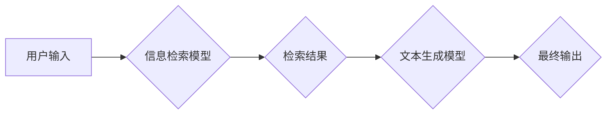

> RAG,Retrieval Augmented Generation, AI应用,知识图谱,自然语言处理,信息检索

## 1. 背景介绍

近年来，人工智能（AI）技术取得了飞速发展，特别是自然语言处理（NLP）领域取得了突破性进展。大型语言模型（LLM）的出现，例如GPT-3、LaMDA等，展现出强大的文本生成能力，能够完成各种自然语言任务，如文本摘要、机器翻译、对话系统等。然而，LLM的知识储备主要来自其训练数据，缺乏对外部知识的访问和更新机制，这限制了其在某些领域的应用，例如需要访问特定领域专业知识或最新信息的任务。

为了解决这个问题，Retrieval Augmented Generation（RAG）技术应运而生。RAG是一种将外部知识源与LLM相结合的生成式AI方法。它通过检索相关知识并将其与LLM的生成过程相融合，从而增强LLM的知识能力、准确性和可靠性。

## 2. 核心概念与联系

RAG的核心思想是将信息检索（IR）与文本生成相结合。它包含以下关键组件：

* **知识库:** RAG系统需要一个包含丰富知识的知识库，例如维基百科、专业数据库、公司内部文档等。
* **信息检索模型:** 用于从知识库中检索与用户查询相关的文档或信息片段。
* **文本生成模型:** 用于根据检索到的信息和用户输入生成文本。
* **融合机制:** 用于将检索到的信息与文本生成模型的输出进行融合，生成更准确、更全面的文本。

**RAG架构流程图:**



## 3. 核心算法原理 & 具体操作步骤

### 3.1  算法原理概述

RAG的算法原理主要基于以下几个方面：

* **信息检索:** 使用传统的IR算法，例如TF-IDF、BM25等，从知识库中检索与用户查询相关的文档或信息片段。
* **文本嵌入:** 将文本转换为向量表示，以便于进行相似度计算和信息检索。常用的文本嵌入方法包括Word2Vec、GloVe、BERT等。
* **文本融合:** 将检索到的信息与文本生成模型的输出进行融合，可以使用多种方法，例如拼接、注意力机制等。

### 3.2  算法步骤详解

RAG的具体操作步骤如下：

1. **用户输入:** 用户输入一个自然语言查询。
2. **信息检索:** 使用信息检索模型从知识库中检索与用户查询相关的文档或信息片段。
3. **文本嵌入:** 将用户查询和检索到的信息片段转换为向量表示。
4. **相似度计算:** 计算用户查询与检索到的信息片段之间的相似度。
5. **结果排序:** 根据相似度排序检索结果，选择最相关的文档或信息片段。
6. **文本融合:** 将检索到的信息片段与文本生成模型的输出进行融合，生成最终的文本。

### 3.3  算法优缺点

**优点:**

* **增强知识能力:** RAG可以访问外部知识库，增强LLM的知识储备和准确性。
* **提高可靠性:** RAG可以利用多个知识源进行验证，提高文本生成的可靠性。
* **支持最新信息:** RAG可以访问最新的知识库，支持对最新信息的处理。

**缺点:**

* **检索效率:** 信息检索过程可能比较耗时，影响整体响应速度。
* **信息质量:** 知识库的质量直接影响RAG系统的性能，需要保证知识库的准确性和完整性。
* **融合机制:** 如何有效地融合检索到的信息与文本生成模型的输出是一个挑战。

### 3.4  算法应用领域

RAG技术在多个领域具有广泛的应用前景，例如：

* **问答系统:** RAG可以构建更智能、更准确的问答系统，能够回答更复杂、更具挑战性的问题。
* **对话系统:** RAG可以增强对话系统的知识能力和自然语言理解能力，使对话更自然、更人性化。
* **文本摘要:** RAG可以利用外部知识进行文本摘要，生成更准确、更全面的摘要。
* **机器翻译:** RAG可以利用外部知识进行机器翻译，提高翻译的准确性和流畅度。

## 4. 数学模型和公式 & 详细讲解 & 举例说明

### 4.1  数学模型构建

RAG系统中，信息检索模型通常使用基于向量空间的模型，例如TF-IDF或BM25。这些模型将文本转换为向量表示，并使用余弦相似度计算文本之间的相似度。

**TF-IDF:**

TF-IDF (Term Frequency-Inverse Document Frequency) 是一个常用的文本特征提取方法，用于衡量一个词语在某个文档中的重要性。

* **TF (Term Frequency):** 词语在文档中出现的频率。
* **IDF (Inverse Document Frequency):** 词语在整个语料库中出现的频率的倒数。

TF-IDF 值计算公式：

$$TF-IDF(t, d) = TF(t, d) \times IDF(t)$$

其中：

* $t$ 是一个词语
* $d$ 是一个文档
* $TF(t, d)$ 是词语 $t$ 在文档 $d$ 中出现的频率
* $IDF(t)$ 是词语 $t$ 在整个语料库中出现的频率的倒数

**BM25:**

BM25 (Best Matching 25) 是一个改进的TF-IDF算法，考虑了文档长度和词语在文档中的位置信息。

BM25 公式：

$$BM25(t, d) = \frac{(k_1 + 1) \times TF(t, d)}{TF(t, d) + k_1 \times (1 - b + b \times \frac{length(d)}{average\_length})} \times IDF(t)$$

其中：

* $k_1$ 和 $k_2$ 是两个参数，用于控制词语频率和文档长度的影响
* $b$ 是一个参数，用于控制文档长度的影响
* $length(d)$ 是文档 $d$ 的长度
* $average\_length$ 是语料库中文档的平均长度

### 4.2  公式推导过程

TF-IDF 和 BM25 的公式推导过程比较复杂，涉及到概率论、信息论等数学知识。

### 4.3  案例分析与讲解

假设我们有一个知识库包含关于动物的文档，用户输入查询 "猫的特征"。

使用 TF-IDF 或 BM25 算法，可以从知识库中检索到与 "猫的特征" 相关的文档，例如 "猫的毛发颜色"、"猫的体型"、"猫的性格" 等。

然后，RAG系统将这些检索到的信息与文本生成模型的输出进行融合，生成最终的文本，例如：

"猫是一种常见的宠物动物，其特征包括：毛发颜色多样，体型中等，性格独立、好奇。"

## 5. 项目实践：代码实例和详细解释说明

### 5.1  开发环境搭建

* Python 3.7+
* PyTorch 或 TensorFlow
* NLTK、SpaCy 等 NLP 库
* Faiss 或 Annoy 等高效信息检索库

### 5.2  源代码详细实现

```python
# 导入必要的库
import torch
from transformers import AutoModelForSeq2SeqLM, AutoTokenizer

# 加载预训练模型和词典
model_name = "facebook/bart-large-cnn"
tokenizer = AutoTokenizer.from_pretrained(model_name)
model = AutoModelForSeq2SeqLM.from_pretrained(model_name)

# 定义 RAG 系统的检索函数
def retrieve_information(query, knowledge_base):
    # 使用信息检索模型从知识库中检索相关信息
    # ...
    return retrieved_information

# 定义 RAG 系统的文本生成函数
def generate_text(query, retrieved_information):
    # 将检索到的信息与用户查询进行融合
    # 使用文本生成模型生成文本
    # ...
    return generated_text

# 示例用法
query = "猫的特征"
retrieved_information = retrieve_information(query, knowledge_base)
generated_text = generate_text(query, retrieved_information)
print(generated_text)
```

### 5.3  代码解读与分析

* 代码首先导入必要的库，并加载预训练的文本生成模型和词典。
* 然后定义了两个函数：`retrieve_information` 用于从知识库中检索相关信息，`generate_text` 用于根据检索到的信息生成文本。
* 最后，示例用法演示了如何使用 RAG 系统回答用户查询。

### 5.4  运行结果展示

运行上述代码，将输出关于 "猫的特征" 的文本，例如：

"猫是一种常见的宠物动物，其特征包括：毛发颜色多样，体型中等，性格独立、好奇。"

## 6. 实际应用场景

RAG技术在多个实际应用场景中展现出强大的潜力，例如：

* **智能客服:** RAG可以帮助客服机器人理解用户问题，并从知识库中检索到相关答案，提供更准确、更有效的服务。
* **个性化教育:** RAG可以根据学生的学习情况和知识水平，从知识库中检索到个性化的学习内容，提供更有效的学习体验。
* **科学研究:** RAG可以帮助科学家快速检索相关文献和数据，加速科研进度。

### 6.4  未来应用展望

随着人工智能技术的不断发展，RAG技术将有更广泛的应用前景，例如：

* **多模态RAG:** 将文本、图像、音频等多模态信息融合到RAG系统中，实现更全面的知识理解和信息检索。
* **联邦学习RAG:** 将RAG技术应用于联邦学习场景，保护用户隐私的同时实现知识共享。
* **可解释性RAG:** 研究RAG系统的决策过程，提高其可解释性和透明度。

## 7. 工具和资源推荐

### 7.1  学习资源推荐

* **论文:**
    * "Retrieval Augmented Generation for Text Summarization"
    * "RAG: Retrieval Augmented Generation for Open-Domain Question Answering"
* **博客:**
    * https://huggingface.co/blog/rag
    * https://www.deeplearning.ai/blog/retrieval-augmented-generation/

### 7.2  开发工具推荐

* **Faiss:** https://github.com/facebookresearch/faiss
* **Annoy:** https://github.com/spotify/annoy
* **Transformers:** https://huggingface.co/transformers/

### 7.3  相关论文推荐

* "BERT: Pre-training of Deep Bidirectional Transformers for Language Understanding"
* "XLNet: Generalized Autoregressive Pretraining for Language Understanding"
* "T5: Text-to-Text Transfer Transformer"

## 8. 总结：未来发展趋势与挑战

### 8.1  研究成果总结

RAG技术在近年来取得了显著进展，成功地将信息检索与文本生成相结合，增强了LLM的知识能力和应用潜力。

### 8.2  未来发展趋势

未来，RAG技术将朝着以下方向发展：

* **多模态RAG:** 将文本、图像、音频等多模态信息融合到RAG系统中，实现更全面的知识理解和信息检索。
* **联邦学习RAG:** 将RAG技术应用于联邦学习场景，保护用户隐私的同时实现知识共享。
* **可解释性RAG:** 研究RAG系统的决策过程，提高其可解释性和透明度。

### 8.3  面临的挑战

RAG技术也面临着一些挑战，例如：

* **信息质量:** 知识库的质量直接影响RAG系统的性能，需要保证知识库的准确性和完整性。
* **检索效率:** 信息检索过程可能比较耗时，影响整体响应速度。
* **融合机制:** 如何有效地融合检索到的信息与文本生成模型的输出是一个挑战。

### 8.4  研究展望

未来，需要进一步研究如何提高RAG系统的效率、准确性和可解释性，使其能够更好地服务于各种应用场景。

## 9. 附录：常见问题与解答

* **Q1: RAG 和 LLM 的区别是什么？**

* **A1:** LLM 是指大型语言模型，主要通过训练大量的文本数据来学习语言模式和生成文本。RAG