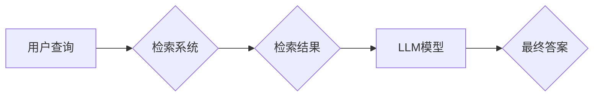

> RAG, LangChain, 检索式生成, 知识图谱, 问题回答, 挑战, 优化

## 1. 背景介绍

近年来，大语言模型（LLM）的快速发展，如GPT-3、LaMDA等，为自然语言处理（NLP）领域带来了革命性的变革。这些模型展现出惊人的文本生成、翻译、摘要等能力，但同时也面临着一些关键挑战。其中之一就是缺乏对外部知识的有效利用。

传统的LLM模型主要依赖于训练数据中的知识，当面对超出训练数据范围的问题时，往往会给出不准确或无意义的答案。为了解决这个问题，检索式生成（Retrieval Augmented Generation，RAG）技术应运而生。RAG技术将外部知识库与LLM模型相结合，通过检索相关信息来辅助模型生成更准确、更全面的答案。

## 2. 核心概念与联系

RAG技术的核心思想是将LLM模型与一个知识库相结合，通过检索相关信息来增强模型的知识储备和推理能力。

**核心概念：**

* **LLM模型:**  大语言模型，例如GPT-3、LaMDA等，能够理解和生成人类语言。
* **知识库:**  包含大量结构化或非结构化知识的数据库，例如维基百科、知识图谱等。
* **检索系统:**  负责从知识库中检索与用户查询相关的文档或实体。
* **融合模块:**  将检索到的信息与LLM模型的输出进行融合，生成最终的答案。

**架构图:**



## 3. 核心算法原理 & 具体操作步骤

### 3.1  算法原理概述

RAG技术的核心算法主要包括以下几个步骤：

1. **用户查询处理:** 将用户的自然语言查询转换为模型可理解的格式，例如关键词提取、实体识别等。
2. **知识库检索:** 根据处理后的查询，从知识库中检索出与之相关的文档或实体。
3. **信息融合:** 将检索到的信息与LLM模型的输出进行融合，生成最终的答案。

### 3.2  算法步骤详解

1. **用户查询处理:**

   * **关键词提取:** 从用户查询中提取出关键的关键词，作为检索的依据。
   * **实体识别:** 识别出用户查询中的实体，例如人名、地名、机构名等，并将其转换为模型可识别的格式。
   * **语义分析:** 对用户查询进行语义分析，理解其意图和上下文，以便更好地进行信息检索和融合。

2. **知识库检索:**

   * **向量化检索:** 将用户查询和知识库中的文档或实体转换为向量，使用余弦相似度等算法进行检索。
   * **关键词匹配:** 将用户查询中的关键词与知识库中的文档标题、摘要等进行匹配，找到相关的文档。
   * **规则匹配:** 使用预定义的规则，例如实体关系、时间关系等，从知识库中检索出符合条件的信息。

3. **信息融合:**

   * **文本拼接:** 将检索到的信息与LLM模型的输出进行拼接，生成最终的答案。
   * **摘要生成:** 使用LLM模型生成一个简洁的摘要，概括检索到的信息和LLM模型的输出。
   * **问答生成:** 使用LLM模型生成一个完整的问答，回答用户的查询问题。

### 3.3  算法优缺点

**优点:**

* **知识增强:** RAG技术可以有效地利用外部知识库，增强LLM模型的知识储备和推理能力。
* **准确性提升:** 通过检索相关信息，RAG技术可以帮助LLM模型生成更准确、更全面的答案。
* **可扩展性强:** RAG技术可以与各种类型的知识库和LLM模型相结合，具有良好的可扩展性。

**缺点:**

* **检索效率:** 对于大型知识库，检索效率可能是一个挑战。
* **信息融合:** 如何有效地融合检索到的信息和LLM模型的输出是一个复杂的问题。
* **数据质量:** RAG技术的性能依赖于知识库的质量，如果知识库存在错误或不完整的信息，会影响RAG技术的性能。

### 3.4  算法应用领域

RAG技术在许多领域都有广泛的应用，例如：

* **问答系统:** RAG技术可以用于构建更智能、更准确的问答系统，例如搜索引擎、客服机器人等。
* **文本摘要:** RAG技术可以用于生成更准确、更全面的文本摘要，例如新闻报道、学术论文等。
* **知识图谱构建:** RAG技术可以用于从文本数据中构建知识图谱，例如人物关系、事件关系等。
* **代码生成:** RAG技术可以用于生成更准确、更符合语法的代码，例如代码补全、代码生成等。

## 4. 数学模型和公式 & 详细讲解 & 举例说明

### 4.1  数学模型构建

RAG技术的核心数学模型是基于向量空间的检索模型。

**向量化表示:** 将用户查询和知识库中的文档或实体转换为向量，可以使用词嵌入技术，例如Word2Vec、GloVe等，将单词映射到一个低维向量空间中。

**相似度计算:** 使用余弦相似度等算法计算用户查询向量与知识库向量之间的相似度，找到最相关的文档或实体。

**公式:**

$$
\text{相似度} = \frac{\mathbf{q} \cdot \mathbf{d}}{\|\mathbf{q}\| \|\mathbf{d}\|}
$$

其中：

* $\mathbf{q}$ 是用户查询向量
* $\mathbf{d}$ 是知识库文档向量
* $\cdot$ 表示向量点积
* $\|\mathbf{q}\|$ 和 $\|\mathbf{d}\|$ 分别表示向量 $\mathbf{q}$ 和 $\mathbf{d}$ 的长度

### 4.2  公式推导过程

余弦相似度公式的推导过程如下：

1. 向量点积：向量点积可以衡量两个向量的方向相关性。
2. 向量长度：向量长度可以衡量向量的“大小”。
3. 归一化：将向量点积除以两个向量的长度，可以得到一个介于-1到1之间的值，表示两个向量的夹角大小。

### 4.3  案例分析与讲解

假设用户查询为“苹果公司”，知识库中包含以下文档：

* 文档1：关于苹果公司的历史
* 文档2：关于苹果公司的产品
* 文档3：关于苹果公司的财务报表

使用词嵌入技术将用户查询和文档向量化，计算其之间的余弦相似度，可以得到以下结果：

* 文档1 与用户查询的相似度：0.8
* 文档2 与用户查询的相似度：0.7
* 文档3 与用户查询的相似度：0.5

根据相似度排序，可以将文档1作为最相关的文档，用于回答用户的查询。

## 5. 项目实践：代码实例和详细解释说明

### 5.1  开发环境搭建

* Python 3.7+
* LangChain 0.0.20+
* Transformers 4.10+
* Faiss 1.7.0+

### 5.2  源代码详细实现

```python
from langchain.chains import RetrievalQA
from langchain.llms import OpenAI
from langchain.document_loaders import TextLoader
from langchain.vectorstores import FAISS
from langchain.embeddings import OpenAIEmbeddings

# 加载知识库
documents = TextLoader("knowledge_base.txt").load()

# 创建向量嵌入模型
embeddings = OpenAIEmbeddings()

# 创建 FAISS 向量存储
vectorstore = FAISS.from_documents(documents, embeddings)

# 创建 OpenAI LLM 模型
llm = OpenAI(temperature=0)

# 创建 RetrievalQA 链
qa_chain = RetrievalQA.from_chain_type(llm=llm, chain_type="stuff", retriever=vectorstore.as_retriever())

# 用户查询
query = "苹果公司成立于何时？"

# 获取答案
answer = qa_chain.run(query)

# 打印答案
print(answer)
```

### 5.3  代码解读与分析

* **加载知识库:** 使用 TextLoader 加载知识库文件。
* **创建向量嵌入模型:** 使用 OpenAIEmbeddings 创建向量嵌入模型，将文本转换为向量。
* **创建 FAISS 向量存储:** 使用 FAISS 创建向量存储，将嵌入后的文本存储起来。
* **创建 OpenAI LLM 模型:** 使用 OpenAI 创建 LLM 模型，用于生成答案。
* **创建 RetrievalQA 链:** 使用 RetrievalQA 创建链，将 LLM 模型和向量存储连接起来。
* **用户查询:** 输入用户查询。
* **获取答案:** 使用 RetrievalQA 链运行用户查询，获取答案。
* **打印答案:** 打印生成的答案。

### 5.4  运行结果展示

```
苹果公司成立于 1976 年。
```

## 6. 实际应用场景

RAG技术在许多实际应用场景中发挥着重要作用，例如：

* **智能客服:** RAG技术可以帮助客服机器人理解用户的查询，并提供更准确、更全面的答案。
* **搜索引擎:** RAG技术可以帮助搜索引擎更好地理解用户的搜索意图，并返回更相关的结果。
* **教育领域:** RAG技术可以用于构建智能学习助手，帮助学生查找相关信息、解答问题、完成作业。

### 6.4  未来应用展望

随着LLM模型和知识库的不断发展，RAG技术的应用场景将更加广泛，例如：

* **个性化推荐:** RAG技术可以根据用户的兴趣和偏好，推荐更相关的商品、服务或内容。
* **医疗诊断:** RAG技术可以帮助医生更快、更准确地诊断疾病。
* **法律研究:** RAG技术可以帮助律师更快、更准确地查找法律法规和案例。

## 7. 工具和资源推荐

### 7.1  学习资源推荐

* **LangChain 官方文档:** https://python.langchain.com/docs/
* **HuggingFace Transformers:** https://huggingface.co/docs/transformers/index
* **FAISS 官方文档:** https://github.com/facebookresearch/faiss

### 7.2  开发工具推荐

* **Python:** https://www.python.org/
* **Jupyter Notebook:** https://jupyter.org/

### 7.3  相关论文推荐

* **Retrieval Augmented Generation for Question Answering:** https://arxiv.org/abs/2109.09613
* **RAG: Retrieval Augmented Generation for Text Summarization:** https://arxiv.org/abs/2204.04537

## 8. 总结：未来发展趋势与挑战

### 8.1  研究成果总结

RAG技术在近年来取得了显著的进展，能够有效地利用外部知识库，提升LLM模型的性能。

### 8.2  未来发展趋势

* **多模态RAG:** 将文本、图像、音频等多模态信息整合到RAG系统中，提升系统的理解和生成能力。
* **动态知识更新:** 实现对知识库的动态更新，使RAG系统能够及时获取最新的信息。
* **可解释性增强:** 提高RAG系统的可解释性，使用户能够更好地理解系统的决策过程。

### 8.3  面临的挑战

* **知识库质量:** RAG系统的性能依赖于知识库的质量，如何构建高质量的知识库仍然是一个挑战。
* **检索效率:** 对于大型知识库，检索效率仍然是一个瓶颈问题。
* **信息融合:** 如何有效地融合检索到的信息和LLM模型的输出是一个复杂的问题。

### 8.4  研究展望

未来，RAG技术将继续朝着更智能、更强大、更可解释的方向发展，在更多领域发挥重要作用。


## 9. 附录：常见问题与解答

**Q1: RAG技术与传统LLM模型相比有什么优势？**

**A1:** RAG技术可以有效地利用外部知识库，提升LL