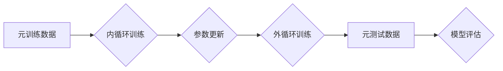

> 元学习，迁移学习，强化学习，深度学习，算法原理，实践应用，未来趋势

## 1. 背景介绍

在人工智能领域，模型的泛化能力和适应新任务的能力一直是研究的热点。传统的机器学习方法需要针对每个具体任务进行大量的数据标注和模型训练，这在时间和资源上都存在着巨大的成本。元学习（Meta-Learning）应运而生，它旨在学习如何学习，从而提高模型在面对新任务时的快速适应能力。

元学习的核心思想是通过学习一系列任务的学习策略，从而能够快速地适应新的、未见过的任务。就像人类学习一样，我们通过学习过去的经验，能够更快地掌握新的知识和技能。元学习的目标是将这种学习能力迁移到机器学习模型中。

## 2. 核心概念与联系

元学习的核心概念包括：

* **内循环（Inner Loop）：** 针对单个任务进行模型训练的过程。
* **外循环（Outer Loop）：** 针对多个任务进行模型参数更新的过程。
* **元训练数据（Meta-Training Data）：** 包含多个任务及其对应的训练数据和测试数据的集合。
* **元测试数据（Meta-Testing Data）：** 包含从未在元训练阶段见过的任务及其对应的测试数据。

**元学习流程图:**



## 3. 核心算法原理 & 具体操作步骤

### 3.1  算法原理概述

元学习算法的核心思想是通过学习一个通用的学习策略，从而能够快速地适应新的任务。常见的元学习算法包括：

* **Model-Agnostic Meta-Learning (MAML):** 通过在元训练阶段学习模型参数的初始值，使得模型能够快速地适应新的任务。
* **Prototypical Networks:** 通过学习每个类别的原型，从而能够快速地对新的数据进行分类。
* **Matching Networks:** 通过学习一个匹配函数，从而能够快速地对新的数据进行检索。

### 3.2  算法步骤详解

以MAML算法为例，其具体操作步骤如下：

1. **初始化模型参数:** 为模型参数赋予初始值。
2. **元训练阶段:**
    * 从元训练数据中随机抽取一个任务。
    * 对该任务进行内循环训练，即在该任务的训练数据上进行模型训练，并更新模型参数。
    * 计算模型在该任务上的损失函数值。
    * 根据损失函数值更新模型参数。
3. **元测试阶段:**
    * 从元测试数据中随机抽取一个任务。
    * 使用元训练阶段学习到的模型参数进行初始化。
    * 对该任务进行内循环训练，并计算模型在该任务上的损失函数值。
    * 根据损失函数值评估模型的性能。

### 3.3  算法优缺点

**优点:**

* 能够快速地适应新的任务。
* 能够利用少量的训练数据进行学习。

**缺点:**

* 元训练数据需要包含多个任务，这在某些情况下可能难以获得。
* 模型参数更新的策略需要仔细设计。

### 3.4  算法应用领域

元学习算法在以下领域具有广泛的应用前景:

* **自然语言处理:** 文本分类、机器翻译、问答系统等。
* **计算机视觉:** 图像识别、目标检测、图像分割等。
* **机器人学:** 运动规划、任务学习、适应性控制等。

## 4. 数学模型和公式 & 详细讲解 & 举例说明

### 4.1  数学模型构建

MAML算法的目标是学习一个模型参数的初始值，使得模型能够快速地适应新的任务。假设我们有N个任务，每个任务包含训练数据和测试数据。

* **任务:**  $T_i$
* **训练数据:** $D_i^{train}$
* **测试数据:** $D_i^{test}$
* **模型参数:** $\theta$

MAML算法的目标函数是：

$$
L(\theta) = \frac{1}{N} \sum_{i=1}^{N} L_i(\theta)
$$

其中，$L_i(\theta)$是模型在第i个任务上的损失函数值。

### 4.2  公式推导过程

MAML算法通过梯度下降法来优化模型参数。具体来说，算法会先对每个任务进行内循环训练，然后根据内循环训练的结果更新模型参数。

**内循环训练:**

$$
\theta_i^{new} = \theta_i - \alpha \nabla_{\theta_i} L_i(\theta_i)
$$

其中，$\alpha$是学习率。

**外循环训练:**

$$
\theta = \theta - \beta \nabla_{\theta} L(\theta)
$$

其中，$\beta$是学习率。

### 4.3  案例分析与讲解

假设我们有一个图像分类任务，需要对猫和狗进行分类。我们可以使用MAML算法来学习一个通用的分类策略。

1. **元训练阶段:** 我们从一个包含多个猫和狗图像的元训练数据中随机抽取一些任务。每个任务包含一些猫和狗图像，用于训练模型。
2. **元测试阶段:** 我们从一个包含从未见过的猫和狗图像的元测试数据中随机抽取一些任务。使用元训练阶段学习到的模型参数进行初始化，然后对这些任务进行内循环训练，并评估模型的性能。

通过元学习，模型能够在元测试阶段快速地适应新的任务，并达到较高的分类精度。

## 5. 项目实践：代码实例和详细解释说明

### 5.1  开发环境搭建

* Python 3.6+
* TensorFlow 2.0+
* PyTorch 1.0+

### 5.2  源代码详细实现

```python
import tensorflow as tf

# 定义MAML模型
class MAMLModel(tf.keras.Model):
    def __init__(self, input_shape, num_classes):
        super(MAMLModel, self).__init__()
        self.layers = tf.keras.Sequential([
            tf.keras.layers.Flatten(input_shape=input_shape),
            tf.keras.layers.Dense(128, activation='relu'),
            tf.keras.layers.Dense(num_classes, activation='softmax')
        ])

    def call(self, x):
        return self.layers(x)

# 定义元学习训练函数
def meta_train(model, optimizer, meta_train_data, epochs=10):
    for epoch in range(epochs):
        for task in meta_train_data:
            # 内循环训练
            for step in range(5):
                # 随机抽取训练数据
                batch_data = task['train_data']
                # 计算损失函数
                with tf.GradientTape() as tape:
                    predictions = model(batch_data)
                    loss = tf.keras.losses.categorical_crossentropy(task['train_labels'], predictions)
                # 更新模型参数
                gradients = tape.gradient(loss, model.trainable_variables)
                optimizer.apply_gradients(zip(gradients, model.trainable_variables))
            # 外循环训练
            # 计算损失函数
            with tf.GradientTape() as tape:
                predictions = model(task['test_data'])
                loss = tf.keras.losses.categorical_crossentropy(task['test_labels'], predictions)
            # 更新模型参数
            gradients = tape.gradient(loss, model.trainable_variables)
            optimizer.apply_gradients(zip(gradients, model.trainable_variables))

# 加载元训练数据
meta_train_data = ...

# 创建模型
model = MAMLModel(input_shape=(28, 28), num_classes=10)

# 创建优化器
optimizer = tf.keras.optimizers.Adam(learning_rate=0.001)

# 元学习训练
meta_train(model, optimizer, meta_train_data)

```

### 5.3  代码解读与分析

* **MAMLModel类:** 定义了MAML模型的结构，包括输入层、隐藏层和输出层。
* **meta_train函数:** 定义了元学习训练过程，包括内循环训练和外循环训练。
* **元训练数据:** 包含多个任务及其对应的训练数据和测试数据。
* **模型参数:** 包括模型层的权重和偏置。
* **优化器:** 用于更新模型参数。

### 5.4  运行结果展示

运行代码后，可以观察到模型在元测试阶段的性能提升。

## 6. 实际应用场景

元学习算法在以下领域具有广泛的应用前景:

* **个性化推荐:** 根据用户的历史行为，学习用户的偏好，并推荐个性化的商品或服务。
* **医疗诊断:** 学习医生诊断的经验，并辅助医生进行疾病诊断。
* **金融风险管理:** 学习金融市场的波动规律，并预测金融风险。

### 6.4  未来应用展望

随着元学习算法的不断发展，其应用场景将会更加广泛。未来，元学习算法可能会被应用于以下领域:

* **自动驾驶:** 学习驾驶员的驾驶习惯，并辅助自动驾驶系统进行决策。
* **机器人学习:** 学习机器人执行任务的策略，并提高机器人的适应性。
* **人工智能安全:** 学习攻击者的攻击策略，并提高人工智能系统的安全性能。

## 7. 工具和资源推荐

### 7.1  学习资源推荐

* **书籍:**
    * 《Meta-Learning with Neural Networks》 by Timothy Hospedales
    * 《Deep Learning》 by Ian Goodfellow
* **论文:**
    * 《Model-Agnostic Meta-Learning for Fast Adaptation of Deep Networks》 by Finn et al.
    * 《Prototypical Networks for Few-Shot Learning》 by Snell et al.
* **在线课程:**
    * Coursera: Deep Learning Specialization
    * Udacity: Machine Learning Engineer Nanodegree

### 7.2  开发工具推荐

* **TensorFlow:** 开源深度学习框架
* **PyTorch:** 开源深度学习框架
* **Keras:** 高级深度学习API

### 7.3  相关论文推荐

* 《Meta-Learning with Differentiable Convex Optimization》 by Wang et al.
* 《Learning to Learn by Gradient Descent by Gradient Descent》 by Andrychowicz et al.
* 《Matching Networks for One Shot Learning》 by Vinyals et al.

## 8. 总结：未来发展趋势与挑战

### 8.1  研究成果总结

元学习算法取得了显著的进展，在少样本学习、快速适应新任务等方面展现出强大的潜力。

### 8.2  未来发展趋势

* **理论研究:** 深入研究元学习算法的理论基础，例如学习策略的泛化能力、算法的收敛性等。
* **算法创新:** 开发新的元学习算法，例如基于强化学习的元学习算法、基于图神经网络的元学习算法等。
* **应用拓展:** 将元学习算法应用于更多领域，例如自动驾驶、机器人学习、医疗诊断等。

### 8.3  面临的挑战

* **数据需求:** 元学习算法需要大量的元训练数据，这在某些情况下可能难以获得。
* **计算资源:** 元学习算法的训练过程通常需要大量的计算资源。
* **算法解释性:** 元学习算法的决策过程往往难以解释，这可能会影响其在安全关键应用中的应用。

### 8.4  研究展望

元学习算法作为人工智能领域的一个重要方向，未来将继续受到广泛关注和研究。随着理论研究的深入和算法的不断创新，元学习算法有望在更多领域发挥重要作用，推动人工智能技术的进步。

## 9. 附录：常见问题与解答

* **什么是元学习？**

元学习是指学习如何学习的机器学习方法。它旨在学习一个通用的学习策略，从而能够快速地适应新的任务。

* **元学习算法有哪些？**

常见的元学习算法包括MAML、Prototypical Networks、Matching Networks等。

* **元