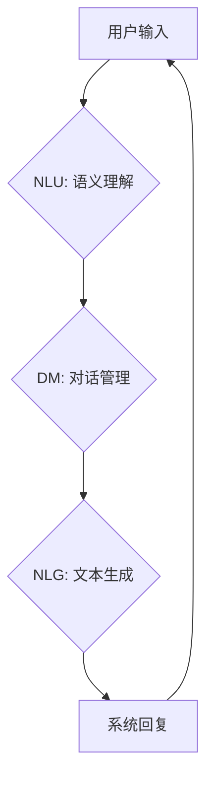

> 自然语言处理，深度强化学习，DQN，对话系统，映射，策略

## 1. 背景介绍

自然语言处理（NLP）领域近年来取得了显著进展，特别是深度学习技术的应用，使得对话系统能够更自然、更智能地与人类交互。然而，构建一个能够理解复杂语义、进行流畅对话的对话系统仍然是一个巨大的挑战。

深度强化学习（Deep Reinforcement Learning，DRL）作为一种新兴的机器学习方法，在解决复杂决策问题方面展现出强大的潜力。DQN（Deep Q-Network）算法作为DRL领域的重要代表，通过深度神经网络学习策略，并通过Q值函数评估不同动作的价值，从而实现智能决策。

将DQN应用于自然对话系统，可以使对话系统具备更强的学习能力和适应性。通过学习用户历史对话和上下文信息，DQN可以预测用户下一个可能的意图，并选择最合适的回复，从而实现更自然、更流畅的对话体验。

## 2. 核心概念与联系

### 2.1 自然对话系统

自然对话系统旨在模拟人类与机器之间的自然语言交互。它需要具备以下核心能力：

* **自然语言理解 (NLU)：** 能够理解用户输入的自然语言，提取语义信息。
* **对话管理 (DM)：** 能够管理对话流程，跟踪对话上下文，并做出合适的回复。
* **自然语言生成 (NLG)：** 能够生成自然流畅的文本回复。

### 2.2 深度强化学习

深度强化学习是一种基于模型学习的机器学习方法，它通过强化学习的原理，结合深度神经网络，学习智能决策策略。

* **强化学习 (RL)：** 强化学习是一种基于奖励机制的学习方法，智能体通过与环境交互，获得奖励或惩罚，并根据奖励信号调整行为策略，最终达到最大化奖励的目标。
* **深度神经网络 (DNN)：** 深度神经网络是一种能够学习复杂非线性映射的强大模型，它可以用于表示和处理各种类型的数据，包括文本、图像、音频等。

### 2.3 DQN算法

DQN算法是一种基于深度神经网络的强化学习算法，它通过学习Q值函数，评估不同状态下不同动作的价值，从而选择最优动作。

* **Q值函数：** Q值函数是一个映射函数，它将状态-动作对映射到一个数值，表示执行该动作在该状态下的期望回报。
* **深度神经网络：** DQN算法使用深度神经网络来逼近Q值函数，通过训练神经网络，学习出最优的Q值函数。

### 2.4 DQN与自然对话系统

将DQN应用于自然对话系统，可以将对话系统视为一个强化学习环境。

* **状态：** 对话系统的当前状态，包括用户历史对话、对话上下文等信息。
* **动作：** 对话系统可以执行的动作，例如生成回复、提问、切换话题等。
* **奖励：** 用户对对话系统的评价，例如满意度、流畅度等。

通过学习用户历史对话和上下文信息，DQN可以预测用户下一个可能的意图，并选择最合适的回复，从而实现更自然、更流畅的对话体验。



## 3. 核心算法原理 & 具体操作步骤

### 3.1 算法原理概述

DQN算法的核心思想是通过学习Q值函数，评估不同状态下不同动作的价值，从而选择最优动作。

Q值函数是一个映射函数，它将状态-动作对映射到一个数值，表示执行该动作在该状态下的期望回报。

DQN算法使用深度神经网络来逼近Q值函数，通过训练神经网络，学习出最优的Q值函数。

### 3.2 算法步骤详解

1. **初始化Q值网络：** 使用随机初始化深度神经网络，作为Q值网络。
2. **收集经验：** 在环境中与智能体交互，收集状态、动作、奖励和下一个状态的经验数据，存储在经验池中。
3. **采样经验：** 从经验池中随机采样一批经验数据。
4. **计算目标Q值：** 使用目标Q值网络计算目标Q值，目标Q值网络是与Q值网络结构相同的，但参数更新频率较低。
5. **更新Q值网络：** 使用采样的经验数据和目标Q值，更新Q值网络的参数。
6. **重复步骤3-5：** 重复以上步骤，直到Q值网络收敛。

### 3.3 算法优缺点

**优点：**

* 可以学习复杂决策策略。
* 可以处理高维状态空间。
* 可以并行训练多个智能体。

**缺点：**

* 训练过程可能比较慢。
* 需要大量的经验数据进行训练。
* 容易出现震荡和发散问题。

### 3.4 算法应用领域

DQN算法在许多领域都有应用，例如：

* 游戏人工智能
* 机器人控制
* 自动驾驶
* 自然语言处理

## 4. 数学模型和公式 & 详细讲解 & 举例说明

### 4.1 数学模型构建

DQN算法的核心是Q值函数，它是一个映射函数，将状态-动作对映射到一个数值，表示执行该动作在该状态下的期望回报。

数学模型：

$$Q(s, a) = E[\sum_{t=0}^{\infty} \gamma^t r_{t+1} | s_t = s, a_t = a]$$

其中：

* $s$：状态
* $a$：动作
* $r_{t+1}$：时间步t+1的奖励
* $\gamma$：折扣因子，控制未来奖励的权重

### 4.2 公式推导过程

DQN算法使用深度神经网络来逼近Q值函数，目标是学习出最优的Q值函数，使得智能体在环境中获得最大的累积奖励。

训练目标：

$$L(\theta) = E[(y - Q(s, a))^2]$$

其中：

* $\theta$：Q值网络的参数
* $y$：目标Q值，计算公式如下：

$$y = r + \gamma \max_{a'} Q(s', a')$$

其中：

* $s'$：下一个状态
* $a'$：下一个状态下的最优动作

### 4.3 案例分析与讲解

假设一个简单的游戏环境，智能体可以选择向上、向下、向左、向右四个动作。

* 状态：智能体的当前位置
* 动作：向上、向下、向左、向右
* 奖励：到达目标位置获得奖励，否则获得惩罚

DQN算法可以学习出每个状态下每个动作的Q值，并选择Q值最高的动作，从而引导智能体到达目标位置。

## 5. 项目实践：代码实例和详细解释说明

### 5.1 开发环境搭建

* Python 3.x
* TensorFlow/PyTorch
* OpenAI Gym

### 5.2 源代码详细实现

```python
import tensorflow as tf

# 定义Q值网络
class DQN(tf.keras.Model):
    def __init__(self, state_size, action_size):
        super(DQN, self).__init__()
        self.dense1 = tf.keras.layers.Dense(64, activation='relu')
        self.dense2 = tf.keras.layers.Dense(64, activation='relu')
        self.output = tf.keras.layers.Dense(action_size)

    def call(self, state):
        x = self.dense1(state)
        x = self.dense2(x)
        return self.output(x)

# 定义DQN算法
class DQNAgent:
    def __init__(self, state_size, action_size, learning_rate=0.001):
        self.state_size = state_size
        self.action_size = action_size
        self.learning_rate = learning_rate
        self.model = DQN(state_size, action_size)
        self.optimizer = tf.keras.optimizers.Adam(learning_rate=self.learning_rate)

    def choose_action(self, state):
        # 使用epsilon-greedy策略选择动作
        if tf.random.uniform(()) < 0.1:
            return tf.random.uniform(shape=(1,), minval=0, maxval=self.action_size, dtype=tf.int32)
        else:
            q_values = self.model(state)
            return tf.argmax(q_values, axis=1)

    def train(self, state, action, reward, next_state, done):
        # 计算目标Q值
        with tf.GradientTape() as tape:
            q_values = self.model(state)
            target_q = reward + self.gamma * tf.reduce_max(self.model(next_state), axis=1)
            loss = tf.keras.losses.MeanSquaredError()(target_q, q_values[0, action])

        # 更新Q值网络参数
        gradients = tape.gradient(loss, self.model.trainable_variables)
        self.optimizer.apply_gradients(zip(gradients, self.model.trainable_variables))

```

### 5.3 代码解读与分析

* `DQN`类定义了Q值网络的结构，使用两层全连接神经网络逼近Q值函数。
* `DQNAgent`类定义了DQN算法的实现，包括选择动作、训练模型等方法。
* `choose_action`方法使用epsilon-greedy策略选择动作，在一定概率下随机选择动作，在其他情况下选择Q值最高的动作。
* `train`方法计算目标Q值，并使用梯度下降算法更新Q值网络参数。

### 5.4 运行结果展示

通过训练DQN算法，可以观察智能体在环境中学习和改进的行为。例如，在游戏环境中，智能体可以逐渐学会到达目标位置，并获得更高的奖励。

## 6. 实际应用场景

### 6.1 自然对话系统

将DQN应用于自然对话系统，可以使对话系统具备更强的学习能力和适应性。通过学习用户历史对话和上下文信息，DQN可以预测用户下一个可能的意图，并选择最合适的回复，从而实现更自然、更流畅的对话体验。

### 6.2 其他应用场景

DQN算法还可以应用于其他领域，例如：

* **推荐系统：** 预测用户对商品的兴趣，并推荐个性化商品。
* **广告投放：** 预测用户对广告的点击率，并优化广告投放策略。
* **金融交易：** 预测股票价格走势，并进行智能交易。

### 6.4 未来应用展望

随着深度学习技术的不断发展，DQN算法在未来将有更广泛的应用场景。例如：

* **多智能体强化学习：** 将DQN应用于多智能体环境，研究智能体之间的合作和竞争。
* **迁移学习：** 将DQN算法应用于迁移学习，使模型能够在新的环境中快速学习。
* **可解释性：** 研究DQN算法的决策过程，提高模型的可解释性。

## 7. 工具和资源推荐

### 7.1 学习资源推荐

* **书籍：**
    * Deep Reinforcement Learning Hands-On
    * Reinforcement Learning: An Introduction
* **在线课程：**
    * Deep Reinforcement Learning Specialization (Coursera)
    * Reinforcement Learning (Udacity)

### 7.2 开发工具推荐

* **TensorFlow:** https://www.tensorflow.org/
* **PyTorch:** https://pytorch.org/
* **OpenAI Gym:** https://gym.openai.com/

### 7.3 相关论文推荐

* Deep Q-Network (Mnih et al., 2015)
* Dueling Network Architectures for Deep Reinforcement Learning (Wang et al., 2