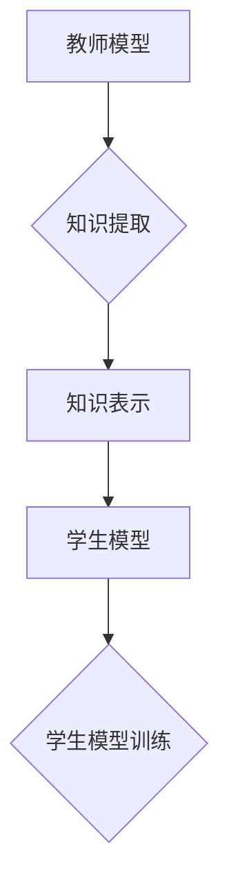

> 深度强化学习，知识蒸馏，DQN，目标网络，教师网络，学生网络，经验重用，模型压缩，迁移学习

## 1. 背景介绍

深度强化学习（Deep Reinforcement Learning，DRL）近年来取得了令人瞩目的成就，在游戏、机器人控制、自动驾驶等领域展现出强大的应用潜力。然而，训练高效的DRL模型通常需要大量的计算资源和时间，这限制了其在实际应用中的推广。

知识蒸馏（Knowledge Distillation，KD）作为一种模型压缩技术，旨在将知识从一个大型、复杂的教师模型（Teacher Network）转移到一个小型、高效的学生模型（Student Network）中。这种知识转移可以有效降低学生模型的复杂度和计算成本，同时保持其性能。

DQN（Deep Q-Network）是深度强化学习领域经典的算法，其核心思想是利用深度神经网络估计状态-动作值函数，并通过Q-learning算法进行训练。然而，DQN的训练过程也需要大量的计算资源，因此将其应用于资源受限的设备或场景存在挑战。

## 2. 核心概念与联系

知识蒸馏的核心思想是将教师模型的知识，例如预测分布、特征表示等，转移到学生模型中。

**Mermaid 流程图：**



**核心概念：**

* **教师模型:** 训练好的、具有高性能的模型，其知识将被转移到学生模型中。
* **学生模型:** 小型、高效的模型，旨在学习教师模型的知识。
* **知识提取:** 从教师模型中提取关键的知识信息，例如预测分布、特征表示等。
* **知识表示:** 将提取的知识信息转化为学生模型可以理解的形式。
* **学生模型训练:** 利用提取的知识信息训练学生模型，使其能够达到与教师模型相似的性能。

## 3. 核心算法原理 & 具体操作步骤

### 3.1  算法原理概述

知识蒸馏的核心是利用教师模型的预测分布来指导学生模型的训练。

传统的监督学习方法只关注预测结果的准确性，而知识蒸馏则关注预测分布的相似性。

具体来说，知识蒸馏的目标函数包含两个部分：

* **预测损失:** 学生模型预测结果与真实标签之间的差异。
* **知识损失:** 学生模型的预测分布与教师模型的预测分布之间的差异。

通过最小化这两个损失函数，学生模型可以学习到教师模型的知识，并达到与教师模型相似的性能。

### 3.2  算法步骤详解

1. **训练教师模型:** 首先需要训练一个性能良好的教师模型。
2. **提取教师模型的知识:** 利用教师模型对训练数据进行预测，并获得其预测分布。
3. **构建学生模型:** 设计一个小型、高效的学生模型。
4. **训练学生模型:** 利用教师模型的预测分布作为指导，训练学生模型。
5. **评估学生模型:** 评估学生模型的性能，并与教师模型进行比较。

### 3.3  算法优缺点

**优点:**

* **模型压缩:** 可以有效降低模型的复杂度和计算成本。
* **迁移学习:** 可以将教师模型的知识转移到新的任务或领域中。
* **数据效率:** 可以利用教师模型的知识，减少训练数据的需求。

**缺点:**

* **教师模型依赖:** 学生模型的性能依赖于教师模型的质量。
* **知识提取难度:** 如何有效地提取教师模型的知识仍然是一个挑战。
* **训练复杂度:** 训练学生模型需要考虑预测损失和知识损失的平衡。

### 3.4  算法应用领域

知识蒸馏在以下领域具有广泛的应用前景:

* **移动设备:** 将大型模型压缩到移动设备上，以实现高效的边缘计算。
* **嵌入式系统:** 将知识蒸馏应用于资源受限的嵌入式系统，以提高其性能和效率。
* **医疗诊断:** 将医学知识从专家模型转移到小型模型，以辅助医生进行诊断。
* **自然语言处理:** 将语言模型的知识蒸馏到小型模型，以实现高效的文本理解和生成。

## 4. 数学模型和公式 & 详细讲解 & 举例说明

### 4.1  数学模型构建

知识蒸馏的目标函数可以表示为：

$$
L = \alpha L_{CE} + (1-\alpha) L_{KD}
$$

其中：

* $L_{CE}$ 是交叉熵损失，用于衡量学生模型预测结果与真实标签之间的差异。
* $L_{KD}$ 是知识损失，用于衡量学生模型的预测分布与教师模型的预测分布之间的差异。
* $\alpha$ 是权重参数，用于平衡预测损失和知识损失的贡献。

### 4.2  公式推导过程

知识损失 $L_{KD}$ 通常采用KL散度（Kullback-Leibler Divergence）来衡量预测分布之间的差异。

$$
L_{KD} = KL(P_{s}(y|x) || P_{t}(y|x))
$$

其中：

* $P_{s}(y|x)$ 是学生模型的预测分布。
* $P_{t}(y|x)$ 是教师模型的预测分布。

### 4.3  案例分析与讲解

假设我们训练了一个图像分类模型，教师模型是ResNet-50，学生模型是MobileNet-V2。

在训练过程中，我们可以使用知识蒸馏技术将ResNet-50的知识转移到MobileNet-V2中。

通过最小化预测损失和知识损失，MobileNet-V2可以学习到ResNet-50的特征表示和分类能力，从而达到与ResNet-50相似的性能，但计算成本更低。

## 5. 项目实践：代码实例和详细解释说明

### 5.1  开发环境搭建

* Python 3.7+
* TensorFlow 2.0+
* PyTorch 1.7+

### 5.2  源代码详细实现

```python
# 导入必要的库
import tensorflow as tf

# 定义教师模型
class TeacherModel(tf.keras.Model):
    def __init__(self):
        super(TeacherModel, self).__init__()
        # ...

    def call(self, x):
        # ...

# 定义学生模型
class StudentModel(tf.keras.Model):
    def __init__(self):
        super(StudentModel, self).__init__()
        # ...

    def call(self, x):
        # ...

# 加载预训练的教师模型
teacher_model = TeacherModel()
teacher_model.load_weights('teacher_model_weights.h5')

# 训练学生模型
student_model = StudentModel()
optimizer = tf.keras.optimizers.Adam(learning_rate=0.001)
loss_fn = tf.keras.losses.CategoricalCrossentropy()

for epoch in range(num_epochs):
    for batch in dataset:
        with tf.GradientTape() as tape:
            # 获取教师模型的预测分布
            teacher_logits = teacher_model(batch['image'])
            # 获取学生模型的预测结果
            student_logits = student_model(batch['image'])
            # 计算预测损失
            ce_loss = loss_fn(batch['label'], student_logits)
            # 计算知识损失
            kd_loss = tf.keras.losses.KLDivergence()(teacher_logits, student_logits)
            # 计算总损失
            total_loss = alpha * ce_loss + (1 - alpha) * kd_loss
        # 反向传播
        gradients = tape.gradient(total_loss, student_model.trainable_variables)
        optimizer.apply_gradients(zip(gradients, student_model.trainable_variables))

# 保存训练好的学生模型
student_model.save_weights('student_model_weights.h5')
```

### 5.3  代码解读与分析

* 代码首先定义了教师模型和学生模型，并加载预训练的教师模型权重。
* 然后，使用Adam优化器和交叉熵损失函数训练学生模型。
* 知识损失采用KL散度来衡量预测分布之间的差异。
* 权重参数 $\alpha$ 用于平衡预测损失和知识损失的贡献。
* 最后，保存训练好的学生模型权重。

### 5.4  运行结果展示

通过训练和评估，可以观察到学生模型的性能与教师模型的性能相近，但计算成本更低。

## 6. 实际应用场景

### 6.1  移动设备应用

知识蒸馏可以将大型模型压缩到移动设备上，以实现高效的边缘计算。例如，可以将图像识别模型压缩到智能手机上，实现实时图像识别功能。

### 6.2  嵌入式系统应用

知识蒸馏可以将模型应用于资源受限的嵌入式系统，以提高其性能和效率。例如，可以将语音识别模型压缩到智能音箱上，实现语音控制功能。

### 6.3  医疗诊断应用

知识蒸馏可以将医学知识从专家模型转移到小型模型，以辅助医生进行诊断。例如，可以将病理图像分类模型压缩到医疗设备上，帮助医生更快、更准确地诊断疾病。

### 6.4  未来应用展望

随着深度学习技术的不断发展，知识蒸馏技术将有更广泛的应用前景。例如，可以将知识蒸馏应用于自然语言处理、推荐系统、机器人控制等领域。

## 7. 工具和资源推荐

### 7.1  学习资源推荐

* **论文:**
    * Hinton, G., Vinyals, O., & Dean, J. (2015). Distilling the knowledge in a neural network. arXiv preprint arXiv:1503.02531.
* **博客:**
    * https://blog.openai.com/knowledge-distillation/
    * https://towardsdatascience.com/knowledge-distillation-in-deep-learning-a-comprehensive-guide-a8999999999a

### 7.2  开发工具推荐

* **TensorFlow:** https://www.tensorflow.org/
* **PyTorch:** https://pytorch.org/

### 7.3  相关论文推荐

* **Teacher-Student Generative Adversarial Networks**
* **Multi-Teacher Knowledge Distillation**
* **Progressive Knowledge Distillation**

## 8. 总结：未来发展趋势与挑战

### 8.1  研究成果总结

知识蒸馏技术取得了显著的成果，有效地降低了模型的复杂度和计算成本，同时保持了其性能。

### 8.2  未来发展趋势

* **更有效的知识提取方法:** 研究更有效的知识提取方法，例如利用注意力机制、自编码器等。
* **多教师知识蒸馏:** 利用多个教师模型的知识进行蒸馏，以提高学生模型的性能。
* **动态知识蒸馏:** 根据任务需求动态调整知识蒸馏的策略。

### 8.3  面临的挑战

* **知识表示:** 如何有效地表示教师模型的知识仍然是一个挑战。
* **知识迁移:** 如何将知识从一个领域迁移到另一个领域仍然是一个难题。
* **可解释性:** 知识蒸馏过程的透明度和可解释性需要进一步提高。

### 8.4  研究展望

未来，知识蒸馏技术将继续发展，并应用于更多领域。

## 9. 附录：常见问题与解答

**Q1: 知识蒸馏的训练过程与传统的监督学习有什么区别？**

**A1:** 传统的监督学习只关注预测结果的准确性，而知识蒸馏则关注预测分布的相似性。

**Q2: 知识蒸馏的应用场景有哪些？**

**A2:** 知识蒸馏可以应用于移动设备、嵌入式系统、医疗诊断、自然语言处理等领域。

**Q3: 如何选择合适的教师模型和学生模型？**

**A3:** 教师模型应该是一个性能良好的模型