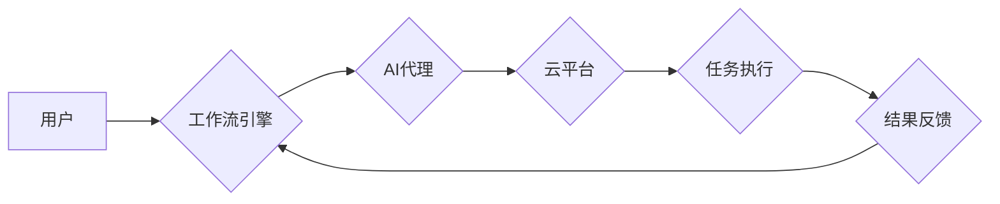

> AI代理, 工作流, 云计算, 自动化, 机器学习, 决策, 协作

## 1. 背景介绍

随着云计算技术的蓬勃发展，企业和个人对计算资源的需求不断增长。同时，人工智能（AI）技术的快速进步也为云计算环境带来了新的机遇和挑战。AI代理作为一种智能化的自动化代理，能够在云计算环境中自动执行任务，提高效率和降低成本。

传统的云计算工作流通常依赖于人工干预，效率低下，难以应对复杂的任务。而AI代理可以自动识别任务需求，选择合适的资源，并执行任务，从而实现自动化和智能化。

## 2. 核心概念与联系

**2.1 AI代理**

AI代理是一种能够在云计算环境中自主执行任务的智能化软件实体。它具备以下特征：

* **自主性:** AI代理能够根据预设的目标和环境信息，自主做出决策并执行相应的行动。
* **智能化:** AI代理通常基于机器学习算法，能够从数据中学习和改进其执行能力。
* **可扩展性:** AI代理可以轻松扩展到多个云平台和资源，以满足不同的需求。

**2.2 工作流**

工作流是一种用于描述和执行业务流程的模型。它通常由一系列的任务和活动组成，这些任务和活动之间存在着特定的顺序和依赖关系。

**2.3 云计算**

云计算是一种基于互联网的计算服务模式，它提供计算资源、存储资源和网络资源等服务，用户可以按需使用这些资源，无需进行硬件采购和维护。

**2.4 AI代理工作流**

AI代理工作流是指在云计算环境中，利用AI代理自动执行工作流任务的模型。它将AI代理与工作流引擎结合，实现自动化、智能化和可扩展的工作流执行。

**2.5 架构图**



## 3. 核心算法原理 & 具体操作步骤

**3.1 算法原理概述**

AI代理工作流的核心算法通常基于以下几个方面：

* **任务识别:** AI代理需要能够识别工作流中的任务，并理解任务的输入和输出。
* **资源调度:** AI代理需要能够选择合适的云平台资源，例如计算实例、存储空间等，以执行任务。
* **任务执行:** AI代理需要能够执行任务，并根据任务的结果进行反馈。
* **决策优化:** AI代理需要能够根据任务需求和资源情况，做出最优的决策，以提高工作流的效率和性能。

**3.2 算法步骤详解**

1. **任务分解:** 将工作流分解成一系列独立的任务，每个任务都有明确的输入和输出。
2. **任务识别:** 使用自然语言处理（NLP）或机器学习算法，识别工作流中的任务类型和参数。
3. **资源调度:** 根据任务需求和云平台资源情况，使用算法选择合适的资源，例如计算实例、存储空间等。
4. **任务执行:** 将任务提交到选择的云平台资源，并监控任务执行进度。
5. **结果反馈:** 收集任务执行结果，并反馈给工作流引擎。
6. **决策优化:** 使用机器学习算法，分析任务执行结果和资源使用情况，优化决策策略，以提高工作流的效率和性能。

**3.3 算法优缺点**

**优点:**

* 自动化工作流执行，提高效率和降低成本。
* 智能化决策，优化资源使用和任务执行。
* 可扩展性强，可以适应不同的工作流需求和云平台环境。

**缺点:**

* 需要大量的训练数据和计算资源。
* 算法复杂度高，需要专业的技术人员进行开发和维护。
* 存在一定的风险，例如AI代理可能做出错误的决策，导致工作流失败。

**3.4 算法应用领域**

AI代理工作流的应用领域非常广泛，例如：

* **云计算资源管理:** 自动化云平台资源的分配、调度和释放。
* **软件开发:** 自动化软件开发流程，例如代码生成、测试和部署。
* **数据分析:** 自动化数据分析任务，例如数据清洗、特征提取和模型训练。
* **业务流程自动化:** 自动化企业内部的业务流程，例如订单处理、客户服务和财务管理。

## 4. 数学模型和公式 & 详细讲解 & 举例说明

**4.1 数学模型构建**

我们可以使用状态机模型来描述AI代理工作流的执行过程。每个状态代表一个任务或活动，状态之间的转换代表任务之间的依赖关系。

**状态机模型:**

```
状态：
- 任务1
- 任务2
- 任务3
- 完成

转换：
- 任务1 -> 任务2
- 任务2 -> 任务3
- 任务3 -> 完成
```

**4.2 公式推导过程**

我们可以使用概率论和统计学来评估AI代理的决策质量。例如，我们可以使用贝叶斯定理来计算AI代理在不同状态下选择不同行动的概率。

**贝叶斯定理:**

$$P(A|B) = \frac{P(B|A)P(A)}{P(B)}$$

其中：

* $P(A|B)$ 是在已知事件B发生的情况下，事件A发生的概率。
* $P(B|A)$ 是在已知事件A发生的情况下，事件B发生的概率。
* $P(A)$ 是事件A发生的概率。
* $P(B)$ 是事件B发生的概率。

**4.3 案例分析与讲解**

假设AI代理需要选择合适的云平台资源来执行一个任务。我们可以使用贝叶斯定理来计算AI代理在不同资源状态下选择不同资源的概率。例如，我们可以根据资源的可用性、价格和性能等因素，计算AI代理选择不同资源的概率。

## 5. 项目实践：代码实例和详细解释说明

**5.1 开发环境搭建**

* 操作系统：Ubuntu 20.04
* 云平台：AWS
* 开发工具：Python 3.8，PyCharm

**5.2 源代码详细实现**

```python
import boto3

# 创建AWS客户端
client = boto3.client('ec2')

# 定义任务函数
def execute_task(instance_id):
    # 执行任务逻辑
    print(f"执行任务，实例ID：{instance_id}")

# 选择合适的云平台资源
def select_resource():
    # 根据任务需求和资源情况，选择合适的云平台资源
    # 例如，根据任务的计算需求选择合适的实例类型
    instance_type = 't2.micro'
    return instance_type

# 创建云平台资源
def create_resource(instance_type):
    # 创建云平台资源，例如EC2实例
    response = client.run_instances(
        ImageId='ami-0c5b09873a1234567',
        InstanceType=instance_type,
        MinCount=1,
        MaxCount=1
    )
    instance_id = response['Instances'][0]['InstanceId']
    return instance_id

# 主函数
if __name__ == '__main__':
    # 选择合适的云平台资源
    instance_type = select_resource()
    # 创建云平台资源
    instance_id = create_resource(instance_type)
    # 执行任务
    execute_task(instance_id)
```

**5.3 代码解读与分析**

* 该代码示例演示了如何使用Python和AWS SDK创建云平台资源并执行任务。
* `select_resource()`函数根据任务需求选择合适的云平台资源。
* `create_resource()`函数创建云平台资源，例如EC2实例。
* `execute_task()`函数执行任务逻辑。

**5.4 运行结果展示**

运行该代码后，将会在AWS云平台上创建一个EC2实例，并执行任务逻辑。

## 6. 实际应用场景

**6.1 云平台资源管理**

AI代理可以自动管理云平台资源，例如根据负载情况动态调整实例数量，释放闲置资源，优化资源使用效率。

**6.2 软件开发自动化**

AI代理可以自动化软件开发流程，例如根据代码规范自动生成代码注释，自动执行代码测试，自动部署代码到生产环境。

**6.3 数据分析自动化**

AI代理可以自动化数据分析任务，例如根据用户需求自动提取数据，自动生成数据报表，自动进行数据挖掘和分析。

**6.4 未来应用展望**

随着AI技术的不断发展，AI代理工作流将在更多领域得到应用，例如：

* **智能客服:** AI代理可以自动处理客户咨询，提供个性化服务。
* **智能制造:** AI代理可以自动控制生产设备，提高生产效率和质量。
* **智能医疗:** AI代理可以辅助医生诊断疾病，提供个性化治疗方案。

## 7. 工具和资源推荐

**7.1 学习资源推荐**

* **书籍:**
    * 《深度学习》
    * 《机器学习》
    * 《云计算》
* **在线课程:**
    * Coursera
    * edX
    * Udacity

**7.2 开发工具推荐**

* **Python:** 
    * PyCharm
    * Jupyter Notebook
* **云平台SDK:**
    * AWS SDK for Python
    * Azure SDK for Python
    * Google Cloud SDK

**7.3 相关论文推荐**

* **论文:**
    * "Towards Data-Driven Workflows"
    * "AutoML: A Survey of the State-of-the-Art"
    * "AI-Powered Workflow Automation"

## 8. 总结：未来发展趋势与挑战

**8.1 研究成果总结**

AI代理工作流的研究取得了显著进展，已经能够在云计算环境中自动执行一些复杂的任务。

**8.2 未来发展趋势**

未来，AI代理工作流的研究将朝着以下几个方向发展：

* **更智能化的决策:** 使用更先进的机器学习算法，提高AI代理的决策质量。
* **更强大的协作能力:** 允许多个AI代理协同工作，完成更复杂的任务。
* **更广泛的应用场景:** 将AI代理工作流应用到更多领域，例如智能客服、智能制造和智能医疗。

**8.3 面临的挑战**

AI代理工作流还面临一些挑战，例如：

* **数据安全:** AI代理需要访问大量数据，因此数据安全是一个重要的挑战。
* **算法可解释性:** AI代理的决策过程通常是复杂的，难以解释，这可能会导致信任问题。
* **伦理问题:** AI代理的决策可能会对人类产生影响，因此需要考虑伦理问题。

**8.4 研究展望**

未来，我们需要继续研究AI代理工作流的算法、架构和应用，以解决上述挑战，并推动AI代理工作流技术的发展。

## 9. 附录：常见问题与解答

**9.1 如何选择合适的云平台资源？**

选择合适的云平台资源需要根据任务需求和资源情况进行评估。例如，需要考虑任务的计算需求、存储需求、网络需求等因素。

**9.2 如何保证AI代理工作流的安全性？**

可以采用以下措施保证AI代理工作流的安全性：

* 使用身份验证和授权机制，控制对AI代理的访问权限。
* 加密敏感数据，防止数据泄露。
* 定期进行安全评估和漏洞扫描。

**9.3 如何提高AI代理工作流的效率？**

可以采用以下措施提高AI代理工作流的效率：

* 使用更先进的机器学习算法，优化AI代理的决策过程。
* 优化工作流设计，减少任务之间的依赖关系。
* 利用云平台的弹性伸缩能力，根据负载情况动态调整资源。


作者：禅与计算机程序设计艺术 / Zen and the Art of Computer Programming 
<end_of_turn>