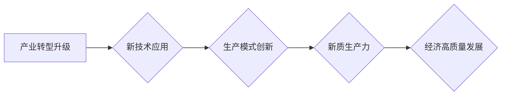

> 产业转型升级, 新质生产力, 数字化转型, 工业互联网, 人工智能, 大数据, 云计算, 

## 1. 背景介绍

当前，全球经济发展进入新阶段，传统产业面临着结构性调整和转型升级的压力。第四次工业革命的浪潮席卷全球，数字化、智能化、网络化等新技术蓬勃发展，为产业转型升级提供了新的机遇和动力。

产业转型升级是指以技术创新、产业结构调整和模式创新为驱动的，从传统产业向新兴产业发展转变的过程。其核心目标是提高产业竞争力，实现经济高质量发展。新质生产力是指以新技术、新模式、新要素为基础，推动生产力跃升的新型生产力。

## 2. 核心概念与联系

**2.1 产业转型升级**

产业转型升级是一个复杂而动态的过程，涉及多个层面和环节。其主要特征包括：

* **技术驱动:** 新技术是产业转型升级的根本动力，例如人工智能、大数据、云计算等。
* **结构调整:** 优化产业结构，发展新兴产业，淘汰落后产业。
* **模式创新:** 推动生产方式、商业模式和服务模式的创新。
* **要素优化:** 优化人力资源、资本资源、技术资源等要素配置。

**2.2 新质生产力**

新质生产力是产业转型升级的最终目标，其核心特征包括：

* **智能化:** 利用人工智能、机器学习等技术，实现生产过程的智能化控制和优化。
* **数字化:** 将生产过程数字化，实现数据采集、分析和应用。
* **网络化:** 通过网络连接生产要素，实现资源共享和协同创新。
* **可持续性:** 推动绿色低碳发展，实现资源节约和环境保护。

**2.3 核心概念联系**

产业转型升级和新质生产力是相互促进、相互依存的关系。新质生产力是产业转型升级的基础和保障，而产业转型升级则是新质生产力的发展土壤。

**Mermaid 流程图**



## 3. 核心算法原理 & 具体操作步骤

**3.1 算法原理概述**

在产业转型升级过程中，人工智能算法扮演着至关重要的角色。例如，机器学习算法可以用于预测市场需求、优化生产流程、识别产品缺陷等。深度学习算法可以用于图像识别、语音识别、自然语言处理等领域，为产业转型升级提供强大的技术支撑。

**3.2 算法步骤详解**

以机器学习算法为例，其基本步骤包括：

1. 数据收集和预处理：收集相关数据，并进行清洗、转换、特征提取等预处理工作。
2. 模型选择：根据具体应用场景选择合适的机器学习算法模型。
3. 模型训练：利用训练数据训练机器学习模型，调整模型参数，使其能够准确预测或分类。
4. 模型评估：使用测试数据评估模型的性能，例如准确率、召回率、F1-score等指标。
5. 模型部署：将训练好的模型部署到实际应用场景中，用于预测或分类新的数据。

**3.3 算法优缺点**

机器学习算法具有以下优点：

* **自动化学习:** 可以自动从数据中学习规律，无需人工编程。
* **适应性强:** 可以适应不断变化的数据分布和应用场景。
* **预测精度高:** 在某些领域，机器学习算法可以达到甚至超过人类的预测精度。

但也存在一些缺点：

* **数据依赖:** 机器学习算法需要大量的数据进行训练，否则性能会下降。
* **解释性差:** 某些机器学习算法的决策过程难以解释，难以理解模型的内部机制。
* **可解释性问题:** 对于一些关键决策，需要能够解释模型的决策过程，以确保其可信性和可接受性。

**3.4 算法应用领域**

机器学习算法在各个领域都有广泛的应用，例如：

* **制造业:** 产品质量控制、预测性维护、生产流程优化。
* **金融业:** 欺诈检测、风险评估、客户画像。
* **医疗保健:** 疾病诊断、药物研发、个性化医疗。
* **零售业:** 商品推荐、库存管理、客户服务。

## 4. 数学模型和公式 & 详细讲解 & 举例说明

**4.1 数学模型构建**

在机器学习算法中，常用的数学模型包括线性回归、逻辑回归、支持向量机、决策树等。这些模型都基于一定的数学公式，用于描述数据之间的关系和预测目标变量。

**4.2 公式推导过程**

例如，线性回归模型的目标是找到一条直线，使得这条直线与数据点之间的距离最小。其数学公式如下：

$$y = w_0 + w_1x_1 + w_2x_2 + ... + w_nx_n$$

其中，$y$ 是目标变量，$x_1, x_2, ..., x_n$ 是输入特征，$w_0, w_1, w_2, ..., w_n$ 是模型参数。

**4.3 案例分析与讲解**

假设我们有一个数据集，包含房屋面积和房屋价格的信息。我们可以使用线性回归模型来预测房屋价格。

首先，我们需要收集数据并进行预处理。然后，选择线性回归模型，并使用训练数据训练模型参数。最后，使用测试数据评估模型的性能。

**举例说明:**

假设训练数据如下：

| 房屋面积 (平方米) | 房屋价格 (万元) |
|---|---|
| 60 | 100 |
| 80 | 150 |
| 100 | 200 |
| 120 | 250 |

通过训练模型，我们可以得到以下参数：

* $w_0 = 50$
* $w_1 = 1.5$

因此，房屋价格的预测公式为：

$$y = 50 + 1.5x$$

其中，$x$ 是房屋面积。

## 5. 项目实践：代码实例和详细解释说明

**5.1 开发环境搭建**

为了实现机器学习算法的应用，我们需要搭建相应的开发环境。常用的开发环境包括：

* Python 语言环境：Python 是机器学习领域最常用的编程语言，拥有丰富的机器学习库和工具。
* Jupyter Notebook：Jupyter Notebook 是一个交互式编程环境，方便进行机器学习算法的开发和调试。
* TensorFlow 或 PyTorch：TensorFlow 和 PyTorch 是两个流行的深度学习框架，可以用于训练和部署深度学习模型。

**5.2 源代码详细实现**

以下是一个使用 Python 和 scikit-learn 库实现线性回归模型的代码示例：

```python
from sklearn.linear_model import LinearRegression
from sklearn.model_selection import train_test_split
from sklearn.metrics import mean_squared_error

# 数据集
X = [[60], [80], [100], [120]]
y = [100, 150, 200, 250]

# 数据分割
X_train, X_test, y_train, y_test = train_test_split(X, y, test_size=0.2, random_state=42)

# 模型训练
model = LinearRegression()
model.fit(X_train, y_train)

# 模型预测
y_pred = model.predict(X_test)

# 模型评估
mse = mean_squared_error(y_test, y_pred)
print(f"均方误差: {mse}")
```

**5.3 代码解读与分析**

这段代码首先导入必要的库函数。然后，定义数据集 X 和 y，其中 X 是房屋面积，y 是房屋价格。

接下来，使用 `train_test_split` 函数将数据分割成训练集和测试集。

然后，创建线性回归模型对象 `model`，并使用 `fit` 函数训练模型。

最后，使用 `predict` 函数预测测试集的房屋价格，并使用 `mean_squared_error` 函数评估模型的性能。

**5.4 运行结果展示**

运行这段代码后，会输出模型的均方误差值。均方误差值越小，模型的预测精度越高。

## 6. 实际应用场景

**6.1 制造业**

* **预测性维护:** 利用机器学习算法分析设备运行数据，预测设备故障时间，提前进行维护，降低设备故障率和维修成本。
* **质量控制:** 利用机器视觉技术和深度学习算法识别产品缺陷，提高产品质量。
* **生产流程优化:** 利用数据分析和机器学习算法优化生产流程，提高生产效率和降低生产成本。

**6.2 金融业**

* **欺诈检测:** 利用机器学习算法分析交易数据，识别异常交易行为，防止欺诈行为发生。
* **风险评估:** 利用机器学习算法分析客户数据，评估客户的信用风险，为贷款和保险等业务提供决策支持。
* **客户画像:** 利用机器学习算法分析客户行为数据，构建客户画像，为精准营销提供支持。

**6.3 医疗保健**

* **疾病诊断:** 利用机器学习算法分析患者病历数据和影像数据，辅助医生诊断疾病。
* **药物研发:** 利用机器学习算法分析药物分子结构和生物活性数据，加速药物研发过程。
* **个性化医疗:** 利用机器学习算法分析患者基因数据和生活习惯数据，为患者提供个性化的医疗方案。

**6.4 未来应用展望**

随着人工智能技术的不断发展，其在产业转型升级中的应用场景将更加广泛和深入。例如，在未来，人工智能将可能被用于：

* **智能制造:** 实现完全自动化的生产过程，提高生产效率和产品质量。
* **智慧城市:** 利用人工智能技术优化城市管理，提高城市运行效率和居民生活质量。
* **个性化服务:** 为每个用户提供个性化的产品和服务，满足用户的个性化需求。

## 7. 工具和资源推荐

**7.1 学习资源推荐**

* **在线课程:** Coursera、edX、Udacity 等平台提供丰富的机器学习和人工智能课程。
* **书籍:** 《深度学习》、《机器学习实战》等书籍是机器学习和人工智能学习的经典教材。
* **开源社区:** TensorFlow、PyTorch 等开源社区提供丰富的学习资源和技术支持。

**7.2 开发工具推荐**

* **Python:** Python 是机器学习领域最常用的编程语言。
* **Jupyter Notebook:** Jupyter Notebook 是一个交互式编程环境，方便进行机器学习算法的开发和调试。
* **TensorFlow 或 PyTorch:** TensorFlow 和 PyTorch 是两个流行的深度学习框架。

**7.3 相关论文推荐**

* **《ImageNet Classification with Deep Convolutional Neural Networks》:** 这篇论文介绍了深度卷积神经网络在图像分类任务中的应用。
* **《Attention Is All You Need》:** 这篇论文介绍了 Transformer 模型，一种新的序列建模方法，在自然语言处理领域取得了突破性进展。

## 8. 总结：未来发展趋势与挑战

**8.1 研究成果总结**

近年来，人工智能技术取得了长足的进步，在各个领域都有广泛的应用。机器学习算法在预测、分类、识别等任务中表现出色，深度学习算法在图像识别、语音识别、自然语言处理等领域取得了突破性进展。

**8.2 未来发展趋势**

未来，人工智能技术将继续发展，并朝着以下几个方向发展：

* **更强大的计算能力:** 随着计算能力的提升，人工智能模型将变得更加复杂和强大。
* **更丰富的算法:** 新的机器学习算法和深度学习算法将不断涌现，解决更多复杂问题。
* **更广泛的应用场景:** 人工智能技术将应用于更多领域，例如医疗保健、教育、交通运输等。

**8.3 面临的挑战**

人工智能技术的发展也面临着一些挑战：

* **数据安全和隐私保护:** 人工智能算法依赖于大量数据，如何保证数据安全和隐私保护是一个重要问题。
* **算法可解释性:** 某些人工智能算法的决策过程难以解释，