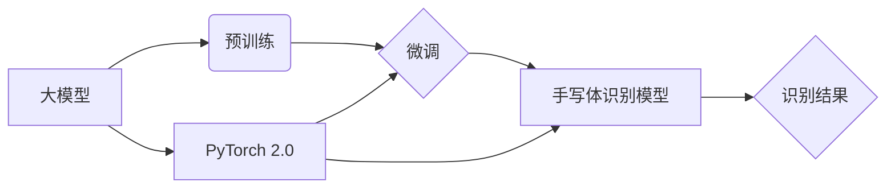

> 大模型开发, 微调, 手写体识别, PyTorch 2.0, 深度学习, 计算机视觉

## 1. 背景介绍

近年来，深度学习技术取得了飞速发展，在图像识别、自然语言处理等领域取得了突破性进展。大模型的出现，进一步推动了深度学习的发展，其强大的泛化能力和学习能力使其在各种复杂任务中展现出巨大的潜力。

手写体识别作为一项重要的计算机视觉任务，在金融、医疗、教育等领域有着广泛的应用。传统的基于规则的手写体识别方法受限于人工设计的规则，难以应对复杂的手写体特征。而深度学习方法能够自动学习手写体特征，具有更高的识别精度和鲁棒性。

本文将基于PyTorch 2.0深度学习框架，从零开始开发一个手写体识别模型，并通过微调预训练模型的方式，提高模型的识别精度。

## 2. 核心概念与联系

### 2.1  大模型与微调

大模型是指参数量庞大的深度学习模型，通常拥有数十亿甚至数千亿个参数。由于其庞大的规模，大模型能够学习到更丰富的特征表示，从而在各种任务中表现出优异的性能。

微调是指在预训练模型的基础上，针对特定任务进行进一步的训练。通过微调，可以将预训练模型的知识迁移到新的任务中，从而提高模型的效率和性能。

### 2.2  手写体识别

手写体识别是指将手写文字转换为可识别的文本的过程。手写体识别是一个复杂的任务，需要考虑手写体特征的复杂性和多样性。

### 2.3  PyTorch 2.0

PyTorch 2.0 是一个开源的深度学习框架，其简洁易用的API和强大的功能使其成为深度学习研究和开发的热门选择。

**核心概念与联系流程图:**



## 3. 核心算法原理 & 具体操作步骤

### 3.1  算法原理概述

本文采用卷积神经网络（CNN）作为手写体识别模型的架构。CNN能够有效地学习图像特征，并具有良好的鲁棒性。

### 3.2  算法步骤详解

1. **数据预处理:** 将手写体图像进行预处理，包括尺寸调整、归一化等操作。
2. **模型构建:** 使用PyTorch 2.0构建CNN模型，包括卷积层、池化层、全连接层等。
3. **模型训练:** 使用训练数据训练模型，并使用损失函数和优化器进行模型参数更新。
4. **模型评估:** 使用测试数据评估模型的识别精度。
5. **模型微调:** 在预训练模型的基础上，使用少量的手写体数据进行微调，提高模型的识别精度。

### 3.3  算法优缺点

**优点:**

* 识别精度高
* 鲁棒性强
* 可处理复杂的手写体特征

**缺点:**

* 训练时间长
* 需要大量的训练数据

### 3.4  算法应用领域

* 金融领域：识别银行支票、信用卡信息等
* 医疗领域：识别病历、医学影像等
* 教育领域：识别学生作业、考试卷等

## 4. 数学模型和公式 & 详细讲解 & 举例说明

### 4.1  数学模型构建

CNN模型的数学模型主要包括卷积层、池化层和全连接层。

**卷积层:**

卷积层使用卷积核对输入图像进行卷积运算，提取图像特征。卷积核是一个小的矩阵，其元素代表着卷积操作的权重。

**池化层:**

池化层对卷积层的输出进行降维操作，减少模型参数量，提高模型的鲁棒性。常见的池化操作包括最大池化和平均池化。

**全连接层:**

全连接层将池化层的输出进行线性变换，并使用激活函数进行非线性变换，最终输出识别结果。

### 4.2  公式推导过程

**卷积运算公式:**

$$
y_{i,j} = \sum_{m=0}^{M-1} \sum_{n=0}^{N-1} x_{i+m,j+n} * w_{m,n}
$$

其中：

* $y_{i,j}$ 是卷积层的输出值
* $x_{i+m,j+n}$ 是输入图像的像素值
* $w_{m,n}$ 是卷积核的权重
* $M$ 和 $N$ 是卷积核的大小

**最大池化公式:**

$$
y_{i,j} = \max_{m=0}^{k-1} \max_{n=0}^{l-1} x_{i+m,j+n}
$$

其中：

* $y_{i,j}$ 是最大池化层的输出值
* $x_{i+m,j+n}$ 是池化区域内的像素值
* $k$ 和 $l$ 是池化窗口的大小

### 4.3  案例分析与讲解

假设输入图像大小为 28x28，卷积核大小为 3x3，步长为 1，则卷积层的输出大小为 26x26。

最大池化窗口大小为 2x2，步长为 2，则最大池化层的输出大小为 13x13。

## 5. 项目实践：代码实例和详细解释说明

### 5.1  开发环境搭建

* 安装Python 3.8+
* 安装PyTorch 2.0
* 安装必要的库，例如NumPy、Matplotlib等

### 5.2  源代码详细实现

```python
import torch
import torch.nn as nn
import torch.optim as optim

# 定义CNN模型
class HandwritingRecognizer(nn.Module):
    def __init__(self):
        super(HandwritingRecognizer, self).__init__()
        self.conv1 = nn.Conv2d(1, 32, kernel_size=3, padding=1)
        self.pool = nn.MaxPool2d(kernel_size=2, stride=2)
        self.conv2 = nn.Conv2d(32, 64, kernel_size=3, padding=1)
        self.fc1 = nn.Linear(64 * 7 * 7, 128)
        self.fc2 = nn.Linear(128, 10)  # 10个类别

    def forward(self, x):
        x = self.pool(torch.relu(self.conv1(x)))
        x = self.pool(torch.relu(self.conv2(x)))
        x = x.view(-1, 64 * 7 * 7)
        x = torch.relu(self.fc1(x))
        x = self.fc2(x)
        return x

# 实例化模型
model = HandwritingRecognizer()

# 定义损失函数和优化器
criterion = nn.CrossEntropyLoss()
optimizer = optim.Adam(model.parameters(), lr=0.001)

# 训练模型
for epoch in range(10):
    # 训练数据
    # ...
    # 计算损失
    outputs = model(inputs)
    loss = criterion(outputs, labels)
    # 反向传播
    optimizer.zero_grad()
    loss.backward()
    # 更新参数
    optimizer.step()

# 保存模型
torch.save(model.state_dict(), 'handwriting_model.pth')
```

### 5.3  代码解读与分析

* 代码首先定义了CNN模型的架构，包括卷积层、池化层和全连接层。
* 然后实例化模型，并定义损失函数和优化器。
* 训练模型的过程包括迭代训练数据，计算损失，反向传播和更新参数。
* 最后，将训练好的模型保存为文件。

### 5.4  运行结果展示

训练完成后，可以使用测试数据评估模型的识别精度。

## 6. 实际应用场景

手写体识别模型可以应用于以下场景：

* **金融领域:** 识别银行支票、信用卡信息等
* **医疗领域:** 识别病历、医学影像等
* **教育领域:** 识别学生作业、考试卷等
* **智能客服:** 识别用户手写输入

### 6.4  未来应用展望

随着深度学习技术的不断发展，手写体识别模型的识别精度和鲁棒性将进一步提高。未来，手写体识别模型将应用于更多领域，例如：

* **人机交互:** 手写输入成为更便捷的人机交互方式
* **个性化教育:** 根据学生的书写习惯提供个性化的学习方案
* **数字签名识别:** 提高数字签名的安全性

## 7. 工具和资源推荐

### 7.1  学习资源推荐

* **PyTorch 官方文档:** https://pytorch.org/docs/stable/
* **深度学习书籍:** 《深度学习》

### 7.2  开发工具推荐

* **Jupyter Notebook:** https://jupyter.org/
* **VS Code:** https://code.visualstudio.com/

### 7.3  相关论文推荐

* **AlexNet:** https://papers.nips.cc/paper/4824-imagenet-classification-with-deep-convolutional-neural-networks.pdf
* **VGGNet:** https://arxiv.org/abs/1409.1556

## 8. 总结：未来发展趋势与挑战

### 8.1  研究成果总结

本文介绍了基于PyTorch 2.0开发手写体识别模型的方法，并详细讲解了模型的架构、训练过程和应用场景。

### 8.2  未来发展趋势

* **模型架构的创新:** 探索新的CNN架构，提高模型的识别精度和效率。
* **数据增强:** 使用数据增强技术，增加训练数据的多样性，提高模型的鲁棒性。
* **迁移学习:** 利用预训练模型，减少训练数据量，提高模型的泛化能力。

### 8.3  面临的挑战

* **数据标注:** 手写体数据标注工作量大，成本高。
* **模型复杂度:** 大型模型的训练和部署需要强大的计算资源。
* **模型解释性:** 深度学习模型的决策过程难以解释，缺乏可信度。

### 8.4  研究展望

未来，我们将继续研究手写体识别模型，探索新的算法和技术，提高模型的性能和鲁棒性，并将其应用于更多领域。

## 9. 附录：常见问题与解答

**Q1: 如何选择合适的卷积核大小？**

A1: 卷积核大小的选择取决于图像分辨率和特征提取的层次。一般来说，较小的卷积核可以提取局部特征，较大的卷积核可以提取全局特征。

**Q2: 如何进行数据增强？**

A2: 数据增强技术包括图像旋转、缩放、平移、翻转等操作，可以增加训练数据的多样性，提高模型的鲁棒性。

**Q3: 如何评估模型的识别精度？**

A3: 常见的评估指标包括准确率、召回率、F1-score等。

作者：禅与计算机程序设计艺术 / Zen and the Art of Computer Programming


<end_of_turn>