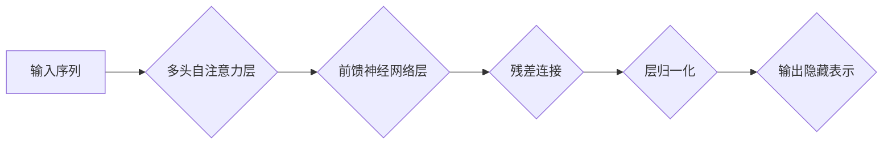

> 大模型、编码器、Transformer、BERT、微调、自然语言处理、深度学习

## 1. 背景介绍

近年来，深度学习在自然语言处理 (NLP) 领域取得了突破性进展，其中大模型扮演着至关重要的角色。大模型是指拥有数亿甚至数十亿参数的深度神经网络，它们通过海量文本数据的训练，能够学习到复杂的语言表示和模式，从而在各种 NLP 任务中表现出色。

编码器是 Transformer 架构的核心组件之一，它负责将输入序列映射到一个固定长度的隐藏表示。编码器通过多层 Transformer 块进行处理，每个 Transformer 块包含自注意力机制和前馈神经网络。自注意力机制能够捕捉序列中不同词之间的依赖关系，而前馈神经网络则进一步提取和融合这些信息。

本文将从零开始介绍大模型开发与微调，重点关注编码器的实现。我们将深入探讨 Transformer 架构、编码器算法原理、数学模型和公式，并通过代码实例和实际应用场景，帮助读者理解大模型开发的流程和关键技术。

## 2. 核心概念与联系

### 2.1 Transformer 架构

Transformer 架构是一种新型的序列到序列模型，它摒弃了传统的循环神经网络 (RNN) 的顺序处理方式，而是通过自注意力机制并行处理整个序列，从而能够更有效地捕捉长距离依赖关系。

Transformer 架构主要由以下几个部分组成：

* **编码器 (Encoder):** 负责将输入序列映射到一个固定长度的隐藏表示。
* **解码器 (Decoder):** 负责根据编码器的输出生成目标序列。
* **自注意力机制 (Self-Attention):** 能够捕捉序列中不同词之间的依赖关系。
* **前馈神经网络 (Feed-Forward Network):** 进一步提取和融合自注意力机制输出的信息。

### 2.2 编码器原理

编码器由多个 Transformer 块堆叠而成，每个 Transformer 块包含以下结构：

* **多头自注意力层 (Multi-Head Self-Attention):** 对输入序列进行多角度的关注，捕捉不同词之间的关系。
* **前馈神经网络层 (Feed-Forward Network):** 对自注意力层的输出进行非线性变换，提取更深层的语义信息。
* **残差连接 (Residual Connection):** 将输入和输出相加，缓解梯度消失问题。
* **层归一化 (Layer Normalization):** 对每一层的输出进行归一化，加速训练过程。

**Mermaid 流程图:**



## 3. 核心算法原理 & 具体操作步骤

### 3.1 算法原理概述

编码器的核心算法是 Transformer 架构，它通过多层 Transformer 块，结合自注意力机制和前馈神经网络，将输入序列映射到一个固定长度的隐藏表示。

### 3.2 算法步骤详解

1. **输入处理:** 将输入序列转换为词嵌入向量，每个词都对应一个向量表示。
2. **多头自注意力层:** 对词嵌入向量进行多头自注意力计算，捕捉每个词与其他词之间的关系。
3. **前馈神经网络层:** 对自注意力层的输出进行非线性变换，提取更深层的语义信息。
4. **残差连接和层归一化:** 将输入和输出相加，并对每一层的输出进行归一化，加速训练过程。
5. **重复步骤 2-4:** 将上述步骤重复多次，形成多层 Transformer 块。
6. **输出隐藏表示:** 最后输出编码器的最后一个 Transformer 块的输出，作为输入序列的隐藏表示。

### 3.3 算法优缺点

**优点:**

* 能够有效捕捉长距离依赖关系。
* 并行处理能力强，训练速度快。
* 表现优异于传统的 RNN 模型。

**缺点:**

* 参数量大，训练成本高。
* 对训练数据要求高。

### 3.4 算法应用领域

编码器在各种 NLP 任务中都有广泛的应用，例如：

* **文本分类:** 将文本分类到不同的类别。
* **文本摘要:** 生成文本的简短摘要。
* **机器翻译:** 将文本从一种语言翻译成另一种语言。
* **问答系统:** 回答用户提出的问题。

## 4. 数学模型和公式 & 详细讲解 & 举例说明

### 4.1 数学模型构建

编码器的数学模型主要基于 Transformer 架构，其中自注意力机制和前馈神经网络是核心组成部分。

### 4.2 公式推导过程

**自注意力机制:**

自注意力机制的计算公式如下:

$$
Attention(Q, K, V) = softmax(\frac{QK^T}{\sqrt{d_k}})V
$$

其中:

* $Q$, $K$, $V$ 分别代表查询矩阵、键矩阵和值矩阵。
* $d_k$ 是键向量的维度。
* $softmax$ 函数将注意力权重归一化到 [0, 1] 之间。

**前馈神经网络:**

前馈神经网络通常由两层全连接神经网络组成，其计算公式如下:

$$
F(x) = ReLU(W_1x + b_1)W_2 + b_2
$$

其中:

* $x$ 是输入向量。
* $W_1$, $W_2$ 分别代表第一层和第二层的权重矩阵。
* $b_1$, $b_2$ 分别代表第一层和第二层的偏置向量。
* $ReLU$ 函数是激活函数。

### 4.3 案例分析与讲解

假设我们有一个句子 "The cat sat on the mat"，将其转换为词嵌入向量后，可以进行自注意力计算。

通过自注意力机制，我们可以计算每个词与其他词之间的注意力权重，例如 "cat" 与 "sat" 之间的注意力权重较高，因为它们在语义上相关。

然后，将自注意力层的输出输入到前馈神经网络中，进一步提取和融合语义信息。

最终，编码器将输出一个固定长度的隐藏表示，代表整个句子的语义信息。

## 5. 项目实践：代码实例和详细解释说明

### 5.1 开发环境搭建

* Python 3.6+
* PyTorch 1.0+
* CUDA 10.0+ (可选)

### 5.2 源代码详细实现

```python
import torch
import torch.nn as nn

class EncoderLayer(nn.Module):
    def __init__(self, d_model, nhead, dim_feedforward=2048, dropout=0.1):
        super(EncoderLayer, self).__init__()
        self.self_attn = nn.MultiheadAttention(d_model, nhead, dropout=dropout)
        self.linear1 = nn.Linear(d_model, dim_feedforward)
        self.dropout = nn.Dropout(dropout)
        self.linear2 = nn.Linear(dim_feedforward, d_model)

    def forward(self, src, src_mask=None, src_key_padding_mask=None):
        src2 = self.self_attn(src, src, src, attn_mask=src_mask,
                              key_padding_mask=src_key_padding_mask)[0]
        src = src + self.dropout(src2)
        src2 = self.linear2(self.dropout(torch.relu(self.linear1(src))))
        src = src + self.dropout(src2)
        return src

class Encoder(nn.Module):
    def __init__(self, layer, num_layers, norm=None):
        super(Encoder, self).__init__()
        self.layers = nn.ModuleList([layer(d_model, nhead) for _ in range(num_layers)])
        self.norm = norm

    def forward(self, src, src_mask=None, src_key_padding_mask=None):
        output = src
        for layer in self.layers:
            output = layer(output, src_mask, src_key_padding_mask)
        if self.norm:
            output = self.norm(output)
        return output
```

### 5.3 代码解读与分析

* `EncoderLayer` 类定义了一个 Transformer 块，包含自注意力层和前馈神经网络层。
* `Encoder` 类定义了一个多层 Transformer 编码器，将多个 `EncoderLayer` 块堆叠在一起。
* `forward` 方法定义了编码器的输入和输出流程。

### 5.4 运行结果展示

通过训练编码器模型，我们可以将输入文本序列映射到一个固定长度的隐藏表示，并用于后续的 NLP 任务。

## 6. 实际应用场景

### 6.1 文本分类

编码器可以用于文本分类任务，例如情感分析、主题分类等。

### 6.2 文本摘要

编码器可以用于生成文本的简短摘要，例如新闻摘要、会议纪要等。

### 6.3 机器翻译

编码器可以用于机器翻译任务，例如将英文翻译成中文、法文翻译成英文等。

### 6.4 未来应用展望

随着大模型的发展，编码器在更多领域将发挥重要作用，例如：

* **对话系统:** 构建更自然、更智能的对话系统。
* **代码生成:** 自动生成代码，提高开发效率。
* **药物研发:** 辅助药物研发，加速新药开发。

## 7. 工具和资源推荐

### 7.1 学习资源推荐

* **Transformer 原论文:** https://arxiv.org/abs/1706.03762
* **Hugging Face Transformers 库:** https://huggingface.co/transformers/
* **Deep Learning Specialization (Coursera):** https://www.coursera.org/specializations/deep-learning

### 7.2 开发工具推荐

* **PyTorch:** https://pytorch.org/
* **TensorFlow:** https://www.tensorflow.org/

### 7.3 相关论文推荐

* **BERT:** https://arxiv.org/abs/1810.04805
* **GPT-3:** https://openai.com/blog/gpt-3/

## 8. 总结：未来发展趋势与挑战

### 8.1 研究成果总结

大模型和编码器在 NLP 领域取得了显著进展，为各种任务带来了突破性性能提升。

### 8.2 未来发展趋势

* **模型规模更大:** 随着计算资源的不断提升，大模型规模将继续扩大，带来更强大的能力。
* **模型效率更高:** 研究者将探索更有效的训练和推理方法，降低大模型的计算成本。
* **模型更通用:** 探索更通用的模型架构，能够适应更多类型的任务。

### 8.3 面临的挑战

* **数据获取和标注:** 大模型训练需要海量高质量数据，数据获取和标注成本高昂。
* **模型可解释性:** 大模型的决策过程难以理解，缺乏可解释性。
* **伦理问题:** 大模型可能存在偏见和歧视问题，需要关注伦理风险。

### 8.4 研究展望

未来，大模型和编码器将继续推动 NLP 领域的发展，并应用于更多领域，为人类社会带来更多价值。

## 9. 附录：常见问题与解答

### 9.1 什么是 Transformer 架构？

Transformer 架构是一种新型的序列到序列模型，它通过自注意力机制并行处理整个序列，能够更有效地捕捉长距离依赖关系。

### 9.2 编码器和解码器有什么区别？

编码器负责将输入序列映射到一个固定长度的隐藏表示，而解码器负责根据编码器的输出生成目标序列。

### 9.3 自注意力机制是如何工作的？

自注意力机制通过计算每个词与其他词之间的注意力权重，捕捉每个词与其他词之间的关系。

### 9.4 如何训练大模型？

大模型的训练需要