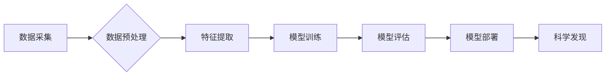

>人工智能，机器学习，深度学习，科学计算，数据分析，模式识别，预测建模

## 1. 背景介绍

人工智能（AI）技术近年来发展迅速，已从实验室走向现实生活，并在各个领域取得了显著成果。传统科学领域，作为人类文明进步的基石，也开始拥抱AI，将其作为推动科学发现和解决复杂问题的强大工具。

传统科学领域涵盖了物理学、化学、生物学、天文学等众多学科，其研究对象是自然界和社会现象的本质规律。传统科学研究往往依赖于实验、观测和理论推导等方法，耗时费力，且难以处理海量数据。而AI技术的出现，为传统科学领域带来了新的机遇和挑战。

## 2. 核心概念与联系

**2.1 AI在传统科学领域的应用**

AI技术在传统科学领域的主要应用包括：

* **数据分析和挖掘:** AI算法能够从海量实验数据、观测数据和文献中提取有价值的信息，发现隐藏的模式和规律。
* **模型构建和预测:** AI模型能够根据已有的数据构建科学模型，并对未来现象进行预测。
* **自动化实验和模拟:** AI技术可以自动化执行实验步骤，并进行科学模拟，提高研究效率和准确性。
* **知识发现和推理:** AI系统能够通过分析大量数据和知识，发现新的科学理论和推导新的科学结论。

**2.2 AI与传统科学研究方法的融合**

AI技术与传统科学研究方法的融合，将形成一种新的科学研究模式，即“数据驱动科学”。

* **数据驱动:** AI技术依赖于海量数据，而传统科学研究也越来越重视数据的收集和分析。
* **模型驱动:** AI模型能够模拟和预测科学现象，为传统科学研究提供新的视角和思路。
* **算法驱动:** AI算法能够自动执行科学任务，提高研究效率和准确性。

**2.3 AI在传统科学领域的应用架构**



## 3. 核心算法原理 & 具体操作步骤

**3.1 算法原理概述**

在传统科学领域，AI算法的应用主要集中在以下几个方面：

* **机器学习:** 机器学习算法能够从数据中学习规律，并对新数据进行预测。常见的机器学习算法包括监督学习、无监督学习和强化学习。
* **深度学习:** 深度学习算法是一种更高级的机器学习算法，它使用多层神经网络来模拟人类大脑的学习过程。深度学习算法在图像识别、自然语言处理等领域取得了突破性进展。
* **自然语言处理:** 自然语言处理算法能够理解和处理人类语言，例如文本分类、情感分析和机器翻译。

**3.2 算法步骤详解**

以机器学习算法为例，其基本步骤如下：

1. **数据收集和预处理:** 收集相关数据，并进行清洗、转换和特征工程等预处理操作。
2. **模型选择:** 根据具体任务选择合适的机器学习算法模型。
3. **模型训练:** 使用训练数据训练模型，调整模型参数，使其能够准确地预测目标变量。
4. **模型评估:** 使用测试数据评估模型的性能，例如准确率、召回率和F1-score等指标。
5. **模型部署:** 将训练好的模型部署到实际应用场景中，用于预测新数据。

**3.3 算法优缺点**

* **优点:**

    * 自动化学习，无需人工编程。
    * 能够处理海量数据，发现隐藏的模式和规律。
    * 能够不断学习和改进，提高预测精度。

* **缺点:**

    * 需要大量的数据进行训练。
    * 模型解释性较差，难以理解模型的决策过程。
    * 容易受到数据偏差的影响。

**3.4 算法应用领域**

* **药物研发:** 利用机器学习算法预测药物的活性，加速药物研发过程。
* **材料科学:** 利用深度学习算法分析材料的结构和性能，设计新型材料。
* **气候变化研究:** 利用机器学习算法分析气候数据，预测气候变化趋势。
* **生物信息学:** 利用自然语言处理算法分析生物学文献，发现新的生物学知识。

## 4. 数学模型和公式 & 详细讲解 & 举例说明

**4.1 数学模型构建**

在AI算法的应用中，数学模型扮演着至关重要的角色。数学模型能够将现实世界的问题抽象成数学语言，并通过数学运算进行分析和解决。

例如，在机器学习算法中，线性回归模型是一种常用的数学模型，其表达式为：

$$y = w_0 + w_1x_1 + w_2x_2 + ... + w_nx_n + \epsilon$$

其中：

* $y$ 是目标变量
* $x_1, x_2, ..., x_n$ 是输入特征
* $w_0, w_1, w_2, ..., w_n$ 是模型参数
* $\epsilon$ 是误差项

**4.2 公式推导过程**

线性回归模型的目标是找到最佳的模型参数，使得模型预测值与实际值之间的误差最小。常用的优化算法包括梯度下降法和随机梯度下降法。

梯度下降法的基本思想是迭代地更新模型参数，每次更新的方向是负梯度方向，即朝着误差最小化的方向前进。

**4.3 案例分析与讲解**

假设我们想要预测房价，输入特征包括房屋面积、房间数量、地理位置等。我们可以使用线性回归模型来构建房价预测模型。

通过训练数据，我们可以找到最佳的模型参数，并使用该模型预测新房子的价格。

## 5. 项目实践：代码实例和详细解释说明

**5.1 开发环境搭建**

* Python 3.x
* Jupyter Notebook
* Scikit-learn

**5.2 源代码详细实现**

```python
from sklearn.linear_model import LinearRegression
from sklearn.model_selection import train_test_split
from sklearn.metrics import mean_squared_error

# 加载数据
data = ...

# 分割数据
X_train, X_test, y_train, y_test = train_test_split(data.drop('price', axis=1), data['price'], test_size=0.2)

# 创建线性回归模型
model = LinearRegression()

# 训练模型
model.fit(X_train, y_train)

# 预测测试数据
y_pred = model.predict(X_test)

# 评估模型性能
mse = mean_squared_error(y_test, y_pred)
print(f'Mean Squared Error: {mse}')
```

**5.3 代码解读与分析**

* 使用Scikit-learn库中的LinearRegression类创建线性回归模型。
* 使用train_test_split函数将数据分割成训练集和测试集。
* 使用fit函数训练模型，将训练数据输入模型进行学习。
* 使用predict函数预测测试数据，得到模型预测结果。
* 使用mean_squared_error函数评估模型性能，计算预测值与实际值之间的均方误差。

**5.4 运行结果展示**

运行代码后，会输出模型的均方误差值，该值越小，模型的预测精度越高。

## 6. 实际应用场景

**6.1 药物研发**

AI技术可以加速药物研发过程，例如：

* **药物靶点发现:** 利用机器学习算法分析生物学数据，预测药物的潜在靶点。
* **药物设计:** 利用深度学习算法设计新型药物分子，提高药物的疗效和安全性。
* **药物筛选:** 利用机器学习算法筛选潜在的药物候选物，缩短药物筛选周期。

**6.2 材料科学**

AI技术可以帮助设计新型材料，例如：

* **材料性能预测:** 利用机器学习算法预测材料的力学性能、热性能和电性能等。
* **材料结构设计:** 利用深度学习算法设计新型材料结构，提高材料的性能和稳定性。
* **材料合成优化:** 利用机器学习算法优化材料合成工艺，提高材料的生产效率和质量。

**6.3 天文学**

AI技术可以帮助天文学家探索宇宙奥秘，例如：

* **星体分类:** 利用机器学习算法对星体进行分类，识别不同类型的星体。
* **星系演化研究:** 利用深度学习算法分析星系图像，研究星系的演化过程。
* **外星生命探测:** 利用机器学习算法分析来自外太空的信号，探测外星生命的存在。

**6.4 未来应用展望**

随着AI技术的不断发展，其在传统科学领域的应用将更加广泛和深入。未来，AI技术将帮助科学家解决更复杂的问题，推动科学发现和技术创新。

## 7. 工具和资源推荐

**7.1 学习资源推荐**

* **在线课程:** Coursera, edX, Udacity
* **书籍:**
    * "Deep Learning" by Ian Goodfellow, Yoshua Bengio, and Aaron Courville
    * "Hands-On Machine Learning with Scikit-Learn, Keras & TensorFlow" by Aurélien Géron
* **博客和网站:**
    * Towards Data Science
    * Machine Learning Mastery

**7.2 开发工具推荐**

* **Python:** 
* **Scikit-learn:** 机器学习库
* **TensorFlow:** 深度学习库
* **PyTorch:** 深度学习库
* **Jupyter Notebook:** 数据分析和可视化工具

**7.3 相关论文推荐**

* "Attention Is All You Need"
* "BERT: Pre-training of Deep Bidirectional Transformers for Language Understanding"
* "AlphaFold: A solution to a fifty-year-old grand challenge in biology"

## 8. 总结：未来发展趋势与挑战

**8.1 研究成果总结**

AI技术在传统科学领域的应用取得了显著成果，例如在药物研发、材料科学、天文学等领域取得了突破性进展。

**8.2 未来发展趋势**

* **模型更加复杂和强大:** 未来，AI模型将更加复杂和强大，能够处理更复杂的问题，并提供更准确的预测结果。
* **数据驱动的科学研究更加深入:** AI技术将推动数据驱动的科学研究，帮助科学家发现新的科学规律和理论。
* **AI与其他技术融合:** AI技术将与其他技术融合，例如量子计算、生物技术等，形成新的技术组合，推动科学技术发展。

**8.3 面临的挑战**

* **数据质量和可用性:** AI算法的性能依赖于数据的质量和可用性，而高质量的数据往往难以获取。
* **模型解释性和可信度:** 许多AI模型的决策过程难以解释，这使得模型的可信度受到质疑。
* **伦理和社会影响:** AI技术的应用可能带来伦理和社会问题，例如算法偏见、隐私泄露等，需要引起重视和解决。

**8.4 研究展望**

未来，我们需要继续探索AI技术在传统科学领域的应用，解决面临的挑战，并确保AI技术安全、可控、可持续地发展。


## 9. 附录：常见问题与解答

**9.1 如何选择合适的AI算法？**

选择合适的AI算法取决于具体的应用场景和数据特点。例如，对于分类问题，可以使用支持向量机、决策树或神经网络等算法；对于回归问题，可以使用线性回归、逻辑回归或随机森林等算法。

**9.2 如何评估AI模型的性能？**

常用的AI模型性能评估指标包括准确率、召回率、F1-score、AUC等。选择合适的评估指标取决于具体的应用场景和任务目标。

**9.3 如何解决AI模型的过拟合问题？**

过拟合是指AI模型对训练数据过拟合，导致模型在测试数据上的性能下降。常用的解决方法包括正则化、交叉验证和数据增强等。


作者：禅与计算机程序设计艺术 / Zen and the Art of Computer Programming 
<end_of_turn>