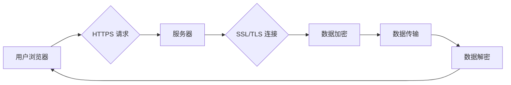

> HTTPS, SSL/TLS, 数据加密, 网络安全, 通信协议, 数字证书, 

## 1. 背景介绍

在当今数字化时代，网络安全已成为至关重要的议题。随着互联网的普及和数据量的激增，网络攻击和数据泄露的风险也日益增加。为了保护用户数据和隐私，确保网络通信的安全性和可靠性，HTTPS（Hypertext Transfer Protocol Secure）协议应运而生。

HTTPS 是一种安全的网络通信协议，它基于 HTTP 协议，并使用 SSL/TLS（Secure Sockets Layer/Transport Layer Security）协议进行数据加密。HTTPS 协议通过加密通信内容、验证服务器身份和确保数据完整性，有效地保护用户数据免受网络攻击和窃取。

## 2. 核心概念与联系

### 2.1 HTTPS 协议

HTTPS 协议是 HTTP 协议的安全扩展，它在 HTTP 协议的基础上添加了 SSL/TLS 加密机制。HTTPS 协议使用 SSL/TLS 协议建立一个安全的连接通道，确保数据在传输过程中不被窃听、篡改或伪造。

### 2.2 SSL/TLS 协议

SSL/TLS 协议是一种用于加密网络通信的标准协议。它提供了一种机制，用于建立安全的连接通道，并确保数据在传输过程中安全可靠。SSL/TLS 协议使用一系列加密算法和数字证书来实现数据加密、身份验证和数据完整性检查。

### 2.3 数字证书

数字证书是用于验证服务器身份的电子文件。数字证书由证书颁发机构（CA）签发，并包含服务器的公钥、域名信息和证书颁发机构的数字签名。浏览器会使用证书颁发机构的根证书来验证数字证书的有效性，从而确保用户访问的是真正的服务器。

**Mermaid 流程图**



## 3. 核心算法原理 & 具体操作步骤

### 3.1 算法原理概述

HTTPS 协议使用 SSL/TLS 协议进行数据加密，SSL/TLS 协议基于一系列加密算法和哈希算法，包括：

* **对称加密算法**: AES (Advanced Encryption Standard)
* **非对称加密算法**: RSA (Rivest-Shamir-Adleman)
* **哈希算法**: SHA-256 (Secure Hash Algorithm 256)

HTTPS 协议使用对称加密算法对数据进行加密，并使用非对称加密算法进行密钥交换。哈希算法用于验证数据完整性。

### 3.2 算法步骤详解

1. **建立连接**: 用户浏览器向服务器发送 HTTPS 请求，服务器响应并建立 SSL/TLS 连接。
2. **身份验证**: 服务器向浏览器发送数字证书，浏览器使用证书颁发机构的根证书验证证书的有效性。
3. **密钥交换**: 服务器和浏览器使用非对称加密算法交换一个共享密钥。
4. **数据加密**: 服务器和浏览器使用共享密钥进行对称加密，加密数据传输。
5. **数据解密**: 接收方使用共享密钥解密数据。
6. **数据完整性检查**: 服务器和浏览器使用哈希算法计算数据摘要，并将其发送给对方进行验证。

### 3.3 算法优缺点

**优点**:

* **安全性高**: HTTPS 协议使用多种加密算法和数字证书，有效地保护数据安全。
* **数据完整性**: 哈希算法确保数据在传输过程中没有被篡改。
* **身份验证**: 数字证书验证服务器身份，防止伪造攻击。

**缺点**:

* **性能开销**: 加密和解密过程需要消耗一定的计算资源，可能会影响网络性能。
* **配置复杂**: 设置 HTTPS 需要配置 SSL/TLS 证书和服务器设置。

### 3.4 算法应用领域

HTTPS 协议广泛应用于各种网络场景，例如：

* **网站安全**: HTTPS 协议用于保护网站数据和用户隐私，例如在线支付、个人信息注册等。
* **移动应用安全**: HTTPS 协议用于保护移动应用数据和通信安全。
* **云计算安全**: HTTPS 协议用于保护云计算平台数据和用户访问安全。

## 4. 数学模型和公式 & 详细讲解 & 举例说明

### 4.1 数学模型构建

SSL/TLS 协议使用数学模型来实现数据加密、身份验证和数据完整性检查。

* **非对称加密**: 使用 RSA 算法，公钥用于加密，私钥用于解密。
* **对称加密**: 使用 AES 算法，共享密钥用于加密和解密。
* **哈希函数**: 使用 SHA-256 算法，将数据转换为固定长度的哈希值。

### 4.2 公式推导过程

RSA 算法的公钥加密公式：

$$C = M^e \pmod{n}$$

其中：

* $C$ 是密文
* $M$ 是明文
* $e$ 是公钥指数
* $n$ 是模数

RSA 算法的私钥解密公式：

$$M = C^d \pmod{n}$$

其中：

* $d$ 是私钥指数

### 4.3 案例分析与讲解

假设 Alice 想发送一条消息给 Bob，Alice 使用 Bob 的公钥加密消息，Bob 使用自己的私钥解密消息。

1. Alice 获取 Bob 的公钥 $(n, e)$。
2. Alice 将消息 $M$ 加密为密文 $C$：$C = M^e \pmod{n}$。
3. Alice 发送密文 $C$ 给 Bob。
4. Bob 使用自己的私钥 $d$ 解密密文 $C$：$M = C^d \pmod{n}$。

## 5. 项目实践：代码实例和详细解释说明

### 5.1 开发环境搭建

* 操作系统: Ubuntu 20.04
* 编程语言: Python 3.8
* 依赖库: OpenSSL, Flask

### 5.2 源代码详细实现

```python
from flask import Flask, request, jsonify
from OpenSSL import SSL

app = Flask(__name__)

# SSL 证书配置
context = SSL.Context(SSL.TLS_SERVER_METHOD)
context.use_certificate_file('server.crt')
context.use_privatekey_file('server.key')

@app.route('/', methods=['GET', 'POST'])
def index():
    if request.method == 'POST':
        # 获取 POST 请求数据
        data = request.get_data()
        # 使用 SSL 加密数据
        encrypted_data = encrypt_data(data)
        # 返回加密数据
        return jsonify({'encrypted_data': encrypted_data})
    else:
        return 'Hello, World!'

def encrypt_data(data):
    # 使用 AES 加密算法加密数据
    # ...
    return encrypted_data

if __name__ == '__main__':
    app.run(ssl_context=context)
```

### 5.3 代码解读与分析

* 使用 Flask 框架构建一个简单的 Web 服务器。
* 使用 OpenSSL 库进行 SSL/TLS 加密。
* 配置 SSL 证书文件。
* 在 POST 请求中加密数据，并返回加密数据。

### 5.4 运行结果展示

运行代码后，访问 HTTPS 协议的服务器地址，可以成功访问网站并进行数据加密操作。

## 6. 实际应用场景

HTTPS 协议广泛应用于各种网络场景，例如：

* **电子商务**: HTTPS 协议用于保护在线支付交易数据安全。
* **社交媒体**: HTTPS 协议用于保护用户个人信息和隐私。
* **在线医疗**: HTTPS 协议用于保护患者医疗信息安全。
* **云存储**: HTTPS 协议用于保护用户云存储数据安全。

### 6.4 未来应用展望

随着物联网、人工智能等技术的快速发展，HTTPS 协议将面临新的挑战和机遇。

* **万物互联**: HTTPS 协议将用于保护物联网设备之间的通信安全。
* **人工智能**: HTTPS 协议将用于保护人工智能模型和数据安全。
* **区块链**: HTTPS 协议将用于保护区块链网络和数据安全。

## 7. 工具和资源推荐

### 7.1 学习资源推荐

* **书籍**:
    * "Applied Cryptography" by Bruce Schneier
    * "Cryptography Engineering" by Niels Ferguson, Bruce Schneier, and Tadayoshi Kohno
* **在线课程**:
    * Coursera: Cryptography I
    * edX: Introduction to Cryptography

### 7.2 开发工具推荐

* **OpenSSL**: 一个开源的 SSL/TLS 库。
* **Let's Encrypt**: 一个免费的 SSL/TLS 证书颁发机构。
* **Nginx**: 一个高性能的 Web 服务器软件，支持 HTTPS。

### 7.3 相关论文推荐

* "The TLS Protocol Version 1.3"
* "A Survey of Secure Socket Layer (SSL) and Transport Layer Security (TLS)"

## 8. 总结：未来发展趋势与挑战

### 8.1 研究成果总结

HTTPS 协议已成为网络安全的重要组成部分，有效地保护了用户数据和隐私。

### 8.2 未来发展趋势

* **更强的安全性**: HTTPS 协议将继续发展，以应对新的网络攻击和威胁。
* **更快的性能**: HTTPS 协议将不断优化，以提高网络性能。
* **更广泛的应用**: HTTPS 协议将应用于更多领域，例如物联网、人工智能等。

### 8.3 面临的挑战

* **证书管理**: 证书管理是一个复杂的任务，需要确保证书的有效性和安全性。
* **网络攻击**: 网络攻击者不断开发新的攻击方法，需要不断更新 HTTPS 协议以应对新的威胁。
* **用户意识**: 用户需要了解 HTTPS 协议的重要性，并采取措施保护自己的数据安全。

### 8.4 研究展望

未来，HTTPS 协议的研究将集中在以下几个方面：

* **量子计算**: 研究量子计算对 HTTPS 协议的影响，并开发相应的防御机制。
* **隐私保护**: 研究如何将隐私保护技术与 HTTPS 协议结合，以更好地保护用户隐私。
* **可信网络**: 研究如何利用 HTTPS 协议构建可信网络，以提高网络安全性和可靠性。

## 9. 附录：常见问题与解答

* **什么是 HTTPS?** HTTPS 是一种安全的网络通信协议，它基于 HTTP 协议，并使用 SSL/TLS 协议进行数据加密。
* **HTTPS 的优势是什么?** HTTPS 协议可以保护数据安全、验证服务器身份和确保数据完整性。
* **如何设置 HTTPS?** 需要配置 SSL/TLS 证书和服务器设置。
* **HTTPS 是否会影响网站性能?** HTTPS 会增加一定的性能开销，但现代浏览器和服务器已经优化了 HTTPS 的性能。


作者：禅与计算机程序设计艺术 / Zen and the Art of Computer Programming 
<end_of_turn>