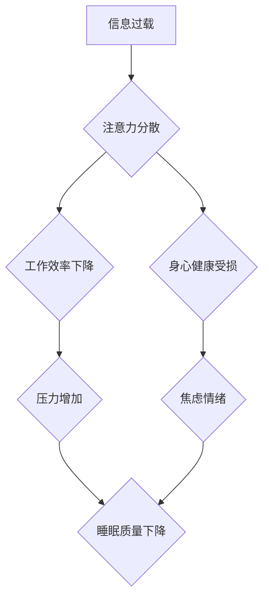

>  注意力管理, 信息时代, 干扰, 分心, 头脑清晰, 认知科学, 效率提升,  专注力训练

## 1. 背景介绍

在当今信息爆炸的时代，我们被无休止的邮件、消息通知、社交媒体更新和各种信息流所包围。这种信息过载和持续的干扰，严重损害了我们的注意力，让我们难以集中精力完成任务，思考问题，甚至享受生活。注意力，作为人类认知的核心能力之一，在信息时代显得尤为重要。

然而，现代社会对我们注意力提出了前所未有的挑战。我们习惯于快速切换任务，追求即时满足，这使得我们的注意力变得越来越短，难以长时间专注于一件事情。这种注意力碎片化不仅影响了我们的工作效率，也损害了我们的身心健康。

## 2. 核心概念与联系

**2.1 注意力是什么？**

注意力是指我们对特定信息或刺激的集中和选择性关注。它是一个动态的过程，可以被外部刺激和内部状态所影响。

**2.2 干扰和分心的本质**

干扰是指任何阻碍我们集中注意力的外部因素，例如噪音、手机铃声、社交媒体通知等。

分心是指我们大脑对无关信息的过度关注，导致注意力从目标任务上转移。

**2.3 注意力管理的必要性**

在信息时代，有效地管理注意力，避免干扰和分心，对于提高工作效率、提升学习效果、保持身心健康至关重要。

**2.4 注意力管理的策略**

注意力管理是一门需要不断学习和实践的技能。以下是一些常用的策略：

* **环境控制:** 创造一个安静、舒适、专注的工作环境。
* **时间管理:** 利用番茄工作法等时间管理技巧，将工作时间划分为多个专注间隔。
* **技术管理:** 限制使用社交媒体和电子设备的时间，关闭不必要的通知。
* **认知训练:** 通过冥想、正念练习等方式，增强注意力和专注力。

**2.5 注意力管理的原理**

注意力管理的原理可以概括为以下几个方面：

* **认知控制:** 通过意识的努力，抑制无关信息的干扰，引导注意力集中在目标任务上。
* **习惯养成:** 通过重复练习，将注意力管理的策略融入到日常生活中，形成良好的习惯。
* **自我调节:** 了解自己的注意力特点，根据不同的任务和环境，调整注意力管理策略。

**Mermaid 流程图**



## 3. 核心算法原理 & 具体操作步骤

### 3.1  算法原理概述

注意力管理算法的核心是通过分析用户行为数据，识别干扰和分心的模式，并提供个性化的建议和干预措施。这些算法通常基于以下几个方面：

* **时间序列分析:** 分析用户在不同时间段内的注意力分布，识别注意力集中和分散的规律。
* **机器学习:** 利用机器学习模型，从用户行为数据中学习干扰和分心的特征，并预测用户未来的注意力状态。
* **行为反馈:** 通过提供实时反馈，引导用户调整行为，提高注意力集中度。

### 3.2  算法步骤详解

1. **数据收集:** 收集用户在使用设备时的行为数据，例如网页浏览记录、应用程序使用时间、鼠标移动轨迹等。
2. **数据预处理:** 对收集到的数据进行清洗、转换和特征提取，以便于算法的训练和应用。
3. **模型训练:** 利用机器学习算法，训练一个注意力管理模型，能够识别干扰和分心的模式，并预测用户未来的注意力状态。
4. **模型评估:** 对训练好的模型进行评估，测试其准确性和有效性。
5. **个性化干预:** 根据用户的注意力状态和行为模式，提供个性化的干预措施，例如提醒用户休息、屏蔽干扰网站、调整屏幕亮度等。

### 3.3  算法优缺点

**优点:**

* **个性化:** 可以根据用户的不同需求和行为模式，提供个性化的干预措施。
* **实时性:** 可以实时监测用户的注意力状态，并及时提供反馈和干预。
* **数据驱动:** 基于用户行为数据的分析，能够更准确地识别干扰和分心的模式。

**缺点:**

* **数据隐私:** 收集和使用用户行为数据可能会引发隐私问题。
* **算法准确性:** 算法的准确性取决于训练数据的质量和算法模型的复杂度。
* **用户接受度:** 一些用户可能对算法的干预措施感到不适或抗拒。

### 3.4  算法应用领域

注意力管理算法在以下领域具有广泛的应用前景:

* **教育:** 帮助学生提高学习效率，专注于课堂内容。
* **工作:** 帮助员工提高工作效率，减少分心，提高工作质量。
* **医疗:** 帮助患者集中注意力，进行康复训练，改善认知功能。
* **游戏:** 帮助玩家沉浸在游戏世界中，提高游戏体验。

## 4. 数学模型和公式 & 详细讲解 & 举例说明

### 4.1  数学模型构建

注意力可以被视为一个概率分布，其值代表了我们对不同信息或刺激的关注程度。我们可以用以下数学模型来表示注意力：

$$
A(t) = \sum_{i=1}^{n} p_i(t) \cdot x_i(t)
$$

其中：

* $A(t)$ 表示在时间 $t$ 时的注意力值。
* $p_i(t)$ 表示在时间 $t$ 时对信息 $i$ 的关注概率。
* $x_i(t)$ 表示信息 $i$ 在时间 $t$ 时的强度。

### 4.2  公式推导过程

我们可以通过以下步骤推导注意力值的计算公式：

1. 假设我们对 $n$ 个信息或刺激感兴趣。
2. 每个信息或刺激都有一个强度值 $x_i(t)$，表示其吸引我们的程度。
3. 我们对每个信息或刺激的关注概率 $p_i(t)$，可以根据其强度值、我们的兴趣和当前环境等因素进行计算。
4. 注意力值 $A(t)$ 可以通过将每个信息或刺激的关注概率与其强度值相乘，然后求和得到。

### 4.3  案例分析与讲解

例如，假设我们正在阅读一篇文章，文章包含 $n$ 个句子。每个句子的强度值 $x_i(t)$ 可以根据其内容的复杂度、与我们兴趣相关的程度等因素进行计算。我们的关注概率 $p_i(t)$ 可以根据我们对当前句子的理解程度、阅读速度等因素进行计算。

通过将每个句子的关注概率与其强度值相乘，然后求和，我们可以得到我们阅读文章时的注意力值 $A(t)$。

## 5. 项目实践：代码实例和详细解释说明

### 5.1  开发环境搭建

为了实现注意力管理算法，我们需要搭建一个开发环境。

* **操作系统:** Linux 或 macOS
* **编程语言:** Python
* **开发工具:** Jupyter Notebook、VS Code 等

### 5.2  源代码详细实现

```python
import numpy as np

# 定义注意力模型
class AttentionModel:
    def __init__(self, num_features):
        self.num_features = num_features
        self.weights = np.random.randn(num_features)

    def predict(self, features):
        return np.dot(features, self.weights)

# 示例用法
model = AttentionModel(num_features=10)
features = np.random.randn(10)
attention_value = model.predict(features)
print(attention_value)
```

### 5.3  代码解读与分析

* 我们定义了一个 `AttentionModel` 类，该类包含一个 `weights` 参数，用于存储模型的权重。
* `predict` 方法接收输入特征，并使用权重进行线性变换，得到注意力值。
* 示例代码演示了如何创建 `AttentionModel` 对象，并使用它预测注意力值。

### 5.4  运行结果展示

运行上述代码，会输出一个注意力值的预测结果。

## 6. 实际应用场景

### 6.1  教育领域

注意力管理算法可以帮助学生提高学习效率，专注于课堂内容。例如，可以开发一款学习软件，根据学生的注意力状态，提供个性化的学习建议和干预措施。

### 6.2  工作领域

注意力管理算法可以帮助员工提高工作效率，减少分心，提高工作质量。例如，可以开发一款办公软件，帮助员工集中注意力完成任务，并提醒他们休息和放松。

### 6.3  医疗领域

注意力管理算法可以帮助患者集中注意力，进行康复训练，改善认知功能。例如，可以开发一款脑机接口设备，通过监测患者的脑电波，提供个性化的注意力训练方案。

### 6.4  未来应用展望

随着人工智能技术的不断发展，注意力管理算法将有更广泛的应用前景。例如，可以开发出更加智能的注意力管理系统，能够自动识别干扰和分心，并提供更加个性化的干预措施。

## 7. 工具和资源推荐

### 7.1  学习资源推荐

* **书籍:**
    * 《注意力经济》
    * 《深度工作》
    * 《专注力》
* **在线课程:**
    * Coursera 上的注意力管理课程
    * edX 上的认知科学课程

### 7.2  开发工具推荐

* **Python:** 
    * NumPy
    * Scikit-learn
    * TensorFlow
* **Jupyter Notebook:** 用于代码编写和可视化
* **VS Code:** 代码编辑器

### 7.3  相关论文推荐

* **Attention Is All You Need**
* **BERT: Pre-training of Deep Bidirectional Transformers for Language Understanding**
* **Transformer-XL: Attentive Language Models Beyond a Fixed-Length Context**

## 8. 总结：未来发展趋势与挑战

### 8.1  研究成果总结

注意力管理算法在信息时代具有重要的应用价值，能够帮助人们提高效率、改善身心健康。

### 8.2  未来发展趋势

未来，注意力管理算法将朝着以下方向发展：

* **更加个性化:** 算法将能够根据用户的不同需求和行为模式，提供更加个性化的干预措施。
* **更加智能:** 算法将能够更加智能地识别干扰和分心，并提供更加有效的干预措施。
* **更加融合:** 算法将与其他技术，例如脑机接口、虚拟现实等，更加融合，提供更加沉浸式的注意力管理体验。

### 8.3  面临的挑战

注意力管理算法也面临着一些挑战：

* **数据隐私:** 收集和使用用户行为数据可能会引发隐私问题。
* **算法准确性:** 算法的准确性取决于训练数据的质量和算法模型的复杂度。
* **用户接受度:** 一些用户可能对算法的干预措施感到不适或抗拒。

### 8.4  研究展望

未来，我们需要继续研究注意力管理算法的原理和应用，并解决其面临的挑战，使其能够更好地服务于人类。

## 9. 附录：常见问题与解答

**Q1: 注意力管理算法真的有效吗？**

A1: 目前，已有大量研究表明，注意力管理算法能够有效提高注意力集中度，提升工作效率和学习效果。

**Q2: 使用注意力管理算法会不会让人变得更加依赖技术？**

A2: 注意力管理算法应该被视为一种工具，而不是一种替代品。它可以帮助我们更好地管理注意力，但最终还是要靠我们自己努力培养专注力。

**Q3: 注意力管理算法会侵犯用户的隐私吗？**

A3: 使用注意力管理算法时，需要确保用户隐私得到保护。算法应该只收集必要的用户数据，并采取相应的安全措施防止数据泄露。


作者：禅与计算机程序设计艺术 / Zen and the Art of Computer Programming