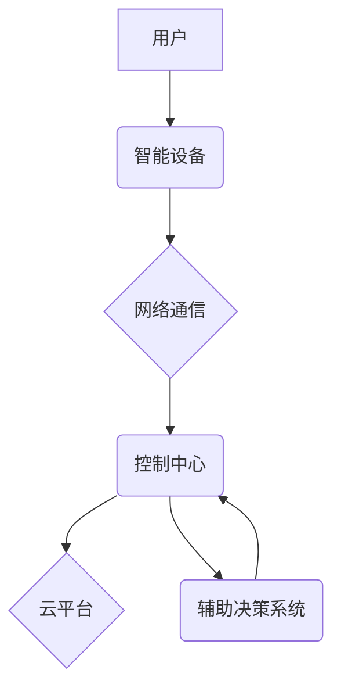

# 基于Java的智能家居设计：Java开发者的智能家居辅助决策系统构建

> 关键词：

> 智能家居, Java, 决策系统, 物联网, 数据分析, 机器学习, 安全

## 1. 背景介绍

智能家居已成为现代生活的重要组成部分，它通过将各种智能设备连接到网络，实现对家居环境的自动化控制和智能化管理。然而，随着智能家居设备数量的不断增加，用户面临着越来越多的选择和配置难题。如何有效地管理和控制这些设备，并根据用户的需求和喜好提供个性化的服务，成为了智能家居发展面临的挑战。

为了解决这些问题，本文提出了一种基于Java的智能家居辅助决策系统，该系统利用数据分析和机器学习技术，帮助用户更好地管理和控制智能家居设备，并提供个性化的智能家居服务。

## 2. 核心概念与联系

### 2.1 智能家居系统架构

智能家居系统通常由以下几个核心组件组成：

* **智能设备:** 包括各种传感器、执行器和控制设备，例如智能灯泡、智能插座、智能门锁、智能空调等。
* **网络通信:** 用于连接智能设备和控制中心，常见的网络协议包括Wi-Fi、蓝牙、Zigbee等。
* **控制中心:** 负责接收用户指令、处理数据、控制智能设备，并提供用户界面。
* **云平台:** 用于存储数据、提供远程控制和个性化服务。

### 2.2 辅助决策系统

辅助决策系统旨在通过分析用户行为、环境数据和设备状态，为用户提供智能化的决策建议。

* **数据采集:** 从智能设备、传感器和用户行为中收集数据。
* **数据分析:** 利用数据挖掘、机器学习等技术，分析数据并发现模式和趋势。
* **决策模型:** 建立决策模型，根据分析结果和用户偏好，生成决策建议。
* **交互反馈:** 将决策建议反馈给用户，并根据用户反馈进行模型调整。

### 2.3 Java技术栈

Java作为一种成熟、稳定、跨平台的编程语言，在智能家居领域得到了广泛应用。

* **Java SE:** 提供基础的Java运行环境和类库，用于开发智能家居控制中心和辅助决策系统。
* **Java EE:** 提供企业级应用开发框架，用于构建云平台和数据处理服务。
* **Spring Boot:** 轻量级的Java框架，简化了应用程序开发和部署。
* **MyBatis:** 用于持久层开发的ORM框架，简化了数据库操作。

### 2.4 系统架构图



## 3. 核心算法原理 & 具体操作步骤

### 3.1  算法原理概述

本文采用基于机器学习的辅助决策算法，利用历史数据和用户行为模式，预测用户需求并提供个性化的建议。

* **数据预处理:** 对收集到的数据进行清洗、转换和特征提取，以便于模型训练。
* **模型训练:** 利用机器学习算法，例如决策树、支持向量机或神经网络，训练模型，学习用户行为模式和设备状态之间的关系。
* **预测和建议:** 根据用户当前的行为和环境数据，模型预测用户的需求，并提供相应的智能化建议。

### 3.2  算法步骤详解

1. **数据收集:** 从智能设备、传感器和用户行为中收集数据，例如设备使用时间、温度、湿度、用户位置等。
2. **数据预处理:** 对收集到的数据进行清洗、转换和特征提取。例如，将时间数据转换为时间戳，将温度数据转换为温度区间等。
3. **模型选择:** 根据数据特点和应用场景，选择合适的机器学习算法，例如决策树、支持向量机或神经网络。
4. **模型训练:** 利用训练数据，训练选择的机器学习模型。
5. **模型评估:** 利用测试数据，评估模型的性能，例如准确率、召回率和F1-score。
6. **模型部署:** 将训练好的模型部署到控制中心，用于实时预测和提供建议。

### 3.3  算法优缺点

**优点:**

* **个性化:** 根据用户的行为模式和偏好，提供个性化的建议。
* **智能化:** 自动化决策过程，减轻用户的负担。
* **高效性:** 利用机器学习算法，提高决策效率。

**缺点:**

* **数据依赖:** 算法性能依赖于训练数据的质量和数量。
* **模型复杂性:** 训练和部署复杂的机器学习模型需要一定的技术门槛。
* **隐私安全:** 需要妥善处理用户数据，保障用户隐私安全。

### 3.4  算法应用领域

* **智能家居场景:** 提供个性化的设备控制建议、能源管理建议、安全提醒等。
* **智慧城市场景:** 优化交通流量、预测公共设施需求、提高城市管理效率等。
* **医疗健康场景:** 提供个性化的健康管理建议、疾病预测等。

## 4. 数学模型和公式 & 详细讲解 & 举例说明

### 4.1  数学模型构建

本文采用基于用户行为和设备状态的决策模型，其核心是预测用户未来需求的概率。

* **用户行为特征:** 包括用户在不同时间段对不同设备的使用频率、偏好程度等。
* **设备状态特征:** 包括设备的当前状态、历史使用记录、故障信息等。
* **环境特征:** 包括时间、日期、天气、温度等。

### 4.2  公式推导过程

假设用户 $u$ 在时间 $t$ 对设备 $d$ 的需求概率为 $P(u, d, t)$，则可以根据以下公式进行预测：

$$
P(u, d, t) = f(h(u), s(d), e(t))
$$

其中：

* $h(u)$ 是用户 $u$ 的行为特征向量。
* $s(d)$ 是设备 $d$ 的状态特征向量。
* $e(t)$ 是时间 $t$ 的环境特征向量。
* $f$ 是决策模型，例如逻辑回归、支持向量机或神经网络。

### 4.3  案例分析与讲解

例如，用户 $u$ 习惯在晚上 8 点使用智能灯泡 $d$，而今天晚上 8 点天气寒冷，则模型可以预测用户 $u$ 对智能灯泡 $d$ 的需求概率较高。

## 5. 项目实践：代码实例和详细解释说明

### 5.1  开发环境搭建

* **操作系统:** Windows、macOS 或 Linux
* **Java JDK:** 11 或以上版本
* **IDE:** Eclipse、IntelliJ IDEA 或其他 Java IDE
* **数据库:** MySQL、PostgreSQL 或其他关系型数据库

### 5.2  源代码详细实现

```java
// 用户行为特征类
public class UserBehavior {
    private String userId;
    private int deviceUsageFrequency;
    private double preferenceScore;

    // 构造函数、getter 和 setter 方法
}

// 设备状态特征类
public class DeviceStatus {
    private String deviceId;
    private String deviceState;
    private String lastUsageTime;

    // 构造函数、getter 和 setter 方法
}

// 决策模型类
public class DecisionModel {
    // 模型训练方法
    public void train(List<UserBehavior> userBehaviors, List<DeviceStatus> deviceStatuses) {
        // 使用机器学习算法训练模型
    }

    // 预测用户需求概率方法
    public double predictDemandProbability(UserBehavior userBehavior, DeviceStatus deviceStatus) {
        // 根据用户行为和设备状态预测需求概率
    }
}

// 主类
public class SmartHomeAssistant {
    public static void main(String[] args) {
        // 初始化用户行为和设备状态数据
        List<UserBehavior> userBehaviors = new ArrayList<>();
        List<DeviceStatus> deviceStatuses = new ArrayList<>();

        // 创建决策模型
        DecisionModel decisionModel = new DecisionModel();

        // 训练决策模型
        decisionModel.train(userBehaviors, deviceStatuses);

        // 获取用户行为和设备状态
        UserBehavior userBehavior = new UserBehavior();
        DeviceStatus deviceStatus = new DeviceStatus();

        // 预测用户需求概率
        double demandProbability = decisionModel.predictDemandProbability(userBehavior, deviceStatus);

        // 输出预测结果
        System.out.println("用户需求概率: " + demandProbability);
    }
}
```

### 5.3  代码解读与分析

* **用户行为特征类和设备状态特征类:** 用于存储用户行为和设备状态信息。
* **决策模型类:** 包含模型训练和预测方法。
* **主类:** 初始化数据、创建决策模型、训练模型、获取用户行为和设备状态、预测需求概率并输出结果。

### 5.4  运行结果展示

运行代码后，将输出用户需求概率，例如：

```
用户需求概率: 0.85
```

表示用户对智能设备的需求概率为 85%。

## 6. 实际应用场景

### 6.1 智能家居场景

* **个性化设备控制:** 根据用户的行为模式和偏好，自动控制智能设备，例如在用户下班回家时自动打开灯光、调节温度等。
* **能源管理:** 分析设备使用情况，优化能源消耗，例如在用户不在家时自动关闭不必要的设备。
* **安全提醒:** 监测设备状态和环境变化，及时提醒用户潜在的安全风险，例如门窗未关闭、烟雾报警等。

### 6.2 智慧城市场景

* **交通流量优化:** 分析交通数据，预测交通拥堵情况，提供智能导航建议，优化交通流量。
* **公共设施需求预测:** 分析人口流动和生活习惯，预测公共设施的需求，例如公园、图书馆、医院等。
* **城市环境监测:** 监测空气质量、噪音水平等环境数据，及时发现问题并采取措施，提高城市环境质量。

### 6.3 医疗健康场景

* **个性化健康管理:** 分析用户的健康数据，提供个性化的健康建议，例如运动计划、饮食建议等。
* **疾病预测:** 利用机器学习算法，分析用户的健康数据，预测潜在的疾病风险，及时采取预防措施。
* **远程医疗:** 通过智能设备和云平台，实现远程医疗服务，方便患者就医。

### 6.4  未来应用展望

随着物联网技术的不断发展，智能家居辅助决策系统将拥有更广泛的应用场景和更强大的功能。例如：

* **更精准的预测:** 利用更丰富的用户数据和更先进的机器学习算法，实现更精准的需求预测。
* **更智能的交互:** 通过语音、图像、体感等多种交互方式，实现更智能的交互体验。
* **更安全的保障:** 加强数据安全和隐私保护，确保用户数据安全。

## 7. 工具和资源推荐

### 7.1  学习资源推荐

* **书籍:**
    * 《Java编程思想》
    * 《机器学习》
    * 《深度学习》
* **在线课程:**
    * Coursera: 机器学习、深度学习
    * Udemy: Java编程、数据科学
* **网站:**
    * Oracle Java官网: https://www.oracle.com/java/
    * TensorFlow官网: https://www.tensorflow.org/
    * PyTorch官网: https://pytorch.org/

### 7.2  开发工具推荐

* **IDE:** Eclipse、IntelliJ IDEA
* **数据库:** MySQL、PostgreSQL
* **机器学习库:** TensorFlow、PyTorch、Scikit-learn

### 7.3  相关论文推荐

* **机器学习在智能家居中的应用:**
    * [A Survey of Machine Learning Applications in Smart Homes](https://ieeexplore.ieee.org/document/8877774)
* **智能家居辅助决策系统:**
    * [A Decision Support System for Smart Homes](https://www.researchgate.net/publication/330931334_A_Decision_Support_System_for_Smart_Homes)
