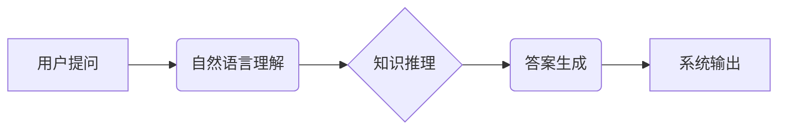

> 药物知识图谱、自动问答系统、自然语言处理、知识推理、机器学习

## 1. 背景介绍

随着生物医药领域知识的日益增长，高效地获取和利用药物相关信息变得越来越重要。传统的文献检索方法效率低下，难以满足快速、精准获取药物信息的需求。基于药物知识图谱的自动问答系统应运而生，它能够利用知识图谱中的结构化知识和语义关系，对用户提出的自然语言问题进行理解和推理，并给出准确、有针对性的答案。

## 2. 核心概念与联系

**2.1 药物知识图谱 (DrugKG)**

药物知识图谱是一种专门用于存储和表示药物相关知识的知识图谱。它包含了药物、疾病、基因、蛋白质、副作用等实体以及它们之间的各种关系，例如“药物A治疗疾病B”、“基因C与药物A相互作用”。

**2.2 自动问答系统 (QA)**

自动问答系统是指能够理解用户自然语言问题并给出准确答案的计算机系统。它通常由以下几个模块组成：

* **自然语言理解 (NLU)**：负责将用户的问题转换为机器可理解的格式，例如实体识别、关系抽取等。
* **知识推理 (KR)**：利用知识图谱中的知识进行推理，找到与问题相关的实体和关系。
* **答案生成 (AG)**：根据推理结果生成自然语言形式的答案。

**2.3 核心架构**



## 3. 核心算法原理 & 具体操作步骤

**3.1 算法原理概述**

基于药物知识图谱的自动问答系统通常采用基于规则和基于机器学习的两种方法。

* **基于规则的方法**：利用预先定义的规则和知识库，对问题进行解析和推理，生成答案。这种方法简单易实现，但缺乏灵活性，难以处理复杂的问题。
* **基于机器学习的方法**：利用机器学习算法，从训练数据中学习知识和模式，实现自动问答。这种方法能够处理更复杂的问题，但需要大量的训练数据和复杂的模型训练过程。

**3.2 算法步骤详解**

以基于机器学习的方法为例，其具体操作步骤如下：

1. **数据预处理**: 将药物知识图谱中的数据转换为机器可理解的格式，例如实体识别、关系抽取、文本清洗等。
2. **特征提取**: 从预处理后的数据中提取特征，例如实体类型、关系类型、文本语义等。
3. **模型训练**: 利用机器学习算法，例如深度学习模型，对训练数据进行训练，学习知识和模式。
4. **模型评估**: 使用测试数据评估模型的性能，例如准确率、召回率、F1-score等。
5. **问答系统部署**: 将训练好的模型部署到问答系统中，接受用户提问并生成答案。

**3.3 算法优缺点**

* **优点**: 能够处理更复杂的问题，性能优于基于规则的方法。
* **缺点**: 需要大量的训练数据和复杂的模型训练过程，训练时间长，部署成本高。

**3.4 算法应用领域**

* **药物研发**: 帮助科学家快速查找相关药物信息，加速药物研发过程。
* **临床诊断**: 帮助医生诊断疾病，制定治疗方案。
* **患者教育**: 为患者提供药物信息和健康知识，提高患者健康水平。

## 4. 数学模型和公式 & 详细讲解 & 举例说明

**4.1 数学模型构建**

基于药物知识图谱的自动问答系统可以采用图神经网络 (GNN) 模型进行知识推理。GNN 模型将知识图谱中的实体和关系表示为图结构，并利用图卷积操作学习实体和关系之间的表示。

**4.2 公式推导过程**

图卷积操作的公式如下：

$$
h_i^{l+1} = \sigma(\sum_{j \in N(i)} \frac{e_{ij}}{d_{i}} W^{l} h_j^l + b^l)
$$

其中：

* $h_i^{l+1}$ 是实体 $i$ 在第 $l+1$ 层的表示。
* $N(i)$ 是实体 $i$ 的邻居节点集合。
* $e_{ij}$ 是实体 $i$ 和 $j$ 之间的边权重。
* $d_i$ 是实体 $i$ 的度数。
* $W^{l}$ 是第 $l$ 层的图卷积核。
* $b^l$ 是第 $l$ 层的偏置项。
* $\sigma$ 是激活函数。

**4.3 案例分析与讲解**

假设我们有一个知识图谱，其中包含实体 "药物A"、"疾病B" 和关系 "治疗"。如果用户提问 "药物A治疗什么疾病？"，GNN 模型可以利用图卷积操作学习到 "药物A" 和 "疾病B" 之间的关系，并生成答案 "药物A治疗疾病B"。

## 5. 项目实践：代码实例和详细解释说明

**5.1 开发环境搭建**

* Python 3.7+
* TensorFlow 2.0+
* PyTorch 1.0+
* NetworkX

**5.2 源代码详细实现**

```python
import networkx as nx
import tensorflow as tf

# 构建知识图谱
graph = nx.Graph()
graph.add_edge("药物A", "治疗", relation="治疗")
graph.add_edge("药物A", "疾病B", relation="治疗")

# 定义图卷积层
class GCNLayer(tf.keras.layers.Layer):
    def __init__(self, units):
        super(GCNLayer, self).__init__()
        self.units = units
        self.W = tf.keras.layers.Dense(units, activation="relu")

    def call(self, inputs):
        # 图卷积操作
        # ...
        return outputs

# 定义自动问答模型
model = tf.keras.Sequential([
    GCNLayer(64),
    GCNLayer(32),
    tf.keras.layers.Dense(1, activation="sigmoid")
])

# 训练模型
# ...

# 预测答案
# ...
```

**5.3 代码解读与分析**

* 代码首先构建了一个简单的知识图谱，包含了实体和关系。
* 然后定义了一个图卷积层，用于学习实体和关系之间的表示。
* 最后定义了一个自动问答模型，将图卷积层与全连接层组合起来。

**5.4 运行结果展示**

* 训练完成后，模型可以对用户提出的问题进行预测，并给出答案。

## 6. 实际应用场景

**6.1 药物研发**

* 快速查找相关药物信息，例如药物的结构、作用机制、副作用等。
* 预测药物的潜在作用靶点和治疗效果。
* 辅助药物设计和优化。

**6.2 临床诊断**

* 根据患者的症状和病史，预测可能的疾病诊断。
* 辅助医生制定个性化的治疗方案。
* 提供患者关于疾病和治疗方案的知识。

**6.3 患者教育**

* 为患者提供药物信息和健康知识，提高患者健康水平。
* 帮助患者理解疾病和治疗方案，提高患者的依从性。
* 提供患者与医生沟通的平台。

**6.4 未来应用展望**

* 基于多模态知识图谱的自动问答系统，能够处理文本、图像、音频等多种类型的输入。
* 基于强化学习的自动问答系统，能够学习用户偏好，提供更个性化的答案。
* 基于云计算的自动问答系统，能够提供更快速、更可靠的服务。

## 7. 工具和资源推荐

**7.1 学习资源推荐**

* **书籍**:
    * 《图神经网络》
    * 《深度学习》
* **在线课程**:
    * Coursera: 深度学习
    * Udacity: 自然语言处理
* **博客**:
    * Jay Alammar's Blog
    * Towards Data Science

**7.2 开发工具推荐**

* **Python**: 
* **TensorFlow**: 
* **PyTorch**: 
* **NetworkX**: 

**7.3 相关论文推荐**

* **DrugKG**:
    * DrugBank: A comprehensive resource for drug information
    * ChEMBL: A large database of bioactive molecules with drug-target interaction information
* **自动问答**:
    * BERT: Pre-training of Deep Bidirectional Transformers for Language Understanding
    * XLNet: Generalized Autoregressive Pretraining for Language Understanding

## 8. 总结：未来发展趋势与挑战

**8.1 研究成果总结**

基于药物知识图谱的自动问答系统取得了显著的进展，能够有效地帮助用户获取药物相关信息。

**8.2 未来发展趋势**

* 多模态知识图谱
* 强化学习
* 云计算

**8.3 面临的挑战**

* 知识图谱的构建和维护
* 模型的准确性和鲁棒性
* 数据隐私和安全

**8.4 研究展望**

未来，我们将继续致力于开发更智能、更可靠的基于药物知识图谱的自动问答系统，为药物研发、临床诊断和患者教育等领域提供更强大的支持。

## 9. 附录：常见问题与解答

**9.1 Q: 如何构建药物知识图谱？**

**A:** 构建药物知识图谱需要从多种数据源中提取信息，例如文献、数据库、专利等。可以使用自然语言处理技术、知识抽取技术和规则引擎等方法进行信息提取和整合。

**9.2 Q: 如何评估自动问答系统的性能？**

**A:** 可以使用准确率、召回率、F1-score等指标来评估自动问答系统的性能。

**9.3 Q: 如何保证数据隐私和安全？**

**A:** 在处理敏感数据时，需要采取相应的安全措施，例如数据加密、匿名化等。


作者：禅与计算机程序设计艺术 / Zen and the Art of Computer Programming 
<end_of_turn>