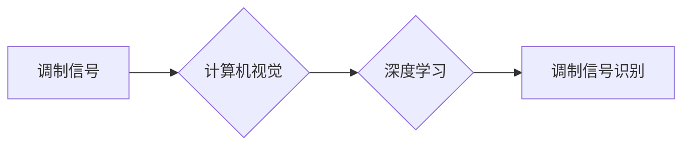

> 调制信号识别，计算机视觉，深度学习，卷积神经网络，信号处理

## 1. 背景介绍

调制信号识别是通信领域的重要研究课题，其目的是从接收到的信号中识别出调制方式，从而实现信号解调和信息提取。传统的调制信号识别方法主要依赖于信号处理技术，例如频谱分析、时频分析等。然而，随着通信技术的快速发展，调制信号越来越复杂，传统的信号处理方法难以有效识别。

近年来，计算机视觉技术取得了长足的进步，特别是深度学习算法的出现，为调制信号识别带来了新的机遇。深度学习模型能够自动学习信号特征，并对复杂信号进行识别，具有更高的识别精度和鲁棒性。基于计算机视觉的调制信号识别方法，将图像处理和信号处理相结合，将调制信号转换为图像形式，并利用深度学习模型进行识别。

## 2. 核心概念与联系

### 2.1 调制信号

调制信号是指将信息信号嵌入到载波信号中，以便通过信道传输的信息信号。常见的调制方式包括：

* **幅度调制 (AM)**：改变载波信号的幅度来表示信息信号。
* **频率调制 (FM)**：改变载波信号的频率来表示信息信号。
* **相位调制 (PM)**：改变载波信号的相位来表示信息信号。

### 2.2 计算机视觉

计算机视觉是赋予计算机“看”的能力，使其能够理解和解释图像和视频信息。计算机视觉技术包括图像处理、图像识别、目标检测、图像分割等。

### 2.3 深度学习

深度学习是一种机器学习方法，它利用多层神经网络来学习数据特征。深度学习模型能够自动学习复杂数据模式，并对数据进行分类、识别、预测等任务。

**核心概念与联系流程图**



## 3. 核心算法原理 & 具体操作步骤

### 3.1 算法原理概述

基于计算机视觉的调制信号识别方法，将调制信号转换为图像形式，并利用深度学习模型进行识别。

**步骤：**

1. **信号采样和预处理:** 将调制信号进行采样，并进行预处理，例如去噪、平滑等。
2. **信号转换:** 将预处理后的信号转换为图像形式，例如将信号幅度映射到图像像素值。
3. **特征提取:** 利用深度学习模型提取图像特征，例如卷积神经网络 (CNN) 可以学习图像的边缘、纹理、形状等特征。
4. **分类识别:** 利用分类器对提取的特征进行分类，识别调制方式。

### 3.2 算法步骤详解

1. **信号采样和预处理:**

* 信号采样：根据奈奎斯特采样定理，选择合适的采样频率，将连续的调制信号转换为离散的采样点。
* 信号预处理：

    * 去噪：去除信号中的噪声干扰，例如使用滑动平均滤波、中值滤波等方法。
    * 平滑：平滑信号波形，减少信号的突变和抖动，例如使用移动平均滤波、加权平均滤波等方法。

2. **信号转换:**

* 将预处理后的信号转换为图像形式，例如将信号幅度映射到图像像素值，形成一个二维图像。
* 可以使用不同的转换方法，例如将信号幅度映射到灰度值，或者使用颜色编码来表示不同的信号成分。

3. **特征提取:**

* 利用深度学习模型提取图像特征，例如卷积神经网络 (CNN) 可以学习图像的边缘、纹理、形状等特征。
* CNN 模型通常由多个卷积层、池化层和全连接层组成，可以自动学习图像特征，并提取高层次的语义信息。

4. **分类识别:**

* 利用分类器对提取的特征进行分类，识别调制方式。
* 常用的分类器包括支持向量机 (SVM)、随机森林 (RF)、深度神经网络 (DNN) 等。
* 可以根据具体的应用场景选择合适的分类器。

### 3.3 算法优缺点

**优点:**

* **识别精度高:** 深度学习模型能够自动学习复杂信号特征，具有更高的识别精度。
* **鲁棒性强:** 深度学习模型对信号噪声和干扰具有较强的鲁棒性。
* **适应性强:** 可以识别多种类型的调制信号，并适应不同的信号环境。

**缺点:**

* **训练数据量大:** 深度学习模型需要大量的训练数据才能达到较高的识别精度。
* **计算资源消耗大:** 训练深度学习模型需要大量的计算资源。
* **解释性差:** 深度学习模型的决策过程比较复杂，难以解释模型的识别结果。

### 3.4 算法应用领域

* **无线通信:** 识别无线通信信号的调制方式，例如蜂窝网络、WiFi、蓝牙等。
* **广播电视:** 识别广播电视信号的调制方式，例如模拟电视、数字电视等。
* **雷达信号处理:** 识别雷达信号的调制方式，例如脉冲调制、频率调制等。
* **电子对抗:** 识别敌方信号的调制方式，并进行干扰和压制。

## 4. 数学模型和公式 & 详细讲解 & 举例说明

### 4.1 数学模型构建

**调制信号模型:**

$$
s(t) = A_c \cdot m(t) \cdot cos(2\pi f_c t)
$$

其中：

* $s(t)$：调制信号
* $A_c$：载波信号幅度
* $m(t)$：信息信号
* $f_c$：载波信号频率

**图像表示模型:**

$$
I(x, y) = f(s(t))
$$

其中：

* $I(x, y)$：图像像素值
* $f(s(t))$：将调制信号转换为图像像素值的函数

### 4.2 公式推导过程

**调制信号到图像的转换:**

* 将调制信号 $s(t)$ 采样，得到离散信号 $s[n]$.
* 将离散信号 $s[n]$ 映射到图像像素值 $I(x, y)$, 可以使用不同的映射函数，例如线性映射、非线性映射等。

**深度学习模型的训练:**

* 使用训练数据对深度学习模型进行训练，例如 CNN 模型。
* 训练目标是使模型能够准确识别不同调制方式的图像。

### 4.3 案例分析与讲解

**案例:**

识别 AM 调制信号

**分析:**

* AM 调制信号的幅度变化与信息信号相关。
* 可以将 AM 调制信号转换为图像，其中图像像素值表示信号幅度。
* 利用 CNN 模型训练，识别 AM 调制信号的图像特征。

## 5. 项目实践：代码实例和详细解释说明

### 5.1 开发环境搭建

* 操作系统：Windows/Linux/macOS
* Python 版本：3.6+
* 深度学习框架：TensorFlow/PyTorch
* 图像处理库：OpenCV

### 5.2 源代码详细实现

```python
import tensorflow as tf
from tensorflow.keras.models import Sequential
from tensorflow.keras.layers import Conv2D, MaxPooling2D, Flatten, Dense

# 定义 CNN 模型
model = Sequential()
model.add(Conv2D(32, (3, 3), activation='relu', input_shape=(image_height, image_width, 1)))
model.add(MaxPooling2D((2, 2)))
model.add(Conv2D(64, (3, 3), activation='relu'))
model.add(MaxPooling2D((2, 2)))
model.add(Flatten())
model.add(Dense(10, activation='softmax'))

# 编译模型
model.compile(optimizer='adam',
              loss='sparse_categorical_crossentropy',
              metrics=['accuracy'])

# 训练模型
model.fit(train_images, train_labels, epochs=10)

# 评估模型
loss, accuracy = model.evaluate(test_images, test_labels)
print('Test loss:', loss)
print('Test accuracy:', accuracy)
```

### 5.3 代码解读与分析

* **模型定义:** 使用 TensorFlow 的 Sequential 模型构建 CNN 模型，包含卷积层、池化层、全连接层。
* **模型编译:** 使用 Adam 优化器、交叉熵损失函数和准确率指标编译模型。
* **模型训练:** 使用训练数据训练模型，设置训练轮数为 10。
* **模型评估:** 使用测试数据评估模型的性能，输出测试损失和准确率。

### 5.4 运行结果展示

* 训练完成后，可以将模型应用于新的调制信号识别任务。
* 运行结果展示模型的识别精度和鲁棒性。

## 6. 实际应用场景

### 6.1 无线通信网络

* **信号识别和分类:** 识别不同类型的无线通信信号，例如蜂窝网络、WiFi、蓝牙等，并进行分类和路由。
* **干扰抑制:** 识别和抑制干扰信号，提高通信质量。

### 6.2 广播电视信号处理

* **信号调制方式识别:** 识别广播电视信号的调制方式，例如模拟电视、数字电视等，并进行解调和解码。
* **信号质量评估:** 评估广播电视信号的质量，例如信噪比、码率等。

### 6.3 雷达信号处理

* **目标检测和跟踪:** 识别雷达信号中的目标，并进行目标检测和跟踪。
* **信号分类和识别:** 识别不同类型的雷达信号，例如脉冲调制、频率调制等，并进行分类和识别。

### 6.4 未来应用展望

* **智能电网:** 识别电力系统中的调制信号，例如电力线通信信号，实现智能电网的自动化控制和优化调度。
* **物联网:** 识别物联网设备中的调制信号，实现设备的互联互通和数据传输。
* **医疗诊断:** 识别生物信号中的调制信号，例如心电图、脑电图等，辅助医生进行疾病诊断和治疗。

## 7. 工具和资源推荐

### 7.1 学习资源推荐

* **书籍:**
    * 深度学习
    * 计算机视觉
* **在线课程:**
    * Coursera
    * edX
    * Udacity

### 7.2 开发工具推荐

* **Python:** 
* **TensorFlow:** 深度学习框架
* **PyTorch:** 深度学习框架
* **OpenCV:** 图像处理库

### 7.3 相关论文推荐

* **基于深度学习的调制信号识别**
* **计算机视觉在通信信号处理中的应用**

## 8. 总结：未来发展趋势与挑战

### 8.1 研究成果总结

基于计算机视觉的调制信号识别方法取得了显著的进展，能够识别多种类型的调制信号，并具有更高的识别精度和鲁棒性。

### 8.2 未来发展趋势

* **模型更深更广:** 探索更深层次、更广阔的深度学习模型，例如 Transformer、Graph Neural Network 等，提高识别精度和泛化能力。
* **数据增强:** 利用数据增强技术，生成更多训练数据，提高模型的鲁棒性和泛化能力。
* **实时识别:** 研究实时调制信号识别算法，满足实时通信和信号处理的需求。

### 8.3 面临的挑战

* **数据标注:** 构建高质量的调制信号数据集需要大量的标注工作，成本较高。
* **模型解释性:** 深度学习模型的决策过程比较复杂，难以解释模型的识别结果，需要进一步研究模型的可解释性。
* **对抗攻击:** 深度学习模型容易受到对抗攻击，需要研究对抗鲁棒性。

### 8.4 研究展望

未来，基于计算机视觉的调制信号识别技术将继续发展，在无线通信